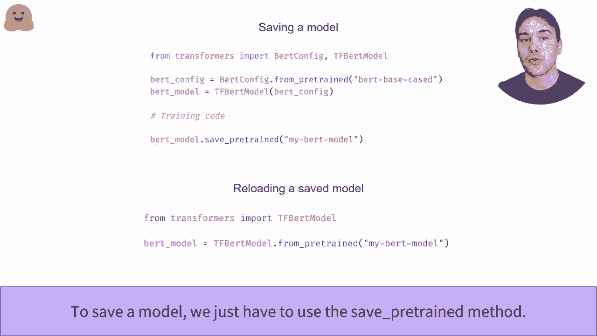

# Transformers原理细节及NLP任务应用！P11：L2.4- 实例化Transformer模型（TensorFlow）🤖

在本节课中，我们将学习如何使用Hugging Face的Transformers库来实例化一个预训练的Transformer模型。我们将重点介绍TensorFlow版本（TF）的模型加载流程，包括如何通过检查点名称或本地路径创建模型，以及如何理解和使用模型配置。

---

## 概述

我们将从Transformers库创建和使用模型。`TFAutoModel`类允许你从任何检查点即时创建一个所需模型。它会自动选择正确的模型类，创建相应的架构，并加载预训练的权重。

---

## 从检查点创建模型

正如我们之前所见，当给定一个BERT检查点时，我们最终得到一个TF BERT模型，GPT-2检查点则会得到TF GPT-2模型。这个API在后台可以接受Hugging Face Model Hub中的检查点名称，它将自动下载并缓存配置文件和模型权重文件。你还可以指定一个包含有效配置文件的本地文件夹路径。

为了即时创建预训练模型，`TFAutoModel` API将首先打开配置文件以确定应该使用的配置类。配置类取决于模型的类型，例如，GPT-2或其他。一旦确定了适当的配置类，它就可以即时创建该配置，这个配置是了解如何创建模型的蓝图。

它还使用这个配置类来找到适当的模型类，该类与加载的配置结合以加载模型。请注意，此时模型尚未加载权重，它刚刚用随机权重初始化。最后一步是从模型文件中加载预训练的权重。

---

## 使用AutoConfig加载配置

要轻松加载来自任何检查点或包含配置文件的文件夹的模型配置，我们可以使用`AutoConfig`类。像`TFAutoModel`类一样，它从库中选择正确的配置类。我们也可以使用与检查点对应的特定配置类（例如`BertConfig`），但使用`AutoConfig`可以避免在尝试不同模型架构时频繁更改代码。

正如我们之前所说，模型的配置是一个蓝图，它包含了创建模型架构所需的所有信息。例如，与基于BERT的检查点相关的BERT模型配置可能包含12层，隐藏层大小为768，词汇表大小为28,996。

---

## 根据配置创建模型

一旦我们有了配置，我们可以创建一个具有与检查点相同架构的模型，但该模型是随机初始化的。这意味着我们可以从头开始训练，制作任意数量的模型。

我们还可以通过使用关键字参数来更改配置的任何部分。例如，以下第二段代码实例化了一个具有10层而不是12层的随机初始化BERT模型。

```python
# 示例：加载配置并创建随机初始化的模型
from transformers import AutoConfig, TFAutoModel

# 加载配置
config = AutoConfig.from_pretrained("bert-base-uncased")
# 创建随机初始化的模型
model = TFAutoModel.from_config(config)

# 示例：修改配置并创建新模型
config.num_hidden_layers = 10  # 将层数改为10
custom_model = TFAutoModel.from_config(config)
```

---

## 保存与重新加载模型

一旦训练或微调完成，保存模型非常简单，只需使用`save_pretrained`方法。在这里，模型将保存在当前工作目录中名为`my_bert_model`的文件夹中。

```python
# 保存模型
model.save_pretrained("./my_bert_model")
```

这样的模型可以通过`from_pretrained`方法重新加载。

```python
# 重新加载模型
reloaded_model = TFAutoModel.from_pretrained("./my_bert_model")
```

要了解如何将此模型推送到Hugging Face Hub，请查看相关的推送教程视频。

---

## 总结



本节课中，我们一起学习了如何使用Transformers库在TensorFlow中实例化Transformer模型。我们了解了`TFAutoModel`和`AutoConfig`类如何自动处理模型架构和配置的选择，学习了如何加载预训练权重、修改模型配置以创建定制架构，以及如何保存和重新加载模型。掌握这些步骤是使用预训练Transformer模型进行下游任务或进一步研究的基础。

---


