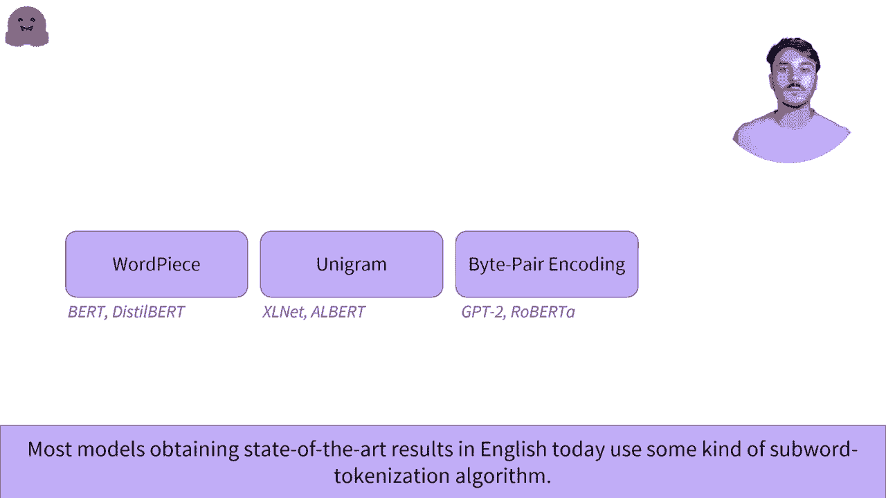

# Transformers原理细节及NLP任务应用！P15：L2.8- 基于子词的分词器 🧩

在本节课中，我们将要学习基于子词的分词方法。我们将探讨其核心思想、工作原理以及它如何克服基于单词和基于字符的分词方法的缺陷。

## 概述

理解基于子词分词的价值，需要先了解基于单词和基于字符分词的局限性。基于子词的分词法在这两种方法之间找到了一个平衡点。其核心目标是在**大词汇量**、**过多未登录词**以及**相似词间语义丢失**这些问题上取得折中。

上一节我们介绍了基于单词和基于字符的分词，本节中我们来看看基于子词的分词如何运作。

## 核心原则

基于子词的分词算法遵循一个基本原则：**常用词不应被拆分成较小的子词，而稀有词应被分解成有意义的子词**。

以下是一些具体例子：
*   **单词“dog”**：我们希望分词器为其保留一个唯一的标记ID，而不是拆分成字符 `d, o, g`。
*   **单词“dogs”**：我们希望分词器能理解，这本质上是“dog”加上一个表示复数的“s”。这既保持了核心语义，又捕捉了语法变化。
*   **复杂单词“tokenization”**：这个词可以被拆分成有意义的子词。词根是“token”，后缀“ization”改变了词性，赋予了“使…化”的含义。因此，拆分成 `token` 和 `##ization` 是合理的。

这里的 `##` 前缀（源于Byte-Pair Encoding算法）用于表示该子词是一个单词的中间或结尾部分，而非开头。

## 优势

通过这种方式，模型能够获得强大的理解能力：
1.  它能理解 `token`, `tokens`, `tokenizing`, `tokenizations` 这些词具有相似的核心含义并且相互关联。
2.  它也能理解 `tokenization`, `modernization`, `immunization` 这些词拥有相同的后缀 `##ization`，可能在相似的句法结构中使用。

基于子词的分词通过在不同单词间共享子词信息，有效减少了所需词汇表的大小，同时增强了模型处理未登录词和构词变化的能力。

以下是基于子词分词的主要优势列表：
*   **平衡词汇量**：在字符级的大序列和单词级的大词汇表之间取得平衡。
*   **处理未登录词**：通过组合已知子词，能有效生成新词的表示。
*   **捕捉词法关系**：能识别词根、前缀和后缀，理解词汇间的形态学关联。

## 应用与总结

如今，大多数在英语任务上取得领先结果的模型都采用了某种形式的基于子词的分词算法（如BPE、WordPiece、SentencePiece）。这些方法通过共享子词信息，显著提升了模型的语言理解效率和泛化能力。

本节课中我们一起学习了基于子词的分词方法。我们了解了它如何作为单词级和字符级分词的折中方案，通过将稀有词分解为有意义的子词、同时保留常用词的完整性，来构建更高效、更智能的词汇表示系统。这种方法使模型能够更好地理解语言的构成和演变。