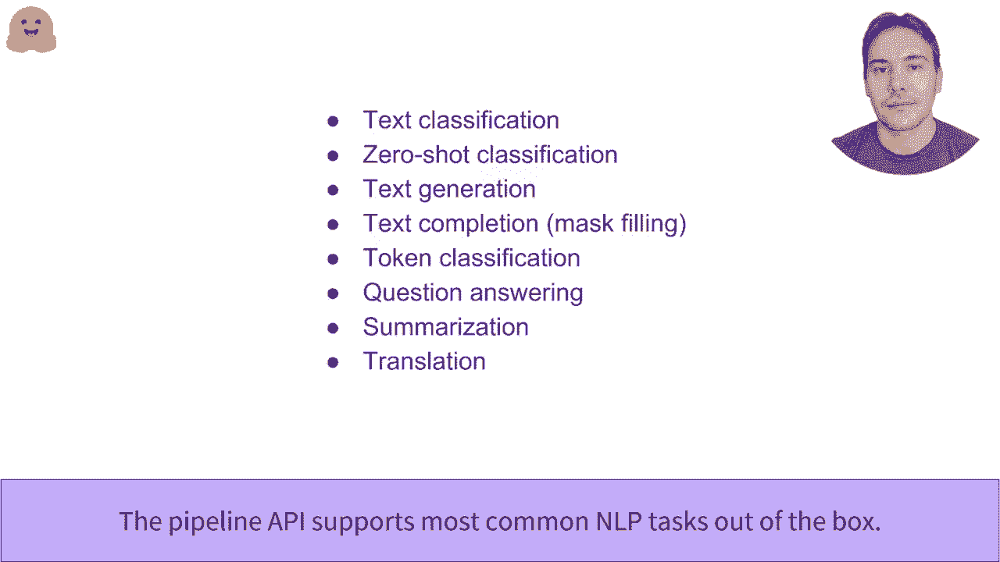

# Transformers原理细节及NLP任务应用！P2：L1.2- Hugging Face流水线功能 🚀

在本节课中，我们将要学习Hugging Face Transformers库中的核心高级API——`pipeline`函数。我们将了解它如何将复杂的自然语言处理任务简化为端到端的调用，并探索其在多种常见任务中的应用。

## 概述

`pipeline`函数是Transformers库中最高级别的API。它的类型是端到端功能。它将从原始输入到最终可用预测的所有步骤聚合在一起。我们使用的是管道的核心，但管道还包含所有必要的预处理，因为模型并不期望文本而是数字。同时还进行一些后处理，使模型的输出更易于人类理解。

## 情感分析管道

让我们来看一下在情感分析管道中的第一个示例。这个管道对给定的输入进行文本分类，并确定其是正面还是负面。

以下是使用示例：
```python
from transformers import pipeline
classifier = pipeline("sentiment-analysis")
result = classifier("I love using Hugging Face transformers!")
# 输出: [{'label': 'POSITIVE', 'score': 0.95}]
```
在这里，它将正面标签归因于给定文本，置信度为95%。

你可以将多个文本传递给同一个管道，这些文本将作为一个批次一起处理并传递给模型。输出是一个与输入文本顺序相同的个体结果列表。
```python
results = classifier(["I love this!", "I hate this!"])
# 输出: [{'label': 'POSITIVE', 'score': 0.95}, {'label': 'NEGATIVE', 'score': 0.999}]
```
在这里，我们发现第一个文本的标签和分数是相同的，而第二个文本的标签是负面的，置信度为99.9%。

## 零样本分类管道

上一节我们介绍了特定情感的分类，本节中我们来看看一种更通用的文本分类管道——零样本分类。

它允许你提供所需的标签。以下是使用示例：
```python
classifier = pipeline("zero-shot-classification")
result = classifier(
    "This is a course about the Transformers library",
    candidate_labels=["education", "politics", "business"]
)
```
在这里，我们希望根据教育、政治和商业的标签对输入文本进行分类。管道成功识别出它更侧重于教育而不是其他标签，置信度为84%。

## 文本生成管道

接下来，我们的任务是文本生成管道，它会完成给定的提示。输出是带有一点随机性的，因此每次调用生成器对象时，生成的结果都会有所变化。

以下是使用默认模型GPT-2的示例：
```python
generator = pipeline("text-generation")
result = generator("In this course, we will teach you how to")
```

到目前为止，我们已经使用默认模型的API与每个任务相关联。但你可以将其与任何已经预训练或微调过的模型一起使用。你可以根据任务在Hugging Face Hub上过滤可用模型。

让我们回到生成管道，并用另一个模型`distilgpt2`加载它。这个模型是由Hugging Face团队创建的更轻量版GPT2。
```python
generator = pipeline("text-generation", model="distilgpt2")
```

在将管道应用于给定提示时，我们可以指定多个参数。例如生成文本的最大长度，以及我们希望返回的句子数量，因为生成中存在一定的随机性。
```python
result = generator("In this course, we will teach you how to", max_length=50, num_return_sequences=2)
```

## 掩码语言建模

生成文本的目标是预测缺失的单词，这是掩码语言建模（MLM）的目标。在这种情况下，我们询问模型最有可能的缺失单词。
```python
unmasker = pipeline("fill-mask")
result = unmasker("Hugging Face is a <mask> company based in New York.")
```

## 命名实体识别

任务转换模型的功能是对句子中的每个单词进行分类，而不是将整个句子视为一个整体。这方面的一个例子是命名实体识别（NER）。其任务是识别句子中的实体，如人、组织或地点。
```python
ner = pipeline("ner", grouped_entities=True)
result = ner("Hugging Face is a company based in Brooklyn, New York.")
```
在这里，模型正确找到了组织“Hugging Face”和地点“Brooklyn, New York”。参数`grouped_entities=True`用于将管道组合在一起，连接到同一实体的不同部分。

## 问答任务

与管道API相关的另一个可用任务是提取式问答。提供上下文和问题后，模型将识别上下文中包含答案的文本跨度。
```python
question_answerer = pipeline("question-answering")
result = question_answerer(
    question="Where is Hugging Face based?",
    context="Hugging Face is a company based in Brooklyn, New York."
)
```

## 文本摘要

获取非常简短的摘要也是Transformers库可以通过摘要管道帮助实现的事情。
```python
summarizer = pipeline("summarization")
result = summarizer("""
    Hugging Face is a company that provides a wide range of natural language processing tools and models.
    The Transformers library is one of their most popular offerings, enabling easy access to state-of-the-art models.
""")
```

## 翻译任务

最后，管道API支持的最后一个任务是翻译。在这里，我们使用在Hugging Face Hub上找到的法英模型来获取输入文本的英文版本。
```python
translator = pipeline("translation", model="Helsinki-NLP/opus-mt-fr-en")
result = translator("Ce cours est excellent!")
```

## 总结



本节课中我们一起学习了Hugging Face Transformers库中强大的`pipeline` API。我们探讨了它在多种自然语言处理任务中的应用，包括：


*   **情感分析**：判断文本情感倾向。
*   **零样本分类**：使用自定义标签进行分类。
*   **文本生成**：根据提示续写文本。
*   **掩码语言建模**：预测句子中被遮盖的单词。
*   **命名实体识别**：识别文本中的人名、地名、组织名等实体。
*   **问答**：从给定上下文中提取答案。
*   **文本摘要**：生成文本的简短摘要。
*   **翻译**：将文本从一种语言翻译成另一种语言。

`pipeline`函数通过封装预处理、模型推理和后处理的所有步骤，极大地简化了先进NLP模型的使用，让初学者也能轻松上手。