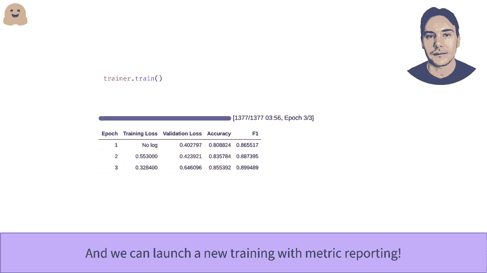

# Transformers原理细节及NLP任务应用！P21：L3.4-训练器Trainer API 🚀

在本节课中，我们将学习如何使用Hugging Face Transformers库提供的Trainer API，来轻松地在自定义数据集上微调预训练的Transformer模型。我们将涵盖从设置训练参数到评估模型性能的完整流程。

---

## 概述

Trainer API是Transformers库的核心组件之一，它封装了训练循环的复杂性，允许用户专注于模型和数据。通过Trainer，你可以在CPU、GPU或多GPU环境下执行训练，并在任何数据集上计算预测和评估模型性能。

---

## 设置训练环境与数据

上一节我们介绍了模型的基本结构，本节中我们来看看如何为训练准备数据和环境。

首先，确保你已经设置了模型和训练超参数。Trainer API可以在多种硬件设置上运行，包括CPU、单个GPU、多个GPU或TPU。它还能在任何数据集上计算预测，前提是你提供了评估指标。

我们选择在MRPC数据集上调用此API，因为该数据集相对较小，易于预处理。正如在数据集相关视频中看到的，我们在预处理阶段不应用填充（padding），因为我们将使用动态填充技术。请注意，我们无需手动执行重命名列、移除无关列或将数据转换为PyTorch张量等最终步骤，Trainer会根据模型签名自动完成这些操作。

---

## 定义模型与训练参数

创建Trainer前的最后一步是定义模型和训练参数。我们在关于模型API的视频中已经学习了如何定义模型。

对于训练参数，我们使用`TrainingArguments`类。它至少需要一个文件夹路径来保存结果和检查点，但你也可以自定义训练器将使用的所有参数，例如学习率、训练轮次等。

以下是定义训练参数的示例代码：
```python
from transformers import TrainingArguments

training_args = TrainingArguments(
    output_dir='./results',
    num_train_epochs=3,
    per_device_train_batch_size=16,
    evaluation_strategy="epoch",
    save_strategy="epoch",
    logging_dir='./logs',
)
```

---

## 创建Trainer并启动训练

以下是创建Trainer并启动训练的步骤：

1.  **初始化Trainer**：将模型、训练参数、训练数据集和评估数据集传递给Trainer。
2.  **启动训练**：调用`trainer.train()`方法。

创建Trainer并启动训练的过程非常简单。执行后，你应该能看到一个进度条。如果在GPU上运行，训练可能在几分钟内完成。

然而，初始的训练结果可能不尽如人意，因为输出通常只包含训练损失，这并不能全面反映模型的表现。这是因为我们尚未指定任何评估指标。

---

## 评估模型性能

为了获取有意义的评估结果，我们首先需要使用`predict`方法在评估集上生成预测。该方法返回一个`PredictionOutput`对象，包含三个字段：`predictions`（模型预测结果）、`label_ids`（真实标签）和`metrics`（评估指标，初始为空）。

预测结果是模型对数据集中所有样本的预测，通常是一个形状为`[样本数, 类别数]`的数组。为了将其与真实标签比较，我们需要对每个样本的预测取最大值，以确定其预测类别。我们可以使用`argmax`函数完成此操作。

然后，我们可以使用`datasets`库中的`load_metric`函数来加载评估指标（如准确率）。它像加载数据集一样简单，并返回计算指标所需的功能。

通过计算，我们可能会发现模型确实学到了一些东西，例如准确率达到85.7%。

---

## 在训练过程中监控指标

为了在训练过程中监控评估指标，我们需要定义一个`compute_metrics`函数。这个函数接收一个`EvalPrediction`对象（包含`predictions`和`label_ids`），并返回一个记录了我们想要跟踪的指标的字典。

定义好计算函数后，通过将`evaluation_strategy`参数（例如设为`"epoch"`）传递给`TrainingArguments`，我们告诉Trainer在每个训练周期结束时进行评估。

在笔记本中启动训练后，你将看到一个进度条，并在每个周期结束时看到包含损失和评估指标（如准确率）的表格，如下所示：



训练完成后的评估结果可能类似这样：


---


## 总结

本节课中，我们一起学习了如何使用Transformers库的Trainer API来微调模型。我们涵盖了从设置训练参数、准备数据、创建Trainer实例，到启动训练并评估模型性能的完整流程。关键点在于利用Trainer简化训练循环，并通过定义`compute_metrics`函数来实现训练过程中的性能监控。掌握这些步骤后，你就能高效地在自己的数据集上微调各种Transformer模型了。