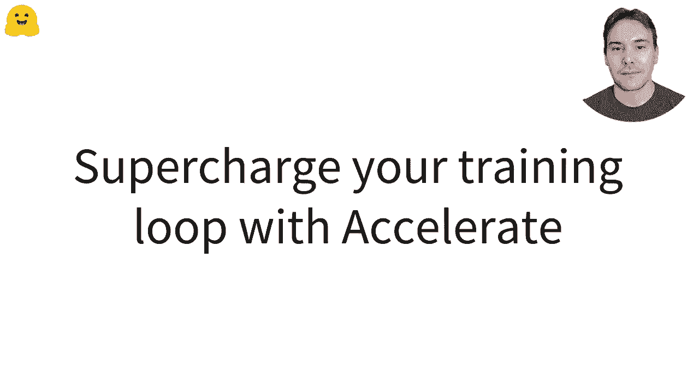
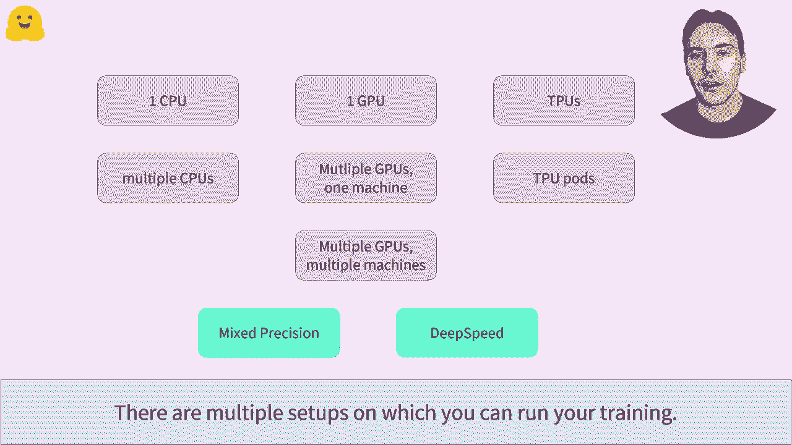
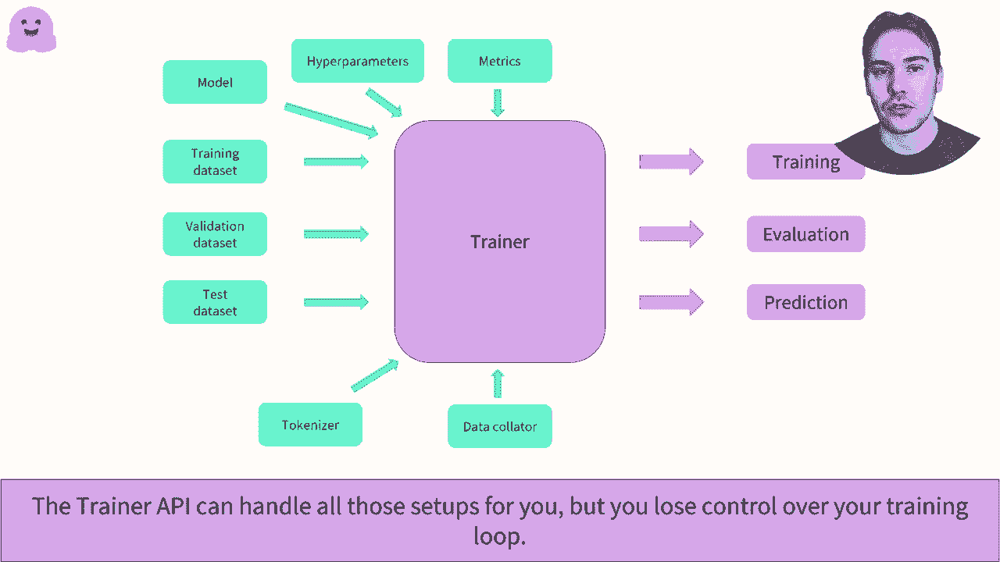
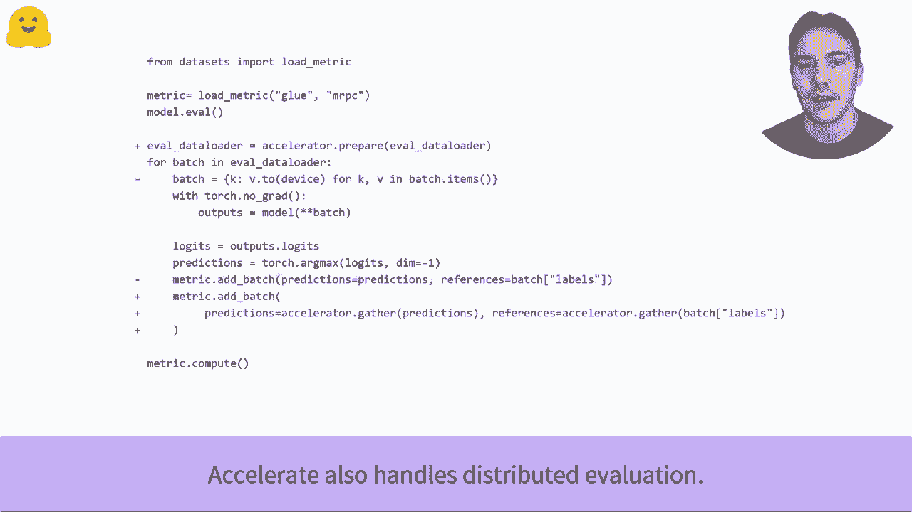
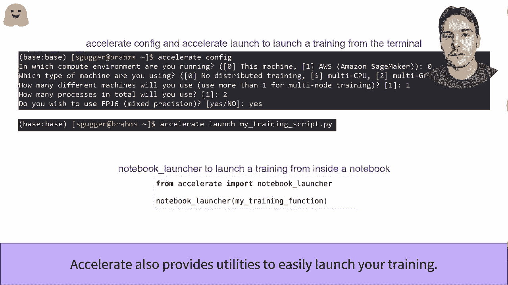

# Transformers原理细节及NLP任务应用！P23：L3.6- 使用Accelerate增强您的PyTorch训练流程 🚀

在本节课中，我们将学习如何使用 Hugging Face Accelerate 库来简化和加速您的 PyTorch 训练流程。Accelerate 旨在让您在各种硬件配置（如 CPU、单 GPU、多 GPU 或多台机器）上运行训练代码时，无需对核心训练循环进行大量修改。



## 概述：为何需要Accelerate？🤔

在深度学习训练中，您可能需要在多种环境中运行代码，例如在 CPU、单个 GPU、多个 GPU 上，甚至是分布在多台机器（节点）上。此外，为了提升训练效率，您可能还需要应用混合精度训练或梯度累积等技巧。每种设置或技巧通常都需要您学习新的 API 并修改训练循环代码，这个过程可能复杂且容易出错。

Accelerate 库的设计目标，是让您能够完全控制训练循环，同时以最小的代码改动来适配不同的训练环境。您只需学习一个统一的 API，即可应对多种场景。

## 核心用法：四行代码的魔法 ✨

使用 Accelerate 增强您的训练循环非常简单。以下是需要遵循的核心步骤：



首先，您需要导入并实例化 `Accelerator` 对象。这个对象会自动检测您的训练环境并进行相应配置。

```python
from accelerate import Accelerator
accelerator = Accelerator()
```

接下来，使用 `accelerator.prepare()` 方法准备您的模型、优化器、数据加载器等组件。该方法会处理将模型放置到正确设备（如 GPU）等细节。



```python
model, optimizer, train_dataloader = accelerator.prepare(model, optimizer, train_dataloader)
```

在训练循环中，您不再需要手动将每个数据批次（batch）移动到特定设备（例如 `.to(device)`）。Accelerator 会自动处理。

最后，将常规的 `loss.backward()` 替换为 `accelerator.backward(loss)`。这确保了在混合精度训练等场景下，梯度计算能正确进行。

```python
# 替换 loss.backward()
accelerator.backward(loss)
```

通过以上四步，您的训练代码就具备了在不同硬件配置上运行的能力。

## 分布式评估 📊

上一节我们介绍了如何修改训练循环，本节中我们来看看如何进行分布式评估。

您仍然可以使用经典的评估循环。但在分布式设置下，每个进程都会执行完整的评估，这可能导致重复计算。为了进行高效的分布式评估，需要对评估循环稍作调整。

以下是适配后的评估循环关键步骤：

在评估循环中，省略手动将批次数据移动到设备的代码。在计算指标之前，使用 `accelerator.gather_for_metrics()` 方法从所有进程中收集预测结果和标签，以确保指标计算的正确性。

```python
# 收集所有进程的预测和标签
all_preds, all_labels = accelerator.gather_for_metrics((predictions, labels))
```

## 启动分布式训练脚本 🚀



分布式训练脚本需要在多个进程上启动，例如为每个使用的 GPU 启动一个进程。虽然可以使用 PyTorch 原生的分布式工具，但 Accelerate 提供了更简单的 API。

您可以通过命令行工具来配置和启动训练。

首先，在终端中运行 `accelerate config` 命令，并根据问卷提示生成配置文件。该文件包含了您的硬件和训练偏好设置。

```bash
accelerate config
```

然后，使用 `accelerate launch` 命令来启动您的训练脚本。

```bash
accelerate launch train_script.py
```

如果您在 Jupyter Notebook 环境中，Accelerate 也提供了专门的笔记本启动器功能来启动训练。



## 总结 🎯

本节课中我们一起学习了如何使用 Hugging Face Accelerate 库来增强 PyTorch 训练流程。我们了解到，只需添加几行代码，就能让训练循环轻松适配 CPU、单 GPU、多 GPU 乃至多机环境，并支持混合精度等高级训练技巧。关键步骤包括：实例化 `Accelerator`、使用 `prepare` 方法准备组件、让 Accelerator 自动处理设备放置、以及使用 `accelerator.backward()` 进行反向传播。此外，我们还学习了如何进行分布式评估以及如何使用命令行工具配置和启动分布式训练。Accelerate 通过统一的 API，极大地简化了在不同硬件上进行高效深度学习训练的复杂性。