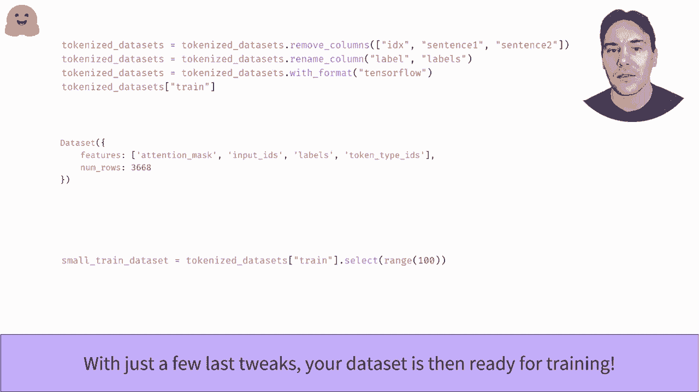

# Transformers原理细节及NLP任务应用！P24：L4.1- Hugging Face数据集概述(Tensorflow) 📚

在本节课中，我们将要学习如何使用Hugging Face的`datasets`库。这是一个功能强大的库，它提供了便捷的API，用于快速下载和预处理众多公开的自然语言处理数据集。我们将通过一个具体的例子，了解如何加载、探索、分词和格式化数据集，为后续的模型训练做好准备。

## 加载数据集

上一节我们介绍了`datasets`库的基本概念，本节中我们来看看如何实际操作。加载数据集的核心是使用`load_dataset`函数。这个函数可以直接从Hugging Face数据集中心下载数据集，并将其缓存到本地磁盘，方便后续重复使用。

```python
from datasets import load_dataset

dataset = load_dataset("glue", "mrpc")
```

以上代码从GLUE基准测试中加载了MRPC数据集。MRPC是一个句子对分类任务，目标是判断两个句子在语义上是否等价。`load_dataset`函数返回一个`DatasetDict`对象，这是一个包含数据集各个切分（如训练集、验证集、测试集）的字典。

## 探索数据集结构

我们可以通过切分的名称来访问不同的数据集部分。每个切分都是`Dataset`类的一个实例。

```python
train_dataset = dataset["train"]
```

我们可以像访问列表一样，通过索引来查看数据集中的具体样本。

```python
first_example = train_dataset[0]
print(first_example)
# 输出可能包含: {'sentence1': '...', 'sentence2': '...', 'label': 1, 'idx': 0, ...}
```

Hugging Face `datasets`库的一个显著优势是它使用内存映射文件。这意味着即使数据集非常庞大，也不会耗尽你的内存。数据只有在被请求时才会加载到内存中。

访问数据集的切片同样简单，结果是一个字典，其中每个键对应一个特征列，值是该列在所有选中样本中值的列表。

```python
a_slice = train_dataset[:5]
print(a_slice.keys())
# 输出: dict_keys(['sentence1', 'sentence2', 'label', 'idx', ...])
```

`Dataset`对象的`features`属性提供了关于各列的详细信息，特别是对于标签列，它会显示整数标签与可读名称之间的映射关系。

```python
print(train_dataset.features['label'])
# 输出可能类似: ClassLabel(names=['not_equivalent', 'equivalent'], id=None)
# 这表示 0 对应“不等价”，1 对应“等价”。
```

## 对数据集进行分词处理

为了将文本数据输入模型，我们需要对其进行分词。对于句子对任务，我们需要将两个句子一起发送给分词器。

以下是分词处理的关键步骤。首先，我们定义一个分词函数。

```python
from transformers import AutoTokenizer

tokenizer = AutoTokenizer.from_pretrained("bert-base-uncased")

def tokenize_function(examples):
    # 对句子1和句子2进行编码
    return tokenizer(examples["sentence1"], examples["sentence2"], truncation=True, padding="max_length", max_length=128)
```

然后，我们可以使用数据集的`map`方法将这个函数应用到所有样本上。`map`方法会根据函数返回的字典来添加新列或更新现有列。

```python
tokenized_datasets = dataset.map(tokenize_function, batched=True)
```

为了加速预处理过程，我们设置了`batched=True`。这允许分词器一次性处理一个批量的样本，效率更高，尤其因为Hugging Face的分词器底层由Rust实现，支持批量操作。你还可以通过`num_proc`参数启用多进程来进一步加速。

## 准备训练格式

分词完成后，我们还需要对数据集进行一些最后的整理，以符合训练库（如TensorFlow或PyTorch）的输入要求。

以下是需要完成的步骤：
1.  移除我们不再需要的原始文本列。
2.  将标签列重命名为`labels`，因为大多数训练库期望这个键名。
3.  将数据集格式设置为特定的后端框架格式。

```python
# 移除不需要的列
tokenized_datasets = tokenized_datasets.remove_columns(["sentence1", "sentence2", "idx"])

# 将标签列重命名为‘labels’
tokenized_datasets = tokenized_datasets.rename_column("label", "labels")

# 设置为TensorFlow格式（如果使用TensorFlow）
tokenized_datasets.set_format("tensorflow")
```



如果需要，我们还可以使用`select`方法创建一个数据集的子集，用于快速测试或开发。

```python
small_train_dataset = tokenized_datasets["train"].select(range(100))
```


---

本节课中我们一起学习了Hugging Face `datasets`库的核心用法。我们从加载一个GLUE数据集开始，探索了其结构，然后使用分词器对文本进行预处理，最后将数据集格式化为适合模型训练的格式。这个过程高效且内存友好，是处理NLP数据集的标准工作流。掌握这些步骤，将为你在后续课程中构建和训练Transformer模型打下坚实的基础。