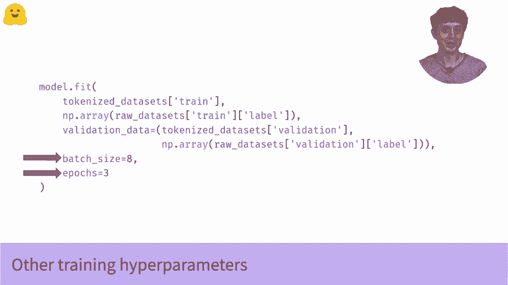

# Transformers原理细节及NLP任务应用！P27：L4.4- 使用TensorFlow进行微调（迁移学习） 🚀

在本节课中，我们将学习如何加载一个预训练的Transformer模型，并使用TensorFlow和Keras对其进行微调，以解决特定的自然语言处理分类任务。我们将从加载模型开始，逐步讲解编译和训练模型的完整流程。

## 概述

我们将看到如何加载和微调一个预训练模型。这个过程非常快速。如果你看过关于管道的视频，过程会非常相似。不过，这次我们将使用迁移学习并进行一些训练，而不仅仅是加载模型并直接使用。

如果你想了解更多关于迁移学习的内容，可以观看相关的视频。现在，让我们直接查看代码。

## 选择并加载模型

首先，我们需要选择要使用的模型。在本例中，我们将使用著名的BERT模型。加载模型的核心代码如下：

```python
from transformers import TFAutoModelForSequenceClassification

model = TFAutoModelForSequenceClassification.from_pretrained('bert-base-uncased', num_labels=2)
```

这行代码具体是什么意思呢？`TFAutoModelForSequenceClassification` 是一个TensorFlow模型类。`TF`代表TensorFlow，其余部分表示：如果加载的语言模型本身没有序列分类头，这个类会为其添加一个。

因此，我们加载的是通用的BERT语言模型，它本身没有分类头。`from_pretrained` 方法确保我们加载的所有权重都来自预训练模型，除了我们将要添加的、新的序列分类头。这个新头的权重是随机初始化的。

这个方法需要知道两件事：
1.  你想加载的模型的名称（例如 `‘bert-base-uncased’`）。
2.  你的分类问题有多少个类别（`num_labels`）。

如果你跟随我们数据集视频中的数据，将有两个类别：正类和负类，因此 `num_labels=2`。

## 编译模型

上一节我们介绍了如何加载模型，本节中我们来看看如何为训练做准备。如果你熟悉Keras，可能已经了解`compile`方法。如果没有，这是Keras模型的核心方法之一，你必须在训练模型之前调用它。

编译模型需要指定两件事：损失函数和优化器。

```python
from tensorflow.keras.losses import SparseCategoricalCrossentropy
from tensorflow.keras.optimizers import Adam

model.compile(
    loss=SparseCategoricalCrossentropy(from_logits=True),
    optimizer=Adam(learning_rate=5e-5)
)
```

**损失函数**是我们希望模型优化的目标。这里我们导入`SparseCategoricalCrossentropy`（稀疏分类交叉熵）。这是神经网络执行分类任务时的标准损失函数。它鼓励网络为正确类别输出较大的值（高概率），为错误类别输出较小的值。

**一个关键细节**：你可以像指定优化器一样，用字符串形式指定损失函数（如 `loss=’sparse_categorical_crossentropy’`）。但这里有一个常见陷阱。默认情况下，Keras的损失函数假设模型的输出是经过Softmax层后的概率值。

然而，我们模型的实际输出是Softmax激活之前的值，通常被称为**logits**（逻辑值）。如果你在关于管道的视频中见过原始输出，那就是logits。

**重要提示**：如果你搞错了这一点（即模型输出logits但损失函数期待概率），你的模型将无法正常训练，并且调试起来会非常困难。请务必检查你的模型输出，并确保损失函数的设置与之匹配（例如，使用 `from_logits=True` 参数）。这将为你节省大量调试时间。

**优化器**是用于更新模型权重的算法。在我们的案例中，使用`Adam`优化器，它是当前深度学习的标准选择之一。你可能需要调整的唯一参数是学习率（`learning_rate`）。为此，我们需要导入实际的优化器类并进行实例化，而不是仅通过字符串调用。

## 训练模型

编译好模型后，我们就可以开始训练了。如果你以前用过Keras，下面的代码会非常熟悉。

训练模型使用`fit`方法，它几乎是Keras模型最核心的方法。`fit`方法告诉模型将输入数据分成批次并进行训练。

```python
history = model.fit(
    x=train_encodings,  # 训练输入
    y=train_labels,     # 训练标签
    validation_data=(val_encodings, val_labels), # 验证数据
    batch_size=16,      # 批次大小
    epochs=3            # 训练轮数
)
```

以下是`fit`方法主要参数的说明：
*   **训练输入 (`x`)**：这通常是经过分词器（Tokenizer）处理后的文本编码。如果你想了解更多关于分词和输入格式的信息，可以查看我们关于分词的视频。
*   **训练标签 (`y`)**：这是一个一维的NumPy数组或TensorFlow张量，其中包含每个样本对应的类别标签（整数）。如果你跟随我们数据集视频中的数据，只有两个类别，那么这将是一个由0和1组成的向量。当然，你可以根据你的问题拥有更多类别。
*   **验证数据 (`validation_data`)**：我们以元组的形式传递验证集的输入和标签。
*   **批次大小 (`batch_size`)** 和 **训练轮数 (`epochs`)**：这些是控制训练过程的超参数。

运行`fit`后，如果一切顺利，你应该会看到一个训练进度条，并且损失值会逐渐下降。

## 后续优化与总结

当模型训练运行时，你就已经成功地将大规模预训练语言模型的能力应用到了你的NLP问题上。但我们还能做得更好吗？当然可以。



还有一些更高级的Keras功能可以进一步优化模型，例如：
*   **学习率调度器**：在训练过程中动态调整学习率，可能有助于获得更低的损失，使模型更准确。
*   **模型保存与加载**：训练完成后，如何处理和保存训练好的模型以供后续使用。


本节课中我们一起学习了使用TensorFlow和Hugging Face Transformers库微调预训练模型的核心步骤：**加载模型 -> 编译模型 -> 训练模型**。我们特别强调了损失函数设置中关于`logits`的关键细节。掌握这个流程，你就能够快速地将最先进的NLP模型应用到自己的文本分类任务中。