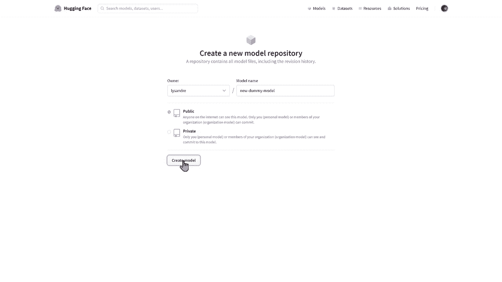
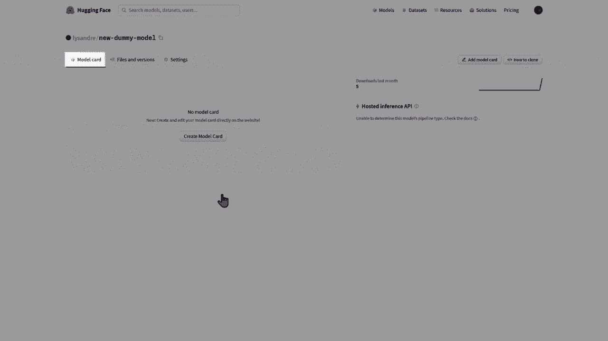
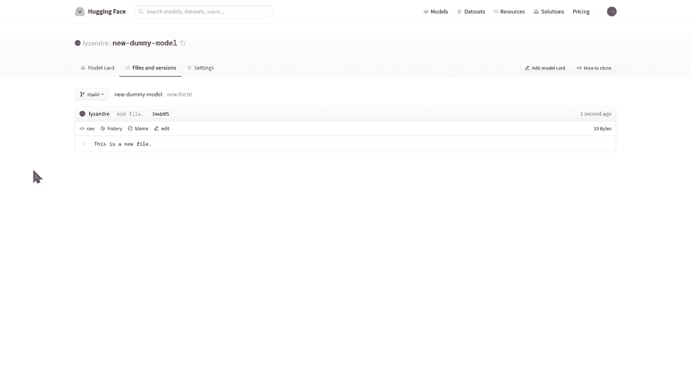
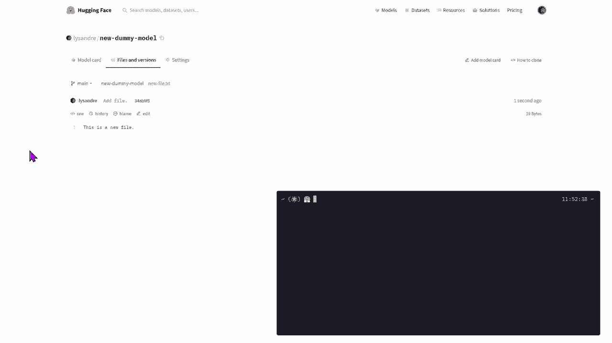
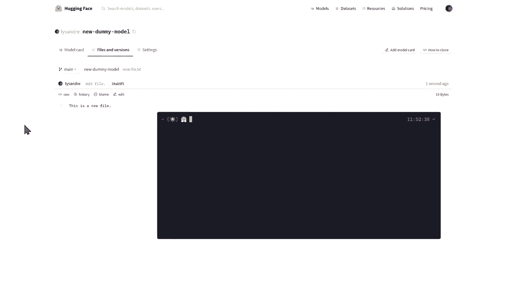
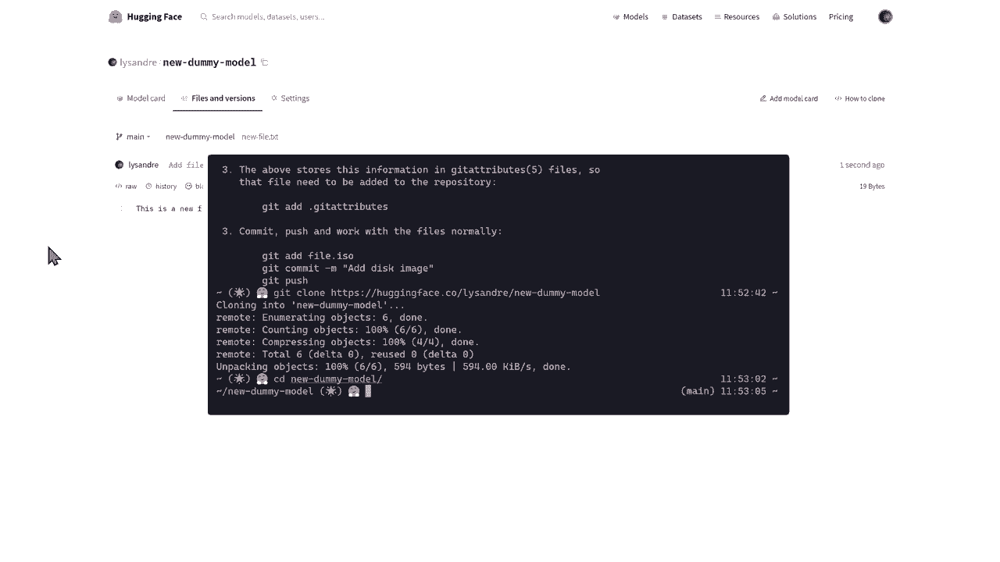
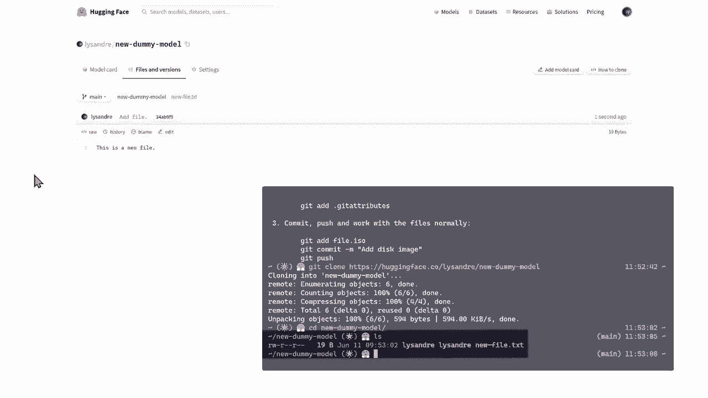
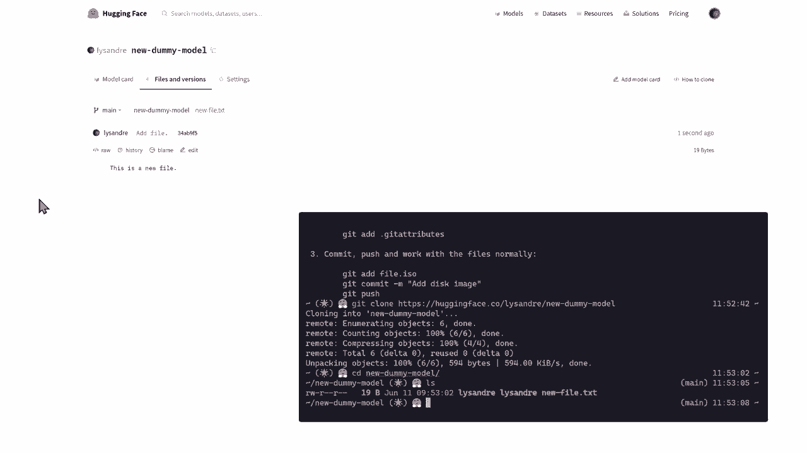
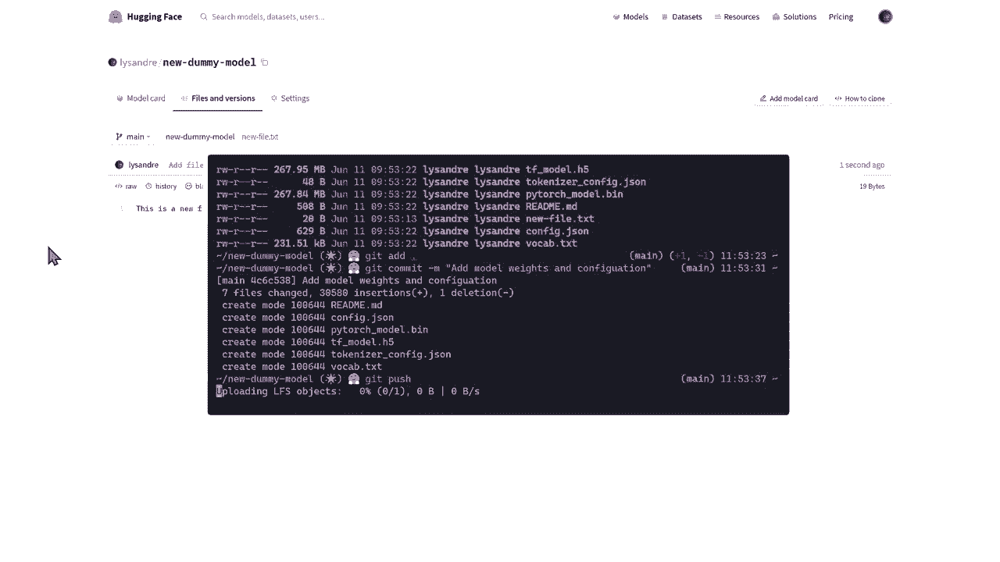
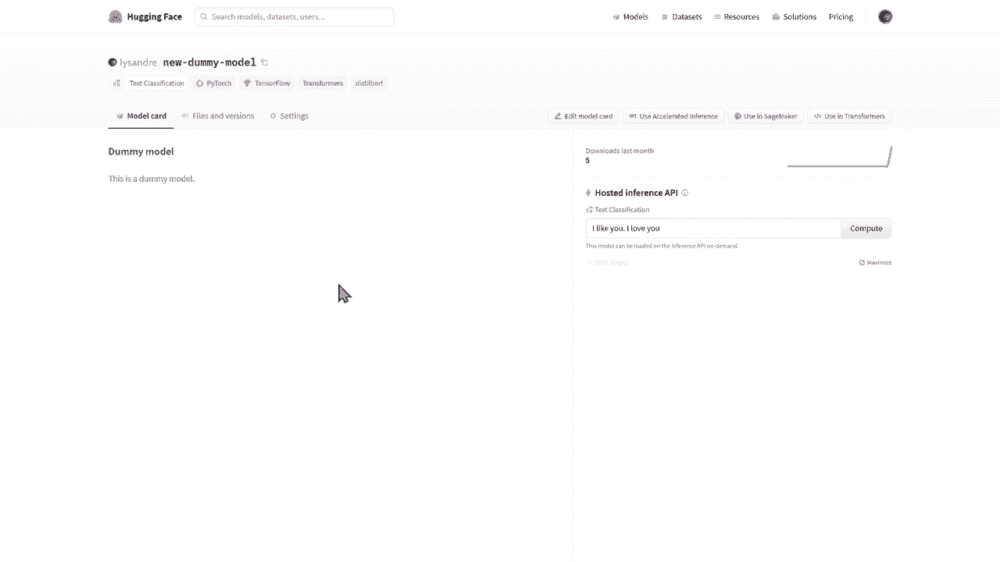

# Transformers原理细节及NLP任务应用！P32：L5.3- 在Model Hub管理模型repo 🗂️

在本节课中，我们将学习如何在Hugging Face Model Hub上创建和管理模型仓库。这包括创建仓库、上传文件、编写模型卡以及最终在代码中调用模型。

---

## 概述

Hugging Face Model Hub是一个用于共享和发现机器学习模型的平台。要有效利用它，你需要知道如何管理自己的模型仓库。本节将指导你完成从创建账户到发布模型的全过程。

---

## 创建Hugging Face账户与模型仓库



要开始管理模型仓库，你首先需要一个Hugging Face账户。创建账户后，登录平台即可创建新模型。

以下是创建新模型仓库的步骤：
1.  点击页面上的“New Model”选项。
2.  在“Owner”输入框中，填写你的用户名或所属组织的命名空间。
3.  为你的模型设定一个“Model Name”，这将作为模型的唯一标识符。
4.  在“Visibility”中选择“Public”（公开）或“Private”（私有）。



**公开模型**对所有人可见，便于分享和协作，是推荐的免费选项。只有仓库所有者有权更新它。
**私有模型**仅对所有者可见，其他用户无法发现或使用。

---

## 理解模型仓库的界面

创建模型仓库后，你会进入管理界面。它主要包含三个标签页，每个都有特定功能。

上一节我们介绍了如何创建仓库，本节中我们来看看仓库的管理界面。

**模型卡（Model Card）页面**：这是向社区展示模型的主页，用于描述模型详情。
**文件和版本（Files and versions）**：模型仓库本质上是一个Git仓库，你可以在这里管理所有模型文件及其历史版本。
**设置（Settings）**：在此管理模型的可见性、协作权限等高级选项。

---



## 向仓库添加文件

模型的核心是文件。你可以通过多种方式将模型权重、配置文件等添加到仓库中。



### 通过网页界面添加



最直接的方法是使用“Add file”按钮上传文件。文件类型可以是Python脚本、文本文件等。上传时，需要为这次更改填写提交信息（Commit message）。

### 通过Git命令行添加（推荐）

对于频繁操作或大型文件，使用Git命令行更为高效。这需要你在本地系统安装Git和Git LFS（Large File Storage，用于管理大文件）。



以下是操作流程：
1.  **克隆仓库到本地**：使用 `git clone` 命令。
2.  **将模型文件放入本地仓库文件夹**：例如，`pytorch_model.bin`（模型权重）、`config.json`（配置文件）、`tokenizer.json`（分词器文件）。
3.  **跟踪并提交文件**：
    ```bash
    # 添加所有新文件到Git跟踪
    git add .
    # 提交更改，并附上描述信息
    git commit -m “添加模型权重和配置文件”
    ```
4.  **推送更改到Hugging Face**：
    ```bash
    git push
    ```
操作完成后，你可以在网页的“Files and versions”标签页中看到新的提交和文件。



---



## 编写模型卡（README）

仅仅上传模型文件还不够。一个完整的仓库需要一个清晰的模型卡（README.md文件），它是模型可重用性和结果可复现性的关键。

模型卡与模型文件同等重要。它为其他使用者提供了必要的信息。

我们建议在模型卡中至少包含以下内容：
*   **模型标题和简短描述**
*   **训练信息**：使用的数据集、训练参数等。
*   **预期用途与限制**
*   **评估结果**：模型在基准测试上的性能。
*   **代码示例**：展示如何加载和使用该模型。



一个简单的模型卡内容如下：
```markdown
# 我的情感分析模型

这是一个用于中文情感分析的BERT模型。

## 使用方法
```python
from transformers import AutoModelForSequenceClassification, AutoTokenizer
model = AutoModelForSequenceClassification.from_pretrained(“你的用户名/模型名”)
tokenizer = AutoTokenizer.from_pretrained(“你的用户名/模型名”)
```
```

---

## 在代码中使用发布的模型

成功上传模型并完善模型卡后，你的模型就可以被社区使用了。在任何支持Transformers库的地方，都可以通过指定模型标识符来加载它。

以下是调用你刚刚发布模型的示例代码：
```python
from transformers import pipeline

# 使用你的模型标识符
classifier = pipeline(“sentiment-analysis”, model=“你的用户名/你的模型名”)
result = classifier(“这是一个非常棒的教程！”)
print(result)
```
通过这行代码，你就可以像使用Hugging Face官方的预训练模型一样，使用自己发布的模型。

---



## 总结


本节课中我们一起学习了在Hugging Face Model Hub上管理模型仓库的完整流程。我们从**创建账户和仓库**开始，了解了仓库的**三个管理界面**。然后，我们掌握了通过**网页**和**Git命令行**两种方式**向仓库添加文件**的方法。接着，我们强调了编写**模型卡（README）**的重要性及其应包含的内容。最后，我们看到了如何通过简单的代码调用**发布到Hub上的模型**。掌握这些技能，你就能有效地在社区中分享和部署自己的模型了。