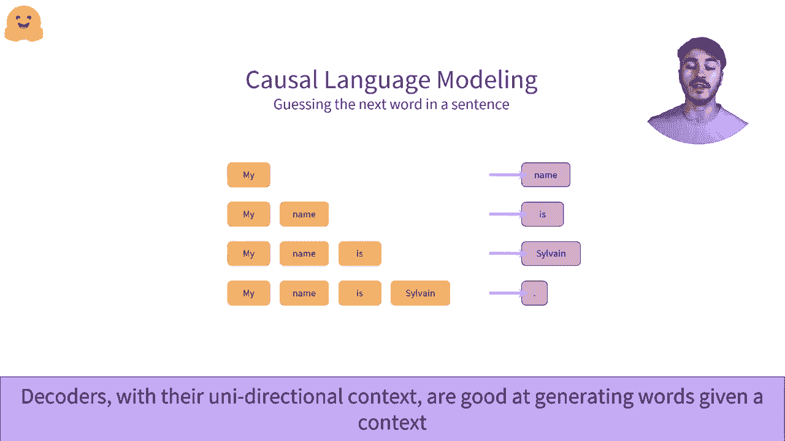

# Transformers原理细节及NLP任务应用！P6：L1.6- Transformer：解码器 🤖

在本节课中，我们将要学习Transformer架构中的解码器部分。解码器是生成式任务的核心，例如文本生成。我们将详细探讨其工作原理、与编码器的区别，以及它在自然语言处理任务中的应用。

---

## 解码器架构概述

解码器是Transformer模型的重要组成部分。一个流行的仅解码器架构示例是GPT-2。为了理解解码器的工作原理，建议先学习编码器的相关知识，因为两者在结构上非常相似。解码器可以用于大多数与编码器相同的任务，尽管通常会伴随一定的性能损失。

上一节我们介绍了编码器，本节中我们来看看解码器。我们将采用与理解编码器相同的方法，重点分析编码器与解码器在架构上的核心差异。

## 解码器的工作流程

我们将使用一个包含三个单词的小示例来说明解码器的工作流程。假设输入是“welcome to NYC”。解码器会将这些单词转换为对应的数值表示。

以下是解码器的基本处理步骤：
1.  解码器接收输入的单词序列。
2.  通过其内部层处理这些输入。
3.  为每个输入单词输出一个对应的数值序列。

这种数值表示也可以称为特征向量或特征张量。它包含了每个通过解码器传递的单词的向量信息。这些向量就是所讨论单词的数值表示。😊 向量的维度由模型的架构预先定义。

## 核心机制：掩码自注意力

解码器与编码器的主要区别在于其自注意力机制。解码器使用一种称为**掩码自注意力**的机制。

这里，我们以关注单词“to”为例。在掩码自注意力机制下，“to”这个词的向量表示**绝对不受**其右侧单词“NYC”的影响。这是因为右侧的所有单词，也称为单词的右上下文，都被一个掩码（mask）遮盖了。

解码器只允许访问单词的**单侧上下文**，通常是左上下文（即该词之前的所有词），而不是像编码器那样可以从左右两侧的所有单词中获取信息。

**掩码自注意力**机制通过使用一个额外的掩码矩阵来隐藏单词的右侧（或未来）上下文，从而与标准的自注意力机制区分开来。这使得单词的数值表示不会受到其后方（未来）上下文中单词的影响。

## 解码器的应用场景

了解解码器的工作原理后，何时使用它就变得很重要。和编码器一样，解码器也可以作为独立模型使用。由于它们能够生成单词的数值表示，因此可以应用于各种任务。

然而，解码器的真正强大之处在于其**仅能访问左上下文**的特性。这种特性使其在**生成文本**方面天生优秀，能够根据已知的单词序列（左上下文）来预测并生成下一个或后续的单词序列。这项任务被称为**因果语言建模**或**自然语言生成**。😊

## 实战：因果语言建模

接下来，我们通过一个例子具体看看因果语言建模是如何工作的。

我们从一个初始单词开始，例如“my”。我们将其作为解码器的输入。😊 模型会输出一个数字向量，这个向量包含了关于当前序列（在这里是“my”这个词）的信息。

我们对这个输出向量进行一个小的转换，使其能够映射到模型已知的所有单词（即词汇表）。这个转换层被称为**语言模型头**。

通过这个映射，我们确定模型认为最可能的下一个单词是“name”。然后，我们将这个新生成的单词“name”添加到初始序列的末尾。于是，序列从“my”变成了“my name”。这个过程体现了模型的**自回归**特性。😊

**自回归模型**会将过去的输出重新作为输入，用于生成下一个输出。我们重复这一过程：将当前序列“my name”再次输入解码器，通过语言模型头提取出最可能的下一个单词，假设是“is”。我们不断重复这一操作，直到生成了满意的文本长度。

从一个单词开始，我们现在生成了一个句子“my name is”。我们可以决定在此停止，也可以继续生成。例如，GPT-2模型的最大上下文长度为1024个标记（tokens），这意味着它可以生成多达1024个单词的连贯文本，解码器在整个过程中会对前面已生成的单词序列保持记忆。😊

---

在本节课中，我们一起学习了Transformer解码器的核心架构。我们了解了它与编码器的关键区别——**掩码自注意力**机制，这种机制使其只能关注左侧上下文。我们还探讨了解码器最主要的应用：**因果语言建模**，并通过自回归生成的例子，演示了模型如何从一个起始词逐步生成完整的文本序列。理解解码器是掌握GPT等生成式模型的基础。