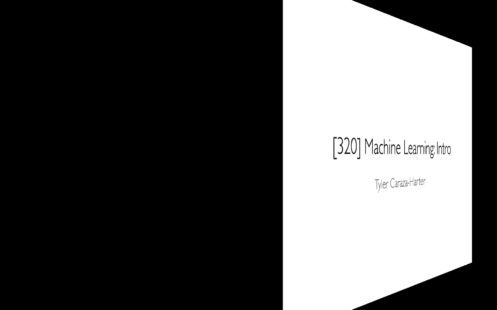
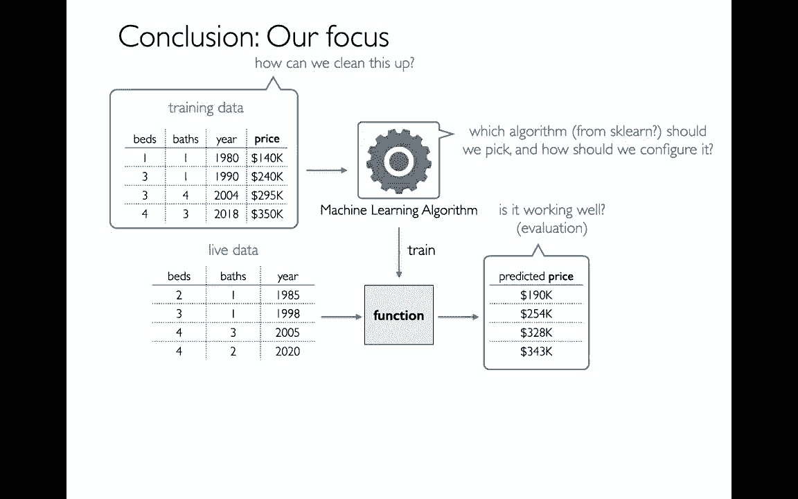

# 机器学习入门与Scikit-learn基础，P1：机器学习介绍 🧠

在本节课中，我们将开启机器学习的新篇章。我们将介绍机器学习的基本概念、主要类别以及本课程的学习路线。虽然内容很多，但这只是机器学习广阔领域的冰山一角。

## 从已知到未知：什么是模型？

为了理解机器学习，让我们从熟悉的概念开始。你已经编写和运行函数很长时间了。函数接收输入（例如参数），然后产生输出（例如返回值或打印内容）。

例如，我可以编写一个函数来预测房价。输入是待售房屋的详细信息（如卧室和浴室数量），输出是预测的售价。这样的函数就是一个**模型**。我可以输入多组数据，批量进行预测。

机器学习的核心思想是：**计算机不再由人类编写这些预测函数，而是通过实例自动生成这些函数**。

## 机器学习如何工作？🤖

计算机通过**训练数据**来学习。例如，我们输入大量已售房屋的数据，包括它们的售价、卧室数、浴室数等。计算机的任务是推断出卧室、浴室等因素对房价的影响规律。

基于学习到的规律，计算机生成一个预测函数。之后，我们就可以用这个函数对新的、未知的房屋数据进行售价预测。这在物业评估、房地产定价等场景中非常有用。

我上面举的例子属于**回归模型**，它是**监督式机器学习**的一种。监督式机器学习是机器学习的三大主要类别之一。

## 机器学习的三大领域 🗺️

接下来，我们广泛地讨论机器学习的三个主要领域，然后会更详细地聚焦于回归分析。

1.  **强化学习**：智能体（如机器人）通过与环境互动并接收奖励来学习做出一系列决策，以优化累积奖励。例如，一个机器人在环境中移动并拾取硬币。本课程不涉及此领域。
2.  **监督机器学习**：我们拥有带有“答案”（标签）的数据，目标是学习特征与标签之间的关系，以便对新的、无标签的数据进行预测。本课程将重点学习此类。
3.  **无监督机器学习**：我们只有数据特征，没有预设的“答案”标签。目标是发现数据中隐藏的模式或结构。

有些人会提到第四类——半监督学习，但本课程暂不讨论。

## 监督学习：回归与分类 📈📊

在监督学习中，数据有一个特殊的列作为**标签**，即我们试图预测的目标。根据标签的类型，监督学习可分为两类：

*   **回归**：预测一个**连续的数量**（数值）。例如，预测房屋售价、股票价格。
*   **分类**：预测一个**类别**。例如，预测邮件是“垃圾邮件”还是“正常邮件”，图像内容是“猫”还是“狗”。

在两种情况下，我们通常将数据分为三部分：
1.  **训练集**：用于让算法学习特征与标签之间的关系，生成模型。
2.  **测试集**：在模型训练完成后，用这部分已知答案的数据来评估模型的预测性能。通过比较预测值与真实值（如房价预测误差），我们可以量化模型的好坏。
3.  **生产应用**：将训练好的模型用于预测真实世界中的未知数据。

除了进行预测，我们还可以通过分析模型来理解世界。例如，通过回归模型了解“每增加一个卧室，房价平均上涨多少”，从而辅助决策（如房屋改造）。

**核心要点**：回归问题的标签列是**定量**的（数值）。如果标签是分类的（如字符串、类别），那就是分类问题。除此之外，训练、测试、应用的整体流程是相似的。

## 无监督学习：聚类与分解 🔍

在无监督学习中，数据没有标签列，我们只是在寻找数据中的一般模式。主要任务包括：

*   **聚类**：将数据行（样本）自动分组到不同的簇中，使得同一簇内的样本彼此相似。例如，将网站用户分成不同的群体，以便开展针对性营销。这里没有“正确”分组的答案，目标通常是最大化组内相似性。
*   **分解**：试图发现数据是由少数几个“原型”行（称为成分或主成分）组合而成的。尽管原始数据有很多列，但内部可能存在简单的结构。这有助于数据压缩（节省存储空间）和降维（简化后续的机器学习任务）。

**核心要点**：无监督学习没有要预测的标签列。

## 本课程学习路线图 🗺️

对于上述四个主题（回归、分类、聚类、分解），存在许多算法。本课程每个主题只学习一个代表性算法。

以下是使用Scikit-learn (`sklearn`)库时，我们将要学习的四个核心算法：

*   **回归**：`LinearRegression` (线性回归)
*   **分类**：`LogisticRegression` (逻辑回归) *注意：尽管名字叫“回归”，但它用于分类*
*   **聚类**：`KMeans` (K均值聚类)
*   **分解**：`PCA` (主成分分析)

**重要提示**：一旦掌握了使用`sklearn`进行机器学习的基本流程，切换不同算法（例如将`LinearRegression`换成`RidgeRegression`）在代码层面会非常简单。关键在于理解不同算法的原理和适用场景。

## 所需工具与数学基础 🛠️

我们将主要使用以下工具：
*   **`scikit-learn` (`sklearn`)**：核心机器学习库。
*   **`NumPy`**：用于高效的数值计算和矩阵操作。Pandas的数据底层就是基于NumPy数组。
*   **`PyTorch`**：一个强大的深度学习框架，本课程中我们将用它来：
    *   自动计算微积分（梯度），这是训练复杂模型的核心。
    *   在GPU（图形处理器）上运行代码，GPU相比CPU能大幅加速大规模数据计算。

我们需要一些数学知识来理解原理，但本课程会从基础开始：

*   **线性代数**：机器学习中，数据常表示为矩阵。许多操作（如线性回归的预测）可以表示为矩阵乘法（点积）。
    *   **公式示例**：`预测值 = X · w + b`
        *   `X` 是特征数据矩阵。
        *   `w` 是权重向量。
        *   `b` 是偏置项（一个数字）。
        *   `·` 表示矩阵点积。
    *   线性方程的特点是变量只进行乘法和加法运算。
*   **微积分**：在训练模型时，我们需要定义一个**损失函数**来衡量模型预测值与真实值的差距。训练的目标是找到模型参数，使得损失函数的值**最小化**。这个过程称为“优化”，微积分（求导）在其中扮演关键角色。不过，`PyTorch`等库会自动处理求导过程。

**变量命名注意**：不同资料中变量命名可能不同。在本课程及`sklearn`中，常用 `X` 表示特征数据，`y` 表示标签。但在一些线性代数资料中，可能用 `A`、`x`、`b` 等表示。

## 我们的角色：使用者而非开发者 👨‍💻

在机器学习生态中，通常有两种角色：
*   **开发者**：研究并实现新的机器学习算法，优化底层代码。
*   **使用者**：应用现有的成熟算法来解决实际问题。

本课程中，我们主要定位为**使用者**。我们关注的核心问题是：
1.  **如何选择**合适的算法？
2.  **如何配置**算法的参数？
3.  **如何准备和清理**数据，使其适用于所选算法？
4.  **如何评估**模型性能？没有唯一的标准，需要根据任务选择评估指标。

---

**本节课总结**：我们一起学习了机器学习的基本概念，包括其核心思想——从数据中自动学习模型。我们了解了机器学习的三大领域（强化学习、监督学习、无监督学习），并重点区分了监督学习下的**回归**（预测数值）和**分类**（预测类别），以及无监督学习下的**聚类**（分组）和**分解**（找主要成分）。最后，我们明确了本课程将使用`scikit-learn`等工具，学习四个核心算法，并作为算法的“使用者”来聚焦于解决实际问题的全流程。