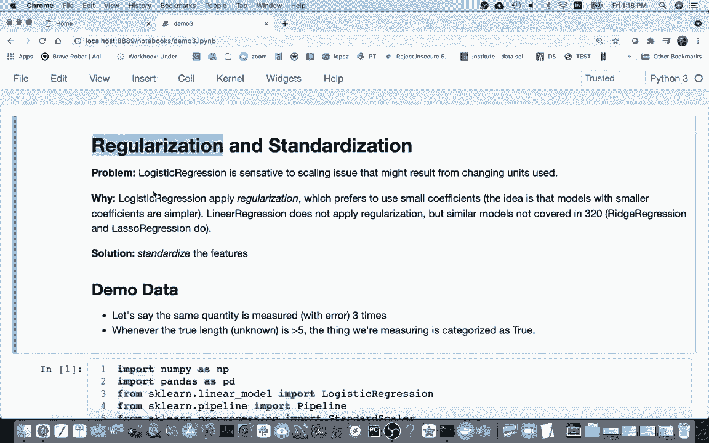
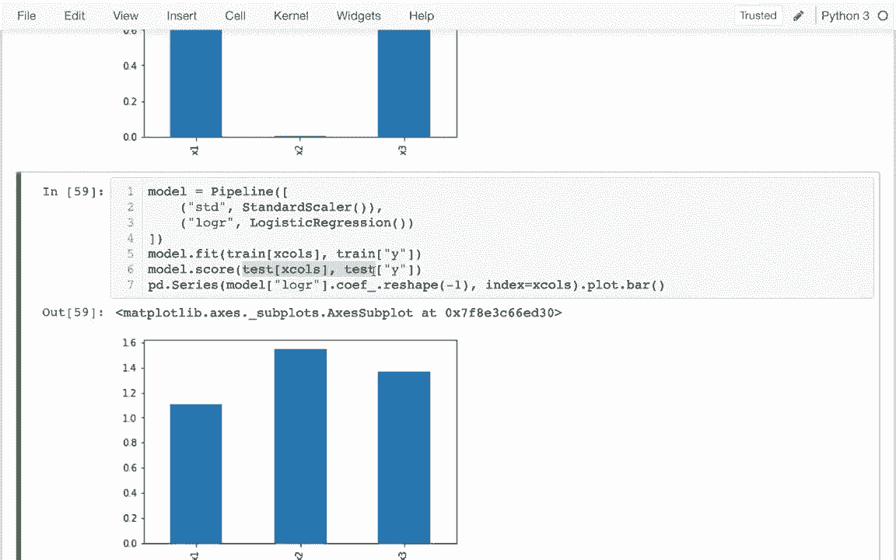

# 机器学习入门 P10：正则化与标准化 📊


在本节课中，我们将学习机器学习中两个重要的概念：**正则化**和**标准化**。正则化有助于防止模型对训练数据“过度学习”，而标准化则确保不同特征的数据处于同一尺度，使模型训练更稳定、更公平。我们将通过简单的例子和代码来理解它们的作用。

---



## 1. 正则化简介 🛡️

上一节我们介绍了逻辑回归等模型。本节中我们来看看**正则化**。正则化是一个复杂的话题，其数学原理可能涉及高级课程。这里我们只给出最直观的理解。

正则化的核心思想是：**防止模型过于依赖某一个特征**。模型有时会因为某个特征在训练数据上表现“太好”而给它分配一个非常大的权重（系数）。这可能导致模型在未见过的测试数据上表现不佳，因为它过度拟合了训练数据中的偶然噪声。

正则化通过向模型添加一个“惩罚项”来鼓励使用较小的系数，从而让模型更均衡地考虑所有特征。在Scikit-learn中，逻辑回归默认就使用了正则化。

**核心公式**：逻辑回归的损失函数通常包含一个正则化项，例如L2正则化（岭回归）：
`损失 = 原始损失 + λ * Σ(系数²)`
其中，λ是控制正则化强度的参数。

---

## 2. 为什么需要标准化？ 📏

我们已经知道逻辑回归对数据的**缩放非常敏感**。例如，一个特征的单位从“英里”改为“英尺”，数值会变大5280倍，这可能会极大地影响模型学到的系数。

我们关心的是数据背后的真实信息，而不是人为选择的单位。因此，我们希望模型不受单位影响。**标准化**就是解决这个问题的技术，它通过调整数据，使所有特征具有相同的尺度（通常均值为0，标准差为1）。

以下是标准化的步骤：
1.  计算每个特征的均值（μ）和标准差（σ）。
2.  对每个数据点进行变换：`新值 = (原值 - μ) / σ`。

经过标准化，不同特征的数据就处于可比较的范围内了。

---

## 3. 一个示例：理解问题 🔍

让我们通过一个虚构的例子来具体感受问题所在。假设我们试图根据三个有噪声的长度测量值（x1, x2, x3）来预测一个物体的类别（真/假）。基本规则是：物体的真实长度大于5时为“真”，否则为“假”。

以下是生成示例数据的代码：

```python
import numpy as np
import pandas as pd

np.random.seed(42)
n_samples = 1000

# 生成真实长度（均值为4）
true_length = np.random.normal(4, 1, n_samples)
# 根据规则生成类别标签
y = true_length > 5

# 生成三个带噪声的测量值
x1 = true_length + np.random.normal(0, 0.5, n_samples)
x2 = true_length + np.random.normal(0, 0.5, n_samples)
x3 = true_length + np.random.normal(0, 0.5, n_samples)

# 创建DataFrame
data = pd.DataFrame({'x1': x1, 'x2': x2, 'x3': x3, 'y': y})
```

如果我们直接在这个数据上训练一个逻辑回归模型：

```python
from sklearn.linear_model import LogisticRegression

model = LogisticRegression()
X = data[['x1', 'x2', 'x3']]
y = data['y']
model.fit(X, y)
print("模型准确率：", model.score(X, y))
```

我们可能会得到约89%的准确率。但如果我们查看模型的系数：

```python
import matplotlib.pyplot as plt

coefficients = model.coef_.flatten()
features = ['x1', 'x2', 'x3']

plt.bar(features, coefficients)
plt.title('逻辑回归模型系数')
plt.ylabel('系数值')
plt.show()
```

可能会发现某个特征（如x1）的系数远大于其他特征。这可能是偶然的，因为三个特征本应包含相似的信息量。

---

## 4. 单位变化带来的问题 🔄

现在，让我们模拟单位变化带来的问题。假设我们将特征x2的单位从“英尺”改为“英里”（1英里 = 5280英尺）：

```python
# 改变x2的单位（模拟英尺到英里）
data['x2_miles'] = data['x2'] / 5280

# 使用新单位的数据训练模型
X_new = data[['x1', 'x2_miles', 'x3']]
model_new = LogisticRegression()
model_new.fit(X_new, y)

coefficients_new = model_new.coef_.flatten()
plt.bar(['x1', 'x2_miles', 'x3'], coefficients_new)
plt.title('单位改变后的模型系数')
plt.ylabel('系数值')
plt.show()
```

你会发现，**x2_miles的系数变得非常小，甚至接近于0**。这是因为它的数值变得极小（除以了5280），而正则化惩罚大系数，导致模型几乎忽略了这一列的信息。这显然不是我们想要的，我们只是改变了单位，信息本质没有变。

---

## 5. 手动标准化解决方案 ✋

为了解决单位不一致的问题，我们可以手动对数据进行标准化。目标是让每个特征的均值为0，标准差为1。

以下是手动标准化的步骤：

```python
# 提取特征数据
X_features = data[['x1', 'x2_miles', 'x3']].copy()

# 1. 计算每个特征的均值和标准差
mean = X_features.mean()
std = X_features.std()

# 2. 执行标准化：(x - mean) / std
X_standardized = (X_features - mean) / std

# 将标准化后的数据放回原DataFrame（或直接使用）
data_std = X_standardized.copy()
data_std['y'] = y

# 使用标准化后的数据训练模型
model_std = LogisticRegression()
model_std.fit(data_std[['x1', 'x2_miles', 'x3']], data_std['y'])

coefficients_std = model_std.coef_.flatten()
plt.bar(['x1', 'x2_miles', 'x3'], coefficients_std)
plt.title('手动标准化后的模型系数')
plt.ylabel('系数值')
plt.show()
```

现在，你会发现**x2_miles的系数重新变得与其他特征相近**。模型能够公平地看待所有特征，不再受原始单位的影响。

---

## 6. 使用Scikit-learn的标准化器 🛠️

手动标准化在实践中有个重要问题：**我们必须用训练集计算出的均值和标准差去转换测试集**，而不能在测试集上重新计算。Scikit-learn的`StandardScaler`为我们自动化了这个过程，并确保了方法的一致性。

以下是使用`StandardScaler`的最佳实践：

```python
from sklearn.preprocessing import StandardScaler
from sklearn.pipeline import Pipeline

# 创建一个管道：先标准化，再逻辑回归
model_pipeline = Pipeline([
    ('scaler', StandardScaler()),   # 第一步：标准化
    ('classifier', LogisticRegression()) # 第二步：分类
])

# 使用原始数据（未手动处理）进行训练
X_original = data[['x1', 'x2_miles', 'x3']]
model_pipeline.fit(X_original, y)

# 评估模型
print("管道模型准确率：", model_pipeline.score(X_original, y))

# 查看标准化后逻辑回归的系数
# 需要从管道中取出‘classifier’步骤
lr_in_pipeline = model_pipeline.named_steps['classifier']
coefficients_pipe = lr_in_pipeline.coef_.flatten()

plt.bar(['x1', 'x2_miles', 'x3'], coefficients_pipe)
plt.title('使用Pipeline标准化后的模型系数')
plt.ylabel('系数值')
plt.show()
```

使用`Pipeline`的好处是：
*   **自动化**：拟合（`fit`）时，`StandardScaler`只从训练数据计算均值和标准差。
*   **一致性**：预测（`predict`）或评分（`score`）时，自动使用之前计算的均值和标准差转换新数据，避免数据泄露。
*   **代码简洁**：将所有步骤封装在一起，使代码更清晰、更不易出错。

---

## 总结 📝

本节课中我们一起学习了正则化与标准化：
1.  **正则化**：通过惩罚大的模型系数，防止模型过度依赖某个特征，提高泛化能力。逻辑回归等模型内置了此机制。
2.  **标准化**：通过`(x - 均值) / 标准差`公式将数据缩放到相同尺度，消除特征单位不同带来的影响，使模型训练更稳定。
3.  **实践方法**：使用Scikit-learn的`StandardScaler`和`Pipeline`可以方便、正确地在机器学习工作流中集成标准化步骤。



记住，对于像逻辑回归、支持向量机（SVM）和K近邻（KNN）这类基于距离或梯度的模型，**标准化通常是一个重要的预处理步骤**。