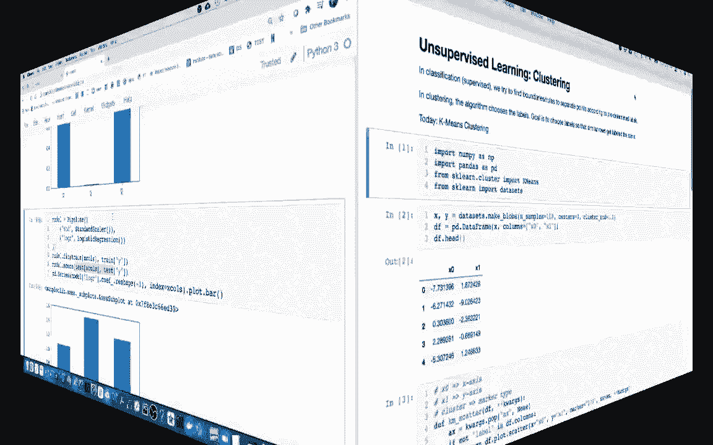
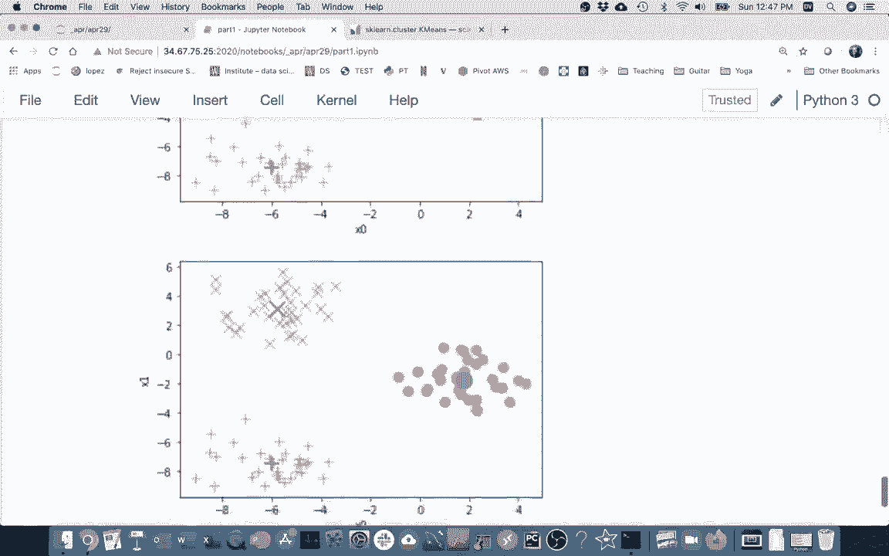
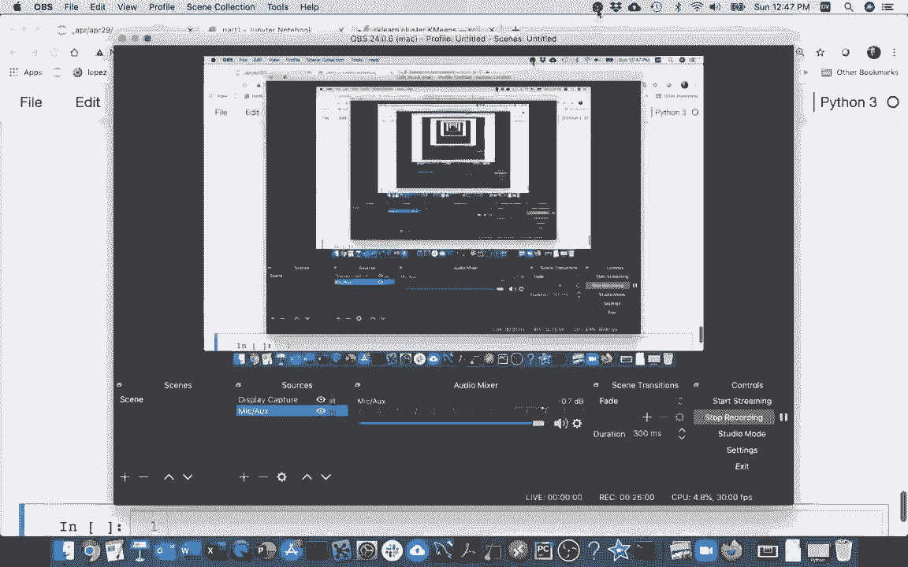

# 机器学习课程 P11：K均值聚类 🧩



在本节课中，我们将学习一种经典的无监督学习算法——K均值聚类。我们将了解它与监督学习的区别，并通过一个从零开始的代码示例，深入理解其核心工作原理。

---

## 概述

上一节我们介绍了监督学习，如回归和分类。本节中，我们来看看无监督学习的一个典型例子：聚类。在聚类问题中，数据没有预先存在的标签，算法需要自行发现数据中的内在结构，将相似的数据点归为一组。

---

## 聚类与分类的区别

聚类与分类有相似之处，它们都涉及对数据点进行分组。然而，关键区别在于数据是否带有预设标签。

*   **分类**：数据点带有已知标签（例如，红点或蓝点）。目标是学习一个规则，根据特征来预测新数据点的标签。
*   **聚类**：数据点没有标签。目标是发现数据中自然存在的分组，算法自行决定如何为数据点分配“标签”（即属于哪个簇）。

由于没有预设答案（标签）来指导学习过程，因此聚类被称为**无监督学习**。

---

## K均值算法简介

K均值是迄今为止最著名的聚类算法。它的目标是将数据划分为K个簇，使得每个数据点都属于离它最近的簇中心（称为**质心**），并且所有点到其所属质心的距离之和最小。

算法通过迭代优化来实现这个目标，主要交替进行两个步骤。

---

## K均值算法步骤

以下是K均值算法的核心流程：

1.  **初始化**：随机选择K个点作为初始质心。
2.  **分配点**：将每个数据点分配到离它最近的质心所在的簇。
3.  **更新质心**：重新计算每个簇中所有点的平均值，将该平均值作为新的质心。
4.  **迭代**：重复步骤2和步骤3，直到质心的位置不再发生显著变化（即算法收敛）。

---

## 从零实现K均值

为了帮助你理解算法细节，我们将手动实现一个简化版的K均值，而不是直接调用库。

### 1. 生成示例数据

首先，我们使用`sklearn`生成一些易于聚类的模拟数据（“blobs”）。

```python
from sklearn.datasets import make_blobs
import pandas as pd

# 生成数据：100个点，围绕3个中心，带有一些随机性
X, y_true = make_blobs(n_samples=100, centers=3, cluster_std=0.60, random_state=0)

# 将数据转换为DataFrame，方便处理
df = pd.DataFrame(X, columns=['x0', 'x1'])
```

### 2. 可视化初始数据

生成的数据点大致围绕三个中心分布，但我们假装不知道这个信息（无标签）。

```python
import matplotlib.pyplot as plt

def plot_data(df):
    plt.scatter(df['x0'], df['x1'], alpha=0.5)
    plt.xlabel('x0')
    plt.ylabel('x1')
    plt.title('未标记的原始数据')
    plt.show()

plot_data(df)
```

### 3. 构建K均值类

我们创建一个类来封装算法逻辑。初始时，我们随机指定三个点作为质心。

```python
import numpy as np

class SimpleKMeans:
    def __init__(self, df, initial_centroids):
        # 复制数据，避免修改原始数据
        self.df = df.copy()
        # 存储质心信息：一个包含坐标和标签的DataFrame
        self.centroids = initial_centroids.copy()

    def assign_points(self):
        """分配步骤：将每个点分配给最近的质心"""
        # 为每个质心计算数据点到该质心的距离
        for idx, row in self.centroids.iterrows():
            label = row['label']
            # 计算欧几里得距离: sqrt((x0_diff)^2 + (x1_diff)^2)
            x0_diff = self.df['x0'] - row['x0']
            x1_diff = self.df['x1'] - row['x1']
            distance = np.sqrt(x0_diff**2 + x1_diff**2)
            # 将距离存储为新列
            self.df[label] = distance

        # 对于每个点，找出距离最小的那个质心标签
        # axis=1表示沿着列（水平方向）查找最小值所在的列名
        distance_columns = self.centroids['label'].tolist()
        self.df['assigned_label'] = self.df[distance_columns].idxmin(axis=1)
        return self

    def update_centroids(self):
        """更新步骤：根据点的分配，重新计算每个簇的质心（均值）"""
        # 按分配标签分组，并计算每组的均值
        new_centroids_data = self.df.groupby('assigned_label')[['x0', 'x1']].mean()
        # 重置索引，使标签重新成为一列
        new_centroids_data = new_centroids_data.reset_index()
        # 重命名列以匹配初始质心的格式
        new_centroids_data.columns = ['label', 'x0', 'x1']
        # 更新质心
        self.centroids = new_centroids_data
        return self

    def plot_current_state(self):
        """绘制当前数据点分配和质心位置"""
        fig, ax = plt.subplots()
        # 绘制数据点，按分配标签着色
        for label in self.centroids['label']:
            cluster_points = self.df[self.df['assigned_label'] == label]
            ax.scatter(cluster_points['x0'], cluster_points['x1'], label=label, alpha=0.6)
        # 绘制当前质心
        ax.scatter(self.centroids['x0'], self.centroids['x1'], c='black', marker='X', s=200, label='Centroids')
        ax.set_xlabel('x0')
        ax.set_ylabel('x1')
        ax.legend()
        ax.set_title('当前聚类状态')
        plt.show()
```

### 4. 运行算法

现在，我们初始化算法并进行几次迭代。

```python
# 1. 随机初始化三个质心（这里我们手动指定一个简单的初始位置）
initial_centroids = pd.DataFrame({
    'label': ['A', 'B', 'C'],
    'x0': [0, 2, -1],
    'x1': [0, 2, -1]
})

# 2. 创建KMeans实例
kmeans = SimpleKMeans(df, initial_centroids)

# 3. 执行第一轮：分配点
print("初始随机质心分配：")
kmeans.assign_points().plot_current_state()

# 4. 执行第一轮：更新质心
print("第一次更新质心后：")
kmeans.update_centroids().plot_current_state()

# 5. 多迭代几轮
for i in range(5):
    print(f"\n迭代 {i+2}:")
    kmeans.assign_points().update_centroids().plot_current_state()
```

---

## 算法挑战与优化

在手动实现中，你可能会遇到算法陷入**局部最优解**的情况。这意味着由于初始质心位置选择不佳，算法收敛到了一个不是全局最好的聚类结果。

**解决方案**：标准的`sklearn`实现通过以下策略缓解这个问题：
*   **多次随机初始化**：算法会从不同的随机质心开始，多次运行整个K均值流程。
*   **选择最佳结果**：最终选择所有运行中效果最好（簇内距离和最小）的那一次作为输出。

---

## 使用Scikit-learn的KMeans

理解了原理后，使用库就非常简单了。`sklearn`的实现包含了上述优化策略。

```python
from sklearn.cluster import KMeans

# 创建KMeans实例，指定簇数K=3
# n_init=10表示用10个不同的质心种子运行算法，选择最佳结果
kmeans_sk = KMeans(n_clusters=3, n_init=10, random_state=0)

# 拟合数据（无标签y）
kmeans_sk.fit(df[['x0', 'x1']])

# 获取簇标签和质心
df['sklearn_label'] = kmeans_sk.labels_
centroids_sk = kmeans_sk.cluster_centers_

print("Scikit-learn 计算的质心：")
print(centroids_sk)
```

---

## 总结

本节课中我们一起学习了K均值聚类算法。

*   我们首先区分了**无监督学习（聚类）** 与**监督学习（分类）**。
*   然后，我们深入探讨了K均值的核心思想：通过迭代执行**分配点**和**更新质心**两个步骤，将数据划分成K个簇。
*   我们通过从零开始的代码实现，揭示了算法的内部工作机制，并了解了它可能遇到的**局部最优**问题及其解决方案。
*   最后，我们介绍了如何使用`scikit-learn`中高效且稳健的`KMeans`类来完成聚类任务。





K均值是探索数据内在结构的强大工具，广泛应用于客户细分、图像压缩、异常检测等领域。记住，选择合适的K值本身也是一个重要的课题，我们将在后续课程中探讨。