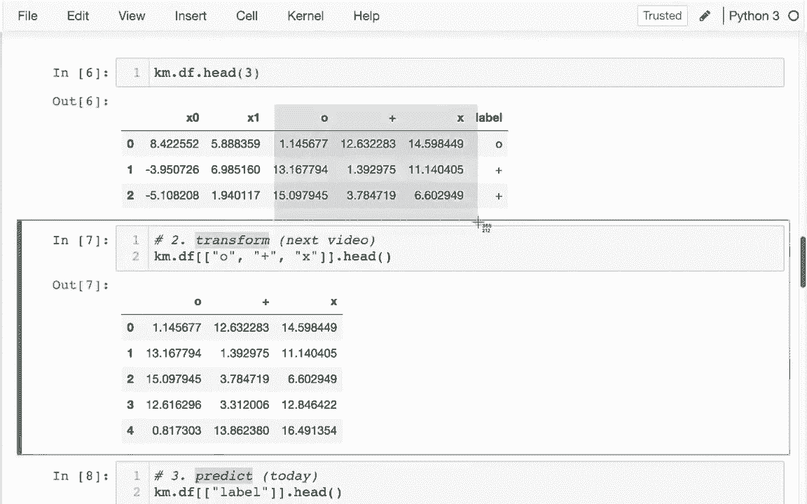
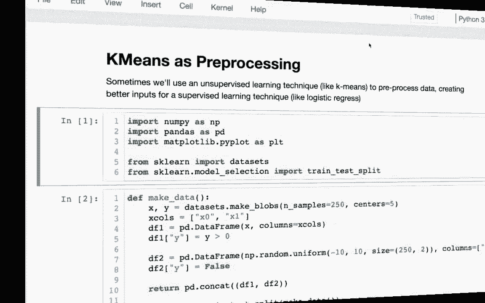
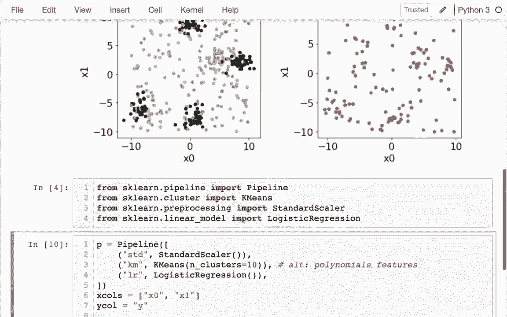

# 机器学习课程 P12：使用 Scikit-learn 进行 K 均值聚类 🧮


在本节课中，我们将学习如何使用 Scikit-learn 库内置的 `KMeans` 类进行聚类分析。我们将了解其核心方法、如何评估聚类效果，以及如何将 K 均值作为预处理步骤集成到机器学习管道中。

---

## 1. 为何使用 Scikit-learn 的 KMeans 类？ 🤔

在上一节中，我们手动构建了自己的 K 均值聚类类。本节中，我们将看到使用 Scikit-learn 内置的 `KMeans` 类更为便捷和高效。

Scikit-learn 的 `KMeans` 类具有以下优势：
*   自动处理初始质心选择等复杂细节。
*   内置智能策略，例如使用 `n_init` 参数进行多次随机初始化以避免局部最优解。
*   自动判断收敛条件，通过 `max_iter` 设置迭代上限，通常不会进行不必要的迭代。

因此，在实际应用中，推荐使用 Scikit-learn 的 `KMeans` 类。

---

## 2. KMeans 的核心方法：fit, transform, predict 🔧

`KMeans` 类提供了三个核心方法：`fit`、`transform` 和 `predict`。这与我们之前见过的转换器和估算器模型有些相似，但用法略有不同。

以下是这三个方法在我们之前手动编写的代码中对应的逻辑：

```python
# 伪代码，展示手动实现 K 均值的核心循环逻辑
for i in range(n_epochs): # n_epochs 类似于 max_iter
    assign_points() # 对应 predict 步骤：为每个点分配最近质心标签
    update_centers() # 更新质心位置
# 最终得到：1) 每个点的聚类标签 2) 最终的质心坐标
```

相比之下，Scikit-learn 的 `KMeans` 类在拟合后，会为数据生成两类额外信息：
1.  **距离信息**：每个点到所有质心的距离。
2.  **标签信息**：每个点所属的聚类（即距离最小的那个质心对应的标签）。

`transform` 和 `predict` 方法的区别就在于输出的是哪类信息：
*   **`transform(X)`**：返回数据 `X` 中每个样本到所有质心的距离。例如，如果有 3 个质心，则返回一个形状为 `(n_samples, 3)` 的数组。
*   **`predict(X)`**：返回数据 `X` 中每个样本所属的聚类标签（0, 1, 2...）。

---

## 3. 动手实践：使用 KMeans 聚类 🚀

现在，让我们在具体数据上使用 Scikit-learn 的 `KMeans`。

首先，我们初始化模型并拟合数据：

```python
from sklearn.cluster import KMeans
import pandas as pd

# 假设 df 是我们的数据框，包含特征列 ‘x0‘ 和 ‘x1‘
km = KMeans(n_clusters=3) # 指定聚类数量为 3
km.fit(df[['x0', 'x1']]) # 拟合模型
```

拟合之后，我们可以进行转换或预测：

```python
# 1. 使用 transform 获取距离
distances = km.transform(df[['x0', 'x1']])
# distances 是一个数组，每一行是点到三个质心的距离

# 2. 使用 predict 获取聚类标签
labels = km.predict(df[['x0', 'x1']])
# labels 是一个数组，包含每个点的聚类编号 (0, 1, 2)
```

我们可以将预测的标签添加回原始数据框，并可视化结果：

```python
# 将聚类标签添加到数据框
df['cluster'] = labels

# 根据聚类标签着色，绘制散点图
import matplotlib.pyplot as plt
plt.scatter(df['x0'], df['x1'], c=df['cluster'], cmap='tab10')
# 绘制质心
centers = km.cluster_centers_
plt.scatter(centers[:, 0], centers[:, 1], c='red', s=100, marker='X')
plt.show()
```

---

## 4. 如何确定最佳的聚类数量？ 📊

在上面的例子中，我们“猜测”了聚类数量 `n_clusters=3`。但对于更复杂的数据，我们需要一个策略来确定最佳的 `k` 值。

常用的方法是绘制 **“肘部法则”** 图。我们计算不同 `k` 值下的 **惯性（inertia）**，即样本到其最近质心的距离平方和。惯性越小，说明聚类越紧密。

以下是绘制肘部法则图的步骤：

```python
inertia_vals = []
k_range = range(1, 11) # 尝试 k 从 1 到 10

for k in k_range:
    km = KMeans(n_clusters=k)
    km.fit(df[['x0', 'x1']])
    inertia_vals.append(km.inertia_) # 获取当前 k 下的惯性值

# 绘制惯性随 k 变化的曲线
plt.plot(k_range, inertia_vals, marker='o')
plt.xlabel('Number of Clusters (k)')
plt.ylabel('Inertia (Avg. Squared Distance to Centroid)')
plt.title('Elbow Method For Optimal k')
plt.show()
```

**如何解读**：寻找曲线中“肘部”的拐点。在拐点之后，增加 `k` 带来的惯性下降幅度变缓。这个拐点对应的 `k` 值通常是一个较好的选择。



---



## 5. KMeans 作为预处理步骤 🔄

K 均值聚类不仅可以用于探索性数据分析，还可以作为监督学习模型（如逻辑回归）的强大预处理工具。

**场景**：当数据类别边界非常复杂，无法用简单直线分开时，逻辑回归可能表现不佳。此时，可以先用 K 均值对特征空间进行划分，然后将每个点到各质心的距离作为新特征，再输入逻辑回归模型。

以下是构建包含 K 均值预处理的管道的示例：

```python
from sklearn.pipeline import Pipeline
from sklearn.preprocessing import StandardScaler
from sklearn.linear_model import LogisticRegression
from sklearn.cluster import KMeans

# 定义管道步骤
pipe = Pipeline([
    ('scaler', StandardScaler()), # 第一步：标准化数据
    ('kmeans', KMeans(n_clusters=5)), # 第二步：K 均值聚类（作为特征转换器）
    ('logreg', LogisticRegression()) # 第三步：逻辑回归分类
])

# 假设 X_train, y_train, X_test, y_test 已定义
pipe.fit(X_train, y_train) # 在训练集上拟合整个管道
accuracy = pipe.score(X_test, y_test) # 在测试集上评估
print(f"Pipeline Accuracy: {accuracy:.2f}")
```

**工作原理**：
1.  `KMeans` 在 `fit` 阶段学习训练数据的质心。
2.  在 `transform` 阶段（管道内部自动调用），计算每个样本到这些质心的距离，生成新的特征集。
3.  逻辑回归模型基于这些新的距离特征进行训练和预测，从而能够学习到更复杂的决策边界。

这种方法通常比直接使用原始特征更有效，特别是当数据存在明显的分组结构时。

---

## 总结 📝

本节课中，我们一起学习了：
1.  **使用 Scikit-learn 的 `KMeans`**：了解了其相对于手动实现的优势。
2.  **核心方法**：区分了 `fit`、`transform`（输出距离）和 `predict`（输出标签）的用途。
3.  **实践与可视化**：完成了聚类、添加标签和可视化质心的完整流程。
4.  **确定最佳 k 值**：通过“肘部法则”图来辅助选择聚类数量。
5.  **高级应用**：将 K 均值作为特征工程的预处理步骤，集成到机器学习管道中，以提升后续分类器的性能。



通过掌握这些内容，你已能够熟练运用 Scikit-learn 的 K 均值算法进行数据聚类和特征构造。