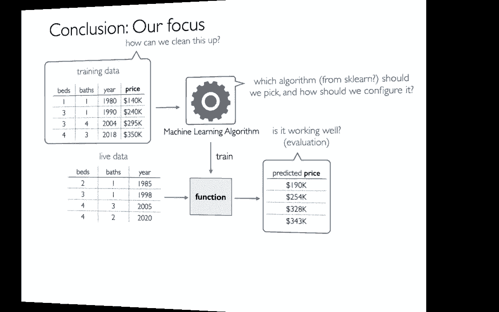
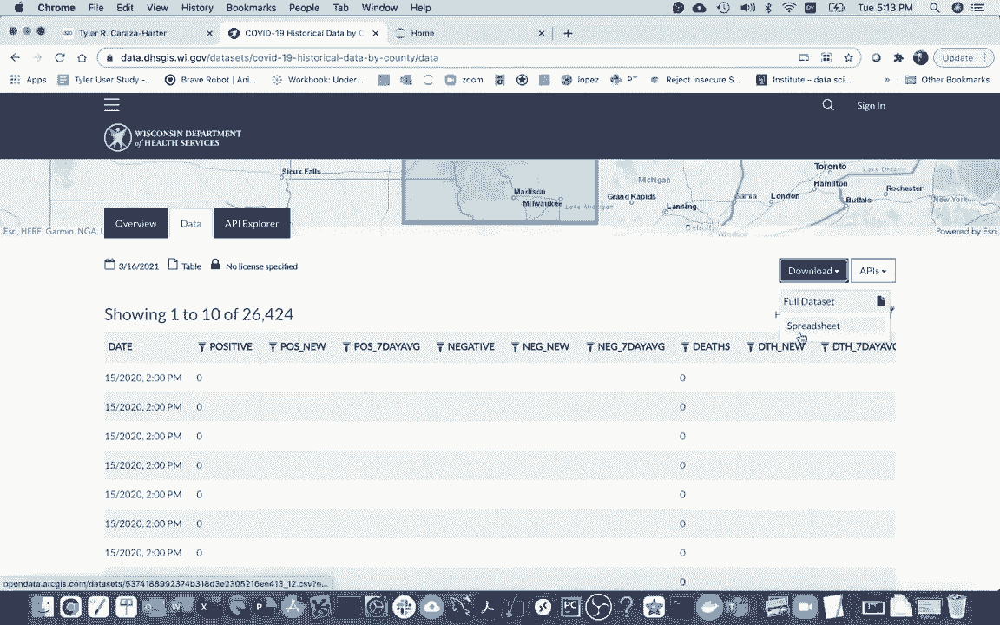
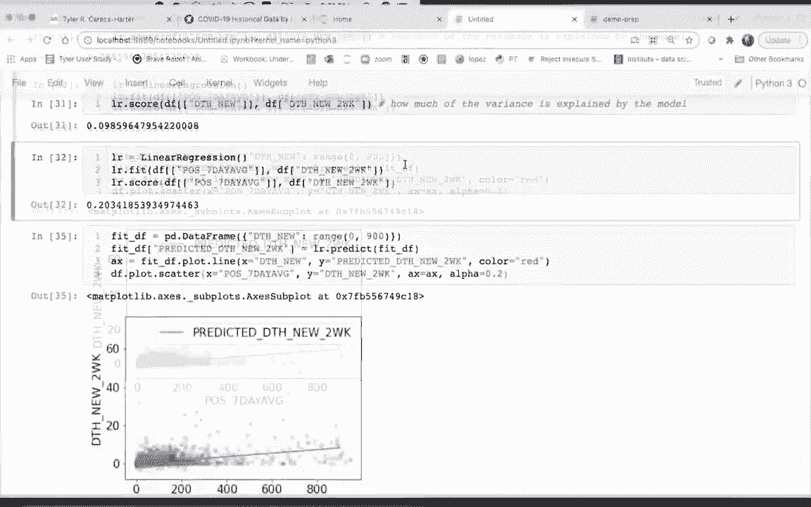

# 机器学习课程 P2：使用 Scikit-learn 进行线性回归 📈



在本节课中，我们将学习如何使用 Scikit-learn 库训练一个线性回归模型。我们将以威斯康星州的 COVID-19 数据为例，尝试预测未来两周的死亡人数。课程将涵盖数据准备、模型训练、可视化以及初步评估。

---



## 数据准备与探索 🔍

上一节我们介绍了课程目标，本节中我们来看看如何准备和探索数据。首先，我们从威斯康星州卫生服务部的数据门户获取了按县统计的历史 COVID-19 数据。数据集包含了每日的统计数据，例如总阳性病例数、新增病例数、过去七天的平均病例数以及死亡人数。

我们的目标是：基于当日的统计数据，预测未来两周的新增死亡人数。为此，我们对原始数据进行了清理和特征工程。

以下是数据清理的主要步骤：
*   删除了所有包含缺失数据的条目。
*   将日期字段转换为标准日期格式，并移除了时间部分。
*   将文档中表示“少于5”的特殊值（-999）替换为0以简化处理。
*   创建了一个新的目标列 `deaths_new_two_weeks_later`，表示两周后的新增死亡人数。

清理后的数据集包含以下核心列：`date`（日期）、`positives_7_day_avg`（过去七天平均阳性病例数）、`deaths_new`（当日新增死亡人数）以及我们要预测的 `deaths_new_two_weeks_later`。

---

## 数据可视化 📊

在直接训练模型之前，先通过可视化探索数据中的模式是一个好习惯。这有助于我们直观感受特征与目标之间的关系。

我们将使用 `matplotlib` 库来绘制散点图。首先，我们观察 `deaths_new`（当日新增死亡）与 `deaths_new_two_weeks_later`（两周后新增死亡）之间的关系。

```python
import pandas as pd
import matplotlib.pyplot as plt

# 设置图表样式
plt.rcParams.update({'font.size': 12})

# 加载数据
df = pd.read_csv('wisconsin_covid.csv')

# 绘制散点图
df.plot.scatter(x='deaths_new', y='deaths_new_two_weeks_later', alpha=0.2)
plt.show()
```

通过设置 `alpha=0.2` 增加透明度，我们可以在点重叠时更清晰地看到数据分布。接下来，我们再观察 `positives_7_day_avg`（过去七天平均病例数）与目标值的关系。

```python
df.plot.scatter(x='positives_7_day_avg', y='deaths_new_two_weeks_later', alpha=0.2)
plt.show()
```

对比两个散点图，我们可以初步判断哪个特征与预测目标的相关性可能更强。

---

## 训练第一个线性回归模型 🤖

上一节我们通过散点图观察了数据，本节中我们来看看如何用 Scikit-learn 训练模型。我们首先尝试使用 `deaths_new` 这一个特征来预测目标。

线性回归模型试图找到一条最佳拟合直线，其公式为：
**`y_pred = w * x + b`**
其中 `w` 是权重（斜率），`b` 是偏置（截距），`x` 是输入特征，`y_pred` 是预测值。

以下是训练和可视化模型的步骤：

```python
from sklearn.linear_model import LinearRegression

# 1. 准备特征 (X) 和标签 (y)
# 特征需要是二维结构（如DataFrame），标签可以是一维序列（Series）
X = df[['deaths_new']]  # 注意双括号，以保持二维结构
y = df['deaths_new_two_weeks_later']

# 2. 创建并训练模型
lr_model_1 = LinearRegression()
lr_model_1.fit(X, y)

# 3. 使用模型进行预测
# 为了画线，我们生成一组均匀分布的特征值
import numpy as np
fit_df = pd.DataFrame({'deaths_new': np.linspace(0, 100, 200)})
fit_df['prediction'] = lr_model_1.predict(fit_df[['deaths_new']])

# 4. 可视化回归线
ax = fit_df.plot.line(x='deaths_new', y='prediction', color='red', label='Regression Line')

# 5. 在同一图上叠加原始数据散点图
df.plot.scatter(x='deaths_new', y='deaths_new_two_weeks_later', alpha=0.2, ax=ax, label='Actual Data')
plt.show()
```

这段代码会生成一张图，其中红色直线是模型的预测线，蓝色半透明点是实际数据。我们可以直观地看到模型拟合的效果。

---

## 模型评估与比较 ⚖️

仅仅画出拟合线还不够，我们需要一个量化的指标来评估模型的好坏。对于回归问题，常用的一个指标是 **R² 分数**（决定系数）。

R² 分数衡量了模型相对于简单使用目标值平均值进行预测的改进程度。其值范围通常在 0 到 1 之间：
*   **1** 表示模型完美拟合数据。
*   **0** 表示模型不比直接取平均值好。
*   在某些情况下（如模型拟合极差），也可能出现负值。

我们可以用模型的 `.score()` 方法计算 R² 分数。

```python
# 评估第一个模型（基于 deaths_new）
score_1 = lr_model_1.score(X, y)
print(f"模型1 (deaths_new) 的 R² 分数: {score_1:.3f}")
```

接下来，我们训练第二个模型，这次使用 `positives_7_day_avg` 作为特征，并比较两者的性能。

```python
# 训练第二个模型（基于 positives_7_day_avg）
X2 = df[['positives_7_day_avg']]
lr_model_2 = LinearRegression()
lr_model_2.fit(X2, y)

# 评估第二个模型
score_2 = lr_model_2.score(X2, y)
print(f"模型2 (positives_7_day_avg) 的 R² 分数: {score_2:.3f}")

# 同样可视化第二个模型的拟合线
fit_df2 = pd.DataFrame({'positives_7_day_avg': np.linspace(0, 900, 200)})
fit_df2['prediction'] = lr_model_2.predict(fit_df2[['positives_7_day_avg']])

ax2 = fit_df2.plot.line(x='positives_7_day_avg', y='prediction', color='red', label='Regression Line')
df.plot.scatter(x='positives_7_day_avg', y='deaths_new_two_weeks_later', alpha=0.2, ax=ax2, label='Actual Data')
plt.show()
```

通过比较两个模型的 R² 分数，我们可以判断哪个特征对预测两周后死亡人数的能力更强。例如，如果 `score_2` 明显高于 `score_1`，则说明过去七天的平均病例数是更好的预测指标。

---

## 一个重要问题：过拟合 🚨

在刚才的评估中，我们存在一个潜在问题：我们使用**训练数据**本身来计算分数。这就好比老师用课堂上讲过的原题来测验学生，学生得高分可能是因为真正理解了，也可能只是死记硬背了答案。

在机器学习中，模型“死记硬背”训练数据细节，导致在新数据上表现很差的现象，称为 **过拟合**。

我们当前的评估方法（在训练数据上计算分数）无法有效检测过拟合。一个分数很高的模型，可能在面对新的、未见过的数据时表现糟糕。

---

## 总结 📝

本节课中我们一起学习了线性回归的完整流程：
1.  **数据准备**：清理数据，构建用于预测的特征和目标。
2.  **数据探索**：通过可视化初步了解特征与目标的关系。
3.  **模型训练**：使用 `sklearn.linear_model.LinearRegression` 的 `.fit()` 方法训练模型。
4.  **预测与可视化**：使用 `.predict()` 方法进行预测，并将回归线绘制出来，与实际数据对比。
5.  **模型评估**：使用 `.score()` 方法获取 R² 分数，量化模型性能。
6.  **发现问题**：我们指出了当前评估方式的缺陷——它无法揭示模型是否“过拟合”了训练数据。



在下一节课中，我们将学习如何通过将数据分为**训练集**和**测试集**来解决过拟合评估的问题，从而更可靠地衡量模型的真实预测能力。