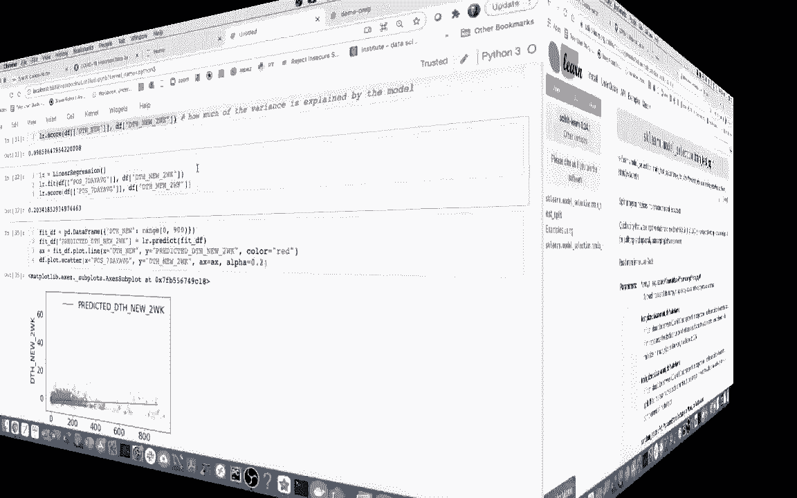
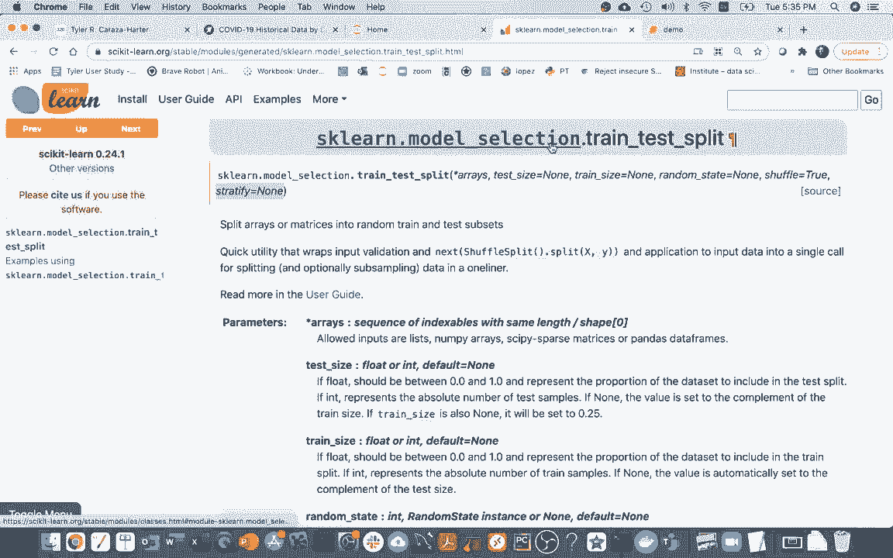
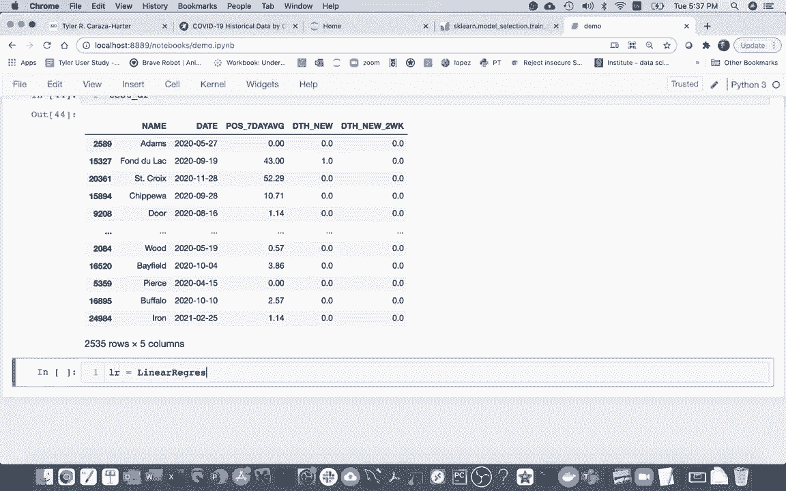
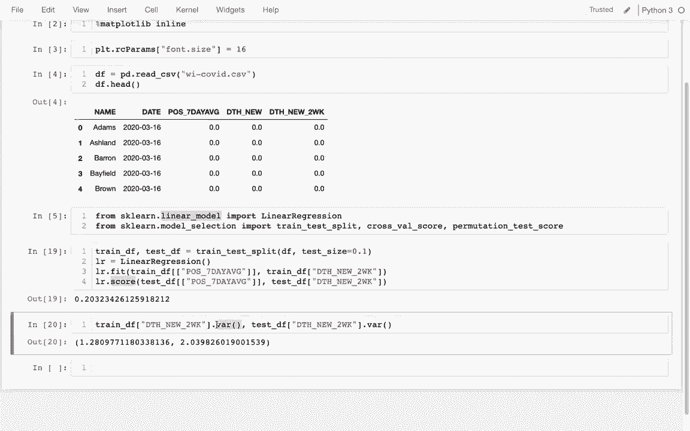
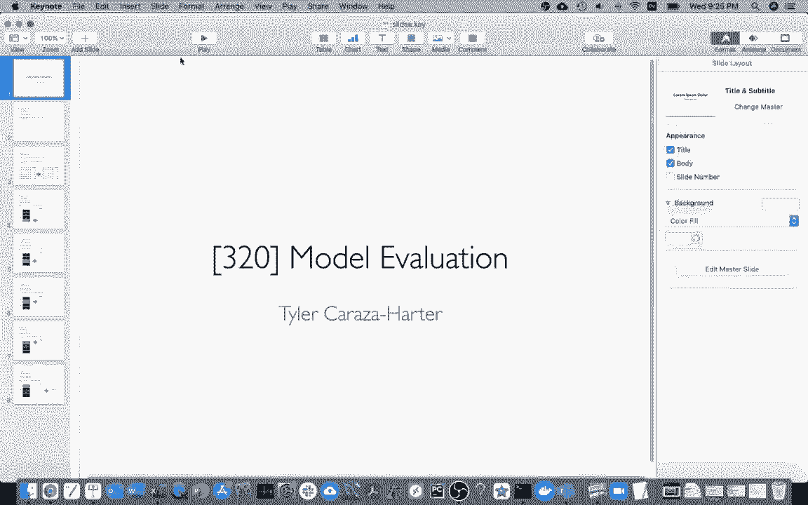
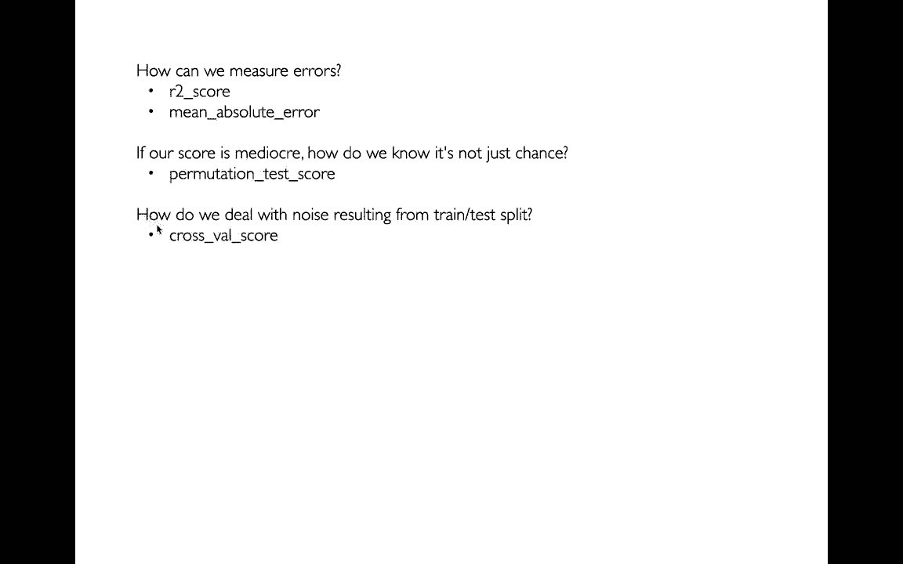
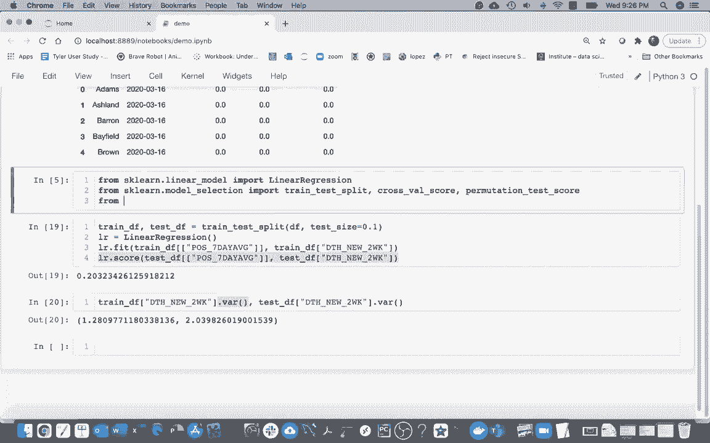
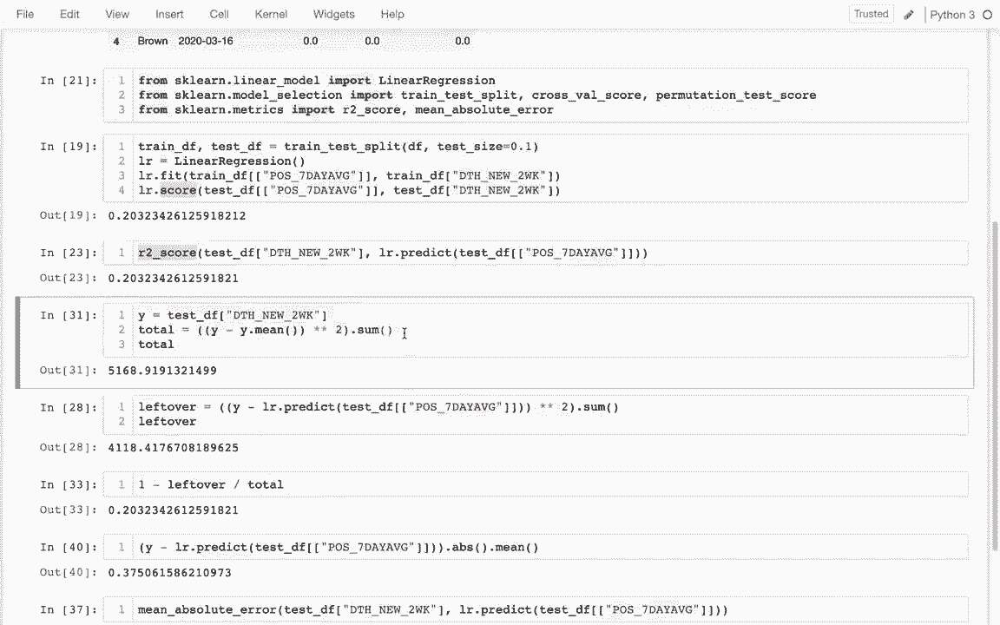

# 机器学习入门：使用 Scikit-learn (P3) - 模型评估与验证 🧪



在本节课中，我们将学习如何正确地评估机器学习模型的性能。我们将重点介绍如何避免模型“记忆”数据（过拟合），并学习几种关键的评估指标，以确保我们的模型能够真正地泛化到新数据上。

---

## 回顾：训练-测试拆分 🧩



上一节我们介绍了在同一份数据上训练和评估模型会导致过拟合的问题。本节中，我们来看看如何使用 `Scikit-learn` 的 `train_test_split` 函数来解决这个问题。

训练-测试拆分是一种通用策略，它将数据集分割成两部分：一部分用于训练模型，另一部分用于评估模型。这样，我们可以在模型从未见过的数据上测试其性能，从而获得更可靠的评估结果。

以下是使用 `train_test_split` 的基本步骤：

1.  从 `sklearn.model_selection` 导入 `train_test_split` 函数。
2.  指定测试集的大小比例（例如，20% 的数据用于测试）。
3.  调用函数，获得训练集和测试集。

```python
from sklearn.model_selection import train_test_split

# 假设 df 是我们的原始数据框
# test_size=0.2 表示 20% 的数据用于测试
train_df, test_df = train_test_split(df, test_size=0.2)
```



拆分后，我们使用 `train_df` 来训练模型，然后使用 `test_df` 来评估模型。这样可以更真实地反映模型处理新数据的能力。

---

## 核心评估指标 📊

现在我们已经有了独立的测试集，接下来需要了解如何量化模型的性能。我们将介绍两个最常用的回归模型评估指标：R² 分数和平均绝对误差（MAE）。

### R² 分数（决定系数）

R² 分数衡量了模型相对于简单使用目标值均值进行预测的改进程度。其值在 0 到 1 之间，越接近 1 表示模型解释数据变异性的能力越强。

**公式**可以理解为：
`R² = 1 - (残差平方和 / 总平方和)`
其中，残差平方和是预测值与真实值之差的平方和，总平方和是真实值与均值之差的平方和。

在 `Scikit-learn` 中，我们可以直接使用模型自带的 `.score()` 方法（默认返回 R² 分数），也可以从 `sklearn.metrics` 模块调用 `r2_score` 函数。

```python
from sklearn.metrics import r2_score

# 使用模型对测试集进行预测
y_pred = model.predict(test_df[feature_columns])

# 计算 R² 分数
r2 = r2_score(test_df[target_column], y_pred)
```

### 平均绝对误差（MAE）

平均绝对误差计算的是预测值与真实值之间绝对差异的平均值。它给出了预测误差的一个直观度量，单位与目标变量相同。

**公式**为：
`MAE = (1/n) * Σ|y_true - y_pred|`

在 `Scikit-learn` 中，使用 `mean_absolute_error` 函数进行计算。

```python
from sklearn.metrics import mean_absolute_error



mae = mean_absolute_error(test_df[target_column], y_pred)
```



与 R² 分数不同，MAE 对大小误差一视同仁，而 R² 由于平方操作，会放大较大误差的影响。根据业务场景，可以选择更合适的指标。

---



## 提升评估的稳定性：交叉验证 🔄


单一的训练-测试拆分存在一个问题：每次随机拆分得到的结果可能波动很大，这导致评估结果不稳定。为了解决这个问题，我们引入交叉验证。



交叉验证的基本思想是将数据分成 k 个相似的子集（称为“折”）。然后进行 k 轮训练和测试，每一轮使用不同的子集作为测试集，其余子集作为训练集。最后，将 k 轮评估结果的平均值作为最终性能估计。

这种方法能更充分地利用数据，并提供更稳定、可靠的性能评估。

`Scikit-learn` 提供了 `cross_val_score` 函数来方便地进行交叉验证。

```python
from sklearn.model_selection import cross_val_score

# 创建模型实例
model = LinearRegression()

# 进行5折交叉验证，评估指标为R²
scores = cross_val_score(model, df[feature_columns], df[target_column], cv=5, scoring='r2')

# scores 是一个包含5个得分的数组
average_r2 = scores.mean()  # 计算平均R²分数
```

通过交叉验证，我们可以得到一个对模型泛化能力更稳健的估计。

---

## 判断性能是否偶然：置换检验 🃏

有时，即使模型得分看起来不错（比如 R²=0.2），我们也需要确认这个性能不是偶然得到的。置换检验是一种用于此目的的方法。

其原理是：如果模型没有学到任何真实规律，那么打乱目标变量（`y`）的顺序后，模型应该得到相似的分数。具体操作步骤如下：

1.  记录模型在原始数据上的真实得分（如 R²）。
2.  多次随机打乱目标变量的值，在打乱后的数据上重新训练和评估模型，得到一系列“随机得分”。
3.  比较真实得分与这些随机得分的分布。如果真实得分显著高于随机得分，则说明模型的性能是真实的。

虽然 `Scikit-learn` 有 `permutation_test_score` 函数，但理解其思想更为重要。它帮助我们区分模型是学到了信号，还是仅仅拟合了噪声。

---

## 总结 🎯

本节课中我们一起学习了机器学习模型评估的核心知识。

我们首先回顾了**训练-测试拆分**的重要性，它是防止过拟合、评估模型泛化能力的基础。接着，我们深入探讨了两个核心评估指标：**R² 分数**和**平均绝对误差（MAE）**，理解了它们的计算方式和适用场景。

然后，我们介绍了**交叉验证**技术，它通过多次拆分和平均，为我们提供了更稳定、可靠的模型性能估计。最后，我们了解了**置换检验**的思想，它帮助我们判断模型的性能是否具有统计学意义，而非偶然获得。



掌握这些评估和验证方法，是构建可靠、有效机器学习模型的关键一步。在接下来的学习中，我们将运用这些工具来优化和选择更好的模型。