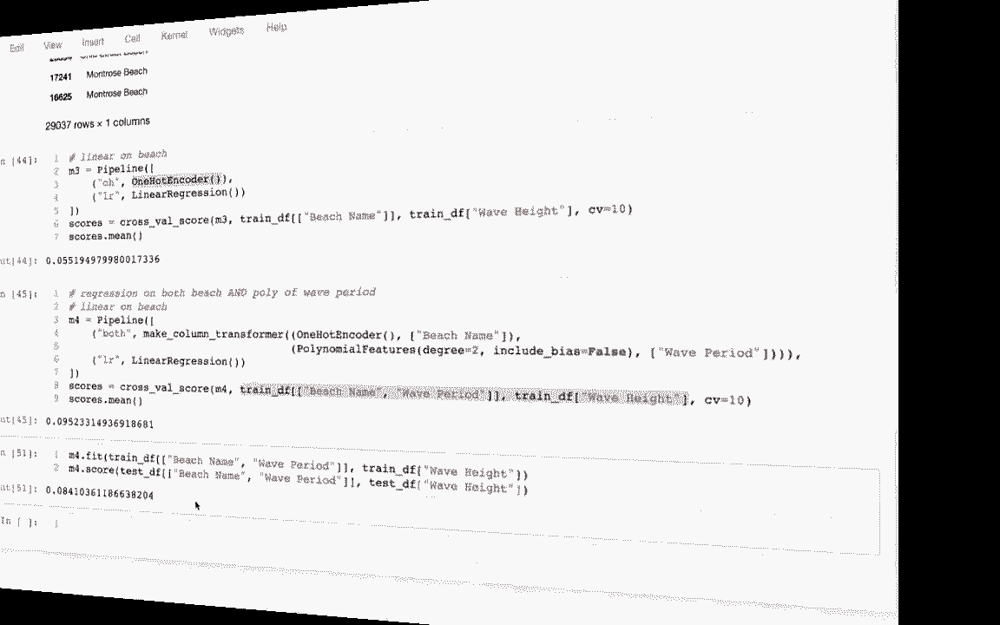
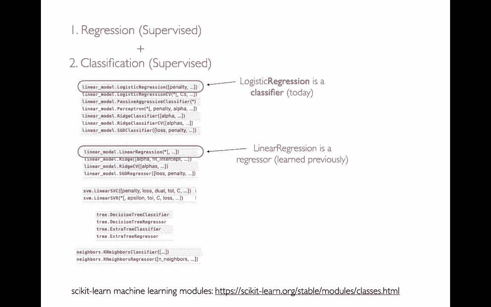
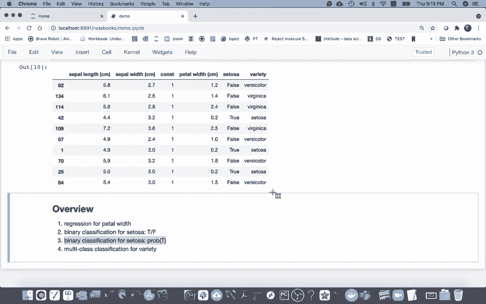
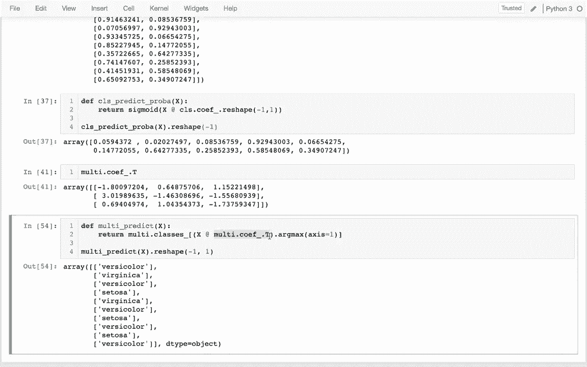

# 机器学习课程 P6：逻辑回归 📊



在本节课中，我们将学习机器学习中的分类问题，并重点介绍逻辑回归模型。我们将从回顾机器学习的主要类别开始，然后通过一个具体的鸢尾花数据集示例，演示如何使用Scikit-learn进行回归、二元分类和多类分类。课程将涵盖模型的核心数学原理，即点积运算，并解释如何将线性分数转换为概率。

---

## 机器学习问题类型回顾

上一节我们介绍了机器学习的基本概念，本节中我们来看看机器学习的主要问题类型。

机器学习主要分为三大类：
*   **监督学习**：我们尝试根据已知的输入和输出数据，对未来或未知事物进行预测。
*   **无监督学习**：数据中没有特定的预测目标，我们旨在发现数据中的模式或进行简化。
*   **强化学习**：涉及多阶段决策，本课程暂不涉及。



在监督学习中，我们已学习过**回归**问题，即预测一个连续数值。本节课我们将学习另一种最常见的监督学习问题：**分类**，即预测一个类别标签。

回归与分类问题的核心区别在于预测目标（标签）的类型：
*   在回归问题中，标签是**定量**的（连续数值）。
*   在分类问题中，标签是**分类**的（离散类别）。

Scikit-learn为不同类型的问题提供了多种算法。值得注意的是，**逻辑回归**虽然名字中包含“回归”，但它实际上是一个用于解决分类问题的模型。

---

## 实践准备：鸢尾花数据集

我们将使用著名的鸢尾花（Iris）数据集进行演示。该数据集包含了鸢尾花的花萼和花瓣测量值，以及其品种信息。



以下是数据准备步骤的代码：

```python
# 导入必要的库并加载数据
import pandas as pd
from sklearn.model_selection import train_test_split

# 假设 df 是包含 Iris 数据的数据框，其中包含特征和‘species’列
# 为了示例清晰，我们创建一个小的测试集
X_train, X_test, y_train, y_test = train_test_split(df[['sepal_length', 'sepal_width']], 
                                                    df['species'], 
                                                    test_size=10, 
                                                    random_state=42) # 设置随机种子以确保结果可复现

# 为特征矩阵添加常数列（用于模拟截距）
X_train['constant'] = 1
X_test['constant'] = 1

# 定义特征列名
x_columns = ['sepal_length', 'sepal_width', 'constant']
```

我们准备了三个预测任务：
1.  **回归**：预测花瓣宽度（`petal_width`）。
2.  **二元分类**：预测是否为山鸢尾（`setosa`）。
3.  **多类分类**：预测具体品种（`species`）。

---

## 任务一：线性回归复习

首先，我们复习如何使用线性回归模型预测连续值。

以下是实现线性回归的步骤：

```python
from sklearn.linear_model import LinearRegression

# 1. 创建模型实例，设置 fit_intercept=False 因为我们已手动添加常数列
reg = LinearRegression(fit_intercept=False)

# 2. 使用训练数据拟合模型
reg.fit(X_train[x_columns], y_train['petal_width'])

# 3. 对测试数据进行预测
predictions = reg.predict(X_test[x_columns])

# 4. 将预测结果添加到测试数据框中查看
X_test_copy = X_test.copy()
X_test_copy['predicted_petal_width'] = predictions
print(X_test_copy[['petal_width', 'predicted_petal_width']])
```

**核心数学原理**：线性回归的预测本质上是特征矩阵与系数向量的点积。
`预测值 = X_test[x_columns] · reg.coef_`
其中 `reg.coef_` 是模型学习到的权重系数向量。

---

## 任务二：二元分类与逻辑回归

现在，我们转向分类问题。我们将使用逻辑回归模型预测花朵是否为山鸢尾（Setosa）。

以下是实现二元分类的步骤：

```python
from sklearn.linear_model import LogisticRegression

# 1. 创建逻辑回归模型实例
cls = LogisticRegression(fit_intercept=False)

# 2. 使用训练数据拟合模型，目标列为‘setosa’
cls.fit(X_train[x_columns], y_train['setosa'])

# 3. 对测试数据进行类别预测
class_predictions = cls.predict(X_test[x_columns])
X_test_copy['predicted_setosa'] = class_predictions

# 4. 获取预测为‘真’（是Setosa）的概率
probability_predictions = cls.predict_proba(X_test[x_columns])
# predict_proba 返回一个数组，每行包含两个概率：[P(False), P(True)]
X_test_copy['probability_setosa_true'] = probability_predictions[:, 1] # 取第二列，即 P(True)
```

**核心数学原理**：逻辑回归首先计算一个线性分数。
`分数 = X_test[x_columns] · cls.coef_[0]`
然后，通过 **Sigmoid函数** 将这个分数转换为概率。
`P(True) = σ(分数) = 1 / (1 + e^{-分数})`
最后，根据概率是否大于0.5（或自定义阈值）决定预测类别。

---

## 任务三：多类分类

最后，我们处理更复杂的多类分类问题，即预测鸢尾花的具体品种。

以下是实现多类分类的步骤：

```python
# 1. 创建逻辑回归模型实例，适用于多类分类
multi_cls = LogisticRegression(fit_intercept=False)

# 2. 使用训练数据拟合模型，目标列为‘species’
multi_cls.fit(X_train[x_columns], y_train['species'])

# 3. 对测试数据进行类别预测
multi_predictions = multi_cls.predict(X_test[x_columns])
X_test_copy['predicted_species'] = multi_predictions
```

**核心数学原理**：多类逻辑回归为每个类别都计算一个分数。
`所有类别的分数矩阵 = X_test[x_columns] · multi_cls.coef_.T`
这里，`multi_cls.coef_` 是一个矩阵，每一行对应一个类别的系数。然后，通常使用 **Softmax函数**（可视为Sigmoid的多类推广）将分数矩阵转换为每个类别的概率。模型最终预测概率最高的那个类别。
`预测类别 = argmax(Softmax(分数矩阵), axis=1)`

---

## 总结

本节课中我们一起学习了：
1.  **机器学习问题类型**：回顾了监督学习、无监督学习和强化学习，并明确了回归（预测数值）与分类（预测类别）的区别。
2.  **逻辑回归模型**：虽然名为“回归”，但它是强大的分类算法，可用于二元及多类分类。
3.  **核心数学原理**：所有模型的核心操作都是**特征与权重的点积**。逻辑回归通过Sigmoid（二元）或Softmax（多类）函数将点积得到的分数映射为概率，从而实现分类。
4.  **Scikit-learn应用**：我们使用 `LogisticRegression` 类完成了从模型构建、训练到预测的全过程，并学会了使用 `predict` 和 `predict_proba` 方法。



理解点积的核心作用以及分数到概率的转换，是掌握逻辑回归乃至许多线性模型的关键。