# 机器学习课程 P9：召回率与精确度 📊

在本节课中，我们将学习两个重要的分类模型评估指标：**召回率**和**精确度**。它们能帮助我们更细致地理解模型在哪些具体类别上表现良好，又在哪些类别上容易出错，这是单一的整体准确率所无法提供的。

## 回顾：混淆矩阵

上一节我们介绍了混淆矩阵，它为我们提供了模型预测结果的全貌。混淆矩阵的行代表数据的真实类别，列代表模型的预测类别。对角线上的数字代表模型预测正确的样本数。

例如，对于一个包含“狗”、“猫”、“老鼠”的分类问题，混淆矩阵可能如下所示：

| 真实 \ 预测 | 狗 | 猫 | 老鼠 |
| :--- | :--- | :--- | :--- |
| **狗** | 4 | 0 | 0 |
| **猫** | 2 | 2 | 0 |
| **老鼠** | 0 | 0 | 2 |

从这个矩阵中，我们可以计算整体**准确率**，即正确预测数占总预测数的比例：

**准确率公式**：`准确率 = 对角线元素之和 / 矩阵所有元素之和`

在上例中，准确率为 `(4+2+2)/10 = 0.8` 或 80%。

## 引入召回率与精确度

然而，准确率无法告诉我们错误的类型。本节中，我们来看看两个更细致的指标：召回率和精确度。它们可以看作是针对特定类别的“准确率”。

以下是理解这两个指标的核心方法：

*   **召回率**：关注**真实情况**。对于某个类别（如“猫”），它回答的问题是：“在所有真实属于该类的样本中，模型正确找出了多少？”
    *   **记忆技巧**：召回率（Recall）的英文首字母是 **R**，它关注的是**行**（Row），首字母也是 **R**。
    *   **计算公式**：`召回率(猫) = TP(猫) / (TP(猫) + FN(猫))`。其中，TP（真正例）是混淆矩阵中“猫-猫”单元格的值；FN（假负例）是“猫”这一行中，除TP外其他单元格的值的总和。

*   **精确度**：关注**模型预测**。对于某个类别（如“狗”），它回答的问题是：“在所有被模型预测为该类的样本中，有多少是预测正确的？”
    *   **计算公式**：`精确度(狗) = TP(狗) / (TP(狗) + FP(狗))`。其中，TP（真正例）是混淆矩阵中“狗-狗”单元格的值；FP（假正例）是“狗”这一列中，除TP外其他单元格的值的总和。

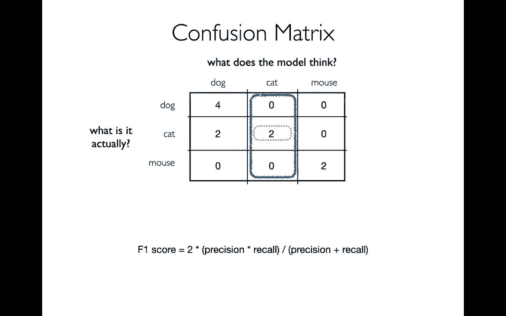

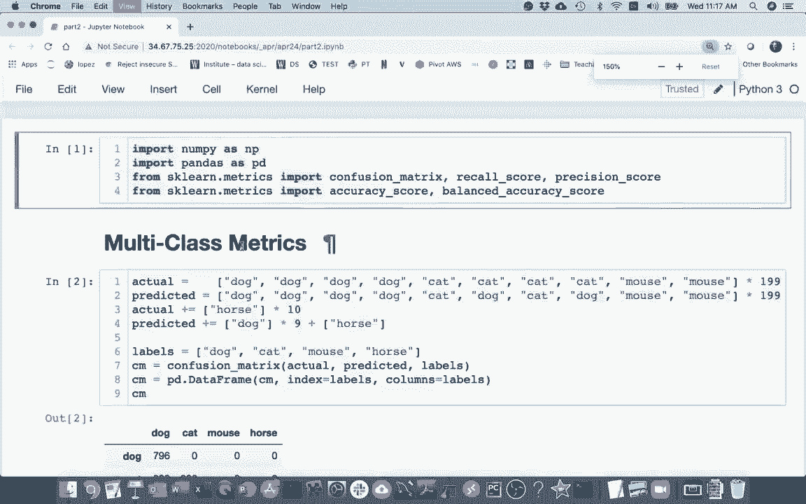

让我们用之前的例子来计算：

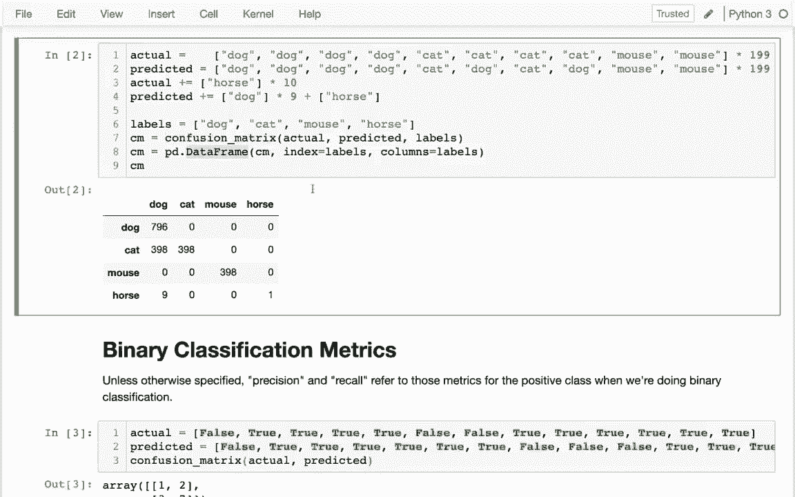

*   **猫的召回率**：真实为猫的样本有4个（第2行总和），模型正确预测为猫的有2个。因此，召回率 = `2 / 4 = 0.5`。
*   **狗的精确度**：模型预测为狗的样本有6个（第1列总和），其中正确预测为狗的有4个。因此，精确度 = `4 / 6 ≈ 0.667`。

这两个指标揭示了不同的问题：模型在识别“猫”时漏掉了很多（召回率低）；而在预测“狗”时，有不少误判（精确度低）。

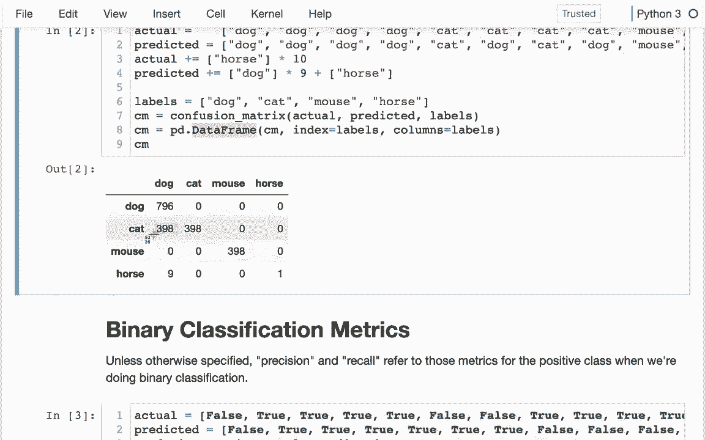

## 使用 Scikit-learn 进行计算

理论清晰后，我们来看看如何在代码中实现这些计算。

首先，我们导入必要的库并生成一个示例混淆矩阵。

```python
import pandas as pd
from sklearn.metrics import confusion_matrix, accuracy_score, recall_score, precision_score

# 示例数据：真实标签和预测标签
y_true = ['狗', '狗', '狗', '狗', '猫', '猫', '猫', '猫', '老鼠', '老鼠']
y_pred = ['狗', '狗', '狗', '狗', '狗', '狗', '猫', '猫', '老鼠', '老鼠']

# 生成混淆矩阵
labels = ['狗', '猫', '老鼠']
cm = confusion_matrix(y_true, y_pred, labels=labels)
cm_df = pd.DataFrame(cm, index=labels, columns=labels)
print("混淆矩阵：")
print(cm_df)
```

接下来，我们计算整体准确率。

```python
# 计算整体准确率
accuracy = accuracy_score(y_true, y_pred)
print(f"\n整体准确率：{accuracy:.2f}")
```

现在，我们来计算每个类别的召回率和精确度。对于多分类问题，我们需要指定 `average=None` 来获取每个类别的分数，并通过 `labels` 参数确保顺序一致。

```python
# 计算每个类别的召回率
recall_per_class = recall_score(y_true, y_pred, labels=labels, average=None)
print("\n各类别召回率：")
for label, score in zip(labels, recall_per_class):
    print(f"  {label}: {score:.2f}")

# 计算每个类别的精确度
precision_per_class = precision_score(y_true, y_pred, labels=labels, average=None)
print("\n各类别精确度：")
for label, score in zip(labels, precision_per_class):
    print(f"  {label}: {score:.2f}")
```

## 平衡准确率

当数据集中各类别的样本数量不均衡时（例如，“狗”的样本远多于“马”），整体准确率可能会产生误导。一个模型可能仅仅通过总是预测样本最多的类别来获得高准确率。

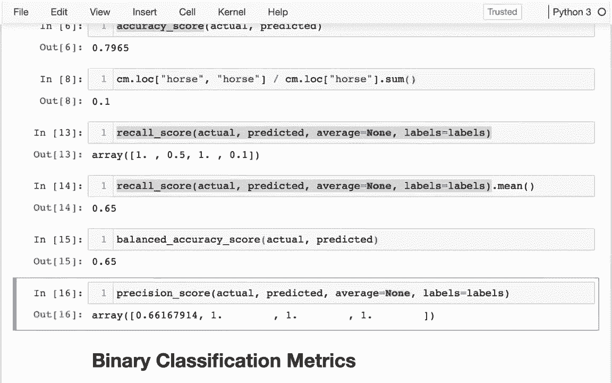

这时，**平衡准确率**是一个更好的指标。它是每个类别召回率的算术平均值，将每个类别视为同等重要。

```python
# 计算平衡准确率 (即召回率的宏平均)
balanced_accuracy = recall_score(y_true, y_pred, average='macro')
print(f"\n平衡准确率：{balanced_accuracy:.2f}")
```

比较整体准确率和平衡准确率，能帮助我们判断数据集是否存在不平衡问题以及模型是否对少数类别表现过差。

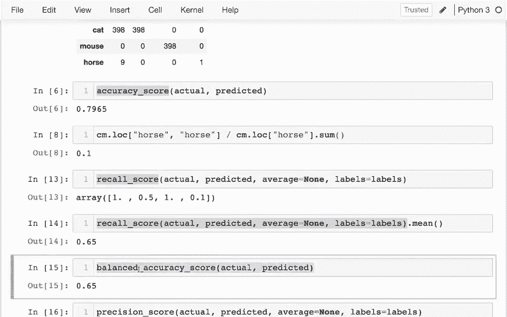

## 二分类的特殊情况

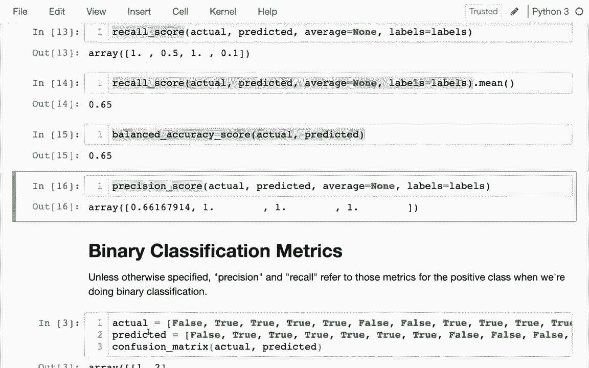

在二分类问题中（标签通常为“正类”和“负类”），当我们谈论“召回率”和“精确度”时，通常默认指的是**正类**的指标。

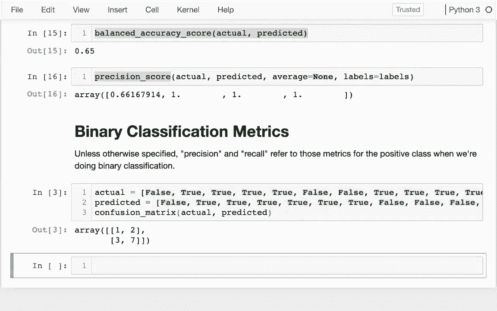

```python
# 二分类示例
y_true_binary = [0, 1, 0, 1, 1, 0, 1] # 0代表负类，1代表正类
y_pred_binary = [0, 1, 0, 0, 1, 0, 1]

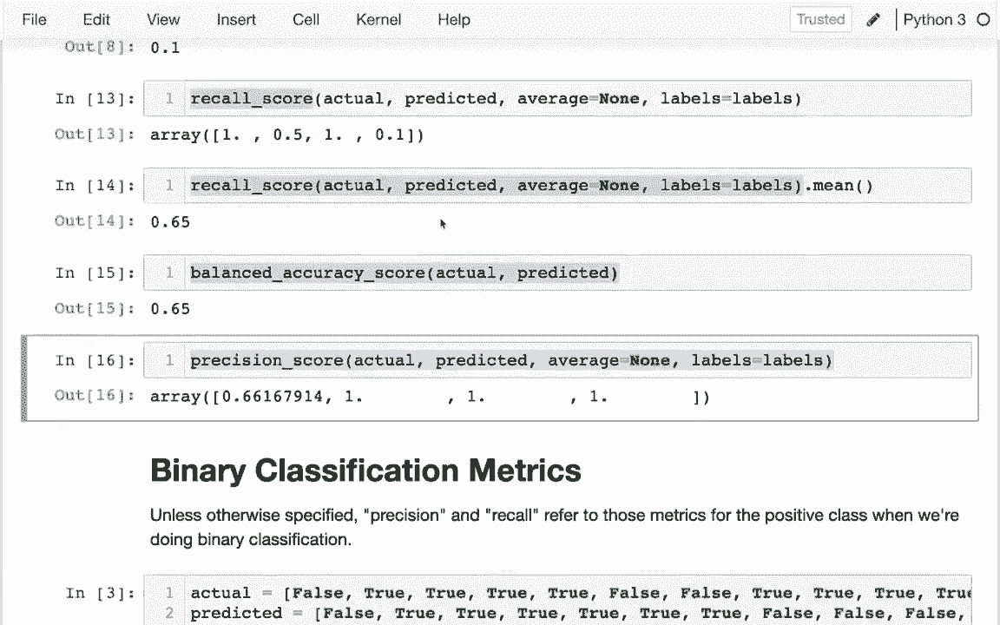

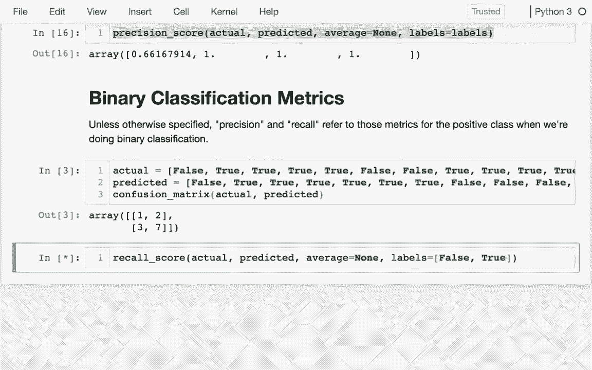

# 计算正类的召回率和精确度
recall_pos = recall_score(y_true_binary, y_pred_binary, pos_label=1)
precision_pos = precision_score(y_true_binary, y_pred_binary, pos_label=1)

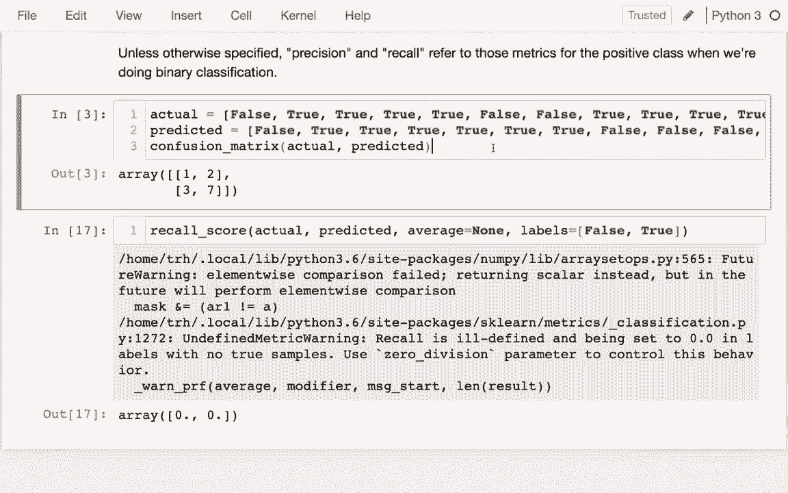

print(f"\n二分类 - 正类召回率：{recall_pos:.2f}")
print(f"二分类 - 正类精确度：{precision_pos:.2f}")
```

## 总结

本节课中我们一起学习了：
1.  **召回率**：衡量模型找出所有相关实例的能力。**公式**为：`TP / (TP + FN)`。
2.  **精确度**：衡量模型预测结果的可靠性。**公式**为：`TP / (TP + FP)`。
3.  **平衡准确率**：在多分类且数据不平衡时，比整体准确率更公平的评估指标，它是各类别召回率的平均值。
4.  掌握了使用 Scikit-learn 的 `recall_score` 和 `precision_score` 函数计算这些指标的方法。
5.  了解了在二分类问题中，“召回率”和“精确度”通常特指正类的指标。

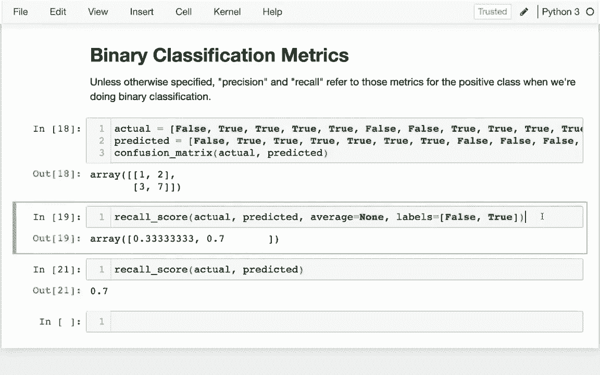

理解召回率和精确度对于诊断模型的具体弱点至关重要，例如模型是“漏报”太多（召回率低）还是“误报”太多（精确度低），从而指导我们进行更有针对性的模型改进。