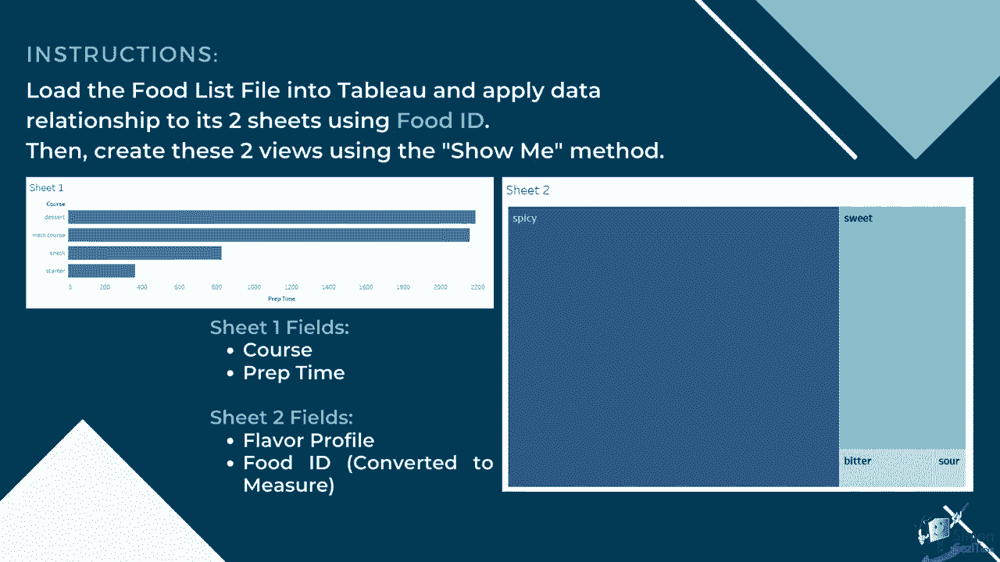
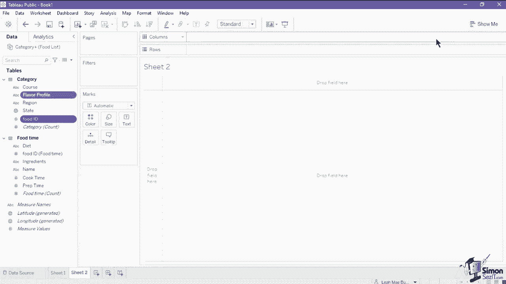
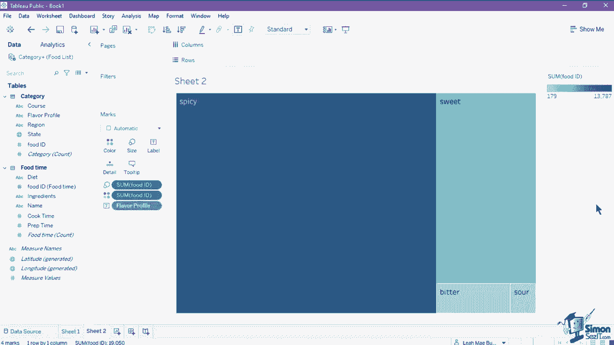

# 数据可视化神器 Tableau！P11：练习 11 - 创建条形图与树图 📊

在本节课中，我们将通过一个具体的练习，学习如何在 Tableau 中加载数据、建立数据关系，并使用“显示我”功能快速创建两种不同类型的图表：横条形图和树图。

---

## 概述

本次练习的目标是使用一个名为“食品清单”的 Excel 文件。我们将完成以下任务：加载数据、在两个工作表间建立关系，并利用 Tableau 的“显示我”功能，分别创建展示“课程与准备时间”的条形图，以及展示“风味资料与食品 ID”的树图。

---

## 第一步：加载数据并建立关系

首先，我们需要将数据导入 Tableau 并设置好数据源之间的关系。

将 Excel 文件“食品清单”拖入 Tableau 的开始页面。数据加载后，你会进入“数据源”页面。

在该页面中，将“类别”工作表拖入画布区域。接着，连接“食品时间”工作表以创建关系。将关系字段设置为 **`食品 ID`**。

关系设置完成后，可以关闭“编辑关系”窗口。

---

## 第二步：创建第一个视图（横条形图）

上一节我们建立了数据关系，本节中我们来看看如何创建第一个图表视图。

打开一个新的工作表。因为我们计划使用“显示我”方法，所以需要先选择用于图表的字段。

以下是操作步骤：
1.  点击“课程”字段。
2.  按住键盘上的 `Ctrl` 键，同时点击“准备时间”字段。
3.  选中这两个字段后，点击界面右上角的 **`显示我`** 按钮。
4.  从弹出的图表类型中选择 **`横条形图`**。

Tableau 会根据我们选择的字段自动生成一个横条形图。你可以通过拖动“课程”轴上的字段来调整条形的大小。

至此，第一个视图创建完成。

---

## 第三步：创建第二个视图（树图）

完成了条形图的创建后，我们继续来学习如何构建一个树图。

首先，点击“添加工作表”按钮以创建一个新的工作表。

在创建树图前，我们需要将一个字段转换为度量。操作如下：
1.  在“数据”窗格中，右键单击“食品 ID”字段。
2.  在弹出的菜单中，点击 **`转换为度量`**。
3.  转换后，“食品 ID”字段会变为绿色，这表示它已成功转换为度量值。

接下来，选择用于树图的字段：
1.  点击“食品 ID”字段。
2.  按住 `Ctrl` 键，同时选择“个人资料”字段。
3.  点击 **`显示我`** 按钮，并选择 **`树图`**。

Tableau 将根据这两个字段生成一个树图。你可以进一步调整树图中各个框的大小或修改标签。

例如，可以调整标签字体：
1.  点击“标记”卡中的“标签”选项。
2.  选择所需的字体大小。
3.  点击“应用”以使更改生效。

这样，第二个视图也创建完成了。

---

## 总结

本节课中，我们一起学习了 Tableau 的一个完整练习流程。我们掌握了如何加载 Excel 数据、在多个工作表间通过 **`食品 ID`** 建立关系，并利用高效的 **`显示我`** 功能，快速创建了展示数据分布的 **`横条形图`** 和 **`树图`**。这个练习涵盖了从数据准备到基础可视化的关键步骤，是初学者熟悉 Tableau 工作流的良好实践。