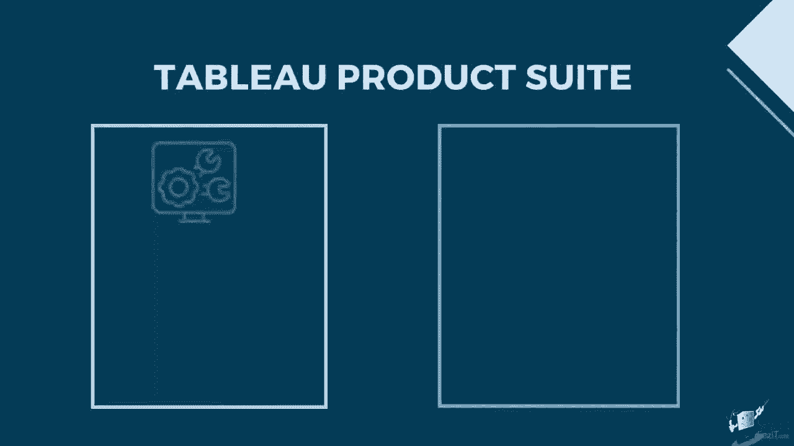
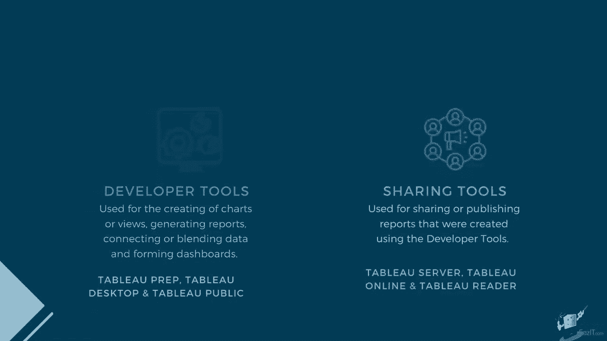
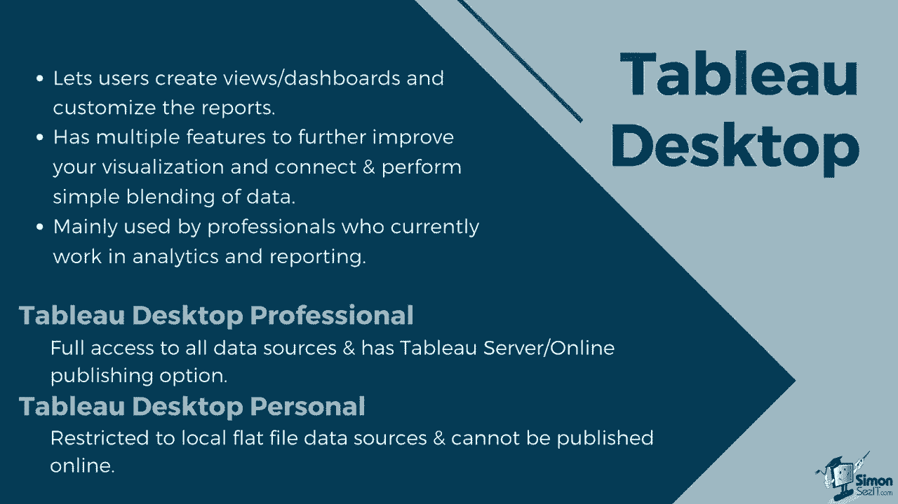
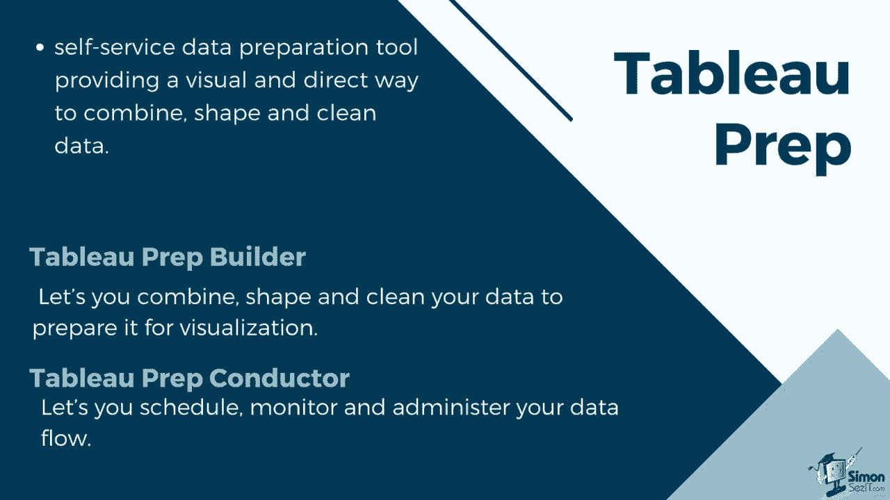
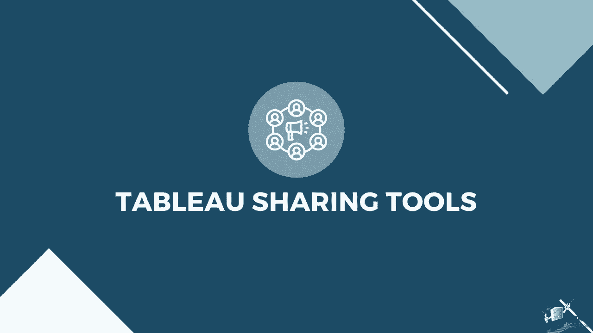
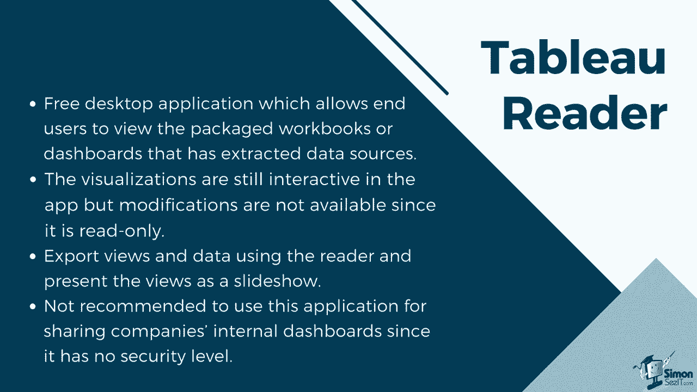
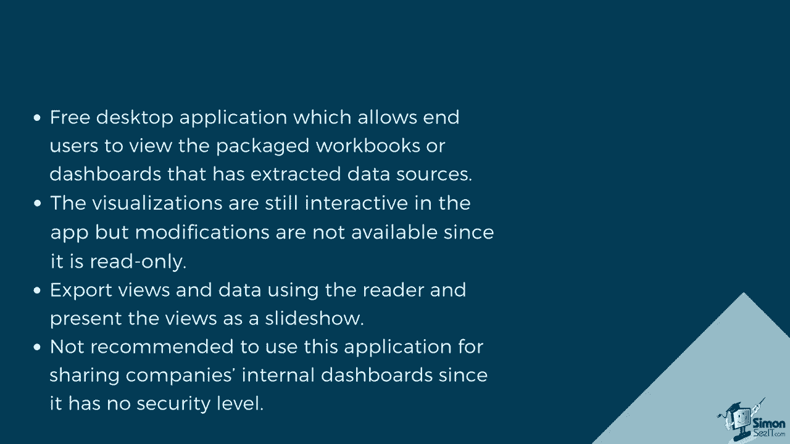
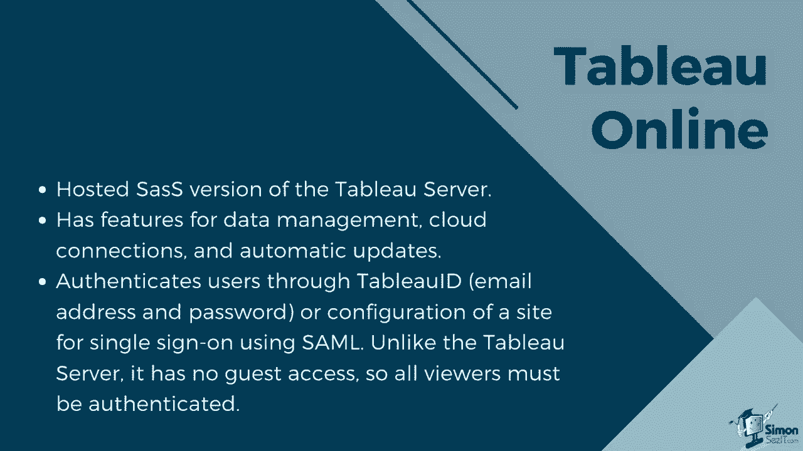
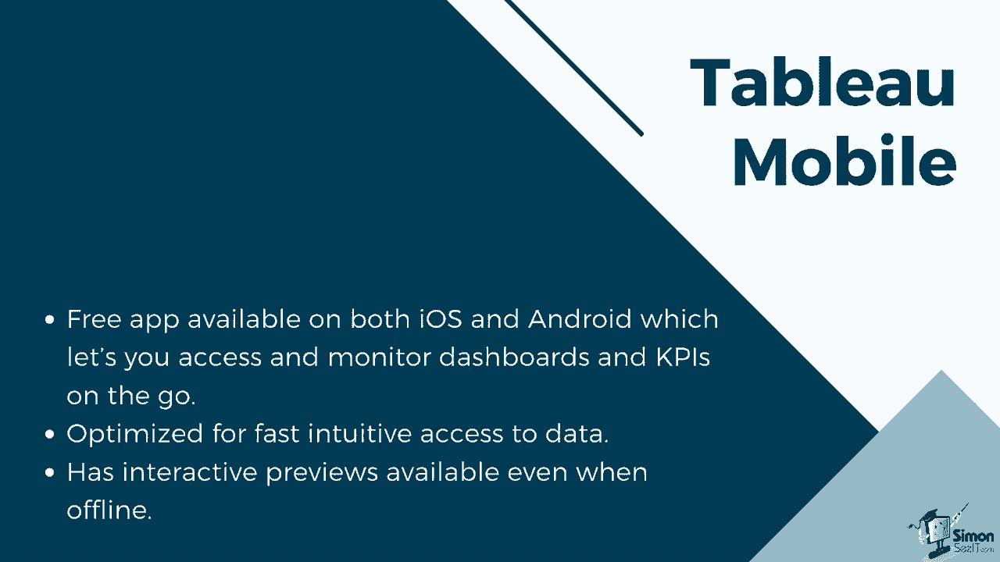

# 数据可视化神器 Tableau！P2：Tableau 产品套件介绍 📊

在本节课中，我们将系统性地了解 Tableau 产品家族。Tableau 提供了一系列工具，以满足从数据准备、可视化开发到报告共享的完整工作流程需求。我们将这些工具分为两大类：**开发工具**和**共享工具**。

---

## 🛠️ 开发工具

开发工具主要用于创建图表、视图、仪表板，以及连接、合并和清理数据。以下是主要的开发工具介绍。

### Tableau Desktop

Tableau Desktop 允许用户创建视图和仪表板，并支持高度自定义报告。它具备多种功能，可帮助用户优化可视化效果，并能连接并执行简单的数据合并。该工具主要供当前在分析和报告领域的专业人士使用。

Tableau Desktop 根据其连接和发布选项，分为两种类型：

*   **Tableau Desktop 专业版**：可以完全访问所有数据源和数据类型。专业版还允许你将仪表板通过 Tableau Server 在线共享。
*   **Tableau Desktop 个人版**：与专业版相比，个人版限制更多。它仅能连接平面文件（如 Excel 和 CSV），且其仪表板不能发布到 Tableau Server，但可以保存在本地或发布到 Tableau Public 网站。

### Tableau Public

Tableau Public 是一个免费版本，用户仍可用它创建和自定义仪表板。它可以连接平面文件，但无法连接实时数据库。与 Tableau Desktop 个人版不同，它不允许将工作簿保存到本地，但可以将创建的仪表板发布到 Tableau Public 网站。它还有 100 万行的数据限制。这个版本最适合想要尝试产品并探索数据分析的初学者。**在本课程中，我们将主要使用 Tableau Public。**

### Tableau Prep

Tableau Prep 是一个自助数据准备工具，提供了一种直观且直接的方式来组合、整理和清理数据。它由两个产品组成：

*   **Tableau Prep Builder**：为数据分析提供了一个完整的视图，允许你组合、整理和清理数据，以准备可视化。它有三个协调视图，可以让你查看每个字段（列）的行级数据概况以及整个数据准备过程。Tableau Prep Builder 还允许你连接到本地或云中的数据。
*   **Tableau Prep Conductor**：让你可以安排、监控和管理数据流。数据流可以发布到 Tableau Server 或 Tableau Online，管理员可以安排运行和更新数据的时间，并监控计划的流程。

---

## 🌐 共享工具

上一节我们介绍了用于创建内容的开发工具，本节中我们来看看在创建工作簿或仪表板后，用于分享和分发的共享工具。

### Tableau Reader

Tableau Reader 是一款免费的桌面应用程序，允许最终用户查看打包的工作簿或基于提取数据源的仪表板。在应用程序中，可视化仍然是交互式的，但由于它是只读的，因此无法进行修改。用户仍可以使用 Reader 导出视图和数据，并将视图呈现为幻灯片。**注意：不建议使用此应用程序共享公司的内部仪表板，因为它没有安全级别控制。**

### Tableau Server

Tableau Server 允许用户在组织的本地服务器或云服务器内共享仪表板。仪表板可以通过浏览器查看，并且可以安排数据刷新和提取。它还支持连接到实时数据源。其安全功能包括配置本地身份验证、活动目录集成、受信任的身份验证或使用 SAML 或 Kerberos 的单点登录。它提供了核心许可选项，允许访客访问，并允许创建和维护多个站点而无需额外费用，同时可以配置用户和权限。

### Tableau Online

Tableau Online 是 Tableau Server 的托管 SaaS（软件即服务）版本。仪表板和数据将保存在由 Tableau 团队提供和维护的服务器上，这消除了用户自行管理服务器的需要。它与 Server 一样，具有数据管理、云连接和自动更新的功能。用户可以通过 Tableau ID、电子邮件地址和密码进行验证，或者配置站点以使用 SAML 进行单点登录。**但与 Tableau Server 不同，它没有访客访问权限，因此所有查看者都必须经过身份验证。**

### Tableau Mobile

Tableau Server 和 Tableau Online 都可以与 Tableau Mobile 配合使用。Tableau Mobile 是一款在 iOS 和 Android 上均可用的免费应用程序，可以让你随时随地访问和监控仪表板与 KPI。它经过优化，以便快速直观地访问数据。其功能包括：

*   **交互式预览**：在你连接到服务器时下载你收藏的工作簿，以便后续离线访问。
*   **移动优化**：由于 Tableau Desktop 针对移动布局进行了改进，你可以在较小的移动屏幕上以清晰可读的格式查看仪表板。

---

## 📝 总结

本节课中，我们一起学习了 Tableau 完整的产品套件。我们首先将工具分为**开发工具**（Tableau Desktop, Tableau Public, Tableau Prep）和**共享工具**（Tableau Reader, Tableau Server, Tableau Online, Tableau Mobile），并逐一了解了每款产品的核心功能、适用场景及区别。掌握这些工具的分类和特点，将帮助你根据不同的需求（如数据分析、报告创建、团队协作或移动查看）选择合适的 Tableau 产品。