# 数据可视化神器 Tableau！P4：界面与核心功能探索 🧭

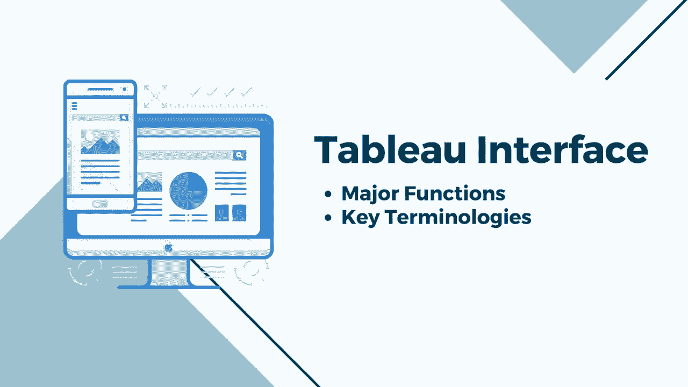

在本节课中，我们将探索 Tableau 的直观界面，并学习每个部分的功能。我们将解释在使用该平台时会遇到的关键术语，帮助你快速熟悉这个强大的数据可视化工具。

---

## 起始页面

打开 Tableau Public 后，我们从这个窗口的起始页面开始。我们可以打开最近创建的工作簿，通过连接到数据源创建一个新工作簿，或探索来自社区的 Tableau 内容。

该页面由三个不同的窗格组成：连接、打开和发现。

最右侧是发现窗格。通过这个窗格，你可以在 Tableau Public 中找到热门视图的链接，通过观看培训视频来提升你的 Tableau 技能，并在资源部分获取博客和新闻的最新信息。

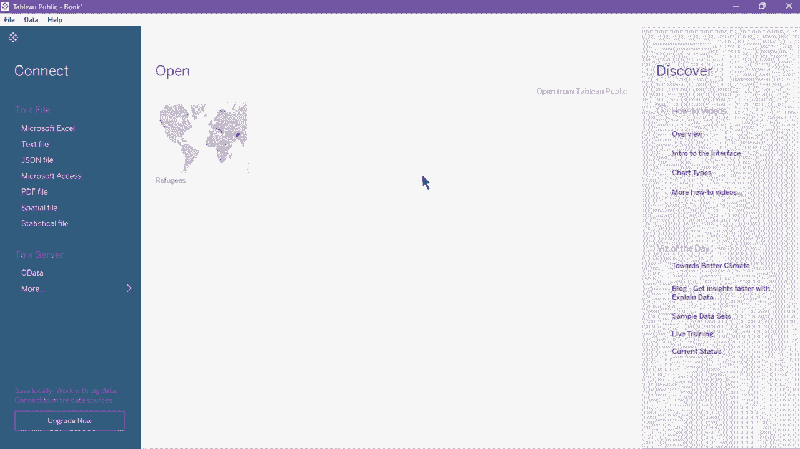

页面的中央部分是打开的窗格。这里包含最近创建的工作簿缩略图，点击其中一个将打开该工作簿。工作簿是一个包含多个表的文件集合、仪表板和故事。

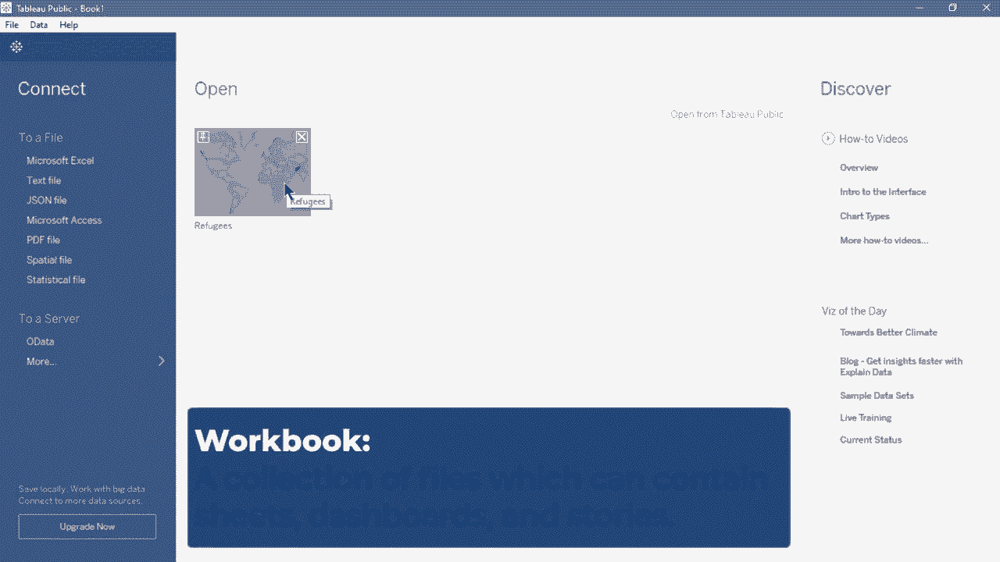

你可以通过点击缩略图左上角的固定图标在起始页面上固定工作簿。固定的工作簿将始终出现在你的起始页面，这在你经常使用特定工作簿时非常有用。要将其从起始页面中移除，请点击缩略图上的 X 按钮。

起始页面的最后部分是连接窗格。你可以使用此功能连接平面文件或创建新的数据连接。你可以从列表中选择一个平面文件来打开文件浏览窗口，或者将文件直接拖入页面以创建新的文件连接。

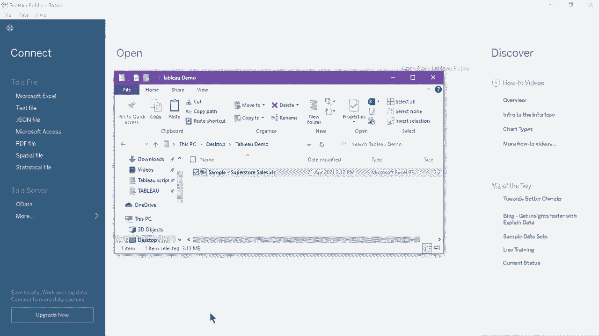

---

## 数据源页面

插入文件后，它将引导我们进入数据源页面。数据源页面允许用户建立数据连接、混合数据、过滤数据，并对字段或列进行基本调整。

该页面由四个主要区域组成：左侧窗格、画布、数据网格和元数据网格。

左侧窗格显示已连接的数据源及其详细信息。数据连接部分下方是平面文件的文件名，适用于数据库连接。所列出的将是数据库或模式。通过下拉菜单，你可以编辑当前连接、删除或重命名。

连接下方是可用工作表的列表。这里有订单、退货和用户，这些是我们之前插入的 Excel 文件中包含的工作表。

左侧窗格的左边是操作按钮：撤销、重做和保存。Tableau徽标显示启动页面。刷新按钮将在数据源页面右上方刷新数据源。

画布有两个层。首先，让我们将订单工作表和返回工作表拖入画布并应用它们的数据关系。这是画布的逻辑层。在这里，你可以创建逻辑表之间的关系。

要显示画布的另一层，双击其中一个表或工作表。这将显示一个新窗口，即画布的物理层。在这里，我们可以在表之间添加连接和并集。当我们讨论如何使用多个数据源时，我们将了解更多。

画布下方是数据网格。它显示了我们指示的连接或文件中的前1000行数据。我们可以用它对数据源进行一般修改，例如排序和隐藏字段、重命名、改变数据类型以及创建新的计算字段。

接下来，点击数据网格左上角的列表图标以查看元数据网格。此窗格显示所选表中的所有字段，它们的表名和远程字段名。

---

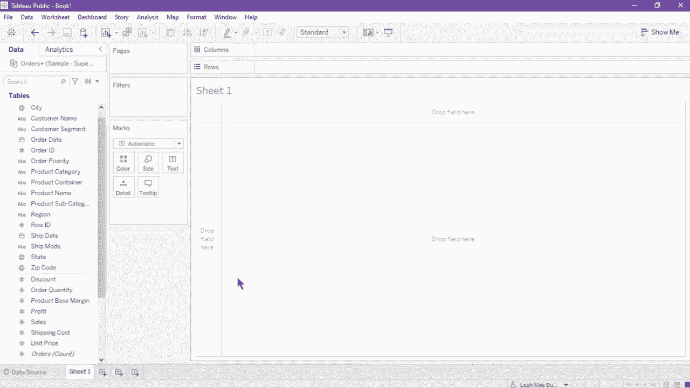

## Tableau 工作区

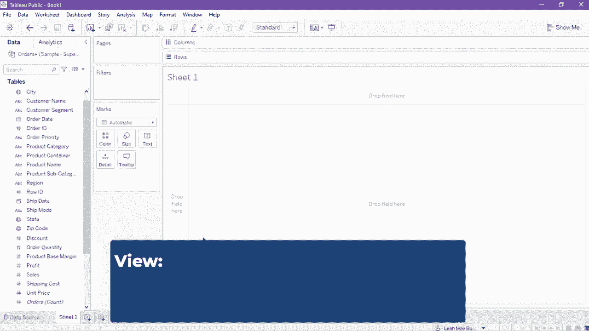

接下来，点击页面下方选项卡上的工作表1以导航到 Tableau 工作区。Tableau 工作区是我们创建图表时主要待的地方。

单个工作表称为工作表，包含单个数据视图。视图是数据的可视化表示或图表本身，它位于工作表中。

Tableau 工作区由菜单、工具栏、数据窗格、卡片和货架组成。

顶部的功能区列出了不同功能的选项卡。以下是各选项卡的功能：

*   **文件**：让你保存文件、打开工作簿和退出应用程序。
*   **数据**：具有与数据源相关的功能，在这里你可以创建新的连接、替换和修改当前源，以及编辑数据关系。
*   **工作表**：你可以创建一个新的工作表、显示或隐藏工作表的部分，并查看其属性。
*   **仪表板**和**故事**：具有基本的仪表板和故事功能。由于我们当前正在编辑视图而不是仪表板或故事，因此大多数功能不可用。
*   **分析**：在执行视图分析方面具有额外功能，例如配置标记和标签、计算百分比、显示趋势线，并在其旁边应用预测。
*   **地图**：设置地理可视化的选项。
*   **格式**：帮助用户调整或个性化可视化或视图的外观。我们可以编辑字体、对齐、阴影、线条和其他视觉属性。
*   **窗口**：让用户显示或隐藏工作区的某些部分，如工具栏、状态栏和侧边栏，同时可以放大视图以进行演示模式。
*   **帮助**：包含指向 Tableau 支持社区的链接，以及语言和应用程序性能的设置。

在功能区下方是工具栏。按钮根据当前工作表的内容而定，某些按钮在当前工作表不适用时会被禁用。

与数据源页面相同，前几个按钮是链接到起始页面、撤销和重做按钮。保存按钮旁边是新数据源按钮，您可以在此插入新的数据连接。

旁边有三个工作表按钮。第一个用于创建新的工作表、故事或仪表板。其次是重复按钮。第三个是清除按钮，用于移除当前工作表上的所有内容。

工作表按钮之后是交换和排序按钮。交换按钮用于交换行和列。旁边是按升序和降序排序的按钮。

之后是高亮按钮，可在工作表中启用高亮显示。创建组的组成员按钮，以及显示或隐藏标记标签的按钮。

旁边的固定按钮用于将图表的坐标轴固定在特定或动态范围内。旁边的下拉菜单用于适应视图。接下来是一个用于在页面上显示或隐藏卡片的下拉菜单。最后一个按钮是切换到演示模式。

Tableau 工作区的左侧有侧边栏，包含数据窗格和分析窗格。

*   **数据窗格**：包括所有字段、集合和参数。您可以使用搜索栏搜索整个列表或按名称或数据源顺序排序。
*   **分析窗格**：允许用户对视图应用高级分析，例如常量线、预测和参考线。

中心画布是工作区域，展示我们的可视化。环绕工作区域的卡片和架子用于指示视图的放置和显示方式。

*   **列和行架**：构成图表的结构。字段被放置在这些架子上，以指示它是在标题上还是在坐标轴上。
*   **过滤器架**：允许您指定要包含和排除哪些数据。过滤器是在视图中限制显示数据的控件。

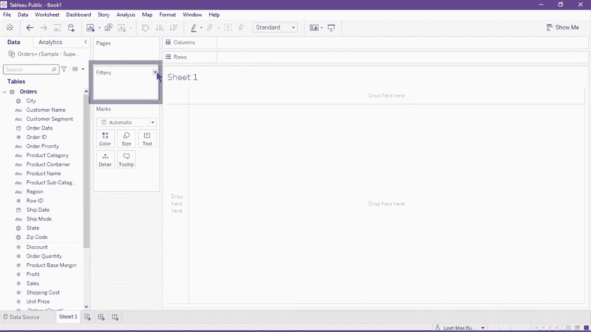
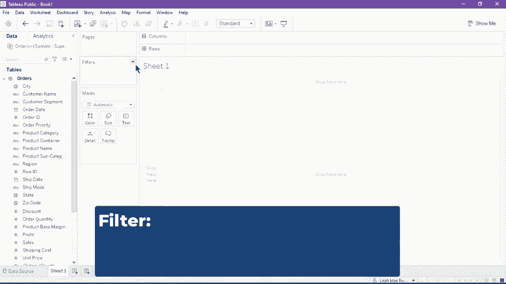

筛选器架下是标记卡片。这是表格中视觉分析的关键元素。因为你可以通过将字段拖动到标记卡的不同视觉属性中来添加上下文和细节。

让我们尝试创建一个视图作为示例。

1.  将 `客户细分` 拖入行架。这会在表格视图中创建四行客户细分值。
2.  从数据面板中拖动 `利润` 字段，并将其放在行架中的 `客户细分` 后面。这将自动创建按客户细分计算利润总和的柱状图。
3.  添加一个 `订单日期` 到列架。它将柱状图转换为折线图，因为我们添加了一个连续字段作为列。
4.  将一个 `区域` 字段拖入标记卡并放在颜色上。这将为每条线图设置区域粒度，每个区域由不同的线条和颜色分隔。

页面架允许你将视图分解为一系列页面，以便更好地分析特定字段如何影响视图中的其余数据。

例如，让我们将 `订单日期` 从列架拖动并放到页面上。这会按订单日期的年份分隔视图，我们可以通过右侧面板上的控件翻阅每一年。

右上角的“显示我”按钮允许用户通过突出显示可能的图表选择图表或视图类型。带橙色轮廓的图表是为所示数据选择的最佳匹配。

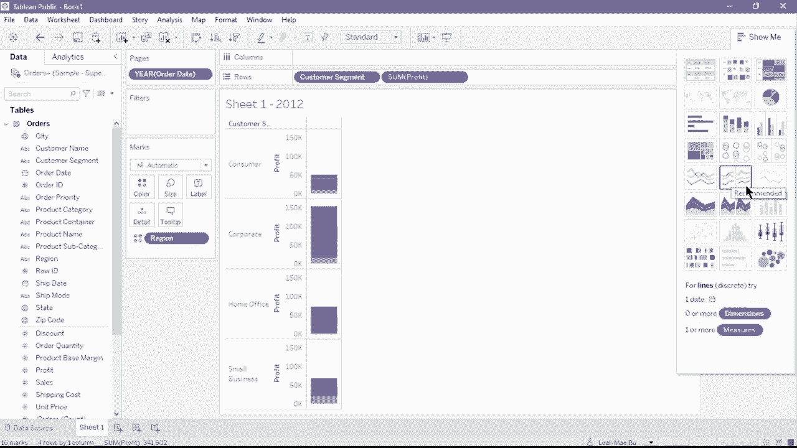

工作区的底部有状态栏。它显示菜单项的描述以及有关当前视图的信息，如标记及其当前的行和列数。

要在工作表之间组织和导航，你可以使用位于工作区右下角的工作表标签、胶卷条和工作表排序器的按钮。

*   **工作表排序器**：以缩略图的形式在单个页面上显示工作簿中的所有工作表。你可以在此视图中拖放缩略图以重新排序工作表。
*   **胶卷条**：在工作簿底部显示，展示工作表的缩略图。
*   **工作表标签**：每个工作表将在工作流底部表示为一个标签。

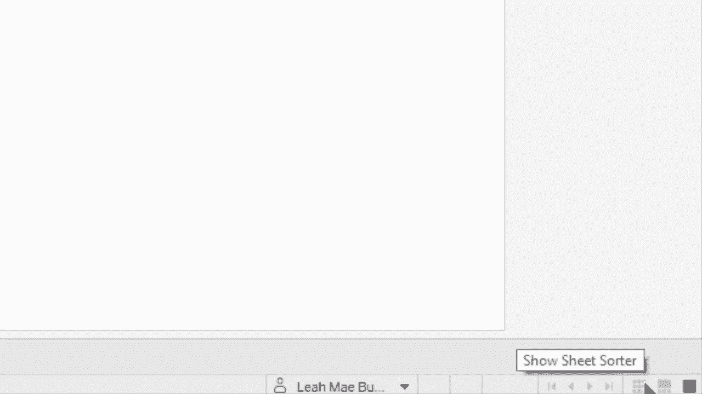
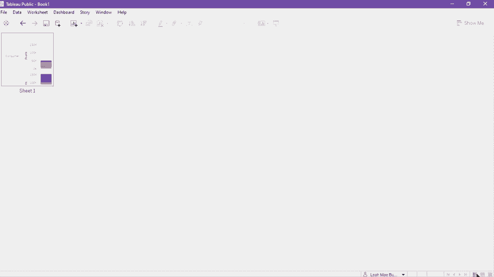

---

## 仪表板页面

现在，让我们导航到仪表板页面。点击新建仪表板按钮来创建一个。仪表板是多个视图的集合，让你可以同时比较多种数据。中心画布的默认白色背景将代表你的仪表板的外观。

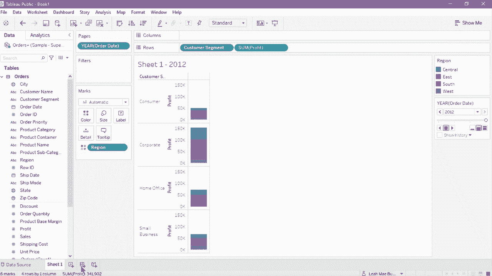
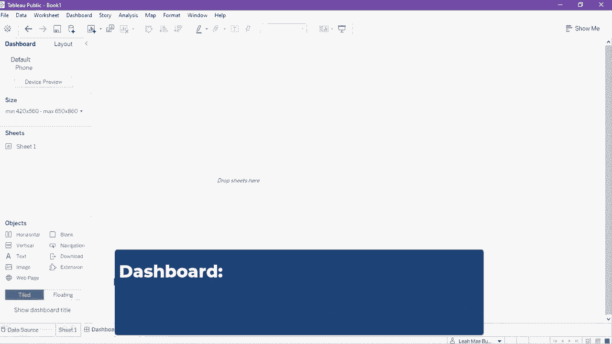

在位于左侧的仪表板窗格中，有几个自定义仪表板的功能。

*   **大小**：第一个选项允许你设置仪表板的大小并显示或隐藏设备预览，可以切换以查看仪表板在不同屏幕分辨率下的外观。在按钮下方，你可以指定仪表板的范围、自动或固定大小。
*   **工作表**：你可以将可用的工作表拖放到画布上以将其包含在仪表板中。
*   **对象**：除了工作表外，你还可以从对象部分插入其他对象，如图像、容器和静态文本。

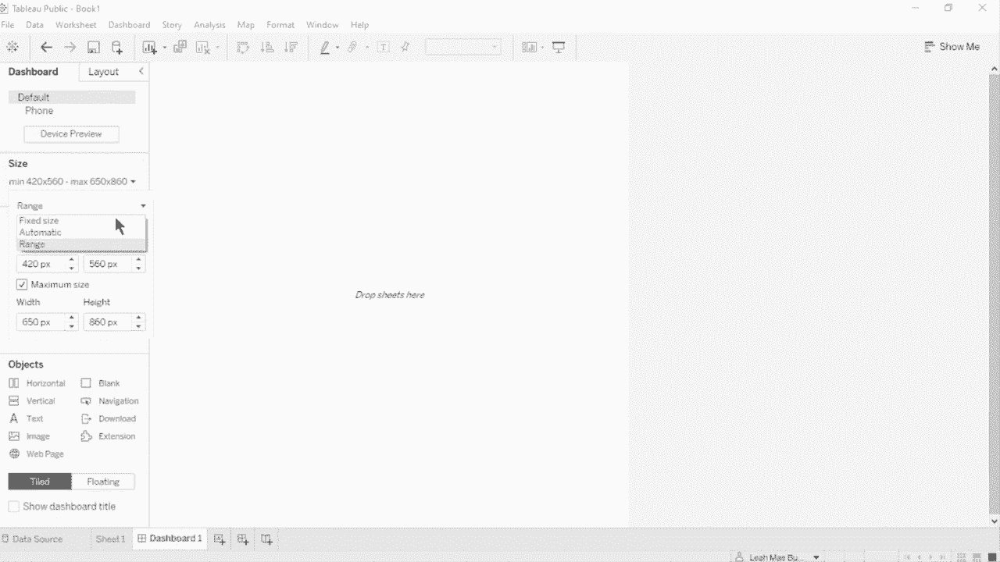

仪表板窗格旁边是布局。此窗格让你调整每个表单和对象的布局位置，以及其大小和填充。在这个窗格中，你还可以配置仪表板的边框和背景颜色。

布局选项卡下是项目层次结构。它列出了当前放置在仪表板中的表单和对象之间的关系。

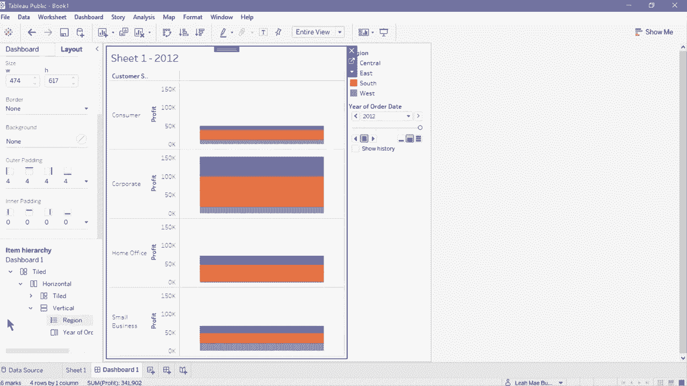

---

## 故事页面

最后，让我们去故事页面，点击底部的新故事按钮以创建一个。中心画布将显示故事的外观。可以在左侧的故事窗格中设置其他配置。

在故事窗格的第一部分是添加新故事点的选项。你可以选择创建一个新的空白故事或复制当前故事。

下面是可以插入到故事中的表单和仪表板列表。将一个表单拖入画布以将其添加到故事中。

添加标题。我们可以双击顶部的默认文本框以编辑其内容。如果你想在故事中添加额外的文本框，请从故事窗格拖动文本对象并放置到故事中的所需位置。

故事标题位于故事画布的右上角。你可以通过双击标题进行编辑。如果选择隐藏它，你可以在故事窗格中取消选中显示标题选项。

要编辑故事的大小，点击故事窗格的大小部分下拉菜单。你可以选择设置固定大小、自动大小或范围。

故事窗格旁边的布局选项卡允许你设置导航器的样式。导航器使你能够编辑和组织你的故事点。这只有在你有超过一个故事点时可见。

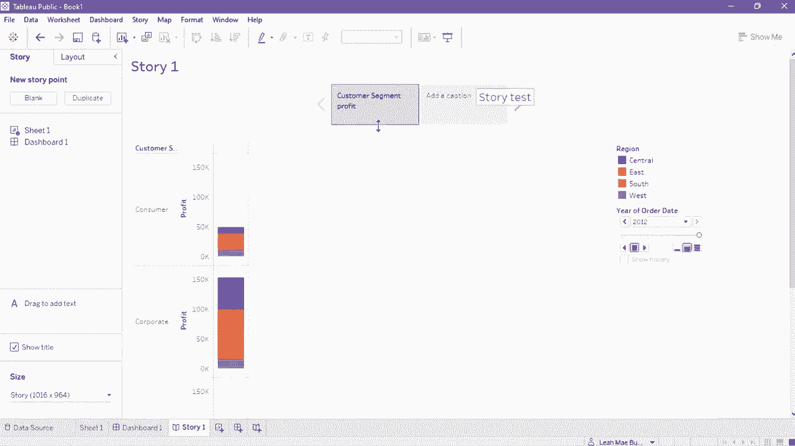

---

## 总结

本节课中，我们一起学习了 Tableau 的核心界面和功能。我们从起始页面开始，了解了如何连接数据。然后深入探索了数据源页面的结构，包括逻辑层和物理层。接着，我们详细介绍了 Tableau 工作区的各个组成部分，如功能区、工具栏、数据窗格、卡片和货架，并通过一个示例创建了视图。最后，我们简要了解了仪表板和故事页面的基本布局和功能。掌握这些基础知识是高效使用 Tableau 进行数据可视化的第一步。