# 数据可视化神器 Tableau！P5：Tableau 数据概念 📊

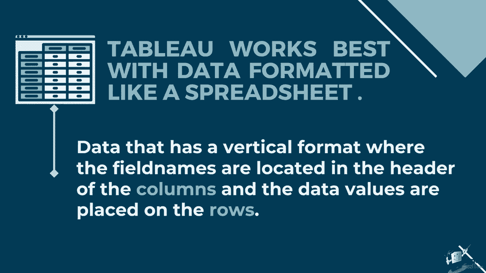

在本节课中，我们将要学习 Tableau 中至关重要的数据概念与结构。理解这些基础知识，能帮助你更高效地准备和分析数据，从而创建出准确且有洞察力的可视化图表。

## 理解数据结构

上一节我们介绍了 Tableau 的基本界面，本节中我们来看看 Tableau 偏好的数据结构。Tableau 最适合处理表格化数据，其格式类似于电子表格。这意味着数据应采用垂直格式：字段名称位于列标题中，而具体的数据值则放置在行中。

对于数据分析的初学者，一个常见的问题是：如何区分行和列？一行，或称一条记录，包含了一组相关的数据值。

**一条数据记录** 意味着表格中的一行水平数据。

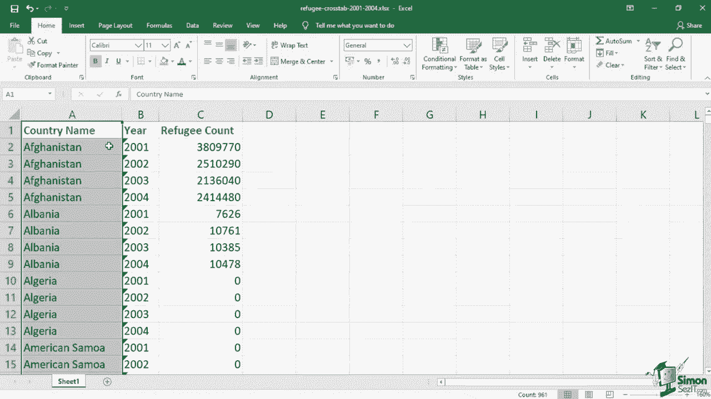

例如，在一个超市销售数据文件中，每一行都对应一笔独立的销售记录。而列则是表格中的一个独立字段或垂直分组。

在这个表中，我们有“客户名称”列和“城市”列。每列的标题或标签被称为**字段名称**。为避免混淆，只需记住：列是垂直的，行是水平的。

## 宽格式与高格式

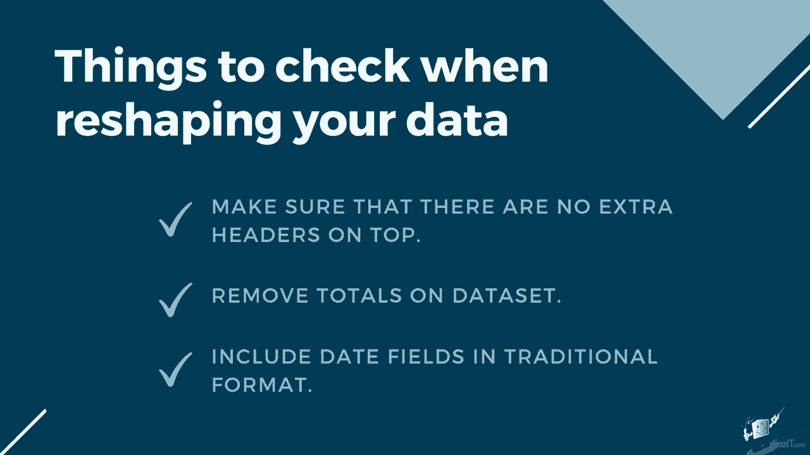

有些数据源可能采用“宽格式”。例如，一个按年份列出难民数量的数据集。

这种格式对人类阅读可能更友好，但在导入 Tableau 时，每一年（如2001、2002）都会被视作独立的列。这使得跨时间分析变得困难，因为数据分散在不同的字段中。另一个问题是数值缺乏上下文，我们无法直接知道数字“76”对应的是哪个国家的哪一年。

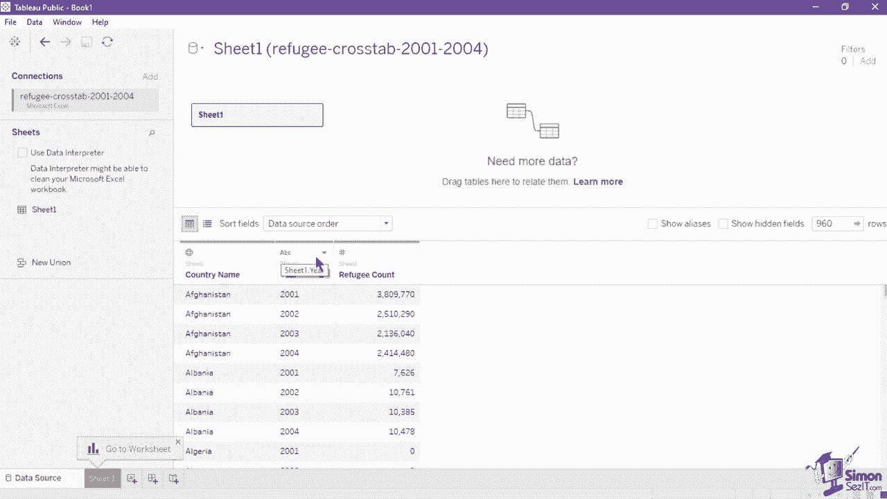

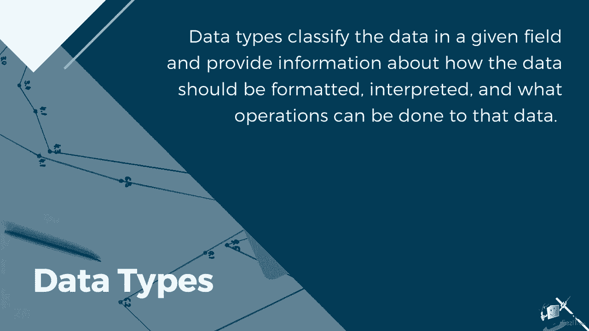

为解决此问题，我们需要在导入 Tableau 前将数据重塑为“高格式”。

在高格式下，我们现在有“国家名称”、“年份”和“难民数量”作为每行的字段。这种结构让分析变得容易得多，因为每个字段都代表了数据的一个独特属性。

以下是重塑数据集时需要进行的额外检查：
*   **删除多余标题**：确保数据表顶部没有合并单元格或多余的标题行，Tableau 需要清晰的第一行作为字段名。
*   **删除“总计”列**：Tableau 可以自动计算汇总值，保留总计列可能导致重复计算。
*   **使用标准日期格式**：日期字段应保持为传统的日期格式（如 `YYYY-MM-DD`），而不是事先被拆分为年、月等独立列。Tableau 强大的日期功能可以自动进行这类聚合。

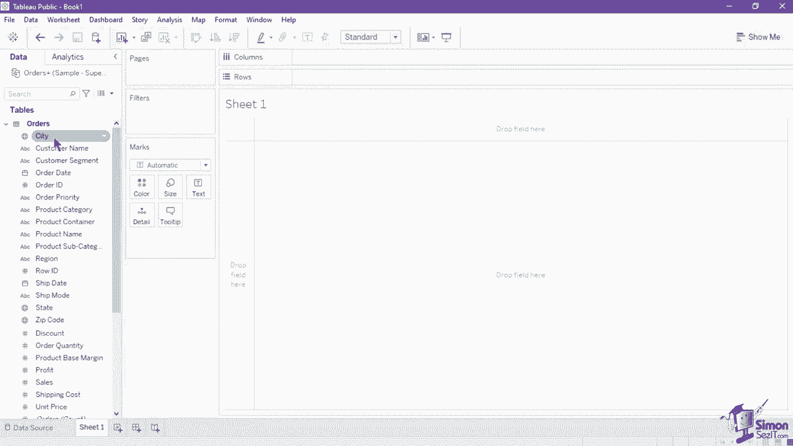

## 数据类型、维度与度量

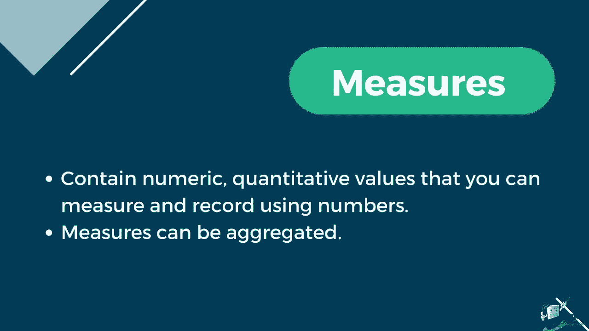

现在，让我们看看 Tableau 如何读取和分类字段。连接数据源后，你会注意到每个字段名称旁都有一个图标，这代表了该列的**数据类型**。数据类型决定了数据的格式、解释方式以及可执行的操作。

以下是常见的数据类型图标及其含义：
*   **`ABC`**：文本（字符串）字段，如客户名称、产品类型。
*   **`#`**：数值字段，如利润、订单ID，可进行数学计算。
*   **`日历`**：日期字段，如发票日期。
*   **`日历+时钟`**：日期与时间字段。
*   **`地球`**：地理字段，如国家、城市，可用于创建地图。
*   **`T|F`**：布尔字段，仅包含真（True）或假（False）值。

在数据窗格中，这些字段会被进一步分类为**维度**或**度量**。
*   **维度**（蓝色图标/胶囊）：包含定性值，用于描述和分类数据（如城市、产品类别）。维度决定了视图中的详细程度。
*   **度量**（绿色图标/胶囊）：包含定量值，是可以被测量和计算的数值（如销售额、数量）。度量默认会被聚合。

为了展示维度和度量的区别，我们创建一个显示各产品类别销售额的条形图。

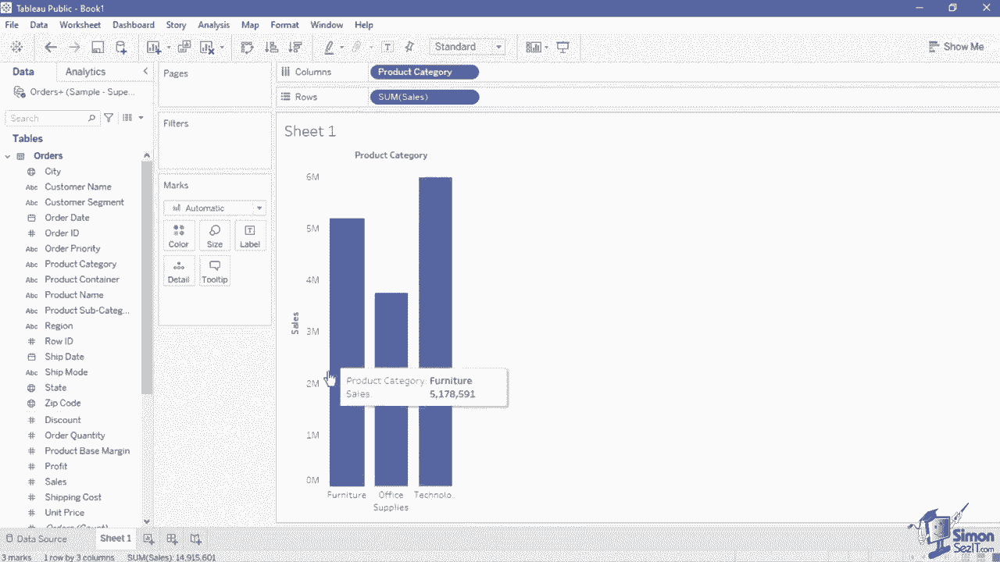

1.  将“销售额”字段拖到“行”功能区。作为度量，Tableau 自动对其使用了**求和**聚合。
    *   **聚合**：将多个值组合成单一汇总值（如总和、平均值）的过程。
    *   代码表示：`SUM([Sales])`
2.  将“产品类别”字段拖到“列”功能区。作为维度，它将数据分为不同的类别组。
3.  你还可以将“产品类别”胶囊拖到“颜色”标记卡上，用不同颜色区分各个柱状图。

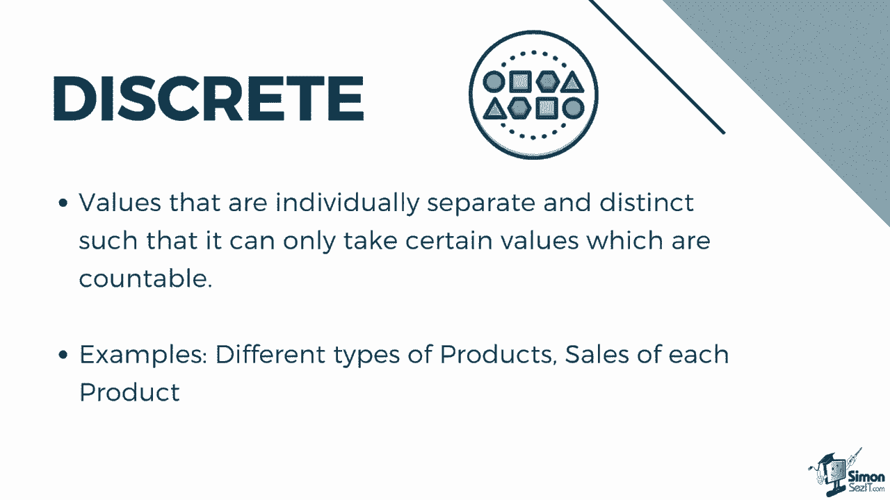

## 离散与连续

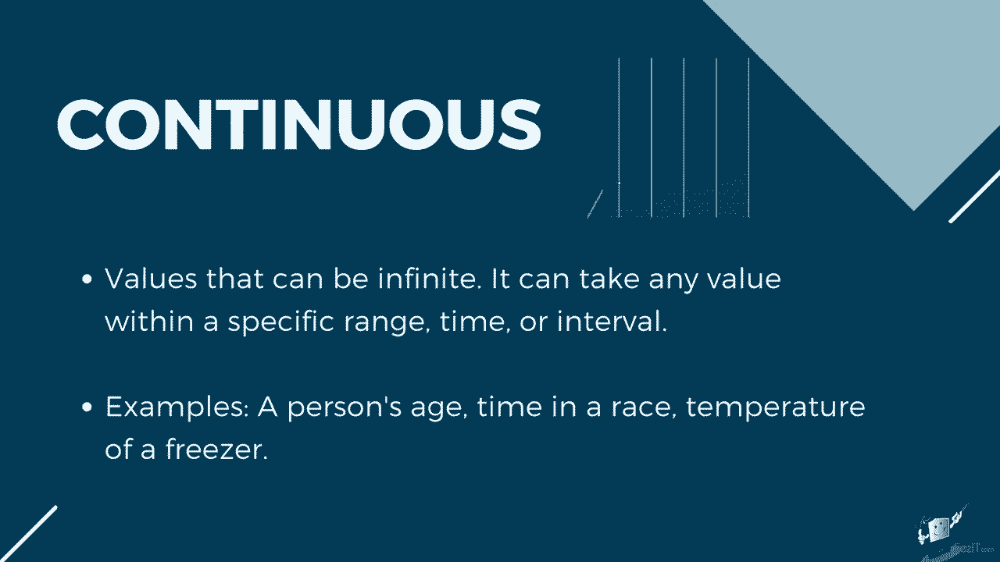

Tableau 根据字段是**离散**还是**连续**来以不同方式呈现数据。
*   **离散值**：是彼此分离、 distinct 的值（如产品类型、年份）。在视图中，离散字段会创建标题或分隔符。
*   **连续值**：可以在一个范围内取无限个值（如时间、温度）。在视图中，连续字段会生成轴线。

通常，维度是离散的（蓝色），度量是连续的（绿色），但这并非绝对。你可以通过右键点击胶囊，在菜单中选择“离散”或“连续”来更改其类型。

举例说明：
*   一个使用**离散**年份（如2019, 2020, 2021）作为维度的图表，每个年份是一个独立的标签。
*   一个使用**连续**日期（如从2019年1月到2021年12月的时间轴）作为维度的图表，会显示一条连续的轴线，更适合观察趋势。

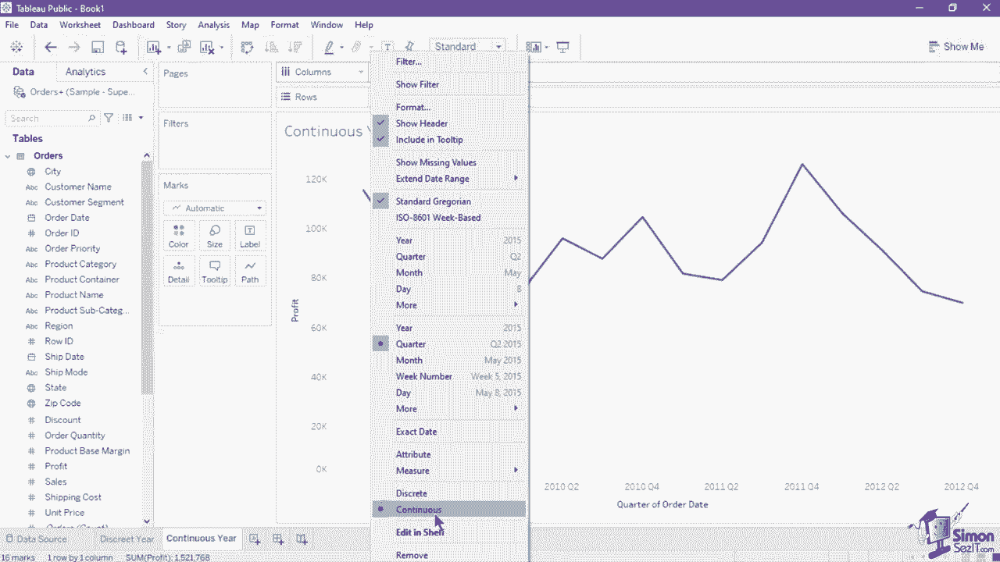

## 关系与连接

当使用多个数据表时，你会遇到“关系”和“连接”这两个概念。它们都用于合并数据，但工作方式不同。

**关系**是一种动态、灵活的结合方式。你可以把它想象成表之间的一份“合同”。Tableau 根据可视化中使用的字段，智能地决定如何查询和组合数据。关系在**逻辑层**中定义，用一条灵活的线表示。

**连接**则是一种更静态、预先定义好的结合方式。它必须在分析前明确指定连接类型（如内连接、左连接）和条件。连接会将多个表物理地合并成一个新表，在**物理层**中以维恩图图标表示。

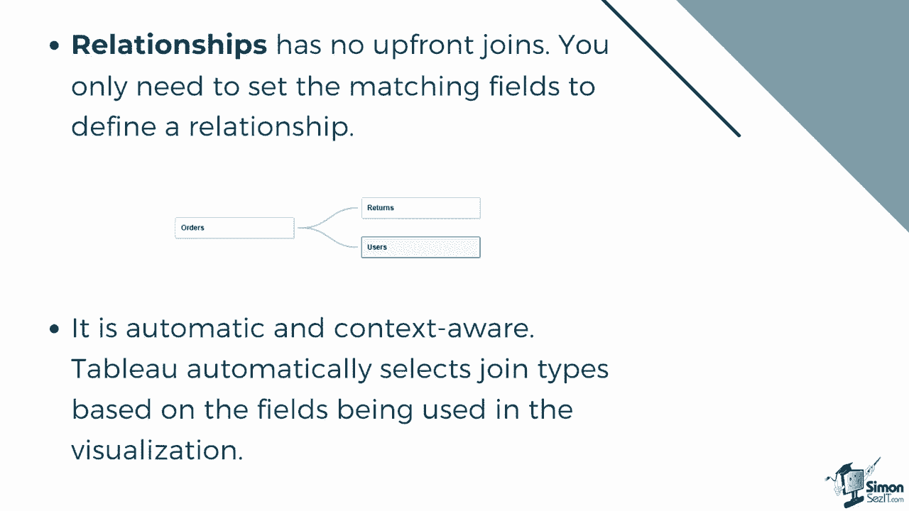

Tableau 推荐优先使用**关系**，因为它更简单直观，能保留各表的原始细节级别。在需要明确控制连接逻辑（如必须使用某种特定连接类型）时，才使用**连接**。

---

本节课中我们一起学习了 Tableau 的核心数据概念。我们了解了其偏好的表格结构、宽格式与高格式的区别、各种数据类型、以及维度与度量如何驱动分析。我们还探讨了离散与连续字段对图表的影响，并区分了合并多表数据的“关系”与“连接”方法。掌握这些概念，是构建有效 Tableau 可视化的坚实基础。