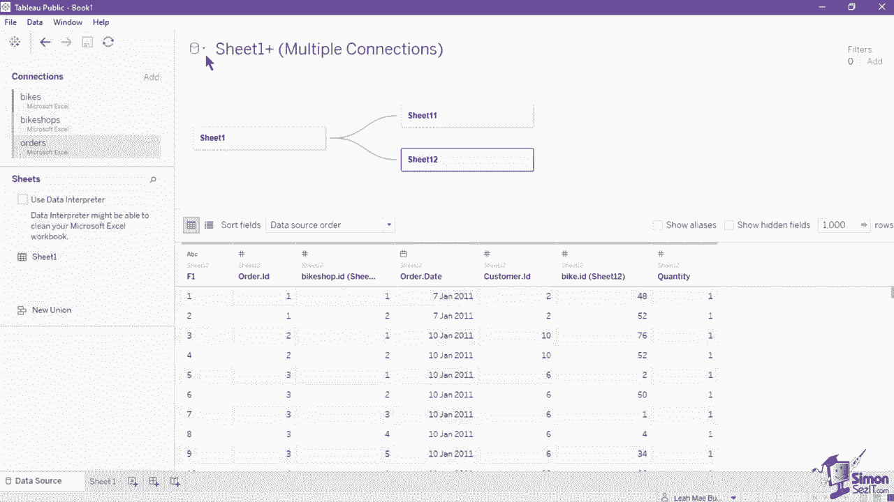
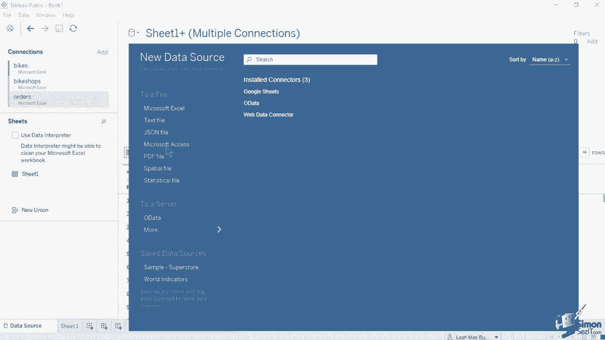
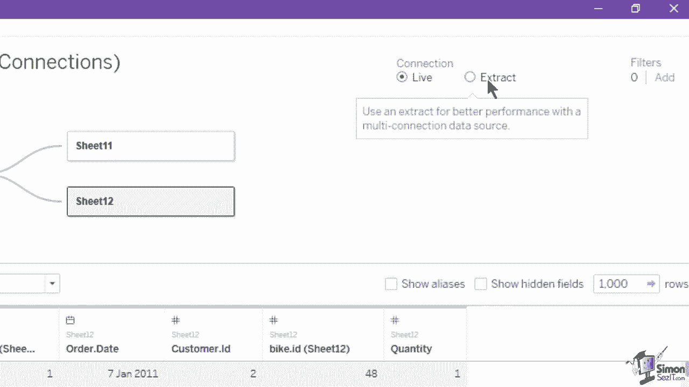
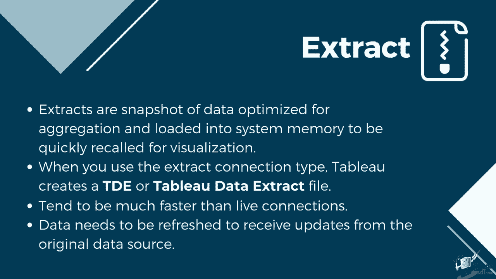
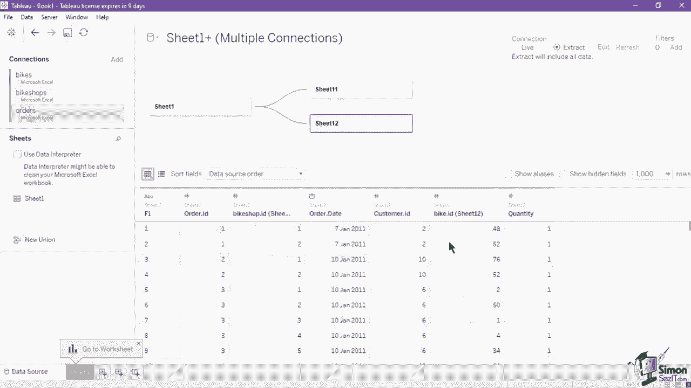
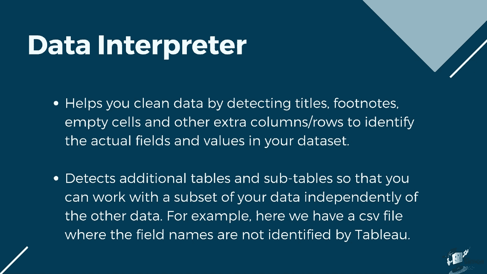
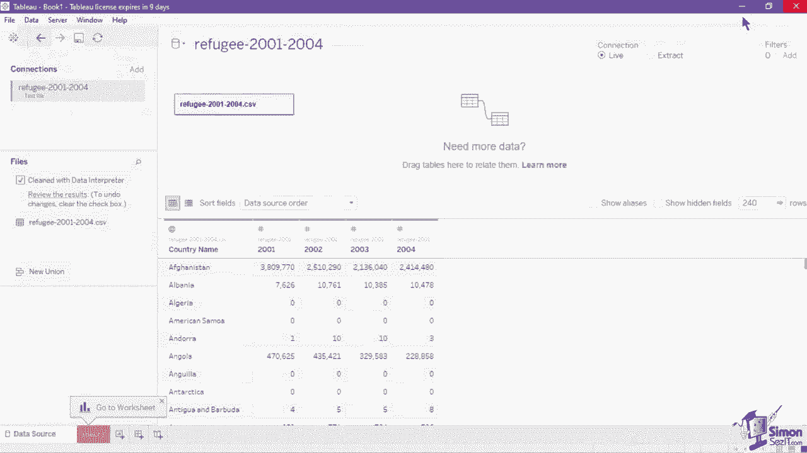
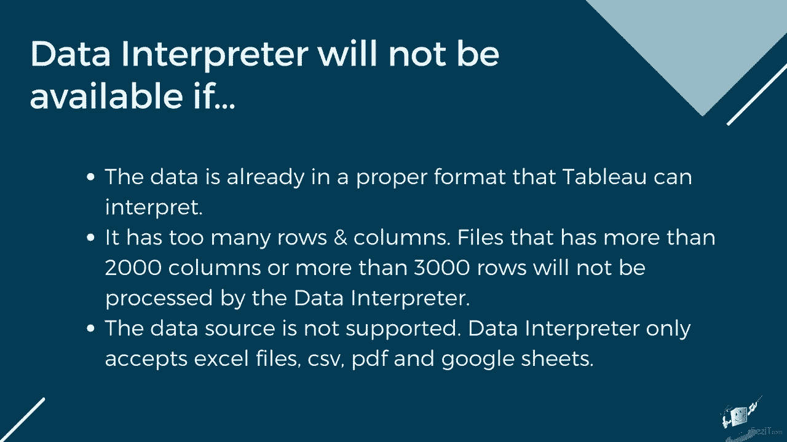
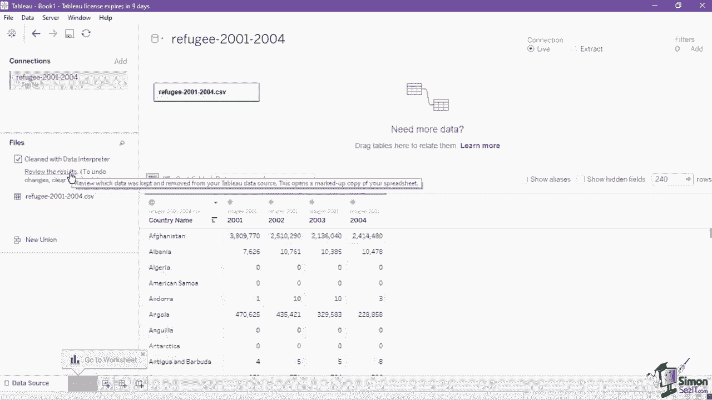

# Tableau 数据可视化教程 P7：数据源详解 📊

在本节课中，我们将深入学习 Tableau 数据源页面的核心功能。我们将探讨如何管理数据连接、理解不同的连接类型、应用数据源过滤器，以及使用数据解释器等工具来清理和准备数据，为后续的可视化分析打下坚实基础。

## 🔗 连接管理

上一节我们介绍了如何创建数据连接，本节中我们来看看数据源页面左上角的“连接”部分如何帮助我们管理多个数据连接。

数据库部分列出了当前连接到 Tableau 的文件或数据库，具体取决于数据源。此列表包含数据源的标题和数据连接的类型。

*   你添加的第一个数据源将标记为蓝色。
*   如果添加第二个数据连接，新的连接将有不同的颜色标签，以便于识别和区分每个独立连接。
*   在数据预览和元数据网格上，来自不同连接的选定工作表或表格也会有不同颜色的标签。

以下是连接管理的主要操作：

*   **添加新连接**：使用连接部分的“添加”按钮添加新数据连接。这不会替换列表中的当前数据连接，而是插入第二个可以与第一个连接相关联或连接的连接。
*   **替换连接**：导航到你想要替换或编辑的连接，点击其下拉按钮，在菜单中选择“编辑连接”，即可打开文件浏览或数据库连接菜单来选择新的连接。
*   **创建独立数据源**：点击左上角的圆柱图标并在列表中选择“新数据源”，可以创建一个与此连接分开的新数据源连接。这将打开一个窗口，显示 Tableau 支持的所有数据源的完整列表。
*   **删除数据源**：确保该数据源当前已被选中（如画布上数据源名称所示），然后在功能区的“数据”菜单中选择“关闭数据源”。

## ⚡ 连接类型：实时 vs. 提取

在画布右上角，我们可以使用单选按钮选择连接类型：实时连接或提取连接。

**实时连接**是 Tableau 的默认连接类型。实时连接意味着它与底层数据直接连接。

*   **公式**：`Tableau 视图 <--实时查询--> 原始数据库`
*   **优点**：提供实时更新的便利，数据源中的任何更改都会自动反映在 Tableau 中。
*   **缺点**：依赖于数据库进行所有查询，查询速度受限于数据库性能、网络速度、流量和自定义 SQL。复杂的实时连接工作簿也可能对一些传统数据库造成压力。

**提取连接**是针对聚合优化的数据快照，加载到系统内存中以便快速回调进行可视化。

*   **公式**：`Tableau 视图 <--查询--> Tableau 数据提取文件 (.tde 或 .hyper)`
*   **优点**：
    *   通常比实时连接快，尤其是在处理大型数据集、复杂过滤器和计算时。
    *   Tableau 直接查询内存中的提取，无需依赖外部数据库。
    *   提取文件已嵌入工作簿，支持离线使用数据。
*   **缺点**：数据是快照，需要手动或计划刷新才能接收来自原始数据源的更新。如果数据结构庞大，提取刷新可能会变慢。

选择画布中的提取连接类型将显示“编辑”和“刷新”两个新按钮。点击“编辑”会打开一个新窗口，您可以设置提取数据的存储方式、定义过滤器、汇总数据，并选择要包含在提取中的行。

## 🧹 数据源过滤器

在连接类型之后是用于添加过滤器的部分。数据源过滤器将根据您指定的条件减少数据源中的数据量。

数据源过滤器在发布工作簿或数据源时非常有用，可以限制用户能够看到的数据范围。当您将数据源发布到 Tableau Server 时，数据源及其关联文件或提取都会移入服务器。在发布时，您可以定义访问权限，并选择能够远程查询该数据源的用户和组。

在数据源页面上点击“添加”按钮将打开一个新窗口，您可以在其中添加、编辑和移除应用于数据源的过滤器。

以下是添加新过滤器的步骤：

1.  单击“添加”按钮。
2.  选择一个字段作为过滤器的基础。
3.  通过从列表中选择可用值来指示过滤器值，也可以设置通配符、条件或通过字段/公式按顶部记录进行过滤。

## 🛠️ 数据解释器

数据源页面上的另一个实用功能是数据解释器。它通过检测标题、脚注、空单元格和其他多余的列/行，来帮助您清理数据，识别数据集中实际的字段和值。它甚至可以检测到额外的表和子集，以便您可以独立处理数据的子集。

例如，对于一个字段名称未被 Tableau 正确识别的 CSV 文件，我们可以通过勾选工作表列表上方的“使用数据解释器”复选框来启用它。观察数据变化：之前标记为 F1 到 F5 的列现在已被正确的字段名称替换，它还可能自动将某些字段（如国家名称）的数据类型从字符串更改为地理类型。

要查看数据解释器所做的所有更改，可以点击“查看结果”，这将输出一个 Excel 文件，列出使用原始数据副本的变化，并带有颜色编码的单元格。

**请注意数据解释器的限制：**

*   并非适用于所有数据集。如果数据格式已正确，该选项可能不会显示。
*   不支持超过 2000 列或 3000 行的文件。
*   仅接受 Excel 文件、CSV、PDF 和 Google 表格。

## 📝 基本数据格式化

如果数据解释器所做的修改不足，您可以随时使用数据网格中的功能进行基本的数据格式化。这些操作仅在 Tableau 内部生效，不影响原始数据源。

以下是常用的数据格式化操作：

*   **透视数据**：对于宽格式数据（如年份作为列名），需要将其转换为长格式以便可视化。选择需要透视的多个列（例如 2001, 2002, 2003, 2004），右键单击并选择“透视”。这将创建“透视字段名称”和“透视字段值”两列，之后可将其重命名为“年份”和“数值”。
*   **重命名字段**：点击字段的下拉按钮，选择“重命名”，或直接双击字段名称进行修改。要恢复原名，可选择“重置名称”。
*   **排序**：将鼠标悬停在字段名称上，点击右侧出现的排序图标。第一次点击升序，第二次点击降序，第三次点击移除排序。
*   **更改数据类型**：点击字段前的数据类型图标（如 `Abc` 代表字符串，`#` 代表数字），从菜单中选择新的数据类型。确保数据类型正确至关重要，因为它决定了可用的可视化类型和计算功能。
*   **拆分字段**：对于包含复合信息的字段（如“姓名, 部门”），可以将其拆分为多列。点击字段下拉菜单，选择“拆分”。Tableau 默认使用空格作为分隔符。要使用特定符号（如逗号），请选择“自定义拆分”，并在新窗口中指定分隔符和拆分方式。
*   **创建别名**：别名是维度成员的替代显示名称。选择一个离散维度字段，点击下拉菜单选择“别名”。在新窗口中，可以为列表中的每个值指定一个别名。这样，在图表中该值将显示为别名，但在数据网格中仍保留其原始值。请注意，此功能仅适用于离散维度，不适用于连续字段和度量。

## 📚 总结

本节课中，我们一起深入探索了 Tableau 数据源页面的多项核心功能。

我们学习了如何管理多个数据连接，理解了**实时连接**与**提取连接**的区别与适用场景，掌握了使用**数据源过滤器**来精简数据和控制访问权限。我们还利用**数据解释器**自动清理格式不佳的数据，并实践了**透视、重命名、排序、更改数据类型、拆分和创建别名**等基本数据格式化操作，为后续创建准确、高效的可视化图表做好了充分的数据准备。