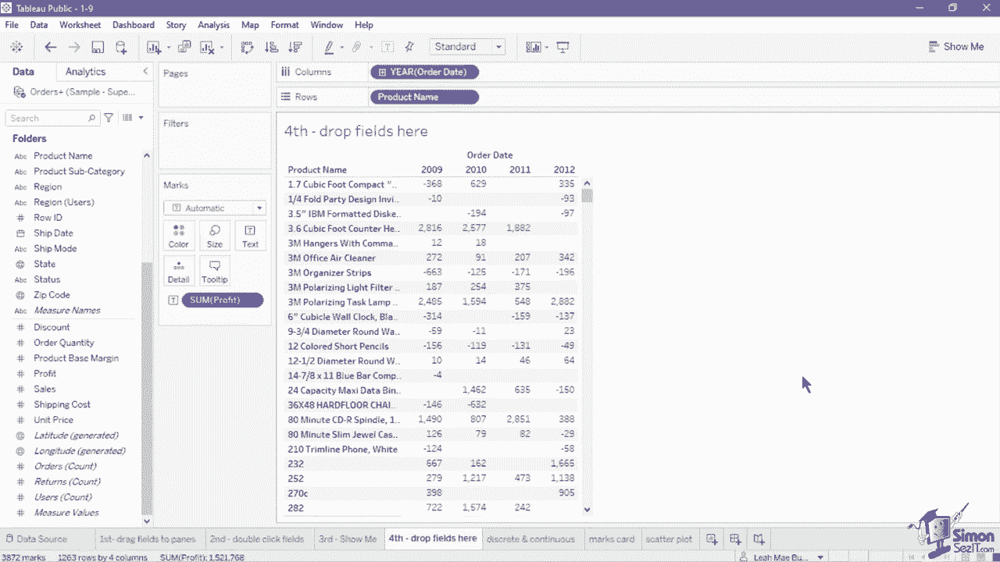
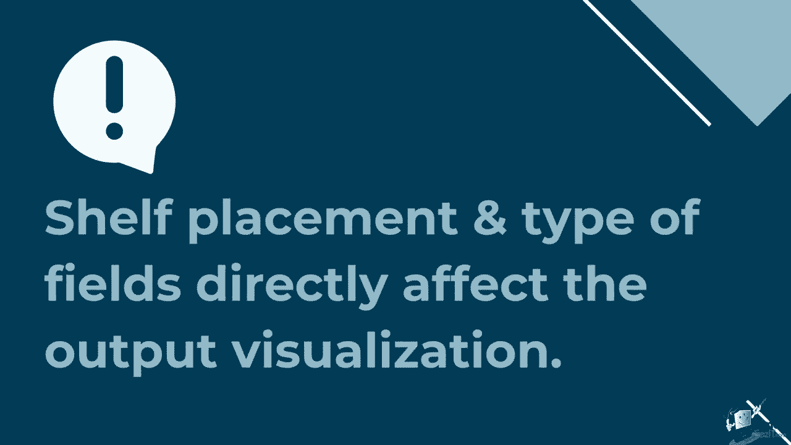
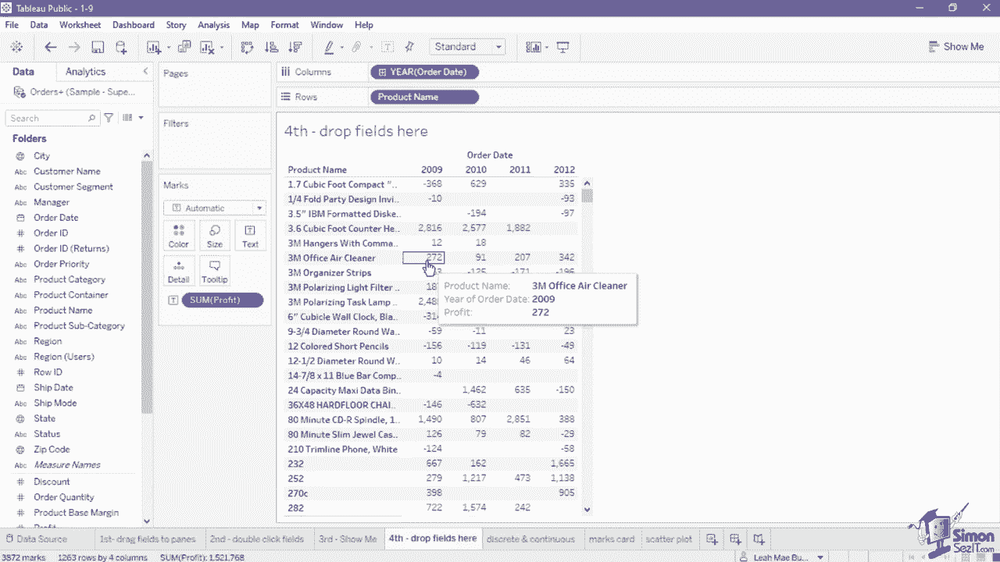

# 数据可视化神器 Tableau！P9：在 Tableau 中创建新视图 📊

在本节课中，我们将学习在 Tableau Desktop 中创建视图的四种核心方法，并深入理解“标记卡”的功能。掌握这些技能是构建有效数据可视化的基础。

创建视图时，应始终从一个需要通过可视化来回答的问题开始。例如，你想了解今年的销售增长情况，或者希望将客户划分为不同类别。明确问题后，即可开始构思视图。

## 🛠️ 创建视图的四种方法

以下是四种在 Tableau 中创建新视图的主要方法。

### 方法一：拖放字段到卡片和货架

第一种方法是从数据面板拖动字段，并将其放置到画布上的卡片和货架上。

例如，将“销售额”度量拖动到“颜色”卡和“标记”卡中，然后将“产品类别”维度添加到“标签”卡中。

完成后，视图中会生成一个树形图。矩形代表每个产品类别，其大小和颜色（从浅蓝到深蓝）均编码了该类别的销售额。这种方法适合已经熟悉字段与卡片位置如何影响可视化效果的用户。

### 方法二：双击数据面板中的字段

第二种方法是直接双击数据面板中的一个或多个字段。

例如，在一个新工作表中，双击维度字段“邮政编码”。Tableau 会自动执行查询，处理邮政编码并生成对应的经纬度坐标。接着，双击度量字段“运费”。

“运费”字段的值决定了在生成的符号地图中，每个点（圆圈）的大小。这种方法非常实用，尤其在你对图表类型没有特定要求时，因为 Tableau 会根据所选字段的类型自动生成最合适的视图。

### 方法三：使用“显示我”功能

第三种方法是在数据面板中选择一个或多个字段，然后使用“显示我”功能来设置图表。

例如，选择维度“客户细分”，然后按住 `Ctrl` 键（Windows）或 `Command` 键（Mac）并选择度量“订单数量”。选中所需字段后，点击界面右上角的“显示我”按钮，并选择“水平条形图”。

选择图表后，Tableau 会生成一个按客户细分分组的水平条形图，每个条形的长度基于该细分的总订单数量。使用“显示我”方法对初学者非常友好，有助于熟悉基于所选字段可用的图表类型。

### 方法四：拖放字段到画布网格区域

第四种方法是将字段直接拖入画布的列、行或值区域（即字段拖放网格）。

例如，将“订单日期”字段拖到“列”功能区。完成后，将“产品名称”字段拖到“行”功能区的最左侧。此时会显示一个折线图指示器。最后，将“利润”字段作为值添加到视图中。

结果会创建一个文本表格。请注意，这种方法主要适用于创建表格视图。

## 🔍 理解字段类型与放置的影响

理解字段的放置位置和其类型（维度/度量，离散/连续）如何影响最终的可视化效果至关重要。

正如我们在数据概念课程中讨论的，数据被分类为维度或度量，并可进一步分为离散或连续。让我们看看每种类型如何创建不同的图表。

*   **离散维度**：创建值的类别或分组。
    *   例如，在一个显示销售总额的条形图上，添加一个离散维度“产品类别”到“列”功能区。条形图会按产品类别分成三个独立的条形。
*   **连续维度**：在可视化中创建一个数字轴。
    *   大多数维度是离散的，但日期字段是个例外，它可以被转换为连续。例如，将“订单日期”拖到“列”功能区，并通过字段下拉菜单将其转换为“连续”。这会生成一个按年份自动排序的折线图，显示销售趋势。
*   **连续度量**：在轴上创建一系列数值范围。
    *   例如，在折线图的“行”功能区放置“销售额”（连续度量），图表纵轴会显示从0到最大值（如400万）的一系列数值。
*   **离散度量**：在可视化中显示为标签或普通文本。
    *   度量通常是连续的，但也可以设置为离散。例如，创建一个条形图后，将“销售额”度量从连续转换为离散，条形会被替换为显示销售额数值的普通文本标签。

## 🎨 掌握“标记卡”的使用

创建视图时，掌握“标记卡”是另一个重要部分。标记卡提供了控制视图中点、线、条形等标记外观的能力，可以为图表增加额外的含义和细节。

以下是标记卡各部分的介绍：

*   **标记类型**：下拉列表用于控制视图中显示的标记类型（如条形、圆形、区域、线等）。默认设置为“自动”，Tableau 会根据数据自动选择最佳类型。你也可以手动更改，例如将条形图改为面积图。
*   **颜色**：用于区分视图中的不同标记。默认颜色是蓝色。你可以通过调色板选择静态颜色，或者将字段（如“客户细分”）拖到“颜色”卡上，实现按类别动态着色。
*   **大小**：调整标记的尺寸。你可以使用滑块手动调整，也可以将字段拖到“大小”卡上，让标记大小动态反映数据值（如用圆圈大小表示销售额）。
*   **形状**：仅在标记类型为符号图、散点图等时可见。将离散维度（如“产品类别”）拖到“形状”卡上，可以用不同形状区分数据类别。
*   **标签**：决定在视图中显示的文本值。将字段（如“产品名称”）拖到“标签”卡上，可以为每个数据点添加标签。对于文本表，标签功能被“文本”卡替代，允许你编辑表格中的显示内容。
*   **详细信息**：向视图添加更细粒度的数据层级，而不改变视图的基本结构。例如，在散点图中将“产品子类别”拖到“详细信息”卡，会在不改变形状分组的情况下，为每个子类别添加一个数据点。
*   **工具提示**：当用户将鼠标悬停在视图中的标记上时显示的信息框。默认包含视图中的字段信息。你可以将其他字段（如“订单数量”）拖到“工具提示”卡中，以丰富提示信息的内容。

## 📝 总结

本节课中，我们一起学习了在 Tableau 中创建新视图的四种核心方法：拖放字段、双击字段、使用“显示我”功能以及拖放到画布网格。我们还深入探讨了字段类型（离散/连续）如何影响可视化，并全面掌握了“标记卡”的各项功能，包括颜色、大小、形状、标签等的设置。理解这些基础操作是灵活、高效创建各类数据可视化图表的关键。