# 数据可视化神器Tableau！P10：在Tableau中使用多个数据源 📊

在本节课中，我们将学习如何在Tableau中组合来自多个数据源的数据。我们将重点介绍**数据混合**、**连接**和**联合**这三种核心方法，理解它们的工作原理、适用场景以及如何操作。

---

## 概述

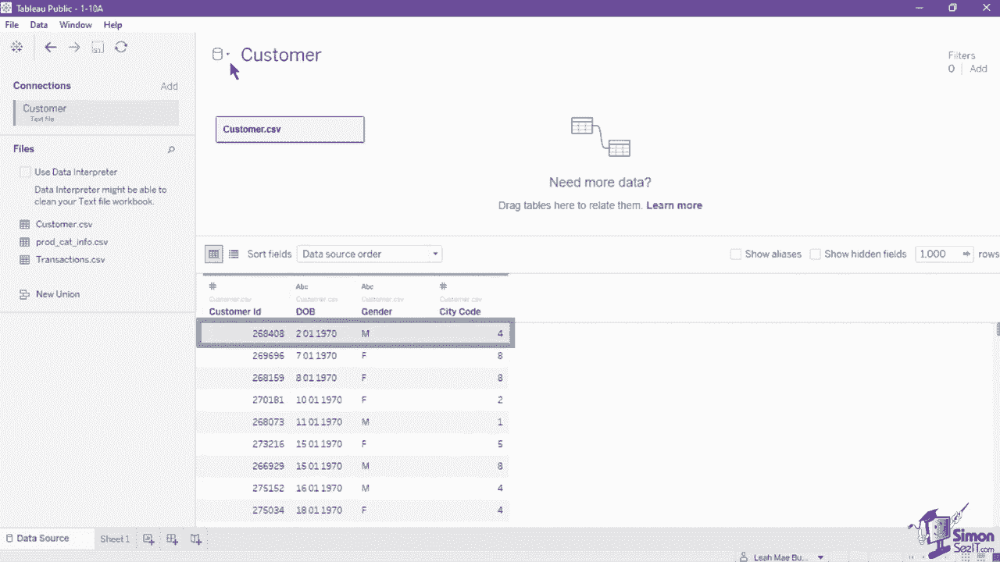

在早期的课程中，我们已经区分了连接和关系方法。这两种方法用于组合来自**同一个数据源**的多个数据表。但是，当我们需要整合来自**不同数据源**的数据时，就需要使用其他方法。本节课将详细介绍数据混合、连接和联合，帮助你根据不同的数据场景选择最合适的组合方式。

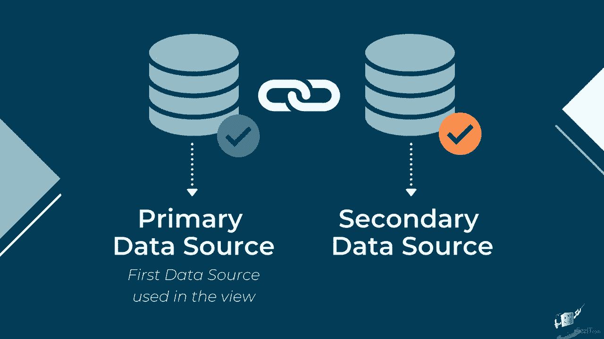

---

## 数据混合 (Data Blending)

上一节我们提到了连接和关系，本节中我们来看看**数据混合**。数据混合与连接或关系不同，数据本身并未真正合并。相反，Tableau会独立查询每个数据源，将结果聚合到适当的级别，然后在视图中以可视化的方式组合呈现。因此，数据混合可以处理不同细节级别的数据，并且能与已发布的数据源协同工作。

例如，在这个工作簿中，我们有两个数据源：
*   第一个是“客户”数据源，包含客户信息。
*   第二个是“交易”数据源，包含交易信息。

这两个数据源都有“客户ID”字段，但细节级别不同。如果顾客多次购买，交易数据源中会包含多个相同的客户ID记录，而客户数据源中每个客户ID通常是唯一的。

### 主要与次要数据源

在进行数据混合时，你的数据源会被识别为**主要**或**次要**数据源。这个设定是按每个工作表进行的，意味着新工作表可以指定不同的主要和次要数据源。

主要数据源是视图中使用的第一个数据源。例如，在这个视图中，我们将“客户ID”作为行功能区上的第一个字段，因此“客户”数据源被标记为该工作表的主要数据源。在数据窗格中，主要数据源的名称旁会有一个蓝色对勾标记。

让我们在这个视图中创建混合：
1.  点击“交易”数据源。
2.  选择“总金额”度量字段，将其拖入视图作为文本标记。

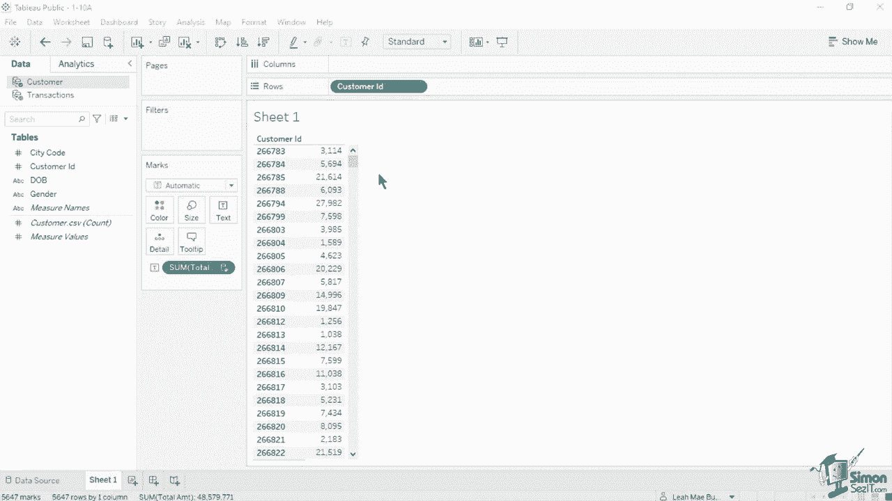

这样一来，就创建了混合，并将“交易”数据源标记为**次要数据源**。次要数据源的名称在数据窗格中会有一个橙色对勾指示器。

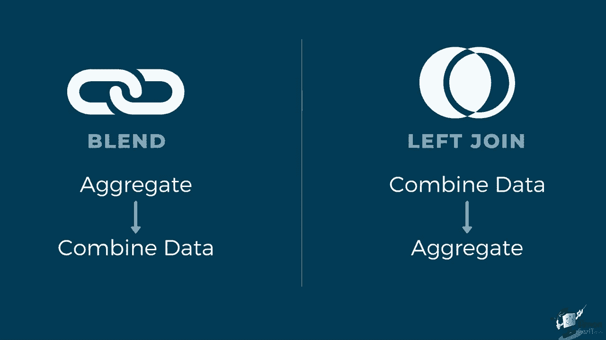

### 链接字段

请注意，在“交易”数据源的“客户ID”字段旁，出现了一个**红色链条图标**。这意味着Tableau自动将“客户ID”设置为主要和次要数据源之间的链接字段。如果两个数据源中的字段名称完全相同，Tableau会自动将其设为链接字段以使混合生效。

链接字段的值必须具有相同的含义或成员。你可以通过导航到“数据”菜单并点击“编辑混合关系”来修改链接字段。

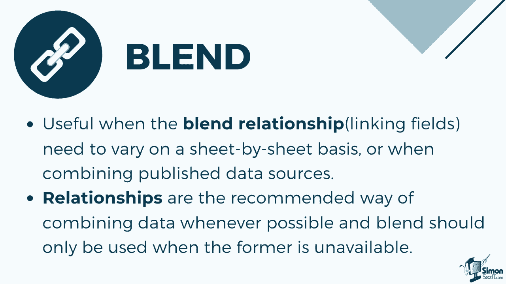

以下是关于链接字段状态的说明：
*   **红色链条**：表示该字段是当前视图中正在使用的活动链接字段。
*   **灰色断链**：表示该字段可以作为链接字段，但当前未被使用。

### 混合的工作原理

在混合数据时，主数据源定义了视图的聚合级别。例如，“总金额”最初是按每笔交易汇总的，但在混合后，它被汇总到了客户级别，显示每个客户ID支付的总金额。

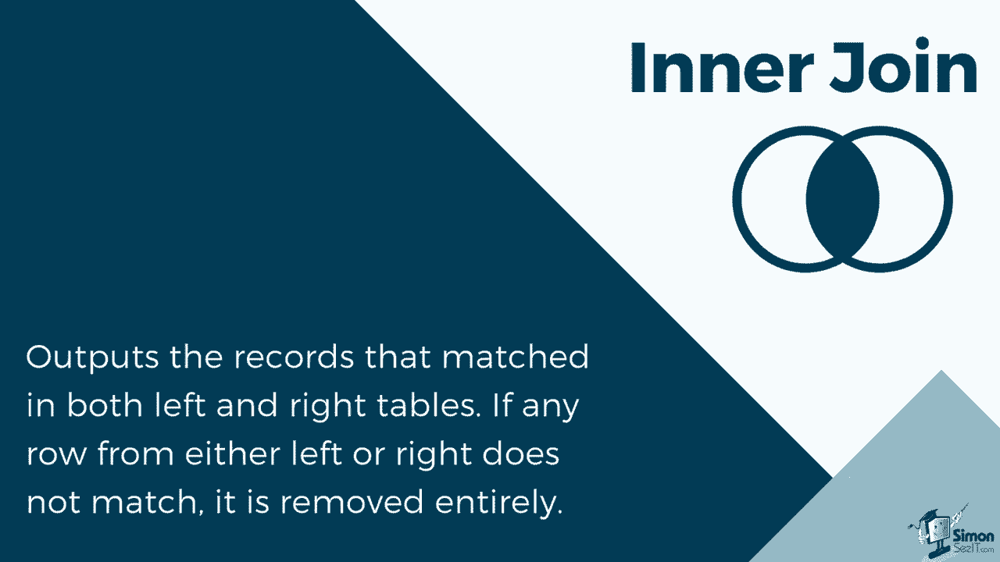

次要数据源将仅限于那些与主数据源有对应匹配的值。因此，在“客户”数据源中没有记录的客户ID，将不会包含在视图中。这个过程类似于传统数据库中的**左连接**，但关键区别在于应用聚合的时机：
*   **连接**是在应用聚合**之前**先组合数据。
*   **混合**则是在组合数据**之前**先进行汇总。

### 混合的特点与建议

每个工作表上的混合是独立建立的，且无法发布为一个单一的混合数据源，因为它仅仅是多个数据源在可视化中的临时组合。你需要分别发布各个数据源，然后在工作表中混合这些已发布的数据源。

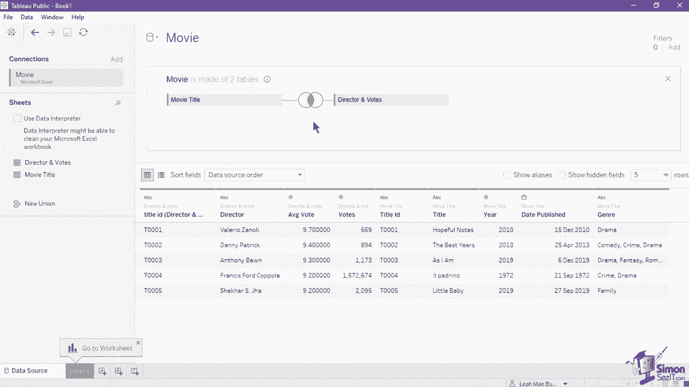

数据混合在以下情况特别有用：
*   链接字段需要在不同工作表之间变化时。
*   需要组合已发布的数据源时。

尽管数据混合曾是使用不同来源数据的唯一方式，但在Tableau 2020.2及更高版本中，引入了更高效的**关系**功能来组合数据。**关系是推荐的组合数据方式，应尽可能优先使用。只有在关系不可行时（如组合已发布的数据源），才使用数据混合。**

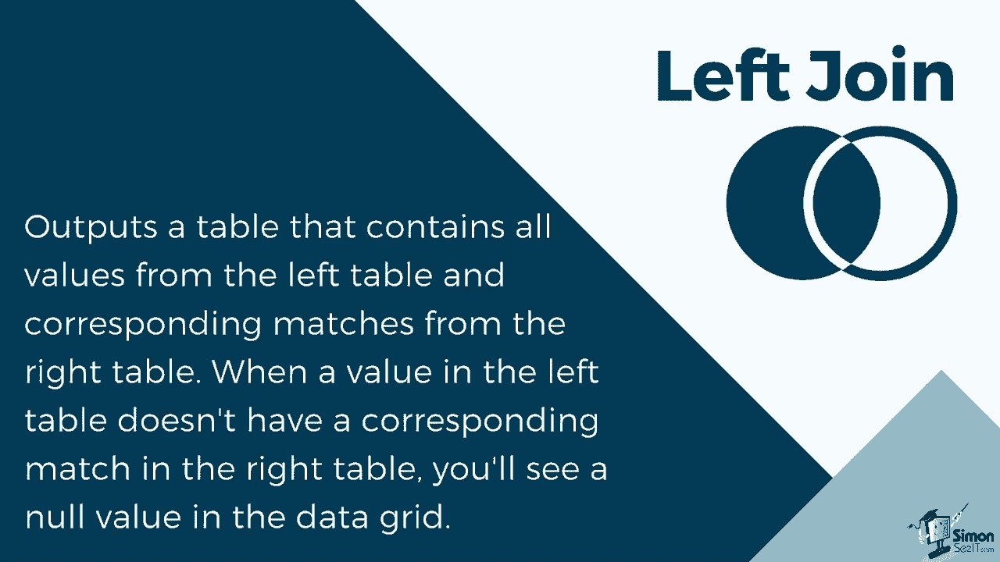

---

## 连接 (Joins)

之前我们提到混合类似于左连接。现在，让我们系统地回顾一下连接。连接是在**数据源页面**的物理层面应用的。你需要指定用于连接的特定字段和连接类型。

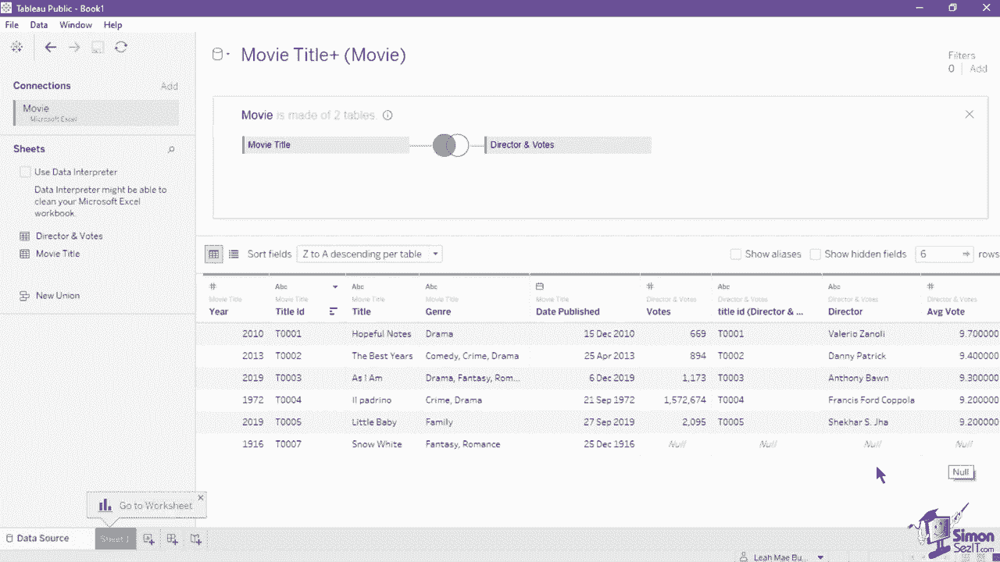

以下是可以在Tableau中应用的不同类型的连接：

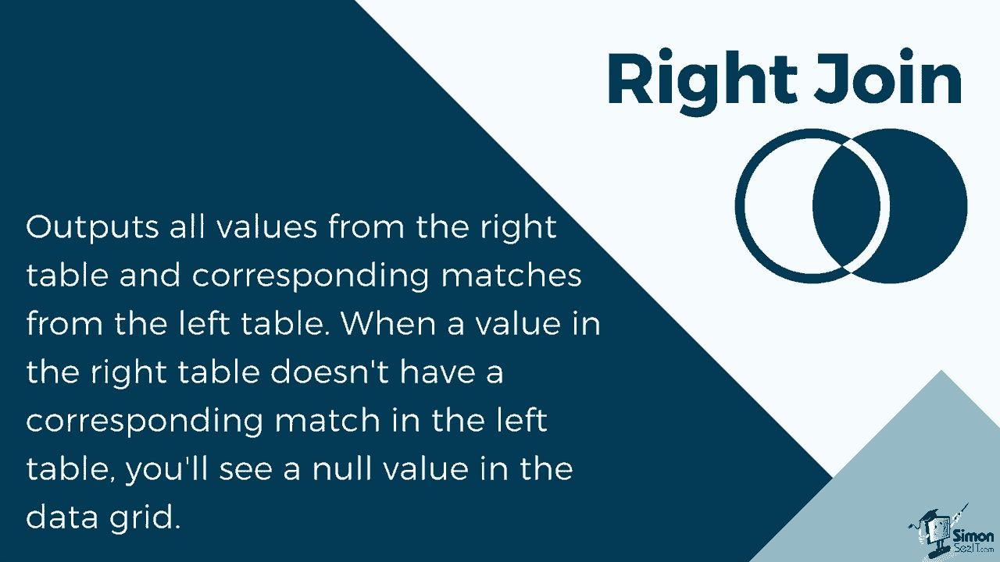

### 内连接 (Inner Join)

内连接的结果表将只包含在左表和右表中都匹配的记录。如果任何一侧的行没有匹配项，它将被完全移除。

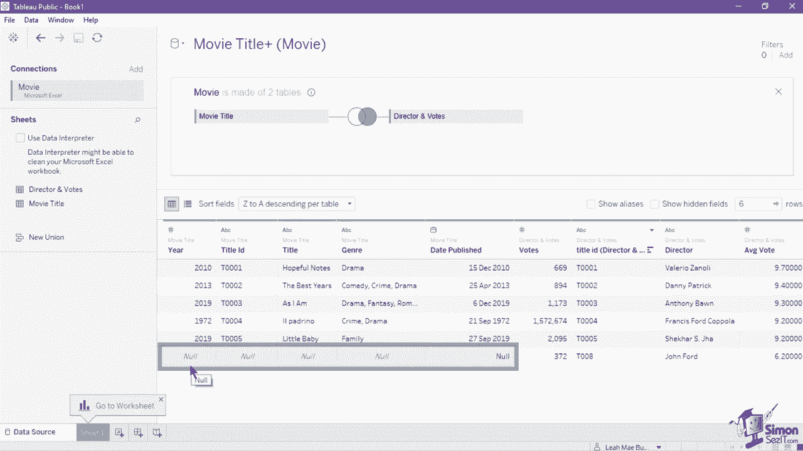

让我们看看内连接在这个电影数据源中的应用。该数据连接有两个表：“电影标题”和“导演投票”。两个表都有“标题ID”字段。应用内连接后，结果仅包含两个表中都存在的“标题ID”记录（例如从标题1到标题5）。那些在另一张表中没有匹配的记录（如左表的《白雪公主》和右表的约翰·福特导演记录）会被删除。

### 左连接 (Left Join)

当你使用左连接来组合表格时，结果是一个包含**左表所有值**及其在右表中对应匹配的表格。当左表中的某个值在右表中没有对应匹配时，结果中该记录的右表字段将显示为**空值**。

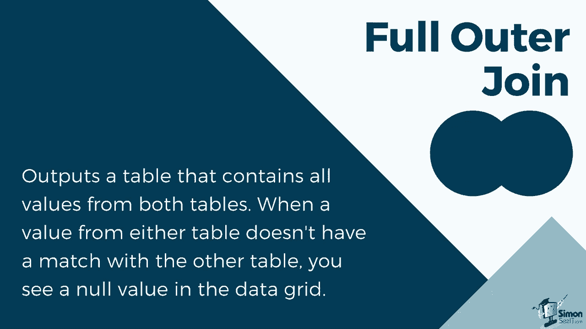

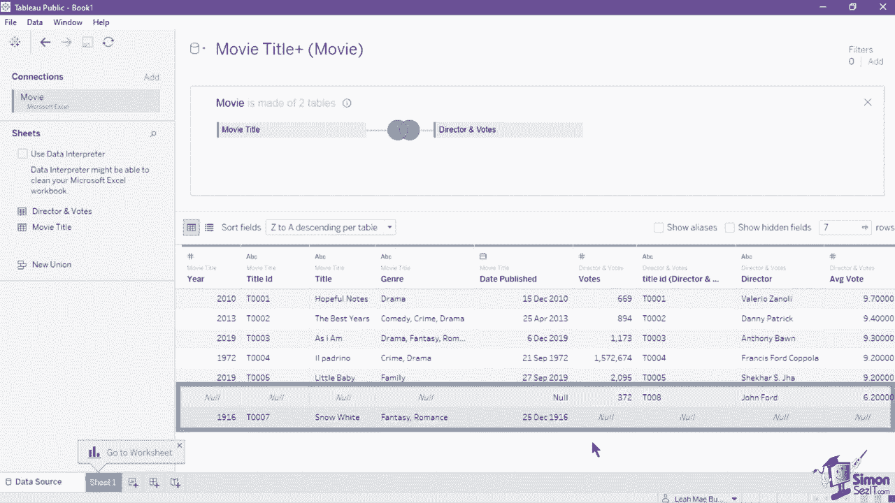

在示例中，将连接改为左连接后，输出包含左表的全部6条记录。其中5条在右表中有匹配，第6条（ID为T0007）是左表独有的，因此其右表字段（如导演、投票数）显示为空值。

### 右连接 (Right Join)

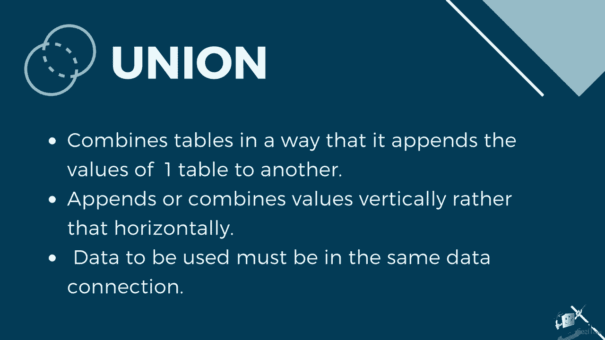

右连接的结果包含**右表中的所有值**和左表中对应匹配的值。当右表中的某个值在左表中没有对应匹配时，结果中该记录的左表字段将显示为**空值**。

将连接类型更改为右连接后，结果包含右表的全部记录。其中5条在左表中有匹配，第6条（ID为T0008）是右表独有的，因此其左表字段（如年份、标题）显示为空值。

### 全外连接 (Full Outer Join)

全外连接的结果表包含**两个表的所有值**。当任何一个表的值在另一个表中没有匹配时，对应的字段将显示为**空值**。

将连接类型更改为全外连接后，结果包含两个表中的所有记录，包括那些没有匹配值的唯一记录，这些记录的缺失字段均显示为空值。

---

## 联合 (Unions)

除了混合和连接，**联合**是另一种合并数据的方法。联合以**垂直堆叠**的方式合并表，即追加行，而不是像连接那样水平合并列。

为了在Tableau数据源中应用联合，所使用的表或工作表必须位于**相同的数据连接**中。建议在结构相同的表中使用联合，它们应具有相同数量的字段，并且字段名称和数据类型要匹配。

### 创建联合

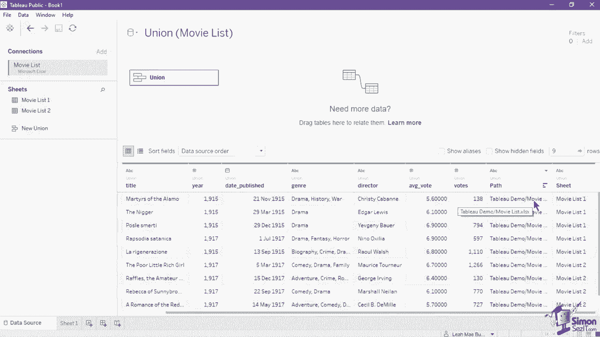

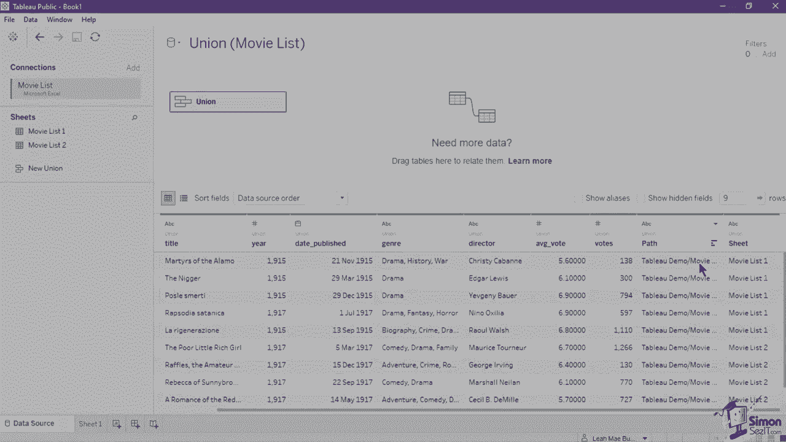

我们以“电影列表”数据源为例，它有两个结构相同的工作表：“电影列表1”和“电影列表2”。

要创建联合，请双击工作表区域中的“新建联合”按钮。这会打开一个新窗口，你可以手动或自动指定要联合的工作表。

**手动方法：**
1.  将“电影列表1”从左侧拖入联合窗口。
2.  再将“电影列表2”拖入，放在“电影列表1”下方。
3.  点击“应用”。数据网格现在会显示来自两个工作表的所有记录。

联合完成后，数据网格末尾会添加“工作表”和“表名”等额外字段。这些字段提供了每条记录来源的信息，在分析时非常有用。

**自动方法（使用通配符）：**
1.  在联合窗口中选择“通配符(自动)”选项卡。
2.  你可以设置搜索标准（如包含“电影列表*”的表名），Tableau会自动将符合条件的所有表联合起来。
3.  这种方法适用于需要联合大量结构相同文件的情况。

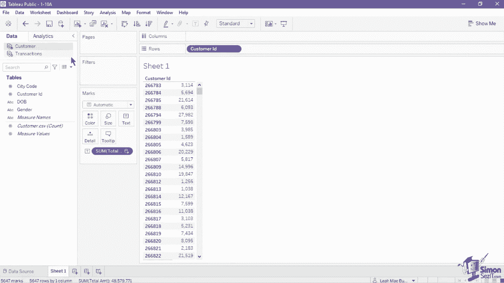

---

## 总结

在本节课中，我们一起学习了在Tableau中组合多个数据源的三种核心方法：

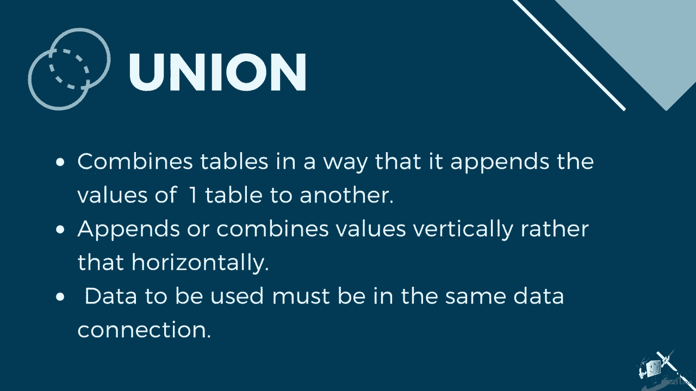

1.  **数据混合**：用于组合**不同数据源**的数据，在可视化层面进行聚合和关联。它类似于左连接，但先聚合后关联。适用于链接字段可变或组合已发布数据源的场景。
2.  **连接**：在**同一数据源**的物理层面水平合并表。包括内连接、左连接、右连接和全外连接，用于根据匹配键整合相关数据。
3.  **联合**：在**同一数据源**中垂直堆叠结构相同的表，用于追加行记录。

记住，**关系**是Tableau现代版本中首选的灵活数据组合方式，应优先考虑。当关系不适用时，再根据数据是否同源、结构是否相同等条件，选择连接、联合或混合。

---

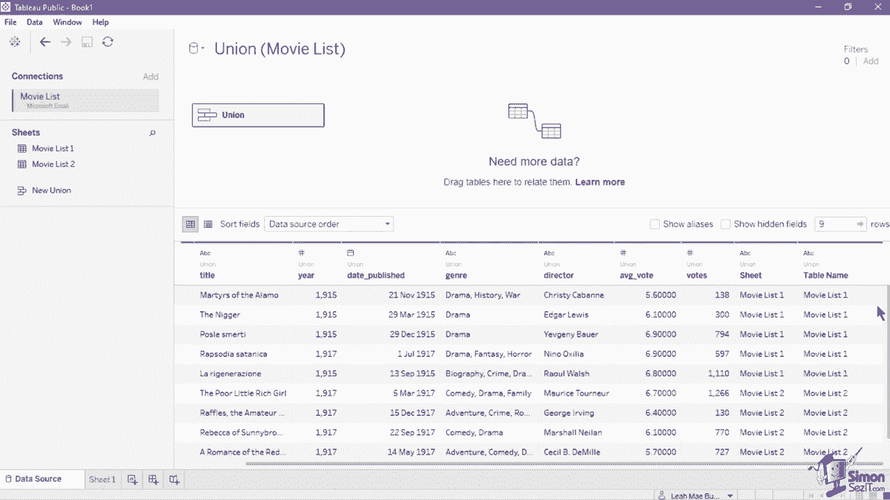

## 练习与资源

在下一个部分，你需要下载课程练习文件。点击视频描述中的链接获取这些文件。你也可以滚动查看详细信息，以找到本课程每个部分的时间戳。