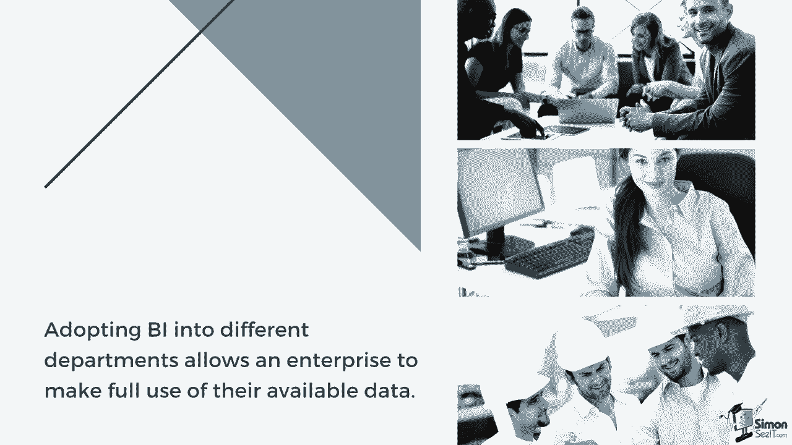
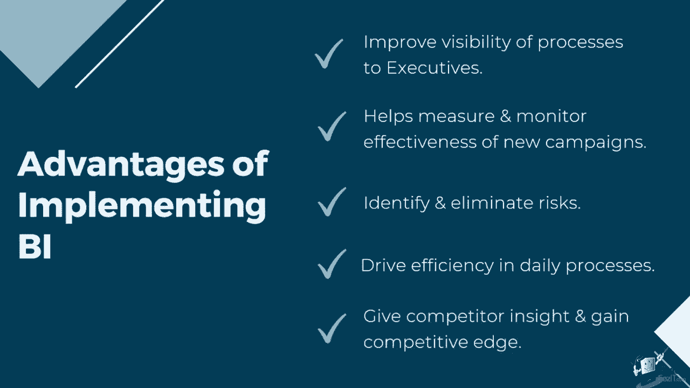
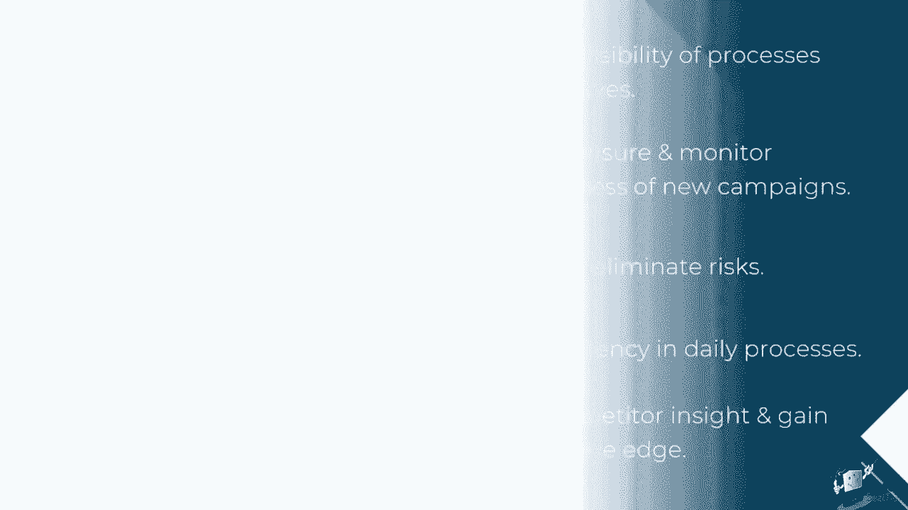
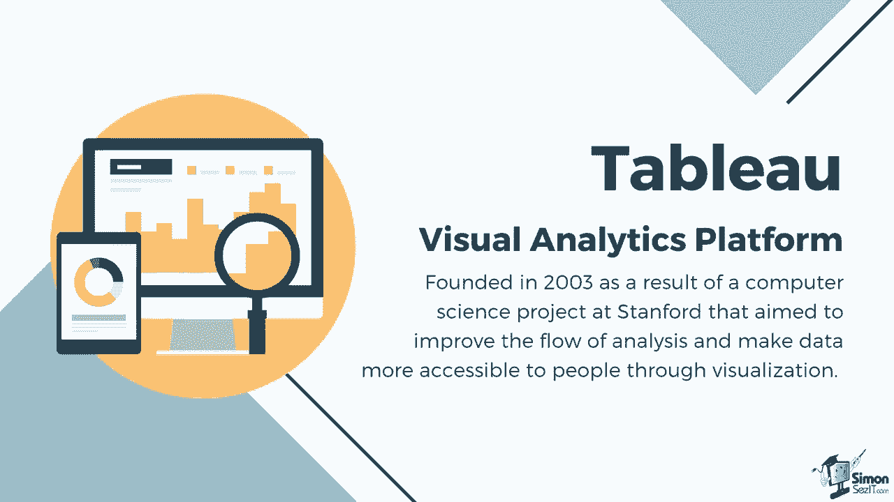

# 数据可视化神器Tableau！P3：商业智能简介 📊

在本节课中，我们将要学习商业智能的基本概念、核心价值以及它与Tableau的关系。商业智能是现代企业决策的重要支撑，理解它有助于我们更好地利用数据工具。

## 什么是商业智能？

商业智能指的是企业利用的过程和技术，用于收集、整合、分析并以易于理解的格式呈现相关商业信息。

它提供了对业务运营的历史、当前和预测视图，其核心作用是将原始数据转化为可操作的洞察。商业智能工具分析数据集，并使用报告、摘要、仪表板、图形、图表和地图呈现其发现，以向用户提供有关业务状态的详细情报。商业智能的关键目的在于支持企业最终用户评估当前的业务状态，并促进更好的商业决策。

## 商业智能的应用价值

将商业智能引入不同部门，使企业能够充分利用现有数据。以下是它在几个关键部门的应用示例：

*   **销售团队**：可以应用商业智能来可视化他们的季度KPI，并有效跟踪当前业绩的表现。它还可以用于创建收入分析和比较销售表现。
*   **人力资源部门**：可以实施商业智能进行工资追踪，同时获得员工满意度的洞察。
*   **财务部门**：可以通过商业智能帮助进行费用管理。他们可以利用商业智能工具进行财务规划和分析。

投资于一个可靠的商业智能战略和系统有助于提高高管对流程的可见性，因为他们可以使用实时数据在仪表板上主动做出决策。使用有效的可视化方法突出洞察，使他们能够快速理解数据，而不是浏览数页年度报告来评估业务。这也有助于衡量和监控新活动和流程的有效性。

## 商业智能带来的核心优势

上一节我们看到了商业智能的具体应用，本节中我们来看看它能给企业带来哪些根本性的好处。以下是商业智能的几个核心优势：

*   **获得深度洞察**：商业智能使企业能够获得关于业务的详细洞察和分析。这些数据帮助他们识别风险和制约因素，以及不利于业务增长的元素。
*   **提升运营效率**：商业智能系统还推动日常流程的效率，例如通过自动处理和提取数据。这反过来可以提高生产力和收入。
*   **支持战略决策**：商业智能可以提供对竞争对手所做事情的洞察，从而使您的组织能够做出明智的决策，并规划未来的努力，以获得竞争优势。

## Tableau：现代商业智能的利器

许多领先行业使用Tableau将现代商业智能应用于他们的系统。Tableau是一个可视化分析平台，它成立于2003年，源于斯坦福大学的一个计算机科学项目，旨在改善分析流程，并通过可视化使数据更易于人们获取。

Tableau的核心功能可以用一个简单的公式来理解：
`Tableau = 数据连接 + 交互式可视化 + 共享与协作`
它允许用户通过拖放操作，快速将数据转化为各种交互式图表和仪表板。

---

本节课中我们一起学习了商业智能的定义、它在企业各部门的应用价值、所带来的核心优势，并介绍了Tableau作为实现现代商业智能的重要工具。理解这些基础概念，是后续深入学习Tableau数据可视化的关键第一步。