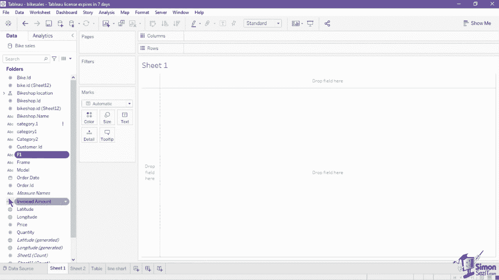
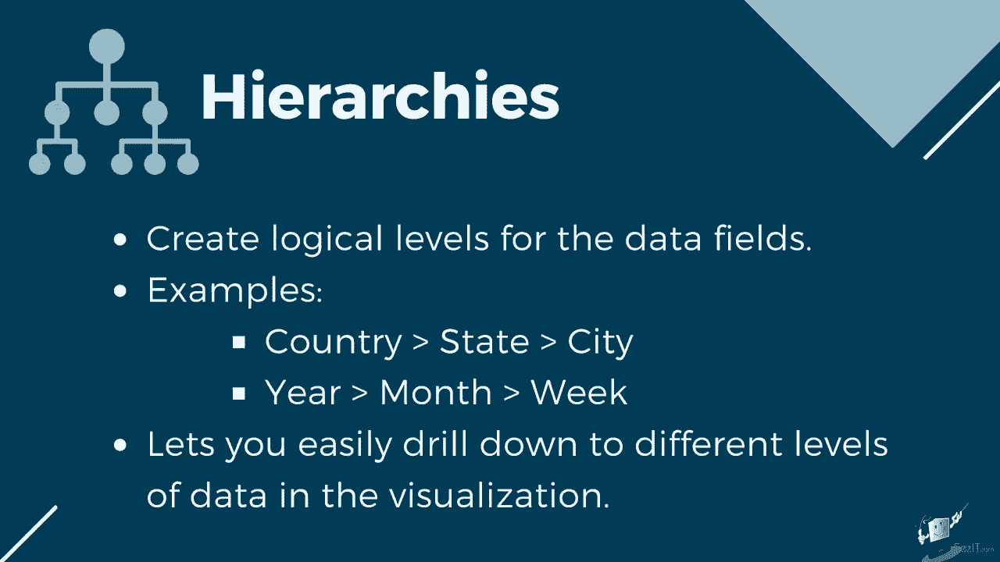
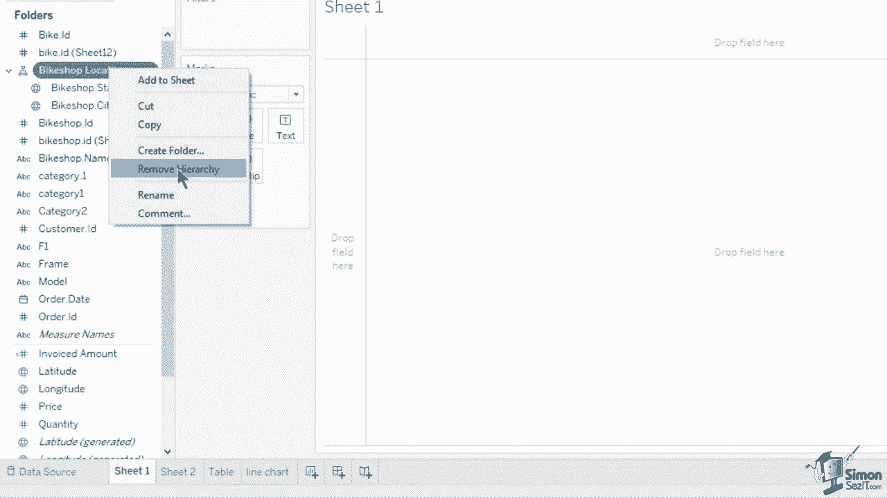
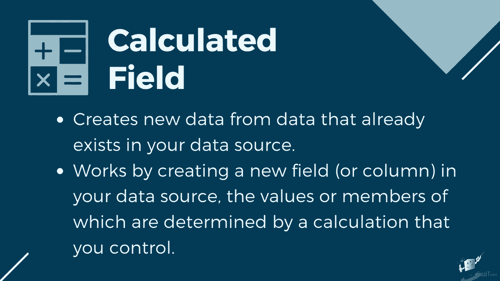
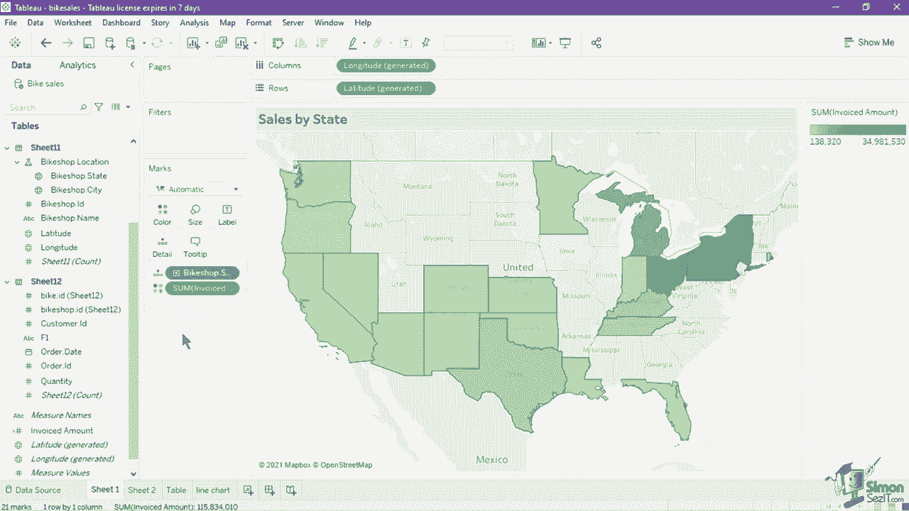
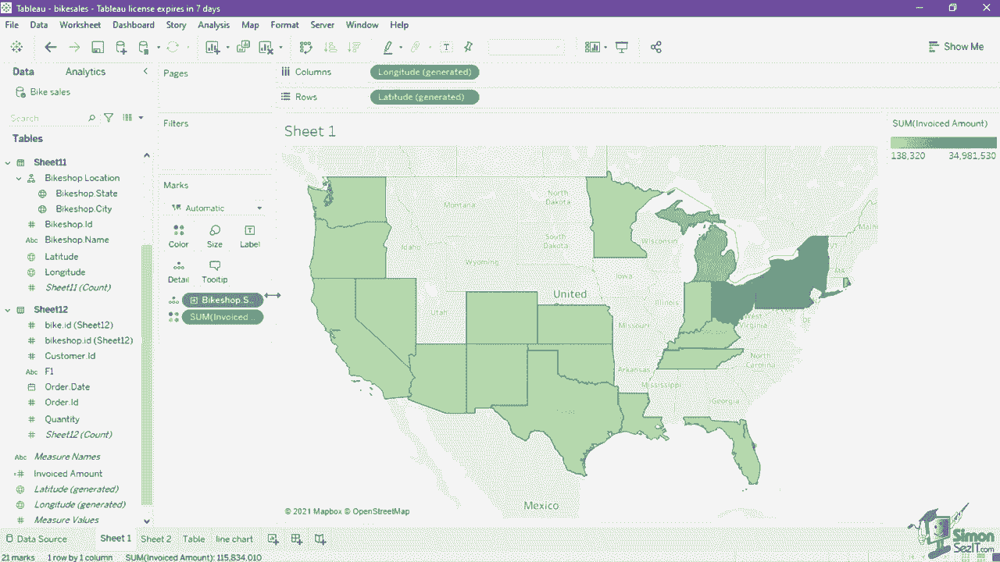

# 数据可视化神器Tableau！P8：Tableau工作区介绍 🧭

在本节课中，我们将深入学习Tableau工作区的核心组成部分。工作区是您创建和操作可视化图表的主要界面，理解其布局和功能是高效使用Tableau的关键。我们将逐一探索数据窗格、字段管理、层级创建、计算字段以及视图的各个元素。

## 概述

Tableau工作区由多个卡片、架子和窗格组成，您可以通过拖放字段来构建图表。本节将详细介绍数据窗格的功能、如何创建层级和计算字段，并解析可视化视图中的各个组成部分。

## 数据窗格详解

数据窗格是工作区的核心区域，它保存了数据字段、集和参数。

窗格顶部显示数据源名称。如果您连接了多个数据源，可以在此处切换。每个数据源在数据窗格中都有独立的字段列表。

右键点击数据源名称可以访问更多功能，例如：
*   提取数据
*   编辑别名
*   应用过滤器
*   发布数据源

要查看数据而不返回数据源页面，可以点击搜索框右侧的“查看数据”图标。弹出的数据窗口右上角有一个数字，用于限制视图中显示的行数。

您可以编辑该数值以增减显示的行数，最大行数限制为10000。除了行数限制，您还可以通过复选框来启用或禁用“显示别名”功能。

由于我们使用了三个通过关系连接的表，窗口底部会显示三个标签。每个标签代表一个独立的表或工作表，点击标签即可切换查看。您可以通过拖动列名来调整列的顺序。

如果您希望复制或导出选定的行，或预览中的所有数据，可以通过点击列名对数据进行排序，然后选择行或列，并点击右上方的“复制”或“导出所有”按钮。

## 管理可用字段

您可以通过点击“查看数据”图标旁的下拉按钮，选择按“数据源”或“文件夹”对字段进行分组。

*   **按数据源分组**：根据字段所属的表或表单列出字段。
*   **按文件夹分组**：默认列出数据源中的所有可用字段。

您也可以创建自定义文件夹来组织字段。右键点击一个字段，选择“文件夹” -> “创建文件夹”即可。

在这两种分组视图中，维度字段会列在度量字段之前，两者之间用一条灰线分隔。

## 创建数据层级

层级为数据字段创建逻辑上的级别关系，便于您深入分析不同粒度的数据。

例如，您可以创建“国家 -> 州 -> 城市”的地理层级，或“年 -> 月 -> 周”的日期层级。

以下是创建层级的方法：
1.  将一个字段拖放到另一个字段上。例如，将“自行车商店城市”拖到“自行车商店州”上。
2.  在弹出的窗口中为新建的层级命名，例如“自行车商店位置”。
3.  命名后，层级会显示在数据窗格中。首先列出的字段是更高层级（例如“州”），您可以向下钻取到更低层级（例如“城市”）。

您可以在层级中上下拖动字段来改变它们的顺序。要删除层级，右键点击层级名称并选择“移除层级”。

## 创建计算字段

计算字段允许您基于已有数据创建新的数据列。

当您创建计算字段时，实际上是在数据源中添加了一个新字段或列，其值由您定义的计算公式决定。

例如，我们的数据集中没有直接的“发票金额”字段，但我们有“价格”和“数量”字段。可以创建一个计算字段来得到它。

创建步骤如下：
1.  点击数据窗格的下拉菜单，选择“创建计算字段”。
2.  在弹出的窗口中，输入计算字段的名称，例如“开票金额”。
3.  输入计算公式：`[价格] * [数量]`
4.  确保左下角提示“计算有效”，然后点击“应用”或“确定”。

新的“开票金额”字段将出现在数据窗格的度量列表中。

如果原始数据源中的字段名称被更新或删除，导致图表中使用的字段失效，数据窗格中该字段旁会出现一个红色感叹号。点击它并选择“替换引用”，然后从列表中选择正确的字段进行映射。

## 构建可视化图表

现在，让我们使用刚创建的计算字段和层级来构建一个图表。

1.  在数据窗格中，按住 `Ctrl` 键（Windows）或 `Command` 键（Mac），同时选择“自行车商店位置”层级和“开票金额”计算字段。
2.  将这两个字段拖放到画布中。

Tableau会自动生成一张符号地图，显示美国各州自行车商店的销售额。Tableau自动从“州”和“城市”字段生成了经纬度坐标，并将其设置为行和列架，从而在地图上标记位置。

在“标记”卡上，可以看到“州”被设置在“详细信息”中，决定了圆圈的位置；“开票金额”被设置为“标签”。

让我们将其转换为热图。点击工具栏上的“智能显示”按钮，然后从列表中选择“地图”。

注意，“标记”卡上的设置发生了变化：“州”仍在“详细信息”中，但“开票金额”被移到了“颜色”卡上。这使得地图从符号图转换为热图，颜色的饱和度代表了“开票金额”的大小。

## 格式化标记与标题

如果您想格式化标记，例如更改颜色渐变，可以点击“标记”卡上的“颜色”按钮。

这会打开编辑颜色窗口，您可以：
*   更改颜色调色板。
*   调整颜色透明度。
*   为标记添加边框或光晕效果。

“标记”卡上的其他选项，如“大小”、“标签”、“工具提示”，也都有各自独特的属性可供自定义。

要为图表添加标题，可以双击地图上方的默认工作表标题。在打开的“编辑标题”窗口中输入新标题，例如“按州销售额”。您还可以在此设置标题的字体、大小、颜色和对齐方式。

要获得更多格式选项，可以右键点击标题，选择“格式标题”。这会在左侧打开格式窗格，允许您为标题设置阴影和边框。

实际上，您可以格式化可视化中的大多数元素。只需点击字段的药丸或图表的某个部分，右键选择“格式”，即可打开对应的格式窗格。

## 管理工作区布局

如果您希望隐藏工作区中的某些架子（如筛选器、标记、页面、图例），可以点击每个架子右上角的下拉菜单，选择“隐藏卡片”。

要重新显示被隐藏的卡片，请导航到顶部菜单栏的“工作表” -> “显示卡片”，然后选择要显示的卡片。

数据和 analytics（分析）窗格无法被隐藏，但可以点击其右侧的箭头将其最小化。

您还可以通过拖放来移动卡片，以自定义工作区的布局。

## 理解视图的构成元素

了解视图各部分的名称，有助于在创建和自定义图表时进行精确的格式化和区分。

以下是一个典型表格视图中的元素：
*   **标题**：当您将维度或离散字段放入行或列架时创建。它显示架上每个字段的成员名称（例如“模型A”、“2023-01-01”）。
*   **字段标签**：即字段本身的名称（例如“模型”、“订单日期”）。右键点击架上的字段图标，取消勾选“显示标题”即可隐藏标题；右键点击标题或字段标签，选择“隐藏行/列的字段标签”可隐藏字段标签。
*   **单元格**：Tableau中任何表格的基本构成单位，由行和列的交点定义。
*   **窗格**：一组横向或纵向排列的单元格。
*   **标题**：图表的名称，默认是工作表名，可以编辑以提供更多上下文。
*   **副标题**：可用于进一步解释视图，可以自动生成或手动创建。在画布空白处右键，选择“标题”即可显示。
*   **坐标轴**：当您将度量或连续字段放入行或列架时创建。例如，折线图通常有水平和垂直两个坐标轴。
*   **工具提示**：当鼠标悬停在标记或数值上时显示，包含该点的附加数据详情。选择标记后，工具提示还会提供“筛选”、“排除”、“组”等操作选项。
*   **图例**：解释视图如何对数据进行编码。它可以使用颜色、大小、形状等作为图例项。例如，热图中的颜色图例显示了颜色饱和度与销售额的对应关系。

## 总结

本节课我们一起深入探索了Tableau工作区的核心功能。我们学习了如何通过数据窗格管理字段和切换数据源，如何创建层级来组织数据逻辑，以及如何利用计算字段衍生新的数据指标。通过动手实践，我们使用这些功能构建了从符号地图到热图的转换，并学会了如何格式化图表元素和自定义工作区布局。最后，我们详细解析了可视化视图中各个构成元素的名称和作用，为您后续创建更复杂、更精美的图表打下了坚实的基础。