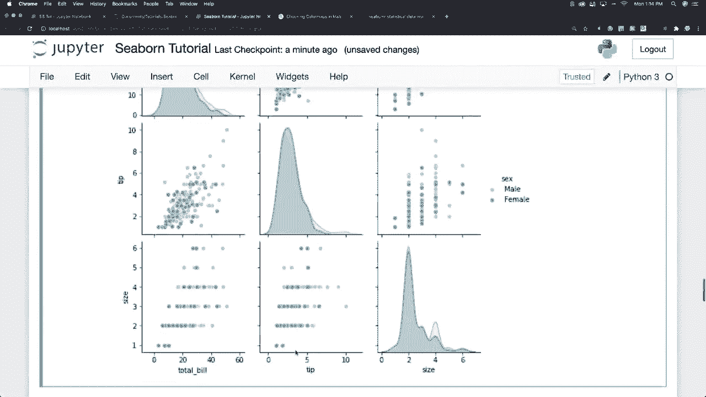
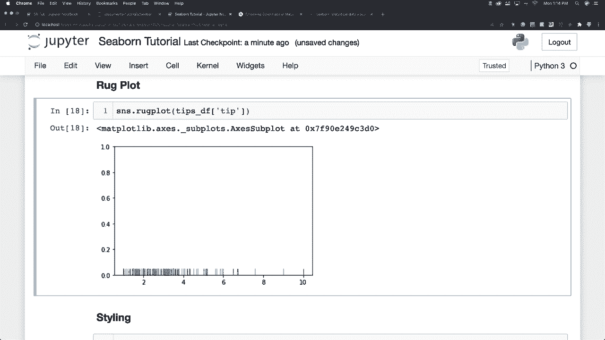
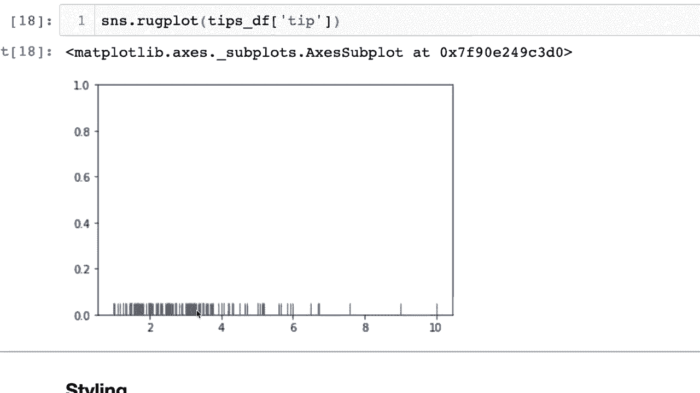
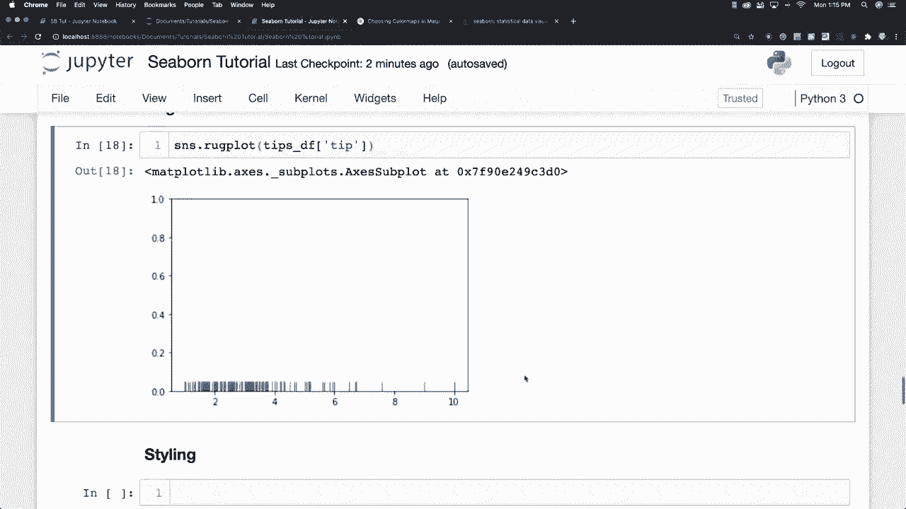

# 更简单的绘图工具包 Seaborn，P9：L9- Rug图 📊

在本节课中，我们将要学习Seaborn库中的一种特殊图表——Rug图。Rug图是一种简洁的可视化工具，用于展示单变量数据的分布情况，它通过在坐标轴底部绘制短竖线（“地毯毛”）来直观地表示每个数据点的位置。

## 概述

Rug图的核心思想是将数据框中的单列数据点，以细小的垂直线段（“棍棒”）形式绘制在坐标轴的底部。数据点越密集的区域，这些线段也会显得越密集，从而直观地反映出数据的分布密度，其效果类似于直方图。

## 创建Rug图

上一节我们介绍了Seaborn的基础绘图功能，本节中我们来看看如何创建Rug图。我们将使用经典的“小费”数据集，并重点关注其中的“小费金额”这一列。

以下是创建基础Rug图的步骤：

1.  **导入必要的库**：首先，我们需要导入Seaborn和Matplotlib库，并加载示例数据集。
    ```python
    import seaborn as sns
    import matplotlib.pyplot as plt

    # 加载小费数据集
    tips = sns.load_dataset('tips')
    ```

2.  **绘制Rug图**：使用`sns.rugplot()`函数，并指定数据列。
    ```python
    # 绘制小费金额的Rug图
    sns.rugplot(data=tips, x='tip')
    plt.show()
    ```
    执行这段代码后，你会在X轴底部看到一系列代表每个小费数据点的短竖线。

3.  **解读图形**：观察生成的图形，你会发现小费金额常见的区域（例如2-4美元附近），竖线非常密集；而在金额较高或较低的区域，竖线则较为稀疏。这与直方图中柱子高度的含义是类似的。




## Rug图的样式与结合使用



虽然Rug图本身不常单独使用，但它是一个极好的辅助图层。我们可以通过调整参数来改变其样式，并轻松地将其与其他图表（如KDE图或直方图）叠加，以提供更丰富的信息。

以下是调整Rug图样式并将其与其他图表结合的示例：



*   **调整颜色和高度**：通过`height`参数控制线段的高度，通过`color`参数改变颜色。
    ```python
    sns.rugplot(data=tips, x='tip', height=0.05, color='red')
    ```
    

*   **与KDE图结合**：Rug图与核密度估计（KDE）图是天作之合。Rug图展示了原始数据点，而KDE图则平滑地展示了其分布形状。
    ```python
    sns.kdeplot(data=tips, x='tip')
    sns.rugplot(data=tips, x='tip', color='black')
    plt.show()
    ```
    



*   **在双变量图中使用**：Rug图也可以应用于双变量分析，在X轴和Y轴边缘同时显示数据的分布。
    ```python
    sns.scatterplot(data=tips, x='total_bill', y='tip')
    sns.rugplot(data=tips, x='total_bill', y='tip', height=0.02, color='grey')
    plt.show()
    ```
    

## 总结

本节课中我们一起学习了Seaborn中的Rug图。我们了解到，Rug图是一种通过在坐标轴底部绘制短线来显示数据点分布的简单方法。数据密集处线段也更密集。虽然它通常不单独使用，但通过调整`height`、`color`等参数改变样式后，可以作为KDE图、散点图等图表的优秀辅助图层，帮助我们更清晰地理解数据的分布情况。