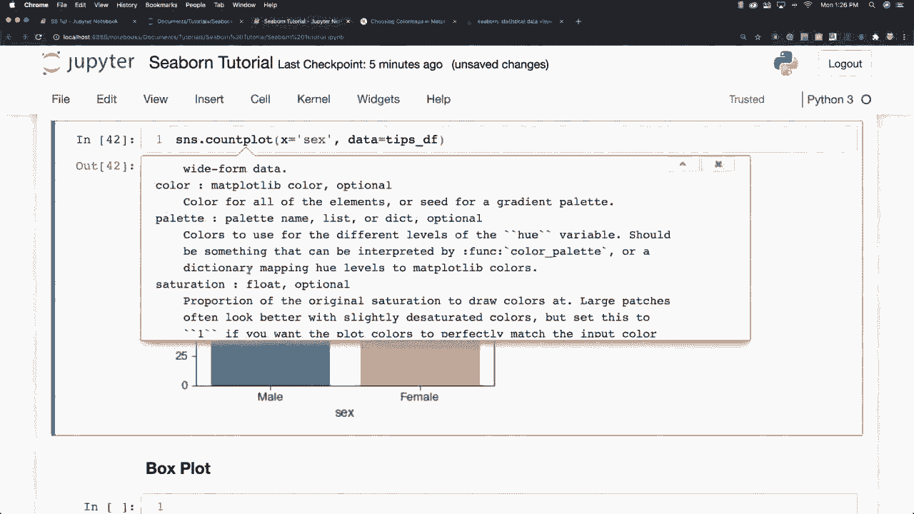
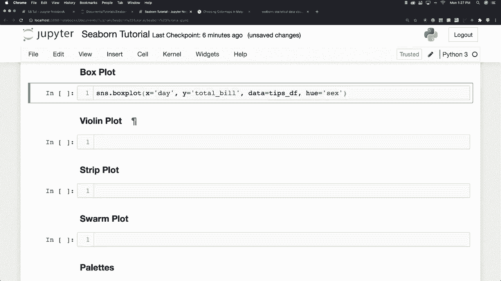
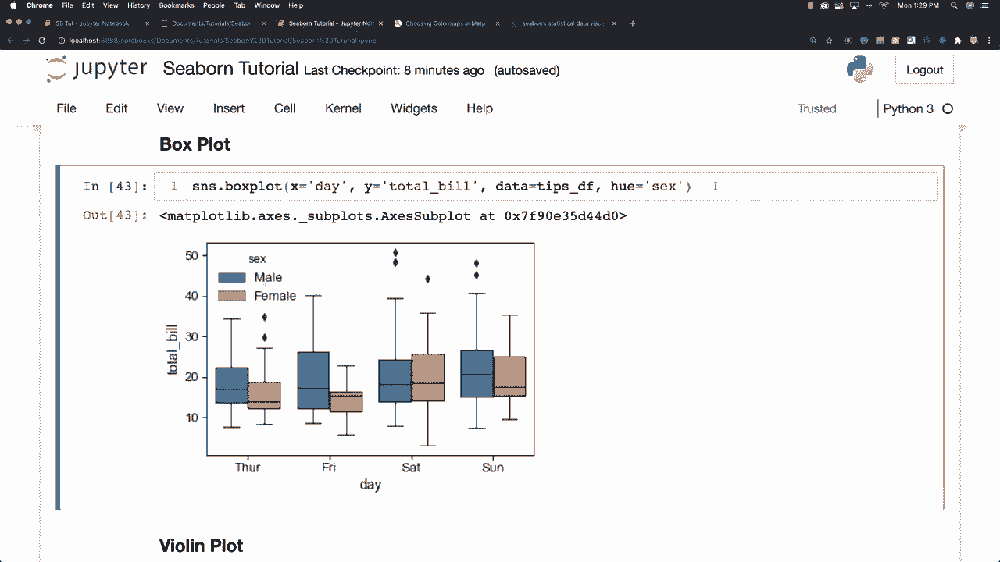
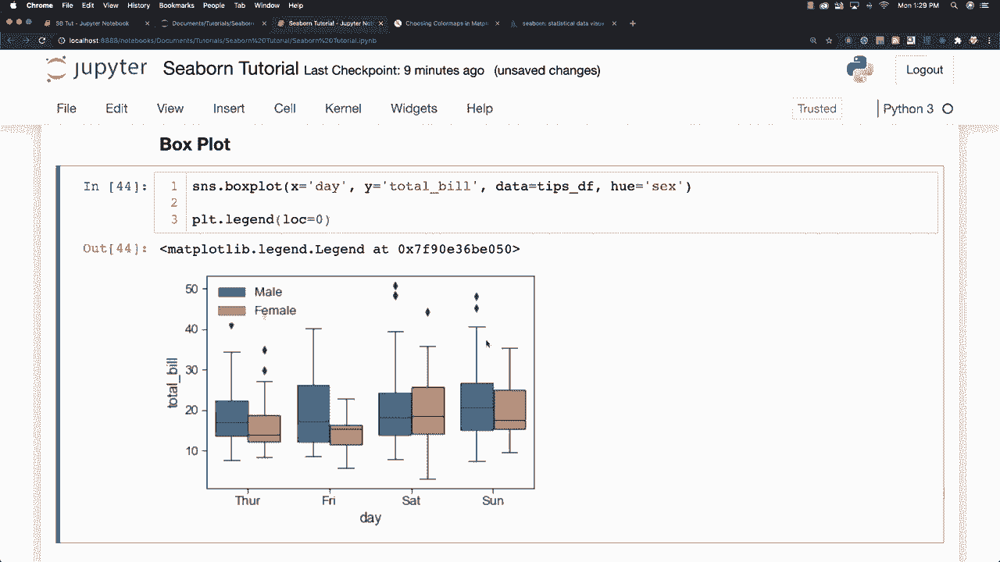

# Seaborn 绘图工具包，P13：L13 - 箱形图 📊

在本节课中，我们将学习如何使用 Seaborn 库绘制箱形图。箱形图是一种强大的可视化工具，用于比较不同变量或类别之间的数据分布，特别是展示数据的四分位数和识别异常值。

上一节我们介绍了如何用 Seaborn 绘制基础的分布图，本节中我们来看看如何用箱形图进行更深入的数据比较。

## 箱形图基础

箱形图的核心是展示数据的四分位数。一个标准的箱形图包含以下几个关键部分：
*   **箱子本身**：代表数据的**四分位距**，即从第一四分位数到第三四分位数的范围。
*   **箱内的线**：代表数据的**中位数**。
*   **胡须**：从箱子延伸出去的线条，通常代表**1.5倍四分位距**范围内的数据边界。
*   **异常值**：落在胡须范围之外的数据点，在图中通常以独立点的形式显示。



其基本统计含义可以用以下公式描述：
*   四分位距 **IQR = Q3 - Q1**
*   胡须上限通常为 **Q3 + 1.5 * IQR**
*   胡须下限通常为 **Q1 - 1.5 * IQR**



## 绘制带分组的箱形图

我们可以使用 `sns.boxplot` 函数来创建箱形图。通过 `x`、`y` 参数指定坐标轴，用 `hue` 参数添加额外的分组维度，从而在一个图中比较多个类别。

以下是一个绘制示例，我们使用经典的 `tips` 数据集，查看一周中不同天数下，男性和女性的总账单分布情况。

```python
import seaborn as sns
import matplotlib.pyplot as plt

# 加载数据
tips = sns.load_dataset('tips')

# 绘制箱形图
sns.boxplot(x='day', y='total_bill', hue='sex', data=tips)
plt.show()
```


在上图中，我们为每一天都绘制了男性和女性两个箱形图。通过观察可以发现，例如在星期五，男性的消费中位数似乎高于星期六，而女性的消费在不同天数间有不同特点。`hue='sex'` 参数为我们提供了性别这一额外的比较维度。

## 调整图例位置

有时，自动生成的图例可能会遮挡图表中的数据。我们可以调整图例的位置，使其不影响数据观察。

以下是调整图例位置的方法：

```python
# 绘制箱形图并获取返回的Axes对象
ax = sns.boxplot(x='day', y='total_bill', hue='sex', data=tips)

# 将图例移动到图表外部（右上角）
ax.legend(loc='upper right', bbox_to_anchor=(1.15, 1))
plt.show()
```




`bbox_to_anchor` 参数与 `loc` 参数配合，可以更精确地控制图例的位置。稍后，在讲解分类绘图选项时，我们会更详细地介绍图例的控制方法。


## 总结

本节课中我们一起学习了 Seaborn 中箱形图的绘制方法。我们了解到箱形图如何通过四分位数、中位数和胡须来概括数据分布，并识别异常值。我们还学会了使用 `hue` 参数为箱形图添加分组，以便进行多类别比较，以及如何调整图例位置来优化图表布局。箱形图是进行数据分布比较和异常值检测的得力工具。