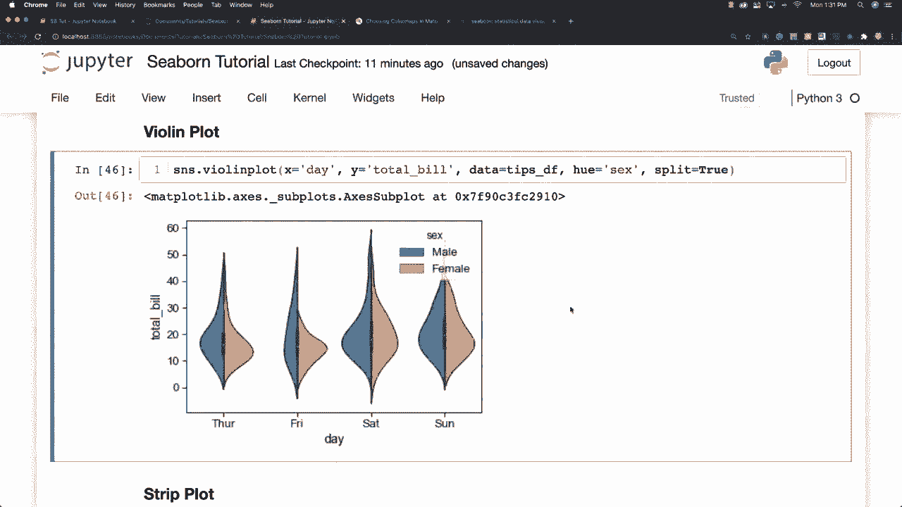
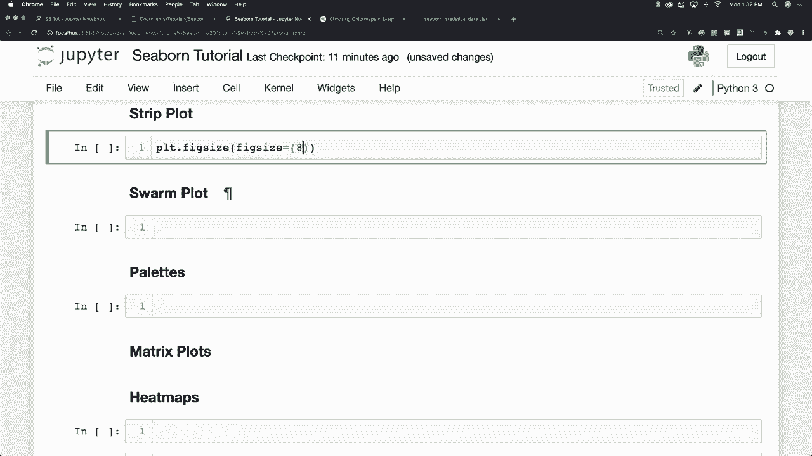
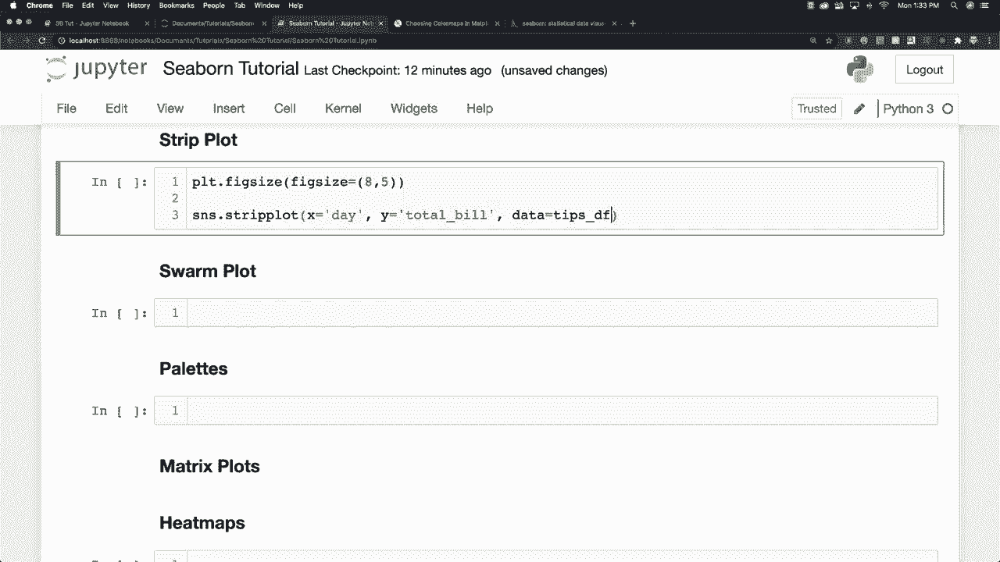
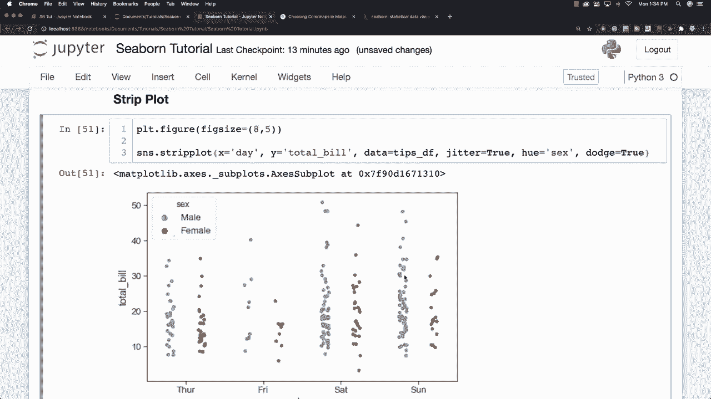

# Seaborn 绘图教程，P15：L15- 带状图 📊

在本节课中，我们将要学习如何使用 Seaborn 库绘制**带状图**。这是一种用于展示分类变量与连续变量之间关系的散点图变体，特别适合观察数据点的分布情况，常作为箱线图或小提琴图的补充。

上一节我们介绍了其他绘图类型，本节中我们来看看如何创建和定制带状图。

## 调整图形尺寸

在绘图前，我们可以调整图形的大小以获得更好的展示效果。这里我们使用 Matplotlib 的 `plt.figure` 函数来设置图形尺寸。

```python
import matplotlib.pyplot as plt
import seaborn as sns

plt.figure(figsize=(8, 5))
```

参数 `figsize=(8, 5)` 表示将图形宽度设置为 8 英寸，高度设置为 5 英寸。

## 创建基础带状图



要创建一个基础的带状图，只需调用 `sns.stripplot()` 函数。带状图会绘制一个散点图，其中**一个变量是分类的**，用于展示所有不同的原始数据点。这有助于观察数据的实际分布，而不是像箱线图那样只展示汇总统计。

以下是创建基础带状图的步骤：



1.  设定分类变量为 `x` 轴。
2.  设定连续变量为 `y` 轴。
3.  指定使用的数据集。

```python
sns.stripplot(x='day', y='total_bill', data=tips)
plt.show()
```




## 使用抖动避免重叠

当数据点过多时，它们可能会在图表上重叠，难以分辨。为了解决这个问题，我们可以启用 `jitter` 参数。

以下是 `jitter` 参数的作用：

*   **`jitter=False`**：数据点严格按分类位置排列，容易重叠。
*   **`jitter=True`**：为数据点添加少量随机抖动，使其在水平方向上分散开，从而清晰展示分布密度。

```python
sns.stripplot(x='day', y='total_bill', data=tips, jitter=True)
plt.show()
```


## 按颜色分组数据

我们可以在一个图中展示更多维度信息。例如，使用 `hue` 参数可以根据另一个分类变量（如性别）为数据点着色。

```python
sns.stripplot(x='day', y='total_bill', hue='sex', data=tips, jitter=True)
plt.show()
```


## 使用 Dodge 分离分组

当使用 `hue` 参数分组后，不同组的数据点可能会混合在一起。使用 `dodge=True` 参数可以将不同组的数据点完全分离开，在各自的分类位置并列显示。



```python
sns.stripplot(x='day', y='total_bill', hue='sex', data=tips, jitter=True, dodge=True)
plt.show()
```


本节课中我们一起学习了如何使用 Seaborn 绘制带状图。我们掌握了调整图形大小、创建基础图形、使用 `jitter` 避免点重叠、用 `hue` 参数按颜色分组数据，以及用 `dodge` 参数分离不同组数据点的方法。带状图是观察分类数据详细分布的有效工具。