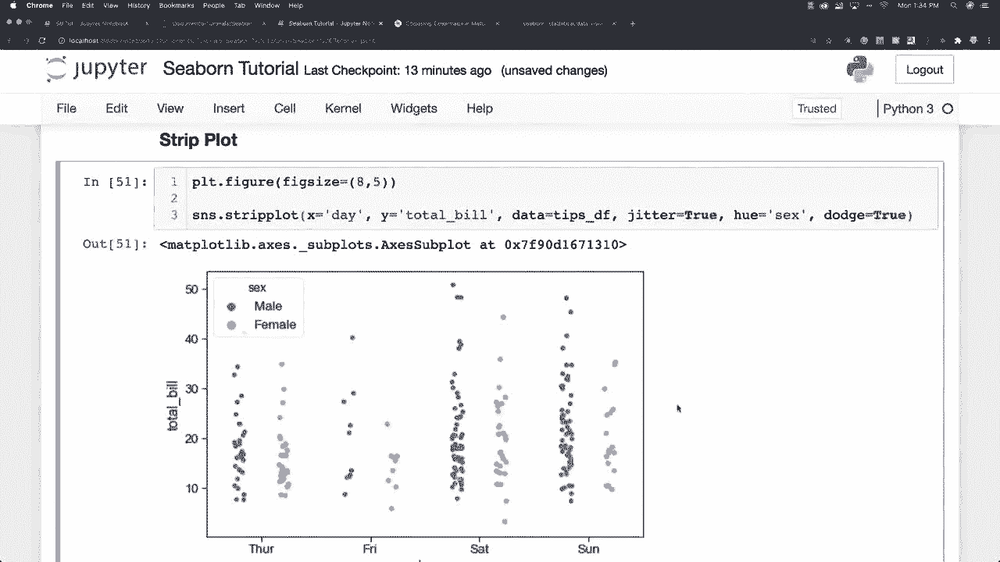
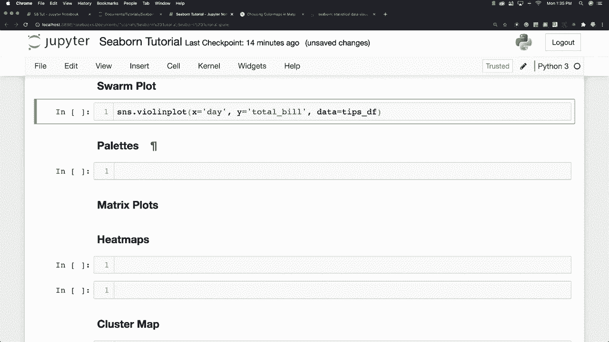
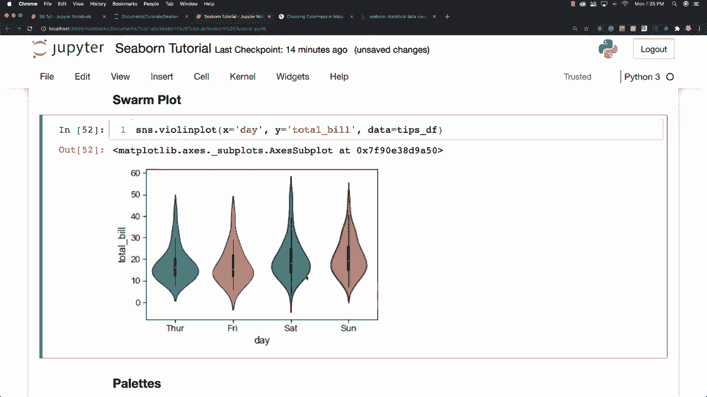
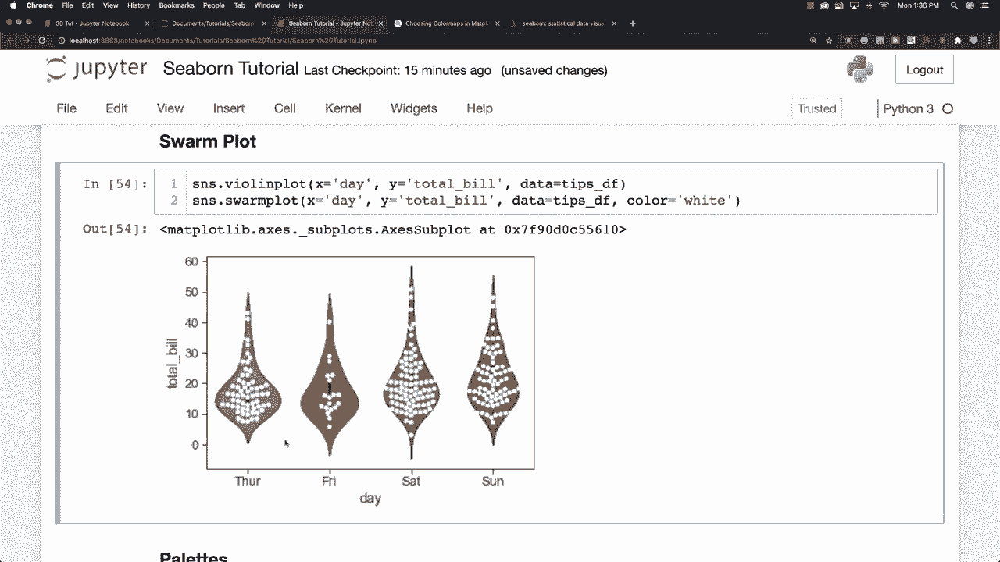
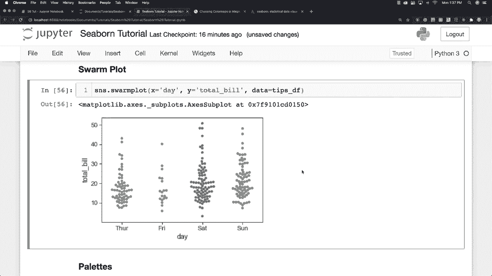

# Seaborn 绘图工具包，P16：L16 - 群图 🎨

在本节课中，我们将学习如何使用 Seaborn 库创建群图。群图是一种结合了小提琴图和条形图特点的可视化方式，能够展示数据的分布以及每个数据点的具体位置。

## 概述

群图允许我们在一个图形中同时看到数据的整体分布和个体数据点。通过将数据点以“群集”的方式排列，可以避免点与点之间的重叠，从而更清晰地展示数据。

## 创建基础群图

上一节我们介绍了 Seaborn 的基本绘图功能，本节中我们来看看如何创建群图。

要创建一个群图，我们可以使用 `sns.swarmplot` 函数。这个函数需要指定 x 轴、y 轴以及数据来源。

以下是创建基础群图的代码示例：

```python
import seaborn as sns
import matplotlib.pyplot as plt

# 加载示例数据集
tips = sns.load_dataset('tips')

# 创建群图
sns.swarmplot(x='day', y='total_bill', data=tips)
plt.show()
```

运行这段代码，你会看到一个群图，其中 x 轴代表星期几，y 轴代表账单总额。数据点会根据其值自动调整位置，避免重叠。

## 结合小提琴图

群图本身已经很有用，但有时我们希望同时看到数据的分布密度。这时，可以将群图与小提琴图结合。



以下是结合小提琴图与群图的步骤：

1.  首先，创建一个小提琴图作为背景，展示数据的整体分布。
2.  然后，在同一个坐标轴上叠加一个群图，展示每个数据点的具体位置。

以下是实现代码：



```python
# 创建小提琴图
sns.violinplot(x='day', y='total_bill', data=tips, color='lightgray')

# 叠加群图
sns.swarmplot(x='day', y='total_bill', data=tips, color='black')

plt.show()
```



通过这种方式，浅灰色的小提琴图形展示了每天账单总额的分布范围，而黑色的点则代表了每一个具体的账单数据。

## 自定义颜色与样式



在默认设置下，群图的所有数据点可能使用同一种颜色。为了提高可读性，我们可以自定义颜色。

例如，将数据点设置为白色，可以使其在小提琴图的背景下更突出：

```python
sns.violinplot(x='day', y='total_bill', data=tips, color='lightgray')
sns.swarmplot(x='day', y='total_bill', data=tips, color='white')
plt.show()
```

当然，你也可以单独使用群图，并为其选择任何你喜欢的颜色：

```python
sns.swarmplot(x='day', y='total_bill', data=tips, palette='Set2')
plt.show()
```

这里，`palette='Set2'` 参数为不同类别的数据点应用了不同的颜色。

## 总结



本节课中我们一起学习了 Seaborn 中群图的创建与应用。我们掌握了：

*   使用 `sns.swarmplot()` 函数创建基础群图。
*   将群图与小提琴图结合，以同时展示数据分布和个体数据点。
*   通过 `color` 和 `palette` 参数自定义图形的颜色，提升可视化效果。

群图是探索性数据分析中的一个强大工具，它能帮助你更直观地理解数据的分布和集中趋势。