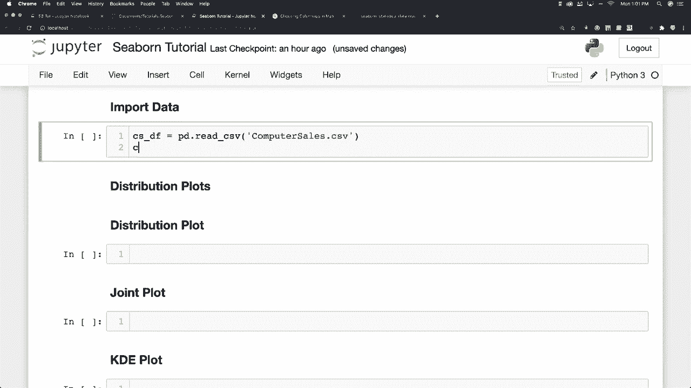
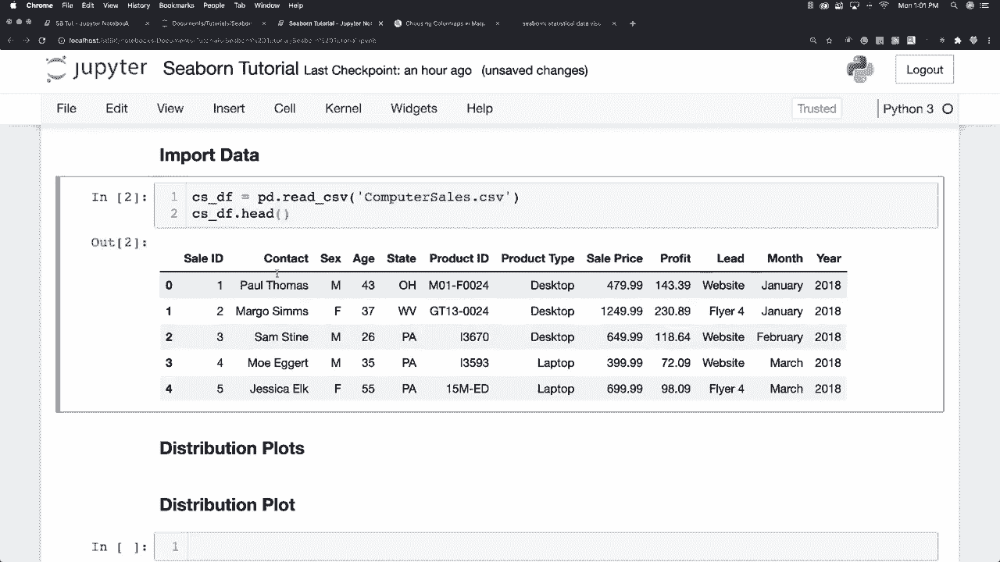
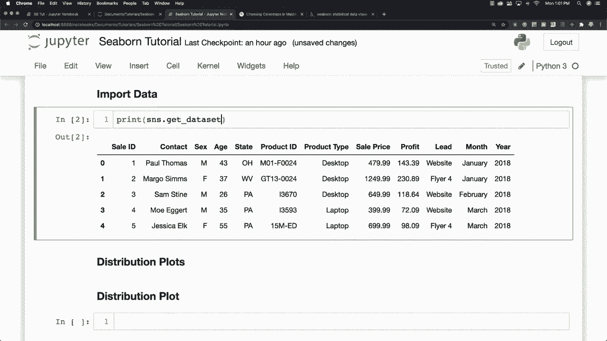
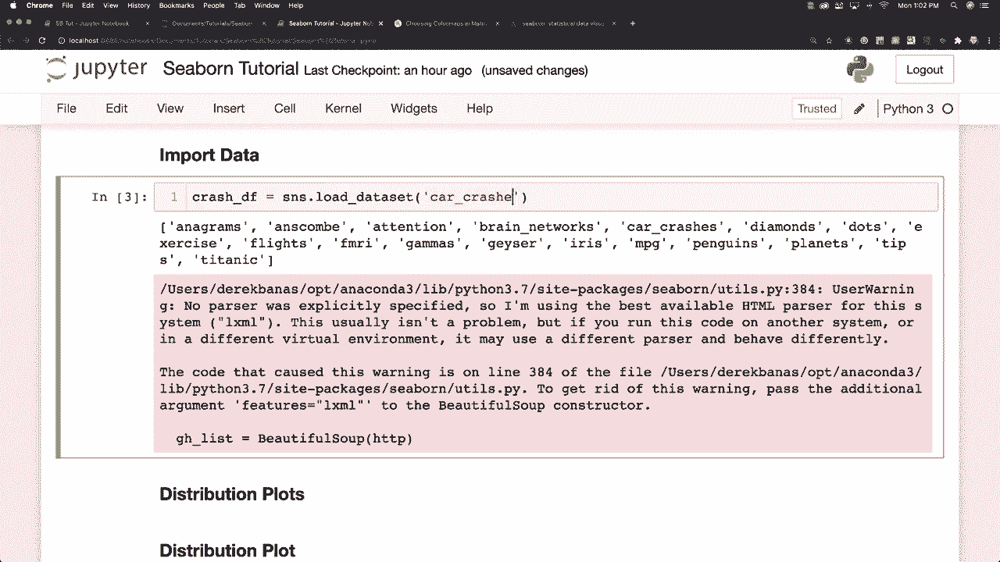
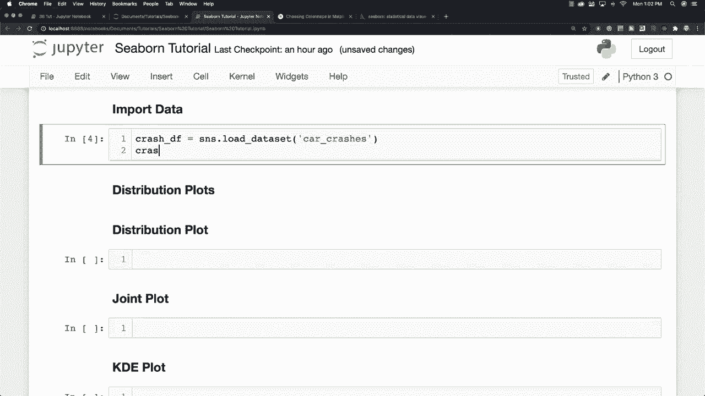
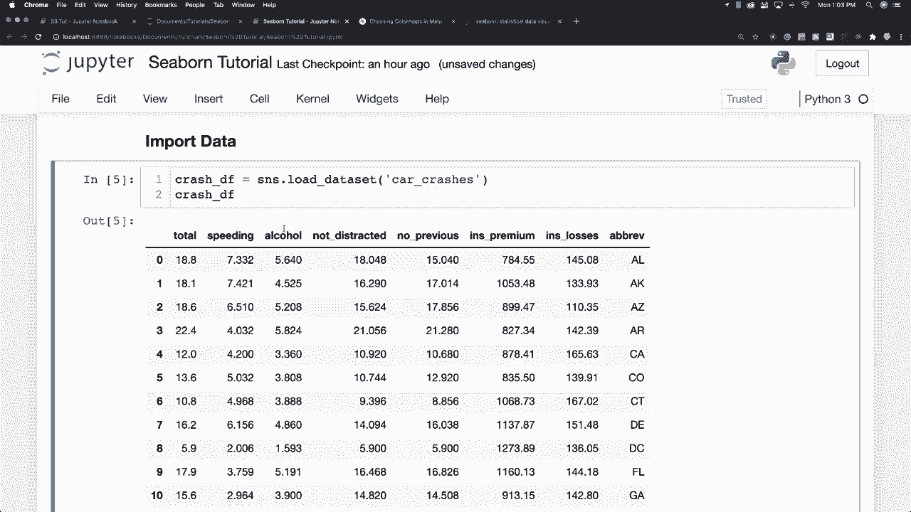

# Seaborn 绘图教程，P3：L3 - 导入数据和数据集 📊

在本节课中，我们将学习如何在 Seaborn 中导入数据。你将能够加载 CSV 文件以及 pandas 支持的其他多种文件类型。

## 概述

为了开始使用 Seaborn 进行数据可视化，我们首先需要将数据加载到 Python 环境中。Seaborn 提供了多种便捷的数据导入方式，包括使用 pandas 加载外部文件，以及直接调用其内置的数据集。

## 使用内置数据集

为了让教程对每个人都简单易行，我将主要使用 Seaborn 内置的数据集。你可以通过以下代码查看所有可用的内置数据集名称：



```python
import seaborn as sns
print(sns.get_dataset_names())
```



执行上述代码后，你会看到一个数据集名称列表。请注意，有时在调用这些数据集时可能会遇到一个错误提示，这通常是因为环境没有正确识别数据类型，忽略它即可。Seaborn 内置了多种数据集，我将在本系列教程中至少使用其中三个。



## 加载数据集示例

你可能会问，如何具体加载这些数据集呢？下面，我将以交通事故数据集为例进行演示。

要加载名为 “car_crashes” 的数据集，只需使用 `load_dataset` 函数：

```python
car_crashes_df = sns.load_dataset('car_crashes')
print(car_crashes_df.head())
```

加载后，你可以查看数据的前几行。这个数据集包含了美国各州的交通事故分析数据，例如：

*   州名（如 Alabama, Alaska）
*   总事故数
*   与超速相关的事故比例
*   与酒精相关的事故比例
*   与非分心驾驶相关的事故比例
*   与无历史事故记录相关的事故比例
*   保险费用
*   保险损失

这些就是我们将要用于分析的数据列。



## 获取配套资源



在视频描述中，你将找到一个 Jupyter Notebook 文件。这个文件包含了我所做的所有操作代码，并且附有大量的注释来帮助你理解。它就像一个巨大的免费备忘单，可以辅助你的学习。



## 总结

本节课我们一起学习了在 Seaborn 中导入数据的两种主要方法：使用 pandas 加载外部数据文件，以及调用 Seaborn 便捷的内置数据集。掌握数据导入是进行数据可视化的第一步。下一节，我们将开始学习如何利用这些数据创建基本的图表。