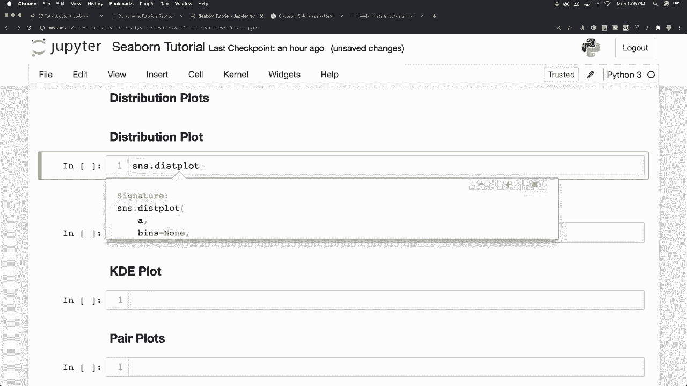
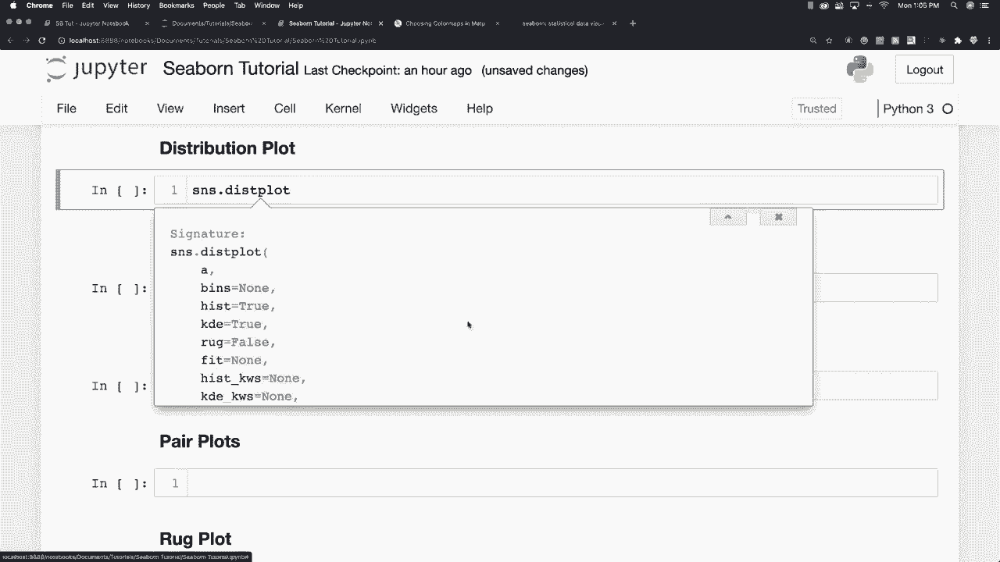
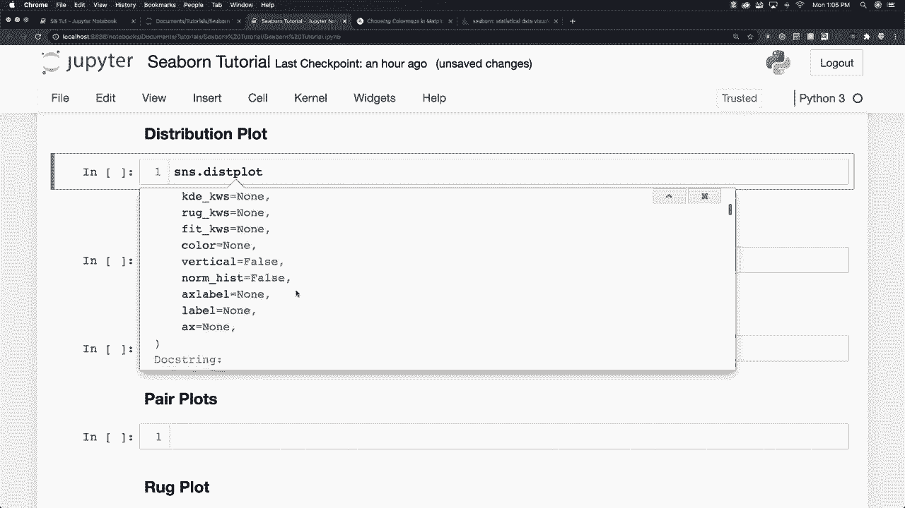
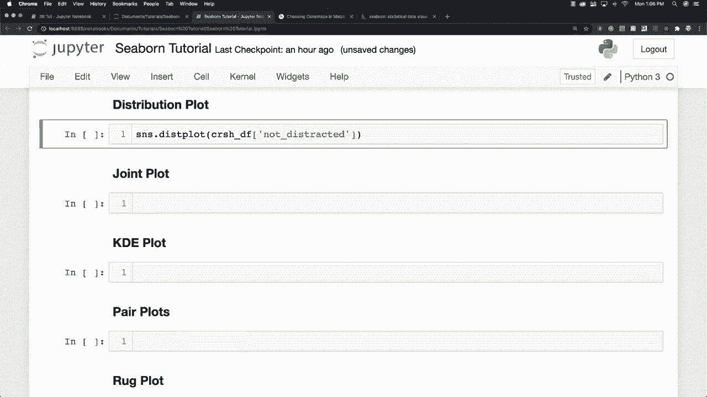
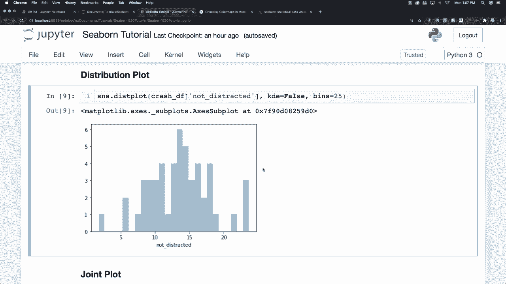
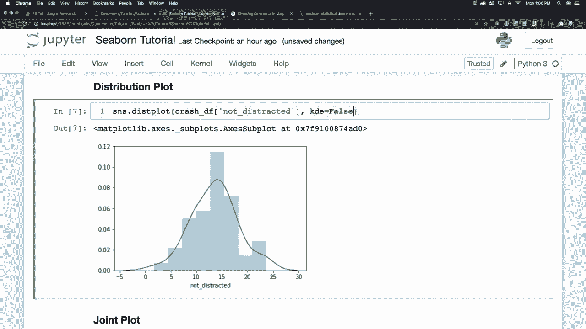
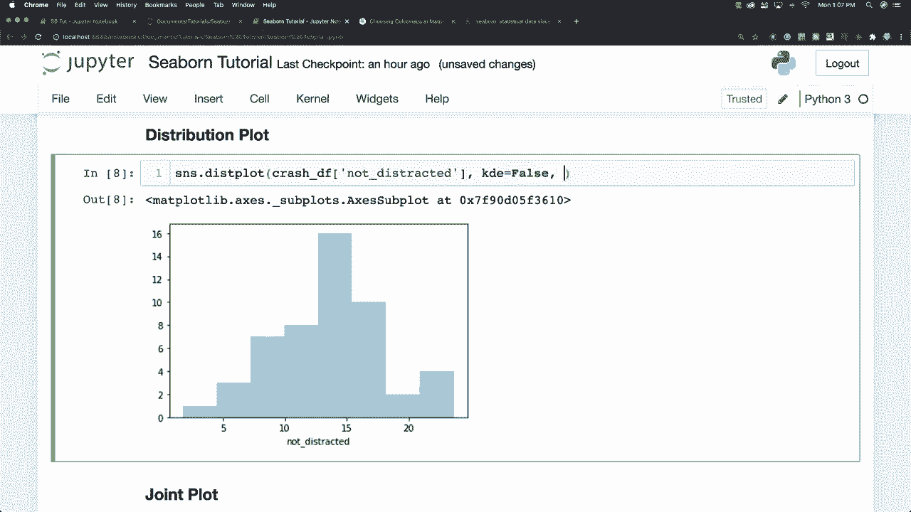

# 更简单的绘图工具包 Seaborn，P4：L4- 分布图 📊

在本节课中，我们将要学习如何使用 Seaborn 库绘制分布图。分布图是一种用于可视化单个变量数据分布的有效工具，它可以帮助我们快速理解数据的集中趋势、离散程度和形状。

## 什么是分布图？

上一节我们介绍了 Seaborn 的基础，本节中我们来看看分布图。分布图提供了一种查看单变量分布的方法。单变量分布是指仅为一个变量提供的数据分布。

在 Seaborn 中，绘制分布图的基本方法是使用 `sns.displot()` 函数。你可以通过按 `Shift + Tab` 键来查看该函数的所有可用参数和属性。

## 绘制基本分布图

假设我们对一个名为“没有分心的事故”的数据集感兴趣。我们可以使用以下代码绘制其分布图。

```python
import seaborn as sns
import matplotlib.pyplot as plt

# 假设 data 是你的数据集，'column_name' 是你要绘制的列名
sns.displot(data=data, x='column_name')
plt.show()
```



执行上述代码后，你会看到一个包含直方图和核密度估计（KDE）曲线的图形。




## 理解图形组件



生成的图形包含两个主要部分：
*   **直方图**：由一系列柱状条组成，每个柱状条代表一个数据区间（或“桶”）内数据点的数量。
*   **核密度估计（KDE）曲线**：是一条平滑的曲线，它提供了数据分布概率密度的估计。



如果你不希望显示 KDE 曲线，可以通过设置参数 `kde=False` 来关闭它。

```python
sns.displot(data=data, x='column_name', kde=False)
plt.show()
```


## 调整直方图区间

我们还可以通过 `bins` 参数来定义直方图的区间数量。区间就像一个“桶”，用于将数据分隔到不同的范围中。

例如，设置 `bins=25` 会将数据范围划分为 25 个等宽的区间，从而改变直方图中柱状条的数量和宽度。

```python
sns.displot(data=data, x='column_name', bins=25)
plt.show()
```





`bins` 参数决定了你在图形中看到的柱状条数量，这直接影响你对数据分布细节的观察。

以下是调整 `bins` 参数对图形的影响：
*   **bins 值较小**：柱状条更宽，分布轮廓更平滑，但可能掩盖细节。
*   **bins 值较大**：柱状条更窄，能显示更多数据细节，但图形可能显得杂乱。



## 总结


本节课中我们一起学习了 Seaborn 中分布图的基本用法。我们了解了：
1.  分布图用于可视化单变量数据的分布。
2.  使用 `sns.displot()` 函数可以绘制分布图。
3.  图形通常包含直方图和核密度估计（KDE）曲线，可通过 `kde` 参数控制 KDE 的显示。
4.  通过 `bins` 参数可以调整直方图的区间数量，从而改变图形的细节程度。

掌握分布图是进行数据探索性分析的重要一步，它能帮助你快速把握数据的基本特征。