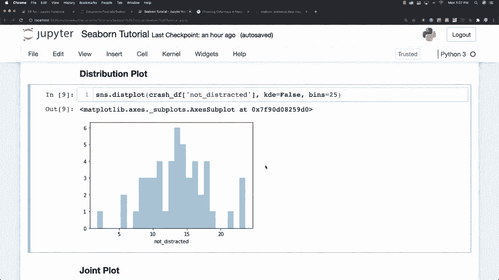
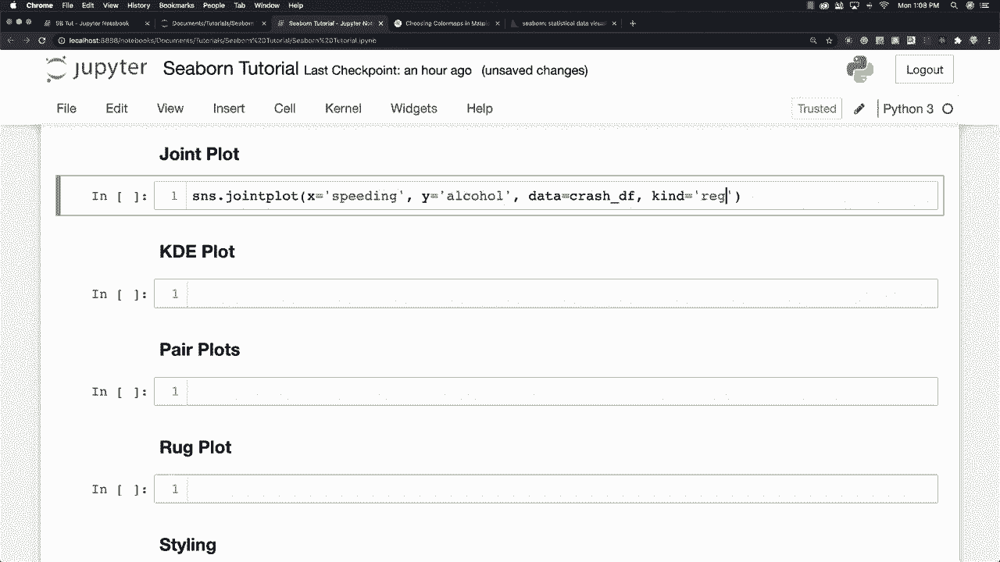
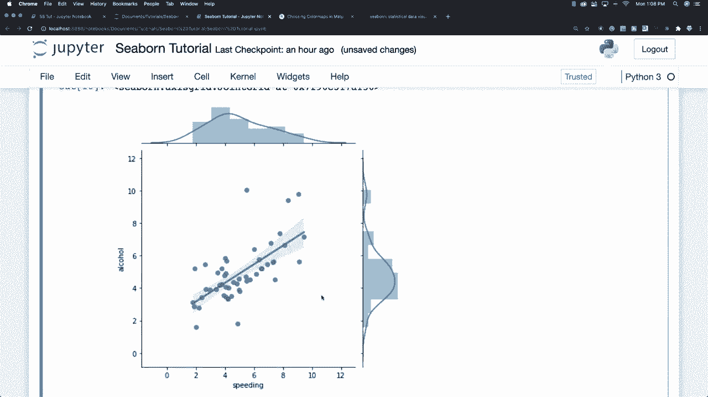
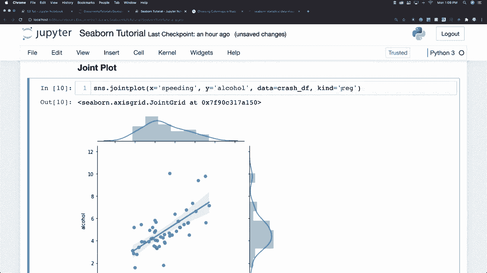
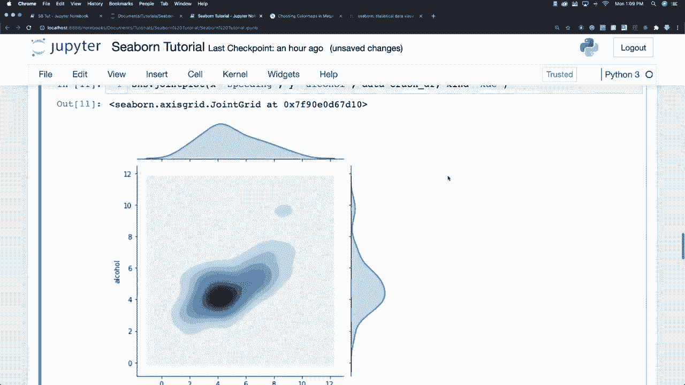
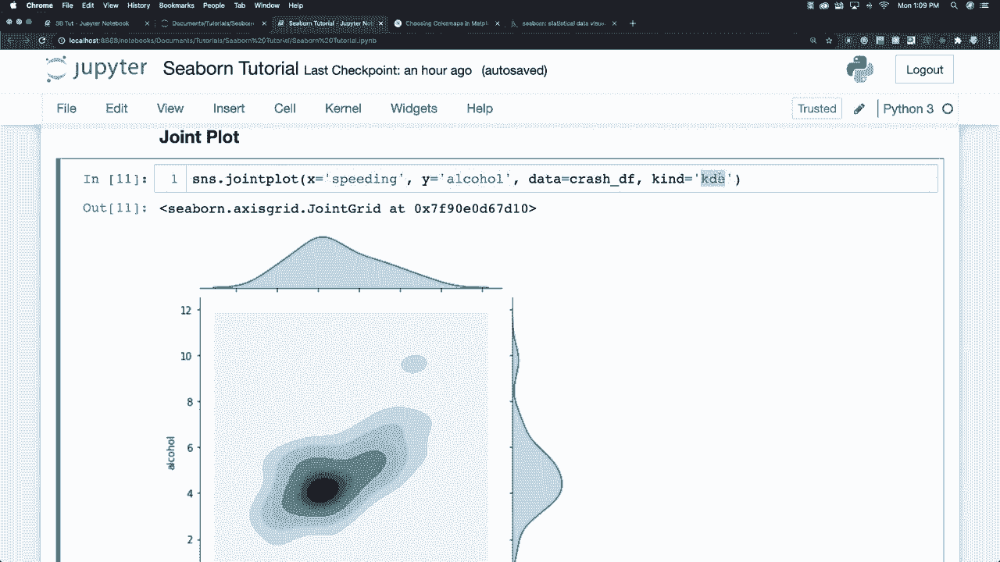

# 更简单的绘图工具包 Seaborn，P5：L5 - 联合图 📊

在本节课中，我们将要学习 Seaborn 中的联合图。联合图是一种强大的可视化工具，它允许我们在同一张图中同时观察两个变量的联合分布以及它们各自的单变量分布。

上一节我们介绍了 Seaborn 的基础知识，本节中我们来看看如何利用联合图进行双变量分析。

## 概述

联合图主要用于比较两个变量的分布。其默认输出是一个散点图，用于展示两个变量之间的关系，同时在图形的边缘会附加每个变量的直方图，用以显示各自的分布情况。

## 创建基础联合图

我们可以使用 `sns.jointplot()` 函数来创建联合图。假设我们有一个数据集，想在 X 轴上分析“人员是否超速”的数据，在 Y 轴上分析“人员是否酒后驾驶”的数据。



以下是创建基础联合图的代码示例：

```python
import seaborn as sns
import matplotlib.pyplot as plt

# 假设 `df` 是我们的数据框，包含 'speeding' 和 'alcohol' 列
sns.jointplot(data=df, x='speeding', y='alcohol')
plt.show()
```

执行上述代码会生成一个包含散点图和边缘直方图的联合图。

## 定制联合图的类型

`jointplot` 函数非常灵活，允许我们通过 `kind` 参数来改变中心图的类型，以适应不同的分析需求。

### 1. 回归图

如果我们希望了解两个变量之间的线性趋势，可以绘制一条回归线。

以下是设置类型为回归的代码：

```python
sns.jointplot(data=df, x='speeding', y='alcohol', kind='reg')
plt.show()
```

设置 `kind='reg'` 后，图形会在散点图上叠加一条回归线，并显示其置信区间。

### 2. 核密度估计图



核密度估计是一种用于估计数据概率密度函数的非参数方法。在联合图中，我们可以用等高线图来展示双变量的核密度估计。

以下是创建 KDE 图的代码：



```python
sns.jointplot(data=df, x='speeding', y='alcohol', kind='kde')
plt.show()
```

设置 `kind='kde'` 会生成一个用等高线表示双变量密度估计的图，边缘则是单变量的密度曲线。

### 3. 六边形图



当数据点非常密集时，散点图可能难以解读。六边形图将平面划分为多个六边形，用颜色深浅表示每个六边形区域内数据点的数量，适用于展示大量数据的分布。

以下是创建六边形图的代码：



```python
sns.jointplot(data=df, x='speeding', y='alcohol', kind='hex')
plt.show()
```

设置 `kind='hex'` 会生成一个六边形分箱图，能有效展示数据的聚集区域。

## 总结



本节课中我们一起学习了 Seaborn 库中的联合图功能。我们了解到：

*   联合图是同时展示双变量关系与单变量分布的有效工具。
*   通过 `sns.jointplot()` 函数可以轻松创建联合图。
*   使用 `kind` 参数可以定制图的类型，包括默认的散点图、带回归线的散点图、核密度估计图以及六边形图，每种类型适用于不同的数据分析场景。

掌握联合图将帮助您更全面、直观地探索和理解数据集中两个变量之间的关系及其各自的分布特征。