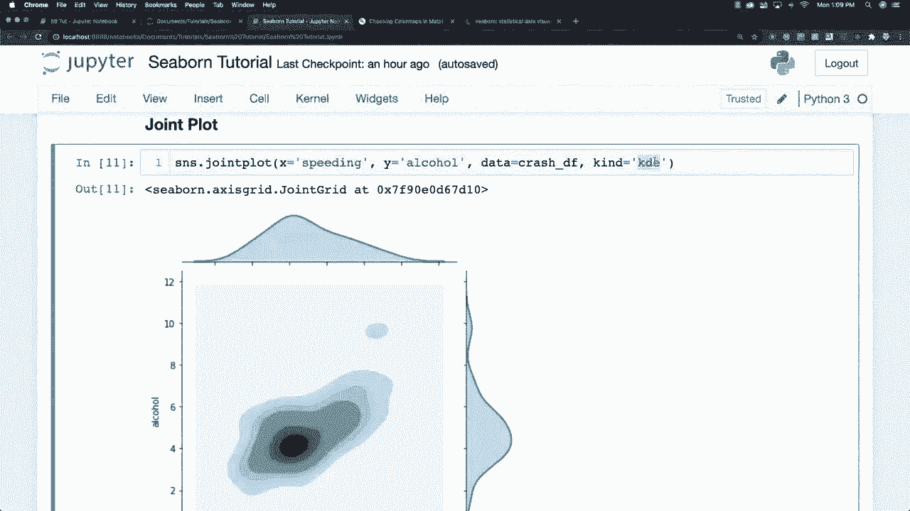
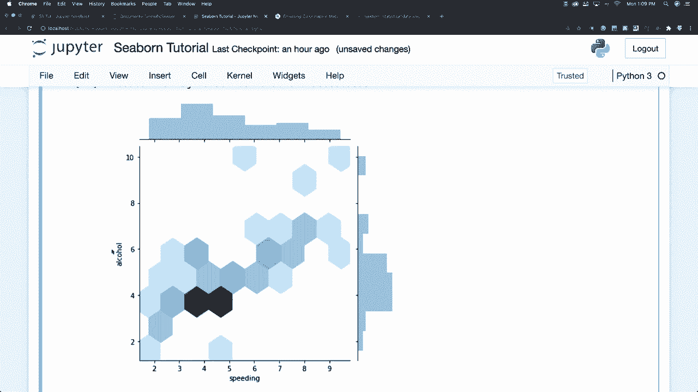
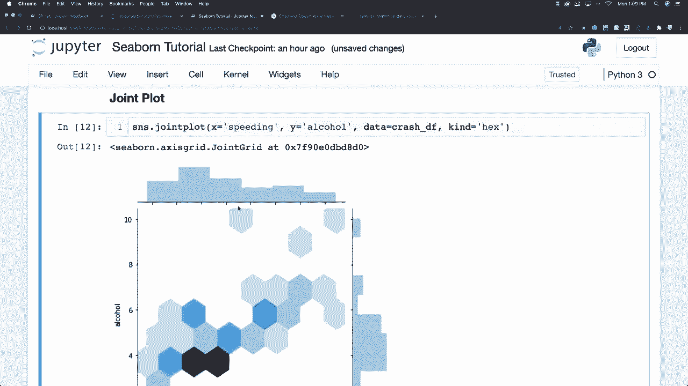

# 更简单的绘图工具包 Seaborn，P6：L6- 六边形分布图 📊

在本节课中，我们将要学习如何使用Seaborn库中的`jointplot`函数，通过设置`kind='hex'`参数来创建六边形分布图。这种图表非常适合展示两个连续变量之间数据点的分布密度。

---

上一节我们介绍了不同类型的联合分布图。本节中我们来看看如何创建六边形分布图。

六边形分布图是一种特殊的散点图，它将坐标平面划分为多个六边形区域，并根据每个区域内数据点的数量进行颜色深浅的填充。这种方法能有效展示数据在二维空间中的聚集情况，尤其适用于数据点过多、普通散点图会显得重叠和混乱的场景。

以下是创建六边形分布图的核心代码：



```python
import seaborn as sns
# 使用‘hex’作为kind参数
sns.jointplot(x='column1', y='column2', data=your_dataframe, kind='hex')
```

通过上述代码，你可以直观地看到数据是如何在两个维度上分布的。例如，在分析交通事故数据时，你可以用它来观察“饮酒量”和“超速程度”这两个变量之间的关系，并找出大多数事故发生时这两个因素的常见组合范围。







你可以利用这种图表完成许多有趣的分析。

---

本节课中我们一起学习了Seaborn中六边形分布图的创建方法。我们了解到，通过`jointplot(kind='hex')`可以生成一种用六边形色块表示数据点密度的图表，它能清晰揭示两个变量间的分布模式，是进行探索性数据分析的强大工具。