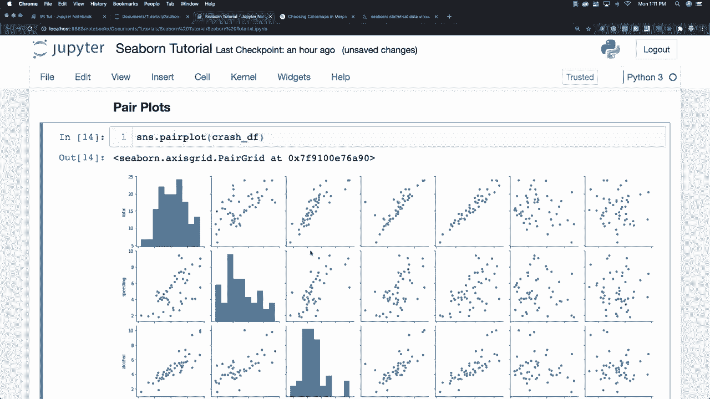
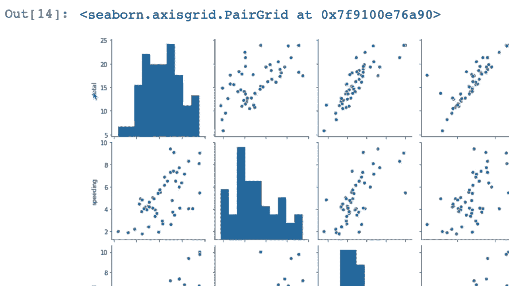
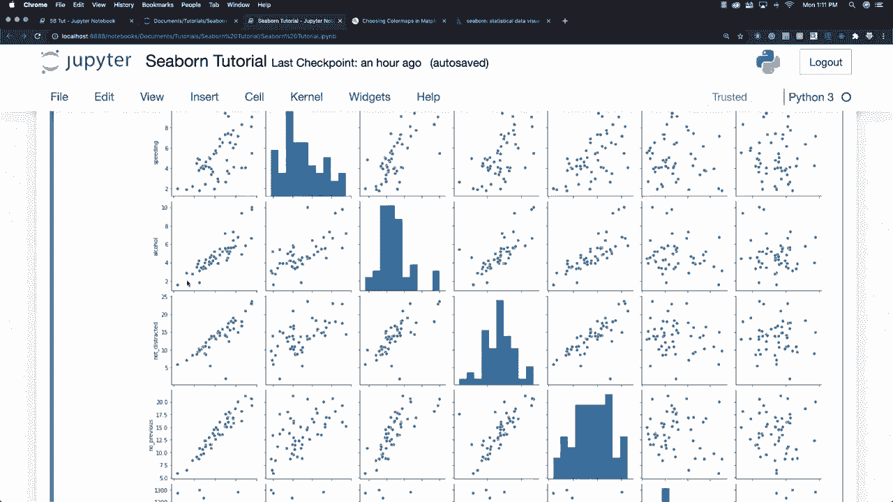
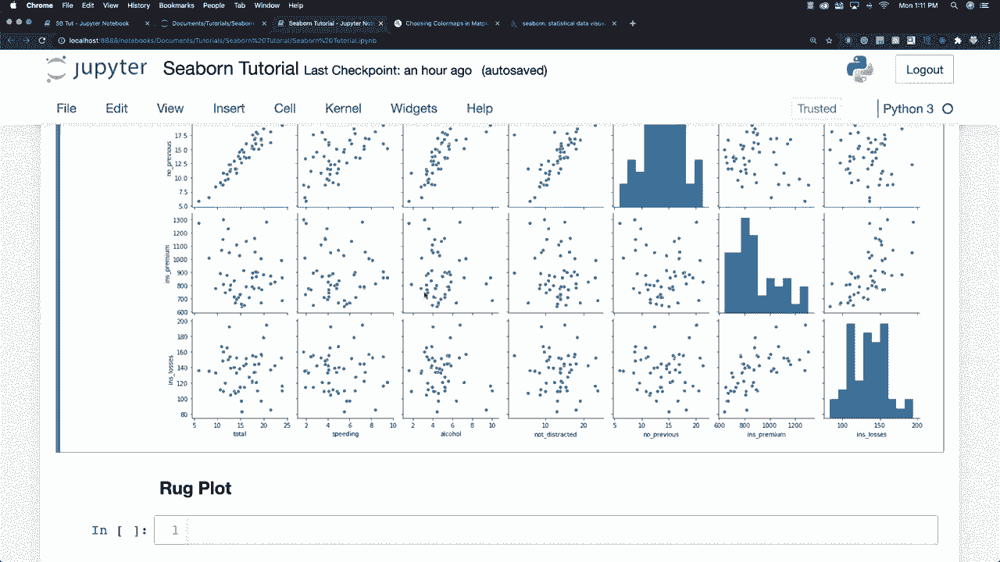
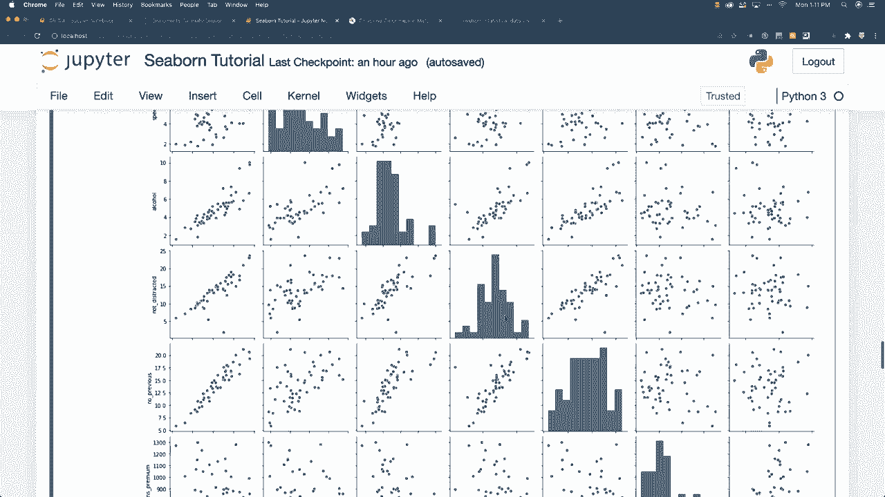
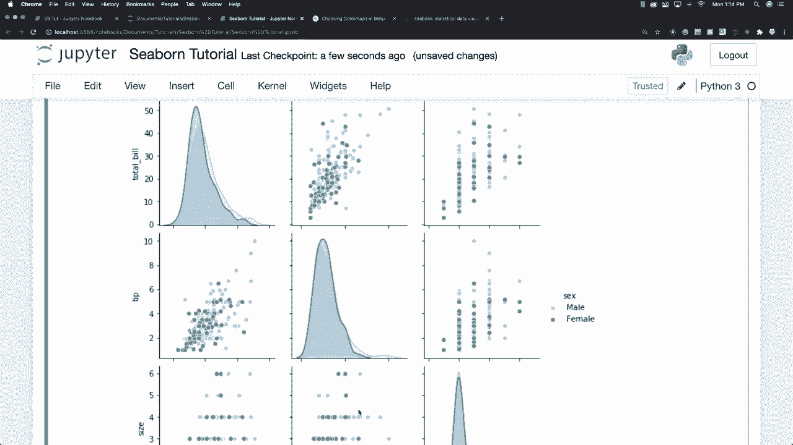

# 更简单的绘图工具包 Seaborn，P8：L8- Pair对图 📊

在本节课中，我们将要学习Seaborn库中的`pairplot`（对图）功能。对图是一种强大的可视化工具，它能一次性展示数据集中所有数值变量之间的关系。我们将通过具体示例，学习如何创建对图、如何根据分类变量为数据着色，以及如何调整图表样式。

## 概述

对图位于分布图的范畴内。它的核心功能是绘制整个数据框中所有数值列之间的成对关系。在默认设置下，对图会在对角线位置显示每个变量的单变量分布（直方图），而在非对角线位置显示两个变量之间的二元关系（散点图）。

## 创建基础对图

上一节我们介绍了对图的基本概念，本节中我们来看看如何用代码创建一个基础的对图。

首先，我们需要导入Seaborn并加载一个数据集。这里我们使用`seaborn.load_dataset`函数来获取“car_crashes”数据集。



```python
import seaborn as sns



# 加载数据集
cash_df = sns.load_dataset('car_crashes')
```



接下来，我们可以使用`sns.pairplot()`函数来创建对图。只需将数据框作为参数传入即可。

```python
# 创建基础对图
sns.pairplot(cash_df)
```



执行这段代码后，会生成一个图表。图表左侧和顶部是变量名，如“total”（总数）、“speeding”（超速）、“alcohol”（酒精）等。对角线上的子图是每个变量的直方图，展示了其分布情况。其他位置的子图则是散点图，展示了任意两个变量之间的关系，帮助我们观察这些不同数据是如何相互影响的。



## 使用分类数据着色

基础对图展示了所有数值关系，但我们经常需要根据某个分类变量（如性别、类别）来区分数据点。`pairplot`函数可以通过`hue`参数实现这一点。

让我们加载另一个数据集“tips”（小费）来进行演示。

```python
# 加载小费数据集
tips_df = sns.load_dataset('tips')
```

这个数据框包含以下列：
*   `total_bill`: 总账单金额
*   `tip`: 小费金额
*   `sex`: 付小费者性别（Male/Female）
*   `smoker`: 是否吸烟（Yes/No）
*   `day`: 星期几
*   `time`: 午餐（Lunch）或晚餐（Dinner）
*   `size`: 聚餐人数

现在，我们创建一个根据“性别”（`sex`）着色的对图。我们只选取`total_bill`（总账单）、`tip`（小费）和`size`（人数）这三个数值列进行分析。

```python
# 创建根据性别着色的对图
sns.pairplot(tips_df, vars=['total_bill', 'tip', 'size'], hue='sex')
```

生成的图表中，数据点会根据“sex”列的不同取值（男/女）显示为不同的颜色，使得我们可以直观地比较不同性别群体在这些变量关系上的差异。

## 调整图表样式

`pairplot`提供了许多参数来调整图表的外观，使其更符合我们的需求。以下是几个常用的样式调整选项：

*   **调色板（`palette`）**：用于设置分类着色的颜色方案。你可以传入Matplotlib调色板名称或Seaborn调色板对象。
    ```python
    # 使用‘blues’调色板
    sns.pairplot(tips_df, vars=['total_bill', 'tip', 'size'], hue='sex', palette='blues')
    ```
    例如，使用`‘blues’`调色板后，图表会呈现蓝色系，其中浅色点可能代表男性，深色点代表女性。

*   **绘图种类（`diag_kind` 和 `plot_kind`）**：你可以更改对角线或非对角线子图的图形类型。
    *   `diag_kind`: 对角线图形类型，默认为`‘hist’`（直方图），可改为`‘kde’`（核密度估计图）。
    *   `plot_kind`: 非对角线图形类型，默认为`‘scatter’`（散点图），可改为`‘reg’`（带回归线的散点图）或`‘kde’`等。
    ```python
    # 对角线使用KDE图，非对角线使用回归图
    sns.pairplot(tips_df, vars=['total_bill', 'tip', 'size'], hue='sex',
                 diag_kind='kde', plot_kind='reg')
    ```

*   **添加地毯图（`rug`）**：在单变量分布图（对角线）上，可以添加`rug`图，它会在坐标轴上用小线段标记出每个数据点的实际位置，更细致地展示数据分布。
    ```python
    # 在对角线直方图上添加rug图
    sns.pairplot(tips_df, vars=['total_bill', 'tip', 'size'], diag_kind='hist', rug=True)
    ```

关于更高级的定制，例如如何精确控制网格中每个子图的类型、如何调整字体大小等，我们将在后续讲解`PairGrid`（对图网格）时详细介绍。`PairGrid`提供了比`pairplot`更低层、更灵活的控制接口。



## 总结

本节课中我们一起学习了Seaborn的`pairplot`（对图）功能。我们首先了解了对图能一次性可视化数据集中所有数值变量对之间的关系。然后，我们实践了如何创建基础对图，以及如何通过`hue`参数根据分类变量为数据点着色，从而进行群体间对比。最后，我们介绍了几种调整对图样式的方法，包括更换调色板、改变对角线与非对角线子图的图形类型，以及添加地毯图（rug）。`pairplot`是一个快速进行数据探索和关系分析的强大工具。