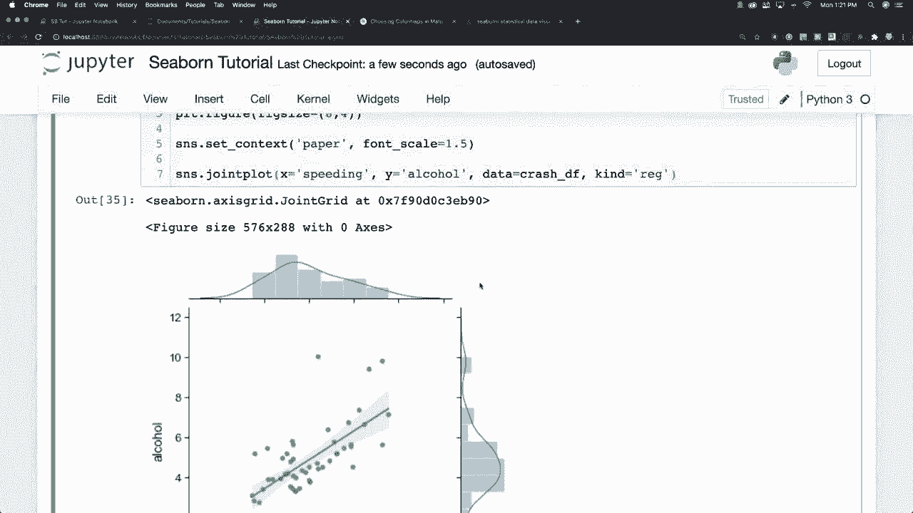
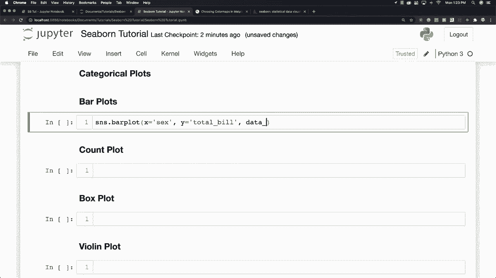
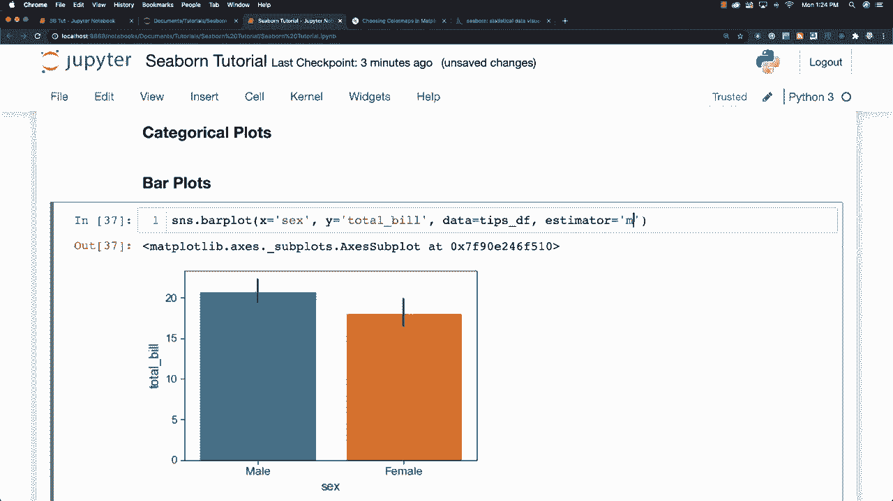
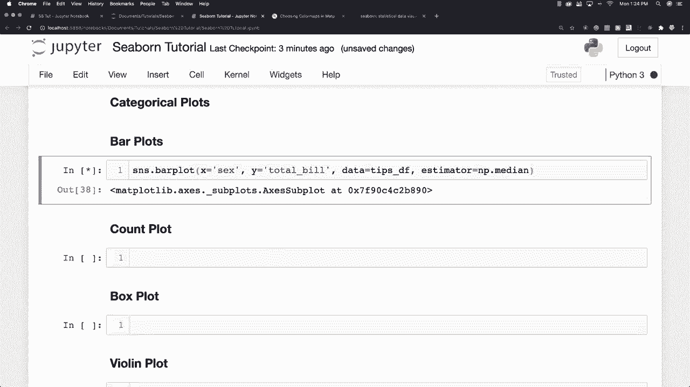
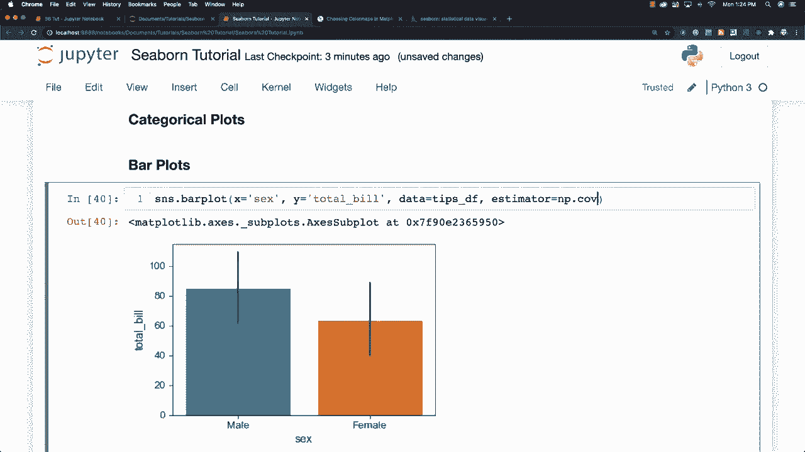
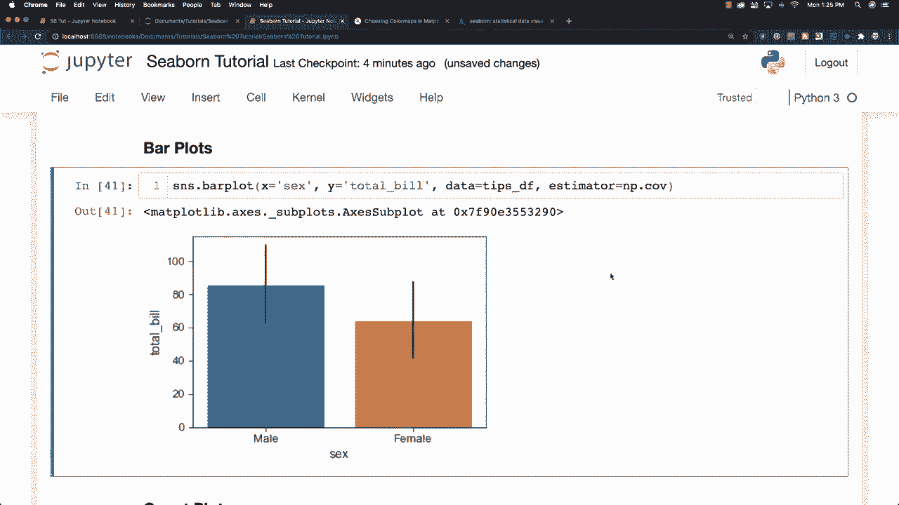

# 更简单的绘图工具包Seaborn，P11：L11- 条形图 📊

在本节课中，我们将学习如何使用Seaborn库绘制条形图。条形图是用于展示分类数据与数值数据之间关系的有效工具，特别适合比较不同类别下的数值聚合结果，如平均值、中位数等。

---

上一节我们介绍了Seaborn的分类绘图功能。本节中，我们来看看如何使用条形图分析分类数据的分布。

假设我们要分析不同性别（男/女）与消费总账单之间的关系。我们可以使用`seaborn.barplot`函数来实现。

以下是绘制基础条形图的代码示例：
```python
import seaborn as sns
import matplotlib.pyplot as plt

# 加载示例数据集
tips = sns.load_dataset('tips')



# 绘制条形图
sns.barplot(x='sex', y='total_bill', data=tips)
plt.show()
```
这段代码将生成一个条形图，展示男性和女性在总账单金额上的差异。默认情况下，条形的高度代表每个性别组`total_bill`的平均值。





---

默认的聚合函数是计算均值，但我们可以通过`estimator`参数轻松地更改它。

以下是修改聚合函数的方法：
```python
import numpy as np

# 使用中位数作为聚合函数
sns.barplot(x='sex', y='total_bill', data=tips, estimator=np.median)
plt.show()
```
通过将`estimator`设置为`np.median`，条形图现在展示的是每个性别组总账单的中位数。







`estimator`参数非常灵活，它不仅可以接受NumPy中的统计函数（如`np.std`计算标准差，`np.var`计算方差），也允许你传入自定义的函数。

例如，你可以创建一个自定义函数来计算数据的聚合方式：
```python
# 定义一个自定义聚合函数（例如：计算范围）
def my_estimator(series):
    return series.max() - series.min()

sns.barplot(x='sex', y='total_bill', data=tips, estimator=my_estimator)
plt.show()
```
这样，条形图展示的就是每个性别组总账单的极差（最大值与最小值之差）。







---

本节课中我们一起学习了Seaborn条形图的绘制方法。我们了解了如何创建基础的条形图来比较不同分类的数值，并重点掌握了如何使用`estimator`参数来改变数据的聚合方式，从默认的均值到中位数、标准差，甚至是自定义函数。这使得条形图成为一个非常强大且灵活的可视化工具，能够满足多种数据分析需求。