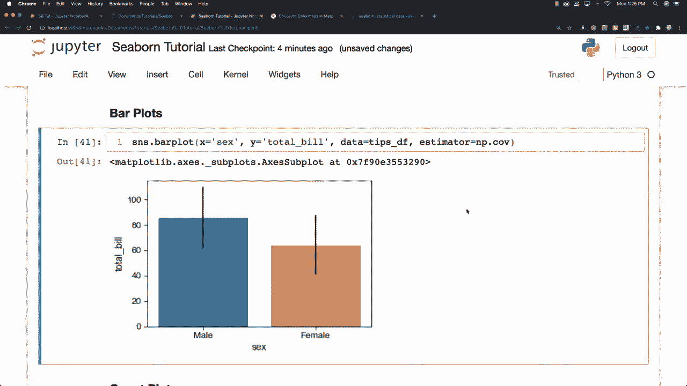
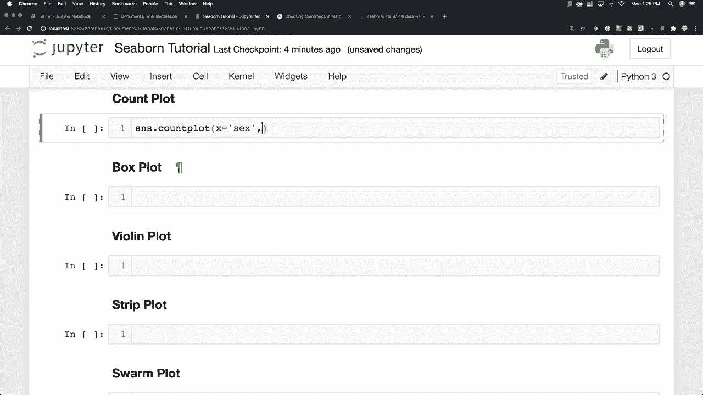
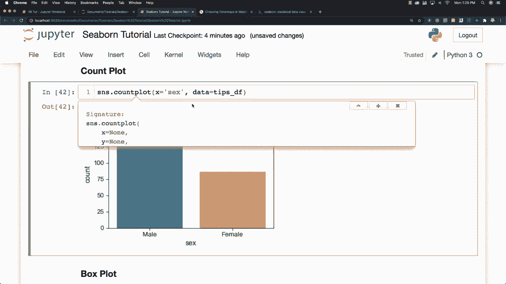
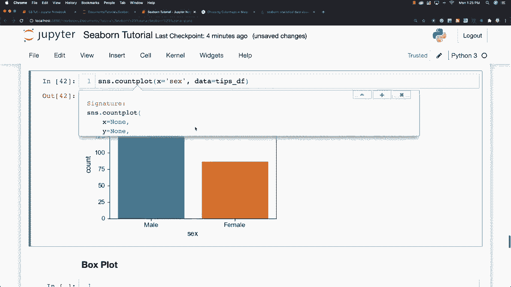
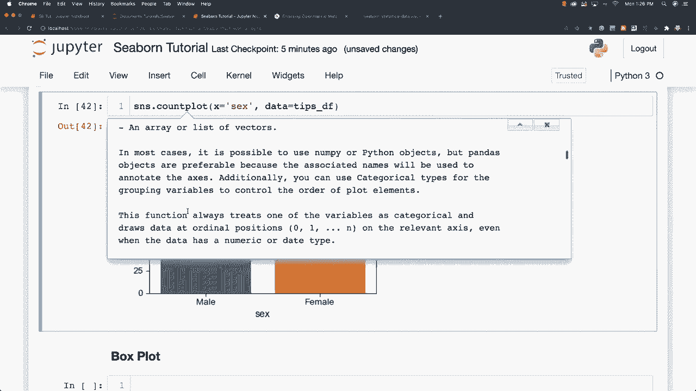
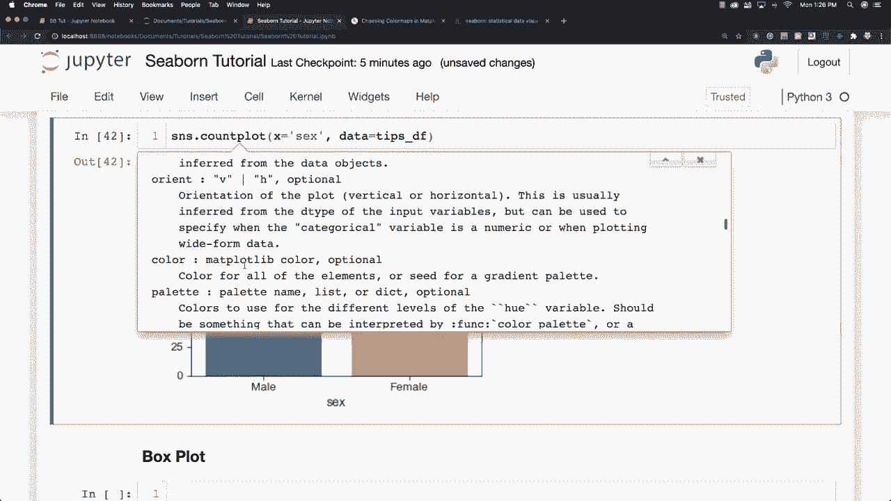
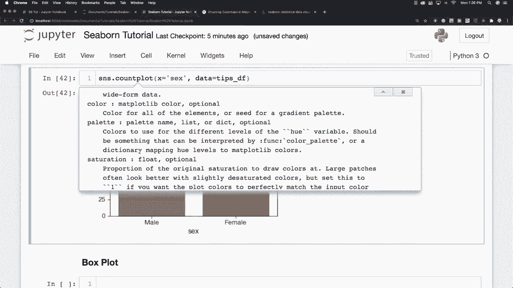

# 更简单的绘图工具包Seaborn，P12：L12-计数图 📊

在本节课中，我们将要学习Seaborn库中的计数图。计数图是一种用于可视化分类数据中各类别出现频次的图表，可以看作是条形图的一种特殊形式，其核心功能是自动统计并展示数据。

## 概述

计数图与条形图类似，但其估算器功能仅仅是简单地计算每个类别出现的次数。例如，我们可以使用计数图来统计并比较数据集中男性和女性的总数量。

## 计数图的基本用法

要绘制计数图，我们使用Seaborn的 `countplot` 函数。其基本语法结构如下：

```python
sns.countplot(x='column_name', data=df)
```

在这个函数中，`x` 参数指定数据框中用于分组的列名，`data` 参数则传入我们的数据框。函数会自动计算该列中每个唯一值出现的次数，并以条形图的形式展示。

## 计数图的常用参数

上一节我们介绍了计数图的基本用法，本节中我们来看看如何通过参数来定制图表的外观和展示维度。`countplot` 函数提供了丰富的参数选项。



以下是 `countplot` 函数的一些关键参数及其作用：

*   **`hue`**: 此参数用于在计数图中引入第二个分类变量，从而进行分组和嵌套展示。例如，在按性别分组的基础上，再按另一个维度（如城市）进行着色区分。
*   **`order`**: 此参数用于手动指定条形在X轴上的显示顺序。传入一个类别名称的列表即可。
*   **`palette`**: 此参数用于设置图表的颜色板。Seaborn提供了多种预设的颜色板，如 `‘viridis’`, `‘Set2’`, `‘husl’` 等。
*   **`saturation`**: 此参数控制颜色的饱和度，取值范围通常在0到1之间。
*   **`dodge`**: 当使用了 `hue` 参数时，`dodge` 参数控制是否将不同 `hue` 类别的条形并排显示（`dodge=True`）还是堆叠显示（`dodge=False`）。



你可以将鼠标光标放在函数名后，按下 `Shift` 和 `Tab` 键来查看所有可用的额外选项和参数的详细说明。

## 图表示例



以下是一些计数图的示例，展示了不同参数设置下的效果：











## 总结

本节课中我们一起学习了Seaborn中的计数图。我们了解到计数图是用于展示分类数据频次分布的有效工具，其核心是 `sns.countplot()` 函数。我们探讨了其基本用法，并介绍了如何通过 `hue`, `order`, `palette` 等参数来增强图表的表达能力和美观性。



好的，关于计数图的内容就介绍到这里。接下来，我们将开始学习箱形图。

