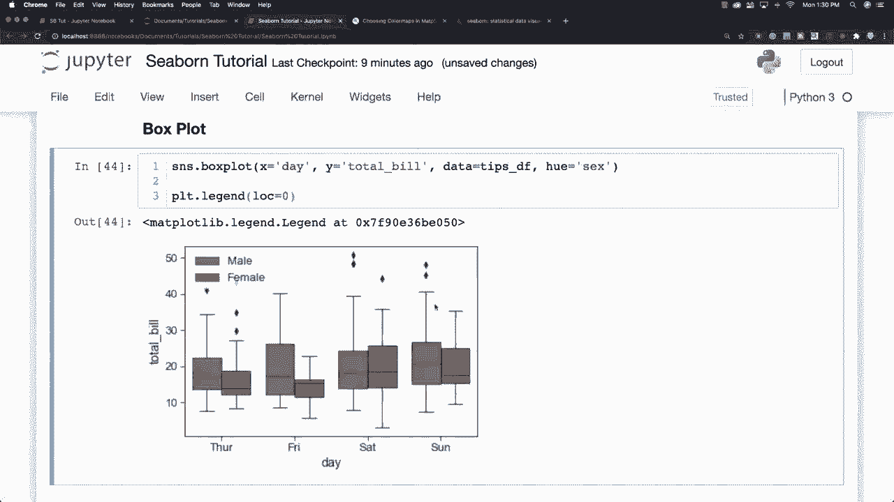
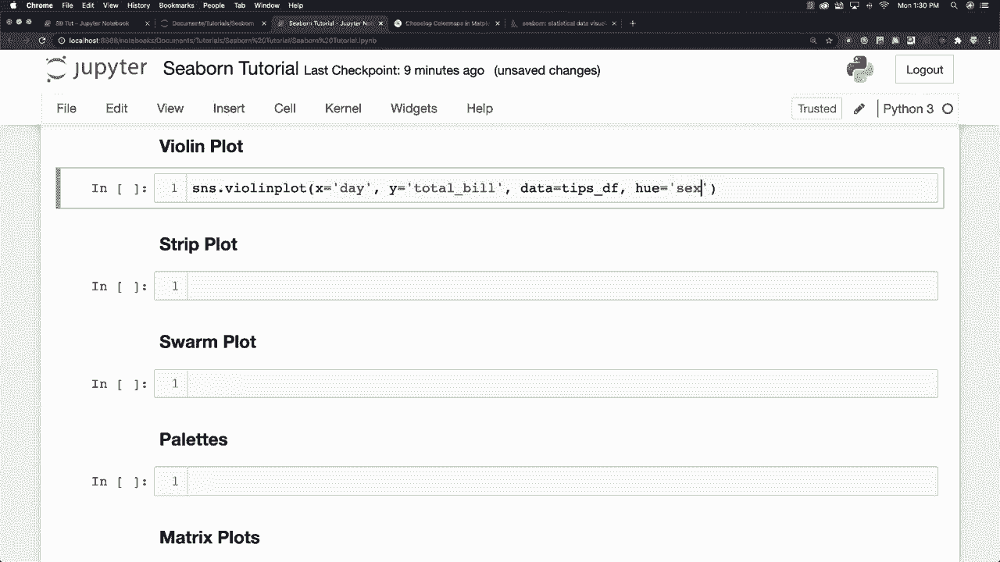
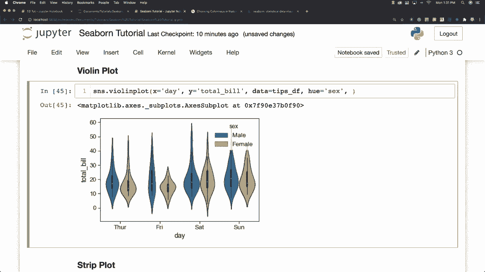
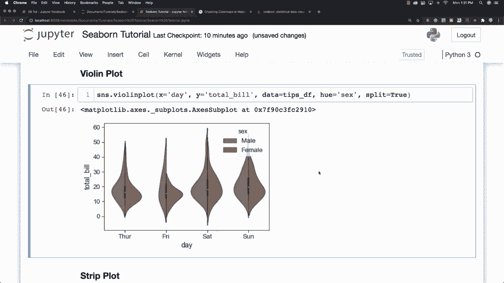

# 更简单的绘图工具包Seaborn，P14：L14- 小提琴图 🎻

在本节课中，我们将要学习一种名为“小提琴图”的可视化图表。小提琴图是箱线图与核密度估计图的结合体，它能同时展示数据的分布范围、密度以及中位数等关键信息，非常适合用于比较不同类别数据的分布情况。

上一节我们介绍了箱线图，本节中我们来看看小提琴图。小提琴图与箱线图非常相似，但它能提供更丰富的数据分布细节。

## 创建基础小提琴图

假设我们想要分析的数据信息与之前类似，我们将从数据框中提取“日期”和“总构建”信息，同时使用“H”参数来区分男性和女性的数据。

以下是创建基础小提琴图的代码示例：

```python
import seaborn as sns
import matplotlib.pyplot as plt

# 假设 `df` 是我们的数据框，包含 `day`, `total_bill`, `sex` 列
sns.violinplot(x='day', y='total_bill', hue='sex', data=df)
plt.show()
```



执行上述代码后，你将看到一个基础的小提琴图，它展示了不同日期下，男性和女性账单金额的分布情况。

## 使用 `split` 参数增强比较



我们还可以在小提琴图中添加一个名为 `split` 的选项，并将其设置为 `True`。这个功能非常有用，它允许你将两个类别的数据在同一把小提琴中并排显示，从而更直观地比较它们之间的关系。



以下是使用 `split` 参数的代码：

```python
sns.violinplot(x='day', y='total_bill', hue='sex', data=df, split=True)
plt.show()
```

通过设置 `split=True`，男性和女性的数据分布会出现在同一把小提琴的左右两侧，使得类别间的对比一目了然。

## 选择与数据匹配的图表

正如之前所说，选择哪种图表取决于你的数据类型和分析目标。小提琴图擅长展示和比较数据的概率密度分布，而箱线图则更侧重于展示数据的四分位范围和异常值。



接下来，我们将探讨条形图，并更深入地讨论一些样式和调色板选项，以帮助你创建更美观、信息更丰富的图表。

---

本节课中我们一起学习了小提琴图。我们了解到小提琴图是箱线图与核密度估计图的结合，能有效展示数据的分布密度。我们学习了如何使用 `sns.violinplot()` 函数创建基础小提琴图，以及如何利用 `split` 参数来增强不同类别数据之间的对比。理解不同图表的适用场景，有助于你为数据选择最合适的可视化方式。