# Seaborn绘图教程 P17：L17- 调色板 🎨

在本节课中，我们将要学习如何使用Seaborn库中的调色板功能来美化图表。通过调整颜色方案和图例位置，我们可以让数据可视化结果更具吸引力和可读性。

---

为了让图表视觉效果更佳，我们需要调整图表尺寸并设置网格样式。我们将使用更深的颜色，并将图表放大，使其更适合演示。

以下是设置图表样式为演示模式的代码：
```python
import seaborn as sns
import matplotlib.pyplot as plt

sns.set(style="talk")
```

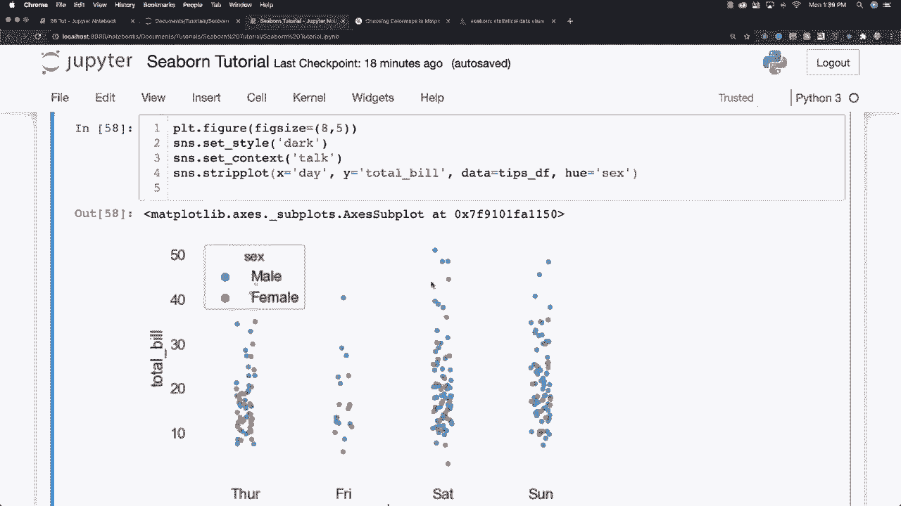


上一节我们设置了图表的整体样式，本节中我们来看看如何创建并自定义一个具体的图表。

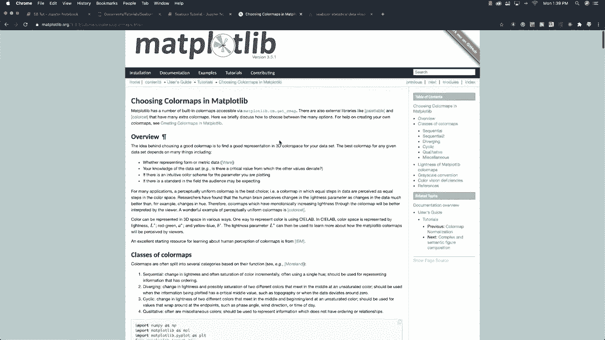

现在，我们创建一个条形图。我们将使用熟悉的“小费”数据集，并探索如何根据性别（`hue='sex'`）来区分数据。

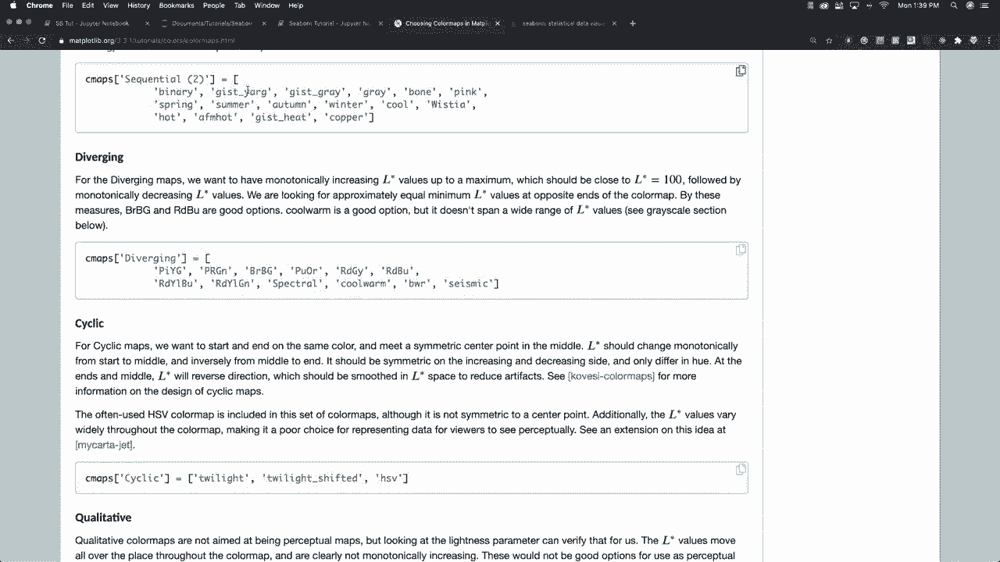

以下是创建条形图的代码：
```python
# 加载数据集
tips = sns.load_dataset("tips")

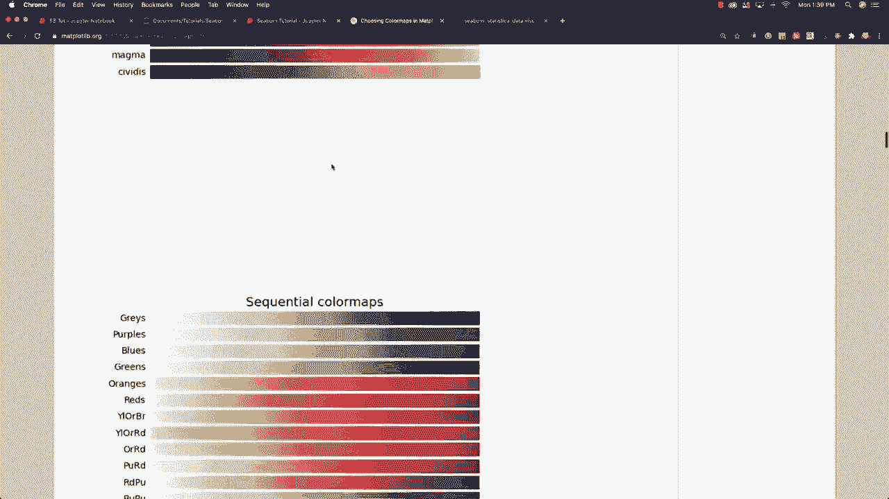

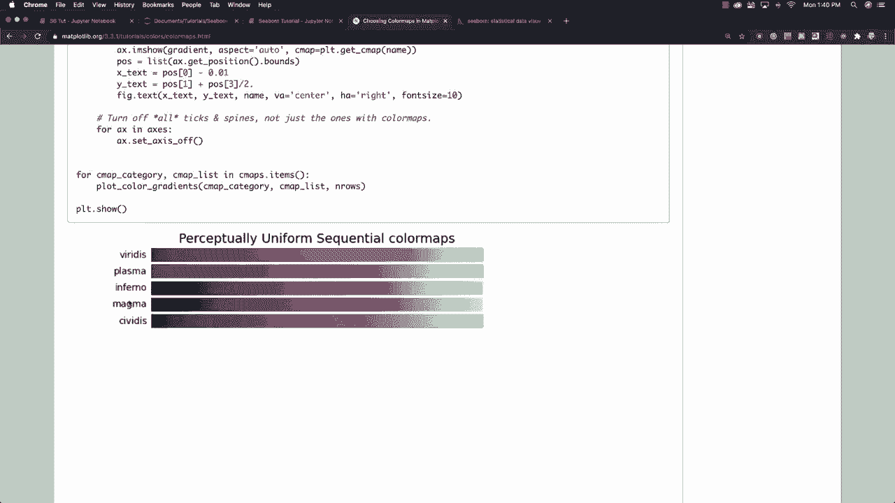

# 创建条形图
sns.barplot(x="day", y="total_bill", hue="sex", data=tips)
plt.show()
```

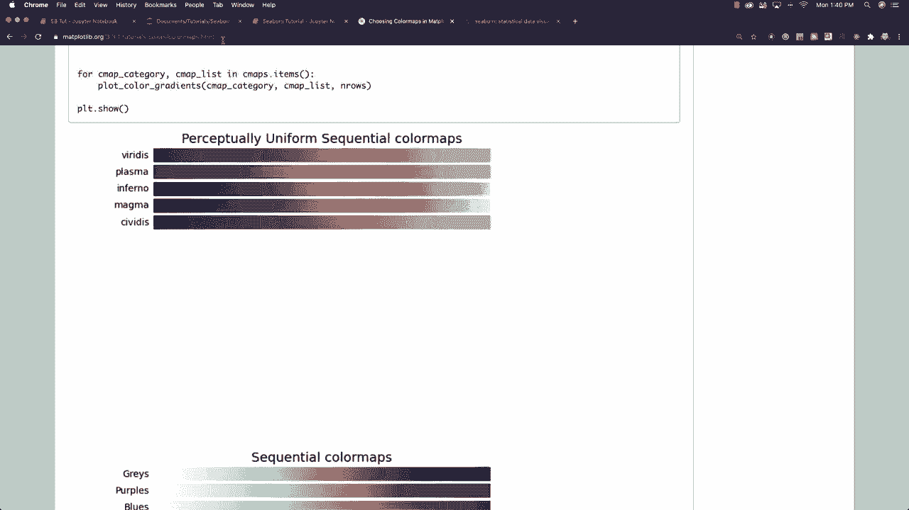

运行上述代码后，你可以看到图表最终呈现的效果。图表中使用的默认颜色有时效果很好，有时则不然。如果你想改变颜色，可以设置调色板。

以下是设置调色板的代码：
```python
sns.set_palette("magma")
sns.barplot(x="day", y="total_bill", hue="sex", data=tips)
plt.show()
```

你可以为自己寻找不同的颜色选项。通过访问Matplotlib库，特别是其颜色映射（Colormap）部分，可以找到丰富的选择。在Matplotlib官网搜索“colormap”，你会进入一个展示众多可用颜色映射示例的页面。

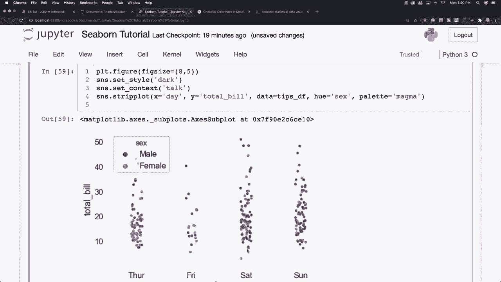

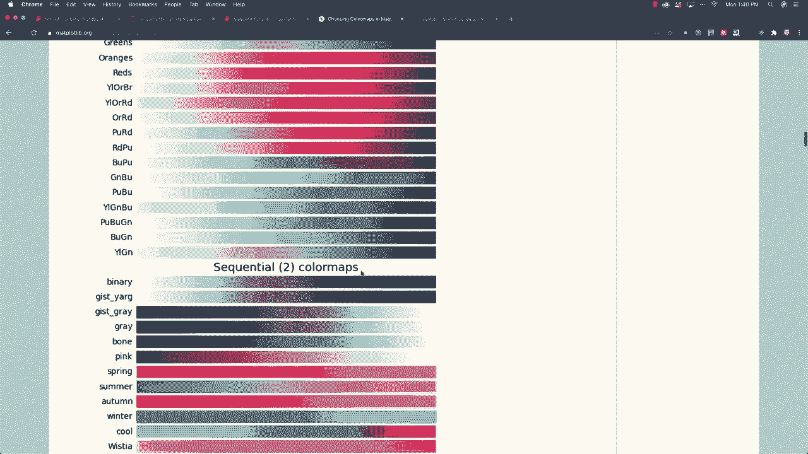

向下滚动页面，你可以看到各种颜色映射的示例及其对应的颜色输出。例如，假设我想使用“magma”颜色映射，我可以在代码中指定它。

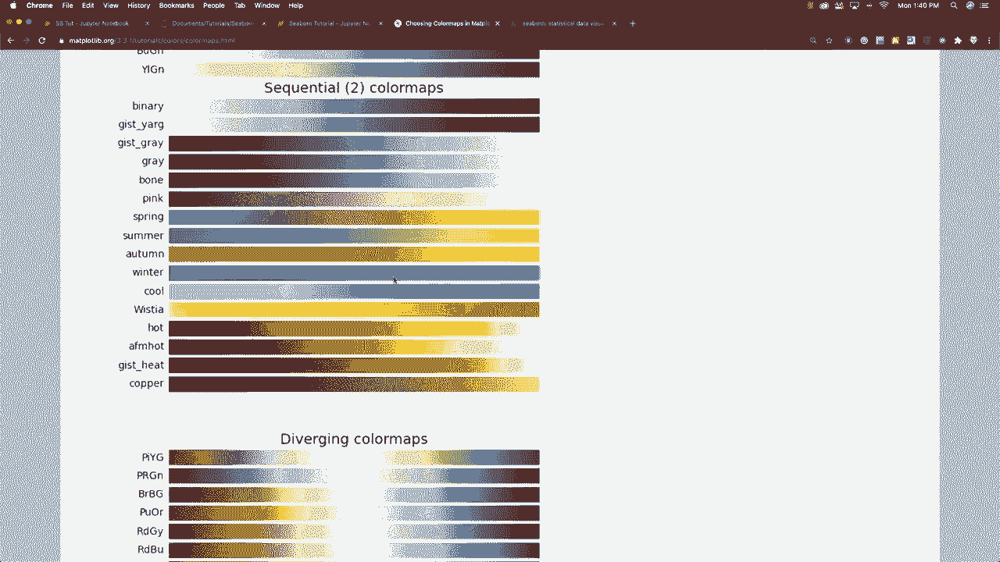

运行设置为“magma”的代码后，你可以评估视觉效果是否更好。你也可以尝试其他不同的样式。

以下是尝试其他颜色映射的示例：
```python
# 尝试不同的颜色映射
palettes = ["magma", "viridis", "plasma", "afmhot"]
for palette in palettes:
    sns.set_palette(palette)
    sns.barplot(x="day", y="total_bill", hue="sex", data=tips)
    plt.title(f"Palette: {palette}")
    plt.show()
```

“afmhot”等颜色映射看起来也很不错。当然，我们也可以调整图例文本的颜色。

有时，图例会出现在不理想的位置。一个常见的解决方法是简单地设置图例位置参数。

以下是调整图例位置的代码：
```python
# 将图例位置设置为‘0’（最佳位置）
plt.legend(loc=0)
```

如果位置“0”给出的结果不理想，你可以尝试其他值。例如，将值设为“1”可以将图例放在右上角。

以下是尝试不同图例位置的代码：
```python
# 尝试不同的图例位置
locations = [0, 1, 2, 3]  # 分别代表：最佳、右上、左上、左下
for loc in locations:
    sns.barplot(x="day", y="total_bill", hue="sex", data=tips)
    plt.legend(loc=loc)
    plt.title(f"Legend Location: {loc}")
    plt.show()
```

如果图例仍然遮挡数据，调整图形大小是另一个可用的选项。或者，如果你不喜欢上述预设位置，可以查阅Matplotlib中关于`plt.legend`的文档，了解所有可用选项。

在Matplotlib中查找“pyplot legend”，它会显示所有不同的位置选项代码，例如“upper left”、“lower right”等。你还可以通过使用元组将图例精确定位在特定的XY坐标上。

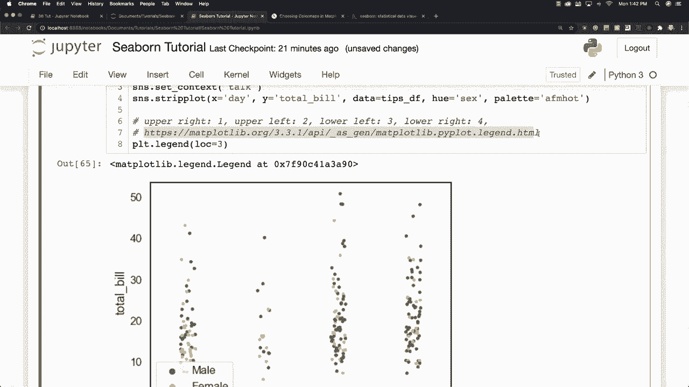

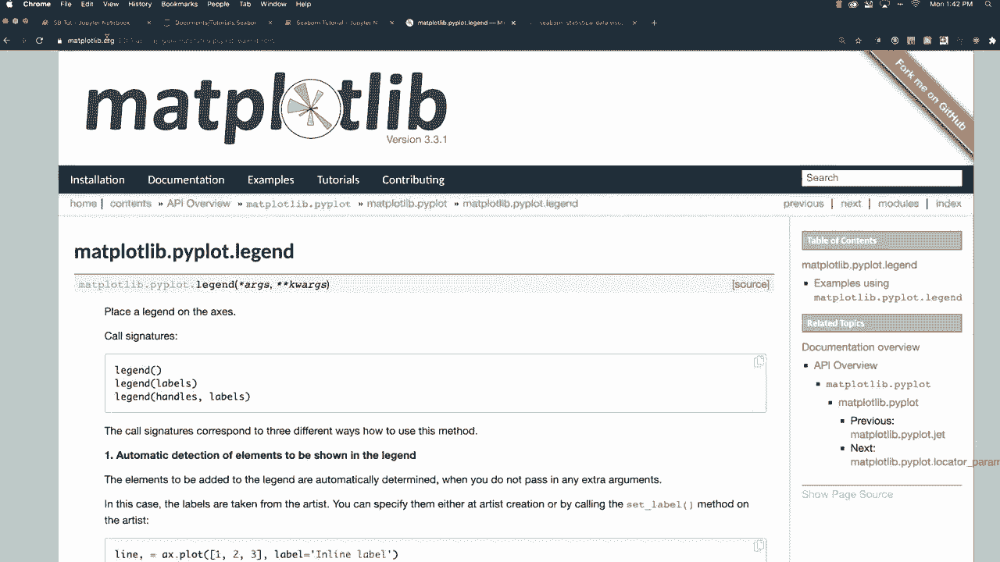

因此，有很多不同的方法可以通过改变调色板和调整图例位置等方式来样式化图表。

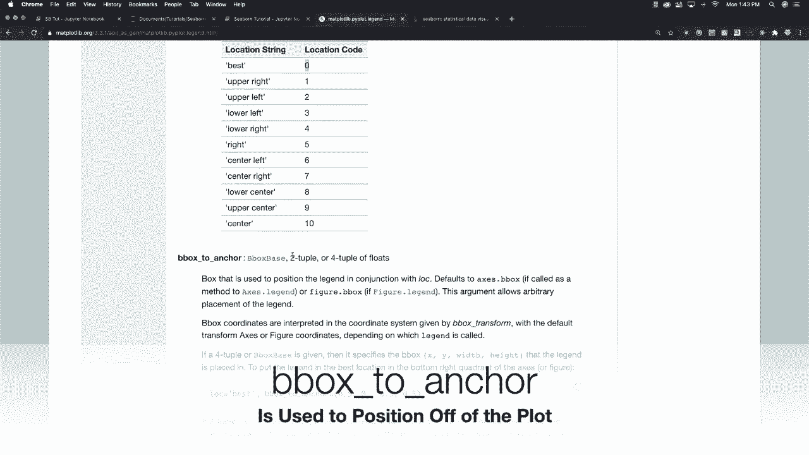

---

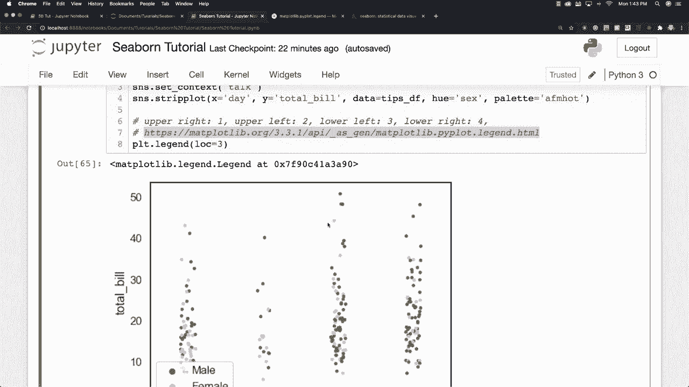

本节课中我们一起学习了如何使用Seaborn的调色板功能来改变图表的颜色方案，以及如何调整图例的位置以优化图表布局。掌握这些技巧能让你的数据可视化作品更加专业和清晰。