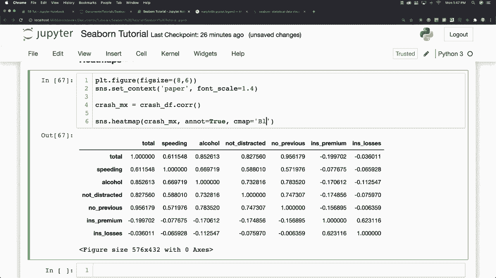
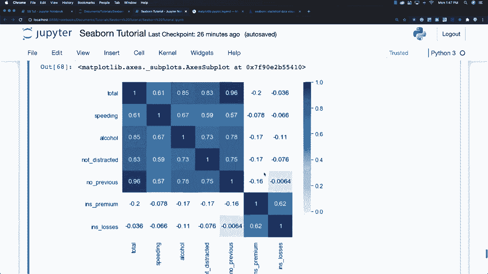
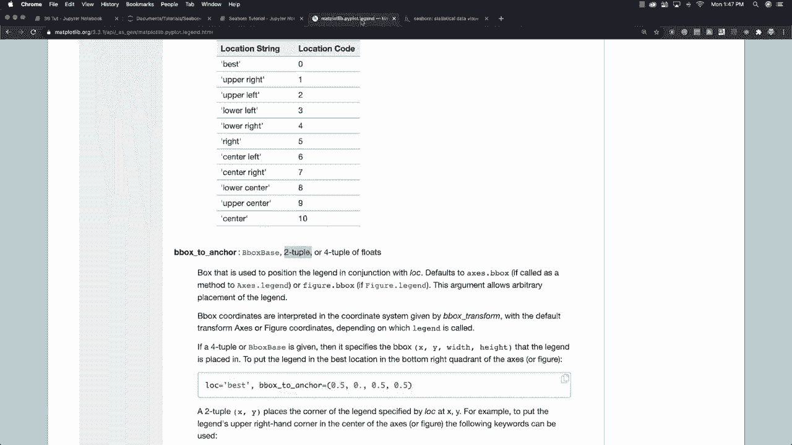
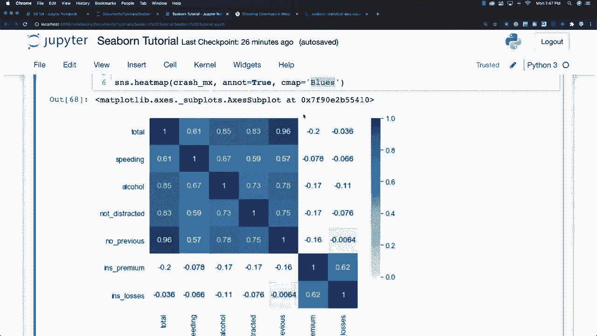
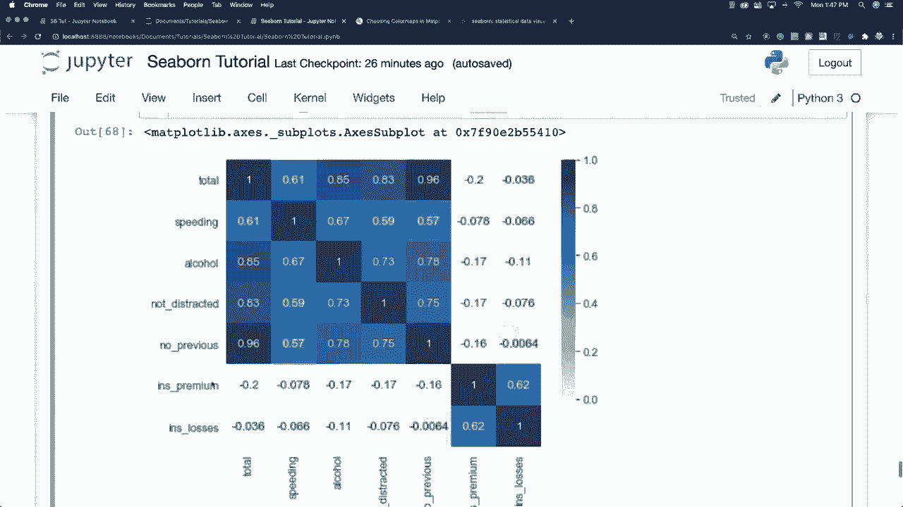
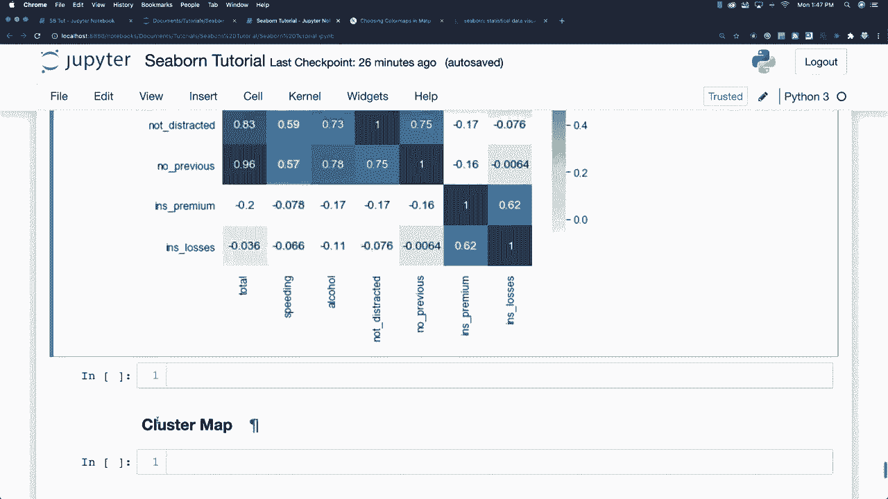
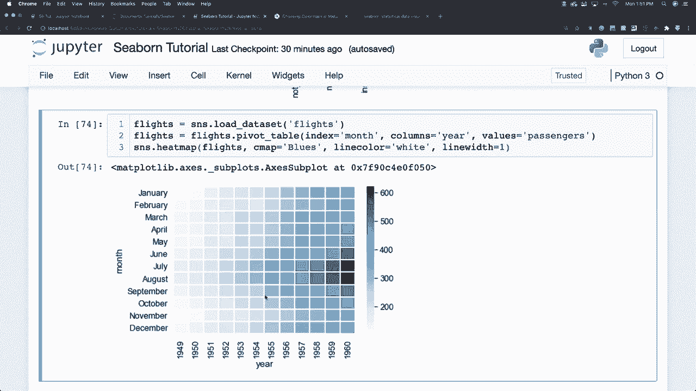

# 更简单的绘图工具包Seaborn，P18：L18- 热力图 🔥

在本节课中，我们将要学习如何使用Seaborn库创建热力图。热力图是一种通过颜色变化来展示矩阵数据中数值大小的可视化方法，非常适合用于观察数据的相关性、分布或模式。

---

## 1. 初始设置与样式

在开始绘图之前，我们需要进行一些初始的样式设置，以确保图形美观且可读。


以下是设置图形样式的基本步骤：

```python
import seaborn as sns
import matplotlib.pyplot as plt

# 设置图形大小
plt.figure(figsize=(8, 6))

# 更改Seaborn的绘图上下文样式，例如设置为“paper”风格
sns.set_context("paper", font_scale=1.4)
```

上一节我们介绍了基本的样式设置，本节中我们来看看创建热力图所需的数据格式。

---

## 2. 数据准备：矩阵格式

要创建热力图，数据必须组织成矩阵格式。这意味着行和列的标签需要对齐，数据值填充在对应的单元格中。

假设我们有一个名为 `accidents` 的数据框。有两种主要方法可以将其转换为适合热力图的矩阵格式。

### 方法一：使用相关性矩阵

一种常见的方法是计算数据框中各数值列之间的相关性。相关性矩阵本身就是一个完美的矩阵。

以下是具体操作：

```python
# 计算数据框的相关性矩阵
accidents_matrix = accidents.corr()
print(accidents_matrix)
```

运行上述代码后，你会得到一个矩阵，其中行和列都是原始数据框的列名，单元格内的数值表示两列之间的相关性强度。例如，`alcohol_use`（酒精使用）可能与 `accident`（事故）有较强的正相关性。

### 方法二：使用透视表

另一种方法是使用透视表来重塑数据。这在你需要按特定维度（如时间和类别）聚合数据时非常有用。

我们以Seaborn内置的 `flights` 数据集为例。这个数据集包含了不同年份和月份的乘客数量。

以下是创建透视表的步骤：



```python
# 加载航班数据集
flights = sns.load_dataset('flights')

# 创建透视表：行索引为月份，列索引为年份，值为乘客数量
flights_pivot = flights.pivot_table(index='month', columns='year', values='passengers')
print(flights_pivot)
```


运行后，你会得到一个矩阵，左侧是月份，顶部是年份，中间单元格是对应年份和月份的乘客数量。



---



## 3. 绘制基础热力图

数据准备就绪后，我们就可以使用 `sns.heatmap()` 函数来绘制热力图了。



以下是使用相关性矩阵绘制热力图的方法：



```python
# 绘制热力图
sns.heatmap(accidents_matrix, annot=True)
plt.show()
```
*   **`annot=True`**：这个参数会在每个色块中心显示具体的数值，使图表信息更清晰。



与Matplotlib相比，Seaborn用一行核心代码就能创建出美观的热力图，大大简化了流程。


接下来，我们看看如何使用航班数据的透视表来绘制热力图。

---

## 4. 进阶热力图：航班数据示例

现在，我们使用准备好的航班数据透视表来绘制一个更复杂的热力图。

以下是具体代码：

```python
# 绘制航班数据热力图，并指定颜色映射
sns.heatmap(flights_pivot, cmap='Blues')
plt.show()
```
*   **`cmap='Blues'`**：这个参数指定了颜色映射方案，`‘Blues’` 表示使用从浅蓝到深蓝的渐变色。

从生成的热力图中，我们可以直观地看到：乘客数量在七月和八月达到高峰，并且从1949年到1960年，总体乘客数量呈增长趋势。

为了使各个数据单元格之间的界限更清晰，我们还可以添加分隔线。

---

## 5. 添加样式：单元格分隔线

在热力图中添加分隔线可以让单元格的边界更加明显。

以下是添加白色分隔线的方法：

```python
# 绘制带白色分隔线的热力图
sns.heatmap(flights_pivot, cmap='Blues', linewidths=1, linecolor='white')
plt.show()
```
*   **`linewidths=1`**：设置分隔线的宽度。
*   **`linecolor='white'`**：设置分隔线的颜色为白色。

添加分隔线后，每个数据单元格都被清晰地划分开来，便于观察。

---

## 6. 总结

本节课中我们一起学习了如何使用Seaborn创建热力图。

我们首先介绍了数据必须准备成矩阵格式，并讲解了两种方法：**计算相关性矩阵**和**构建透视表**。

然后，我们使用 `sns.heatmap()` 函数绘制了基础热力图，并通过 `annot` 参数显示数值。



最后，我们以航班数据为例，绘制了进阶热力图，并通过 `cmap` 参数调整颜色，使用 `linewidths` 和 `linecolor` 参数添加了单元格分隔线，使图表更加清晰美观。

热力图是探索数据关联性和模式的有力工具，希望你能在实践中熟练运用它。