# Seaborn绘图工具包，P19：L19- 聚合地图 🌐

在本节课中，我们将要学习如何使用Seaborn库中的`clustermap`函数来创建聚合地图（聚类图）。这是一种结合了层次聚类和热力图的可视化方法，能够帮助我们识别数据中的模式和分组。

---

## 概述

聚合地图是一种强大的数据探索工具。它通过计算数据点之间的距离，将相似的行和列聚集在一起，并以热力图的形式展示出来。这使得我们能够直观地发现数据中的潜在结构。

---

## 使用鸢尾花数据集创建聚类图

首先，我们使用经典的鸢尾花数据集来演示。这个数据集包含了不同鸢尾花物种的花瓣和花萼的测量数据。

以下是加载数据并创建聚类图的步骤：

```python
import seaborn as sns
import matplotlib.pyplot as plt

# 加载鸢尾花数据集
iris = sns.load_dataset('iris')

# 创建聚类图，按‘species’列对数据进行分组
g = sns.clustermap(iris.drop('species', axis=1), row_colors=iris['species'])
plt.show()
```

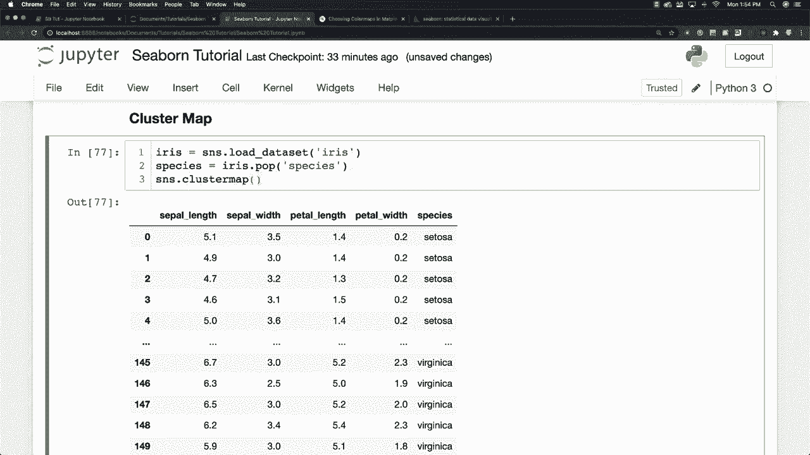

这段代码执行了以下操作：
1.  加载鸢尾花数据集。
2.  使用`sns.clustermap`函数创建聚类图。我们传入了除‘species’列以外的所有数值数据。
3.  通过`row_colors`参数，根据‘species’列的值对行进行着色，从而在聚类结果中直观地区分不同物种。

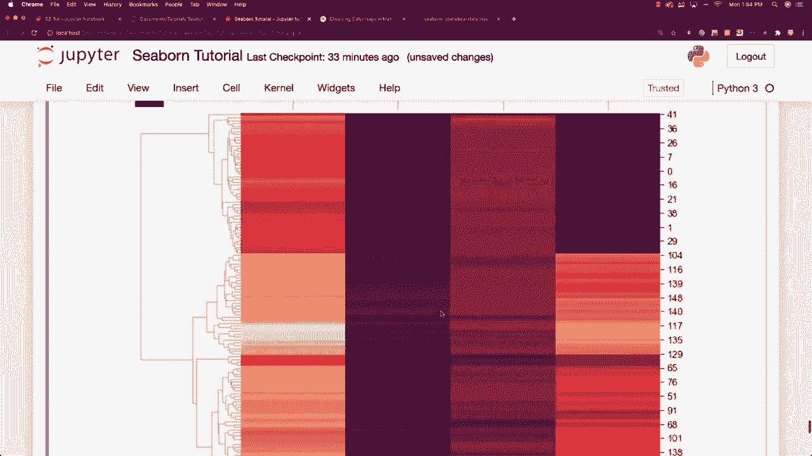

生成的图表看起来可能有些复杂，但它展示了一个分层聚类热图。图表左侧和上方的树状图显示了行和列是如何根据相似性被聚类的。热图部分则用颜色深浅表示数值大小。

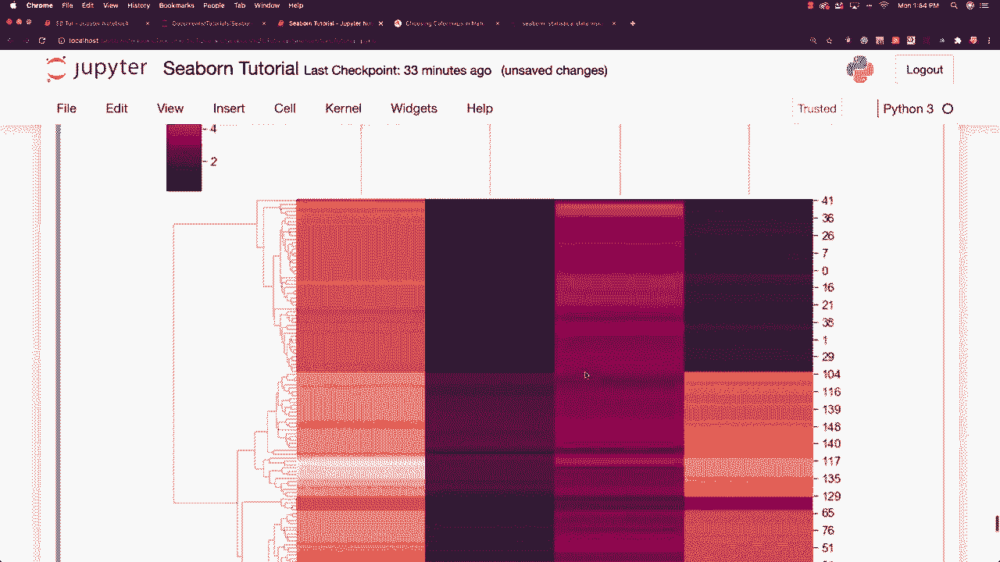

---

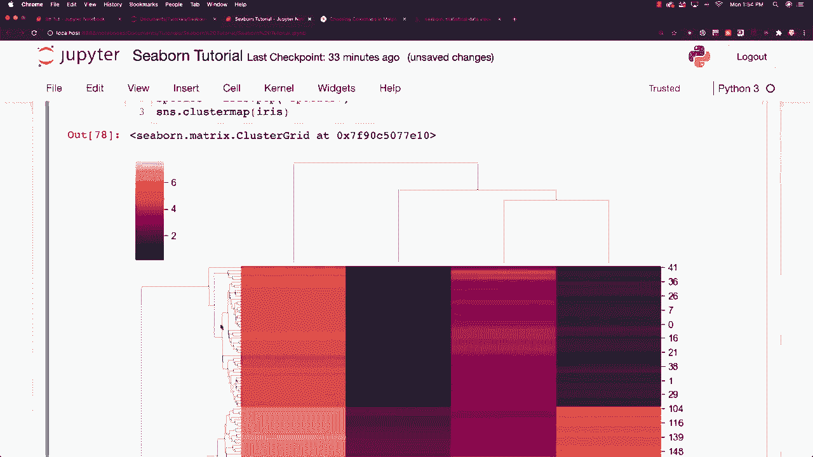

## 理解聚类图的工作原理

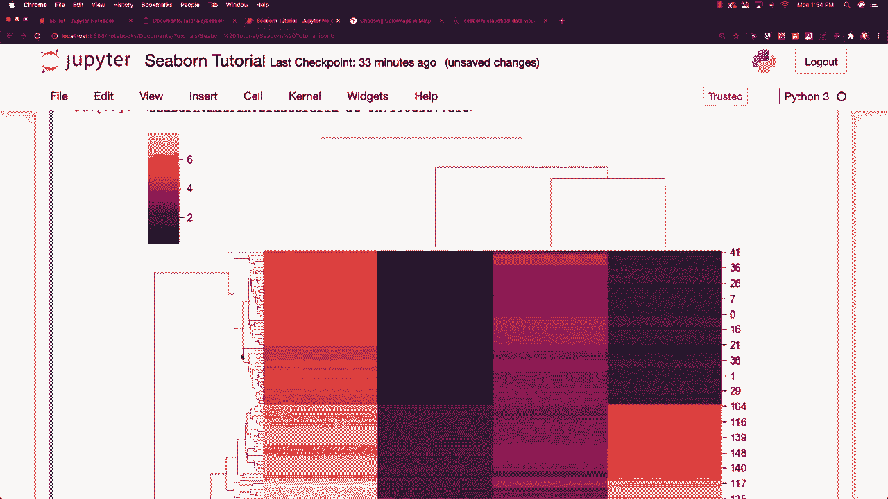

上一节我们介绍了如何创建聚类图，本节中我们来看看它的核心工作原理。

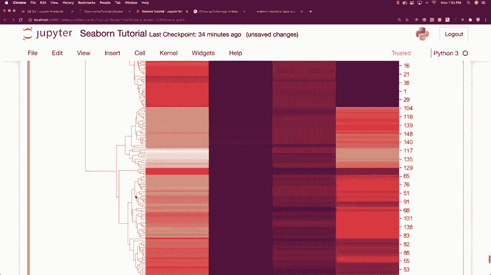

聚类图所做的是计算数据点之间的距离，然后将最近的点连接在一起。这个过程会持续进行，连接下一个最近的点。它同时比较热图的列和行，尝试将相似的数据类型和数据点聚集在一起。

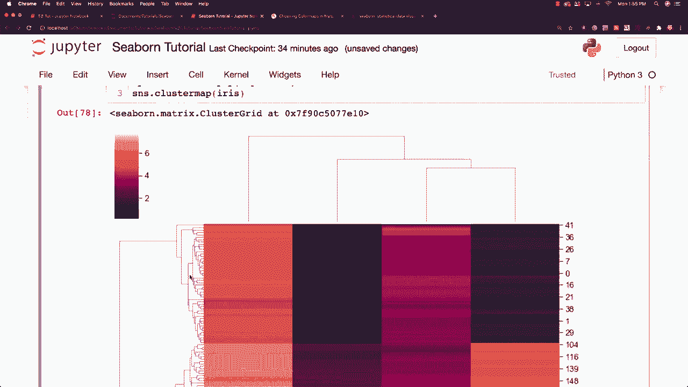

为了更清晰地理解，我们可以将其与普通热力图进行对比。

---

## 对比聚类图与热力图

我们使用航班数据集来展示聚类图与普通热力图之间的区别。

以下是创建航班数据聚类图的代码：

```python
# 加载航班数据集
flights = sns.load_dataset('flights')
flights_pivot = flights.pivot(index='month', columns='year', values='passengers')

# 创建聚类图，并进行标准化以便专注于聚类模式
sns.clustermap(flights_pivot, cmap='Blues', standard_scale=1)
plt.show()
```

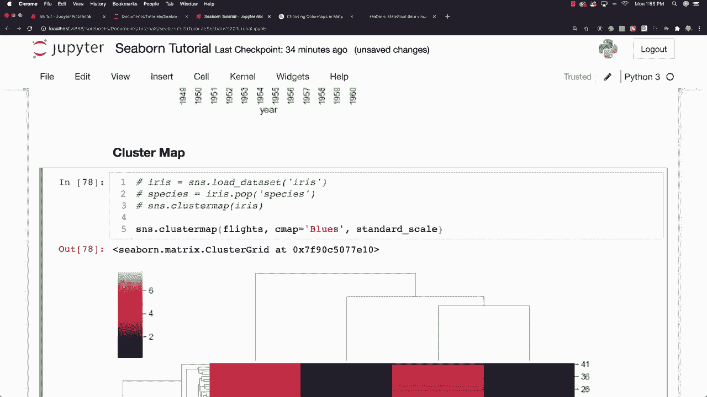

这段代码中：
*   `flights_pivot`将数据重塑为矩阵形式，行是月份，列是年份，值是乘客数量。
*   `cmap='Blues'`指定了颜色映射。
*   `standard_scale=1`参数对数据进行标准化（按列），这有助于消除量纲影响，专注于数据的聚类模式。

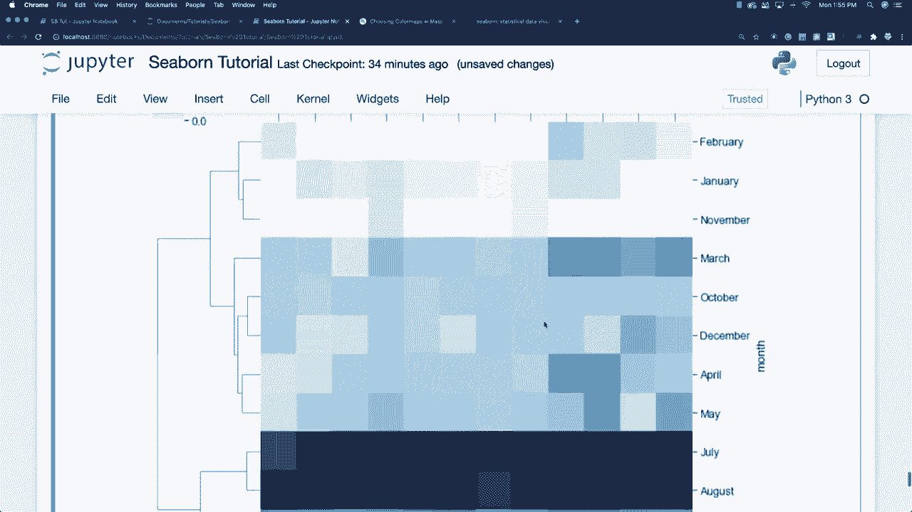

观察生成的聚类图，你会发现：
*   7月和8月的数据被聚集在了一起，这表明这两个月份的乘客模式非常相似。
*   年份也不再按原始顺序排列，而是根据相似性被重新排序。

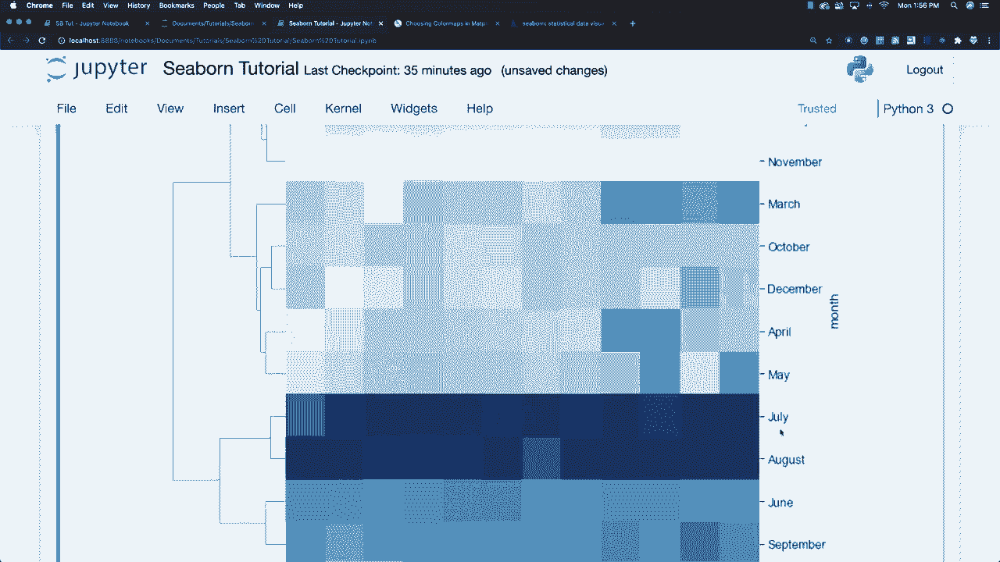

**热力图** 只是在现有数据顺序的基础上展示数据。
**聚类图** 则会主动重新排列行和列，将相似的数据紧密聚集，从而揭示出数据中潜在的、非常具体的模式。对于这个航班数据集，它清晰地展示了旅游旺季的月份模式和不同年份客流量的相似性。

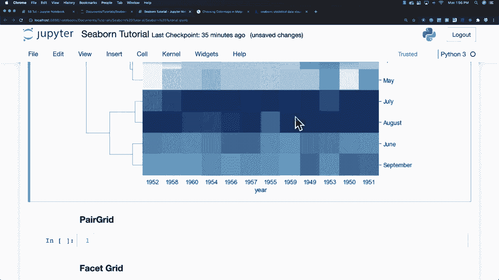

---

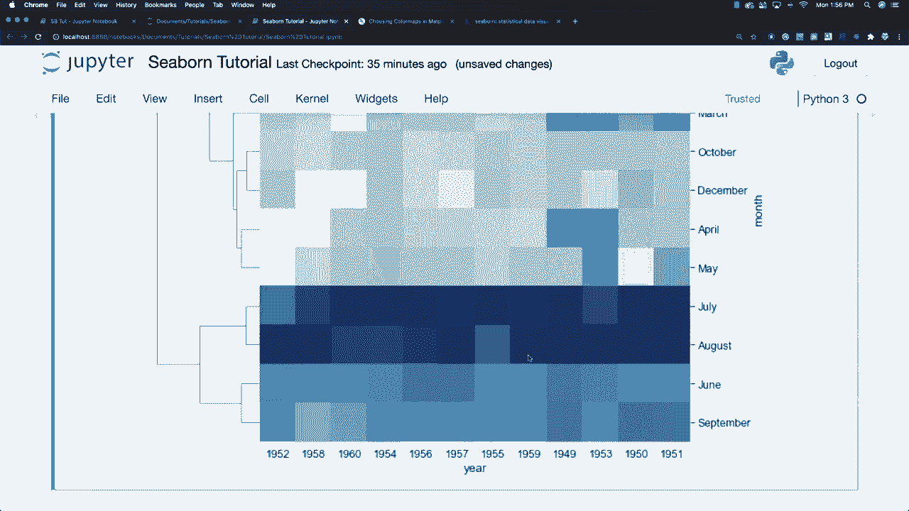

## 总结

本节课中我们一起学习了Seaborn中的聚合地图（`clustermap`）。
我们首先使用鸢尾花数据集创建了一个基础的聚类图，并理解了其通过层次聚类算法组织数据行的方式。
接着，我们通过对比航班数据的聚类图和热力图，明确了聚类图的核心价值：它通过重新排列数据来主动揭示内在的分组结构和模式，而不仅仅是静态展示。
这是一种强大的探索性数据分析工具，特别适用于寻找高维数据中的相似性组别。