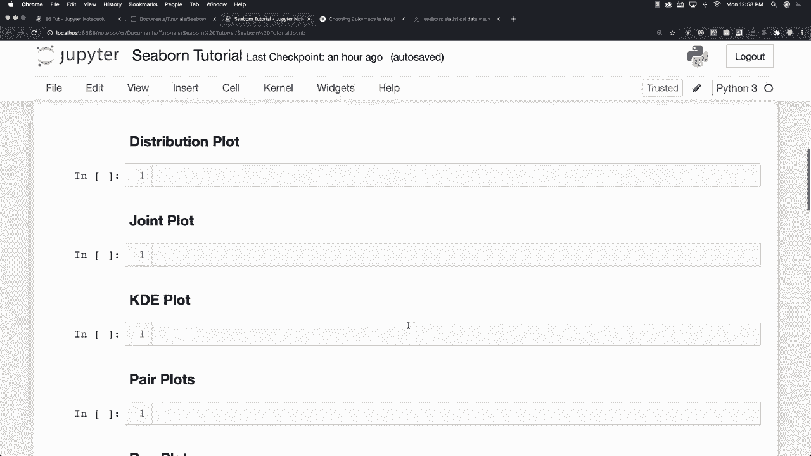
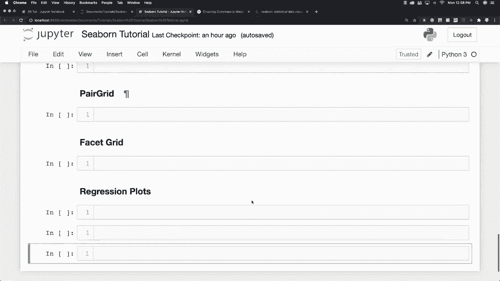
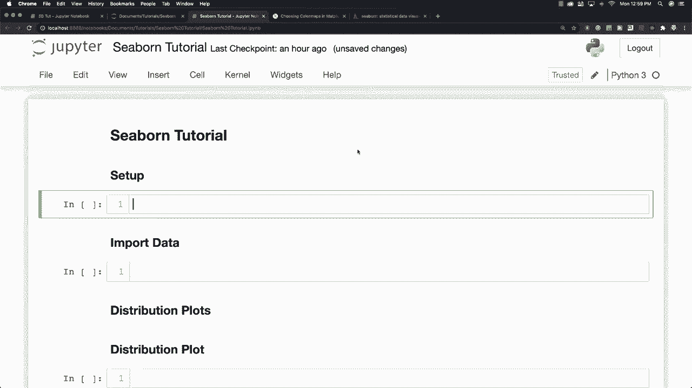
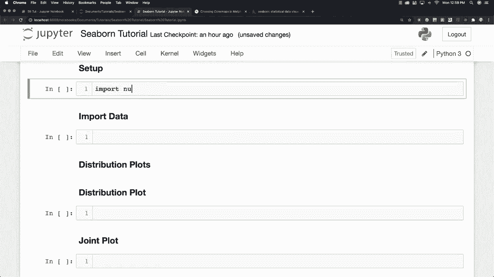
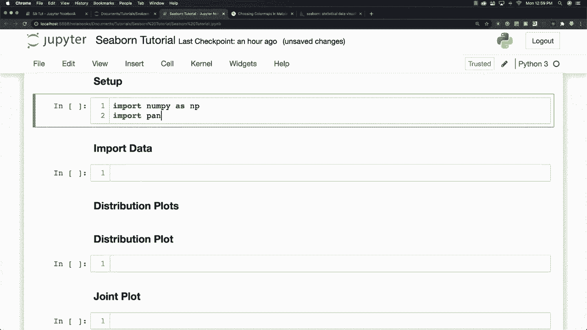
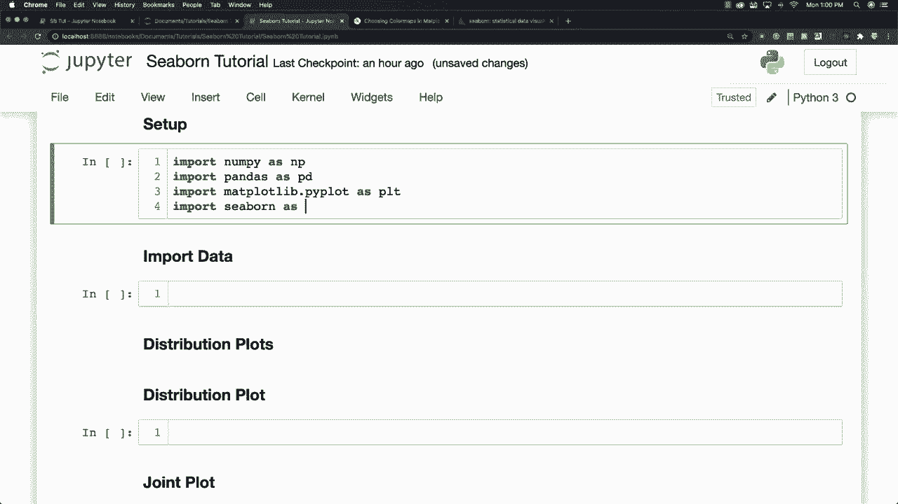
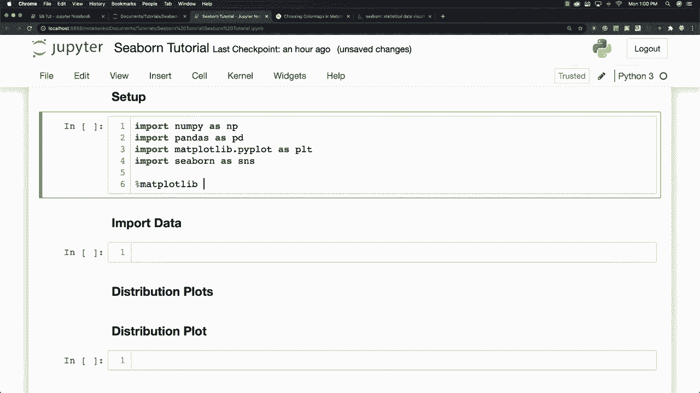
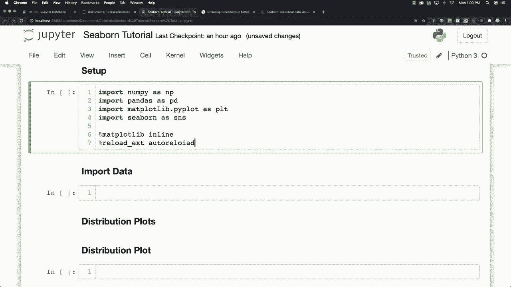
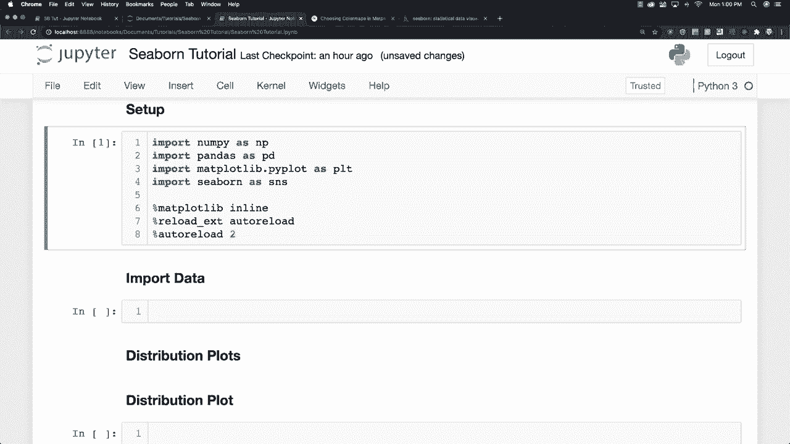

# Seaborn绘图教程，P2：L2- 环境设置 🛠️

在本节课中，我们将学习如何为使用Seaborn库设置Python编程环境。我们将涵盖必要的库导入、Jupyter Notebook的配置以及一些可选的便利设置。

## 概述

Seaborn是一个基于Matplotlib的Python数据可视化库，它提供了更高级的接口，能够用更少的代码绘制出统计图形。与Matplotlib相比，Seaborn能根据数据自动做出合理的样式假设，从而简化绘图过程。

## 安装Seaborn

在开始使用Seaborn之前，需要确保它已安装在你的环境中。你可以通过以下两种方式之一进行安装。



以下是安装命令：
*   **使用pip安装**：`pip install seaborn`
*   **使用conda安装**：`conda install seaborn`



## 导入必要的库



设置好环境后，我们需要在Python脚本或Jupyter Notebook中导入Seaborn及其常用的辅助库。

以下是需要导入的核心库：
```python
import numpy as np
import pandas as pd
import matplotlib.pyplot as plt
import seaborn as sns
```

## 配置Jupyter Notebook

为了在Jupyter Notebook中直接显示图形，并启用一些便利功能，可以进行额外的配置。



以下是可选的配置命令：
```python
# 使Matplotlib图形内嵌显示在Notebook中
%matplotlib inline



# 启用自动重载模块功能（方便开发时修改代码后无需重启内核）
%load_ext autoreload
%autoreload 2
```



> **注意**：这些配置步骤（特别是自动重载）不是强制性的，但能提升在Jupyter Notebook中的开发体验。



## 执行设置

完成上述代码编写后，在Jupyter Notebook中运行该单元格（例如按`Ctrl+Enter`），即可加载所有库并应用设置，为后续的Seaborn绘图做好准备。



## 总结



本节课我们一起学习了使用Seaborn前的准备工作。我们了解了Seaborn的安装方法，掌握了导入核心库（NumPy, Pandas, Matplotlib, Seaborn）的步骤，并介绍了如何配置Jupyter Notebook以优化绘图和开发体验。现在，你的环境已经准备就绪，可以开始创建简洁而强大的统计图表了。