# Seaborn绘图工具包，P22：L22- 回归图 📈

在本节课中，我们将学习如何使用Seaborn库绘制回归图。回归图是一种用于可视化两个变量之间关系的图表，它不仅能展示数据点，还能拟合出一条回归线，帮助我们理解趋势。我们将使用“小费”数据集作为示例，演示如何创建基础回归图，以及如何通过分组、分面等方式进行高级定制。

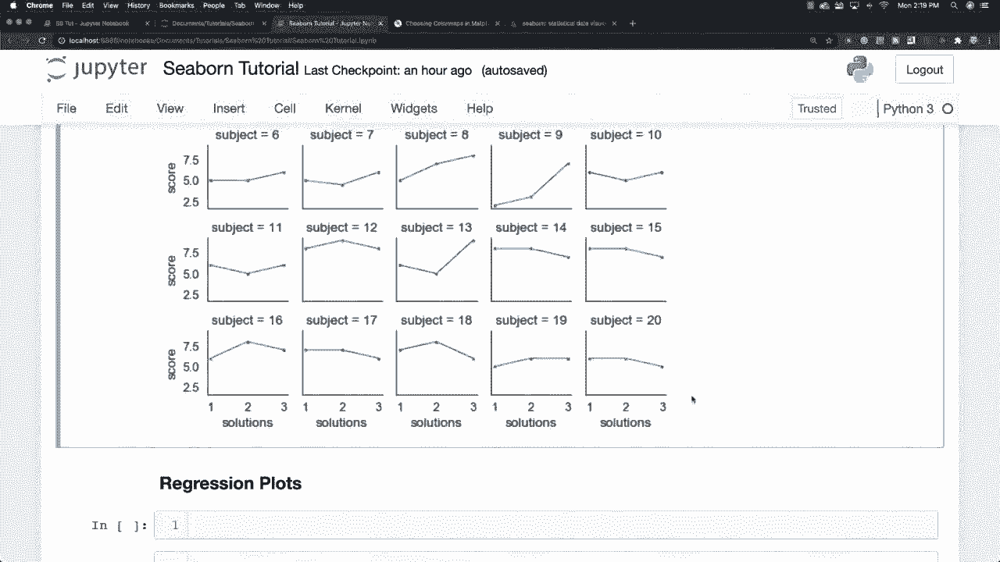

---

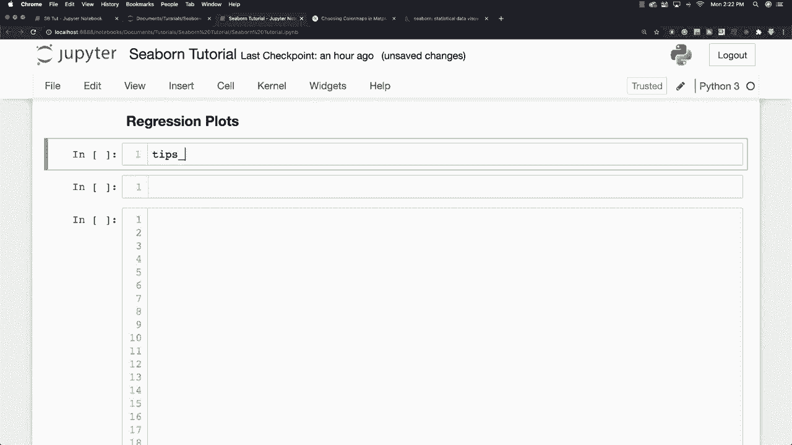

## 数据准备与图形设置

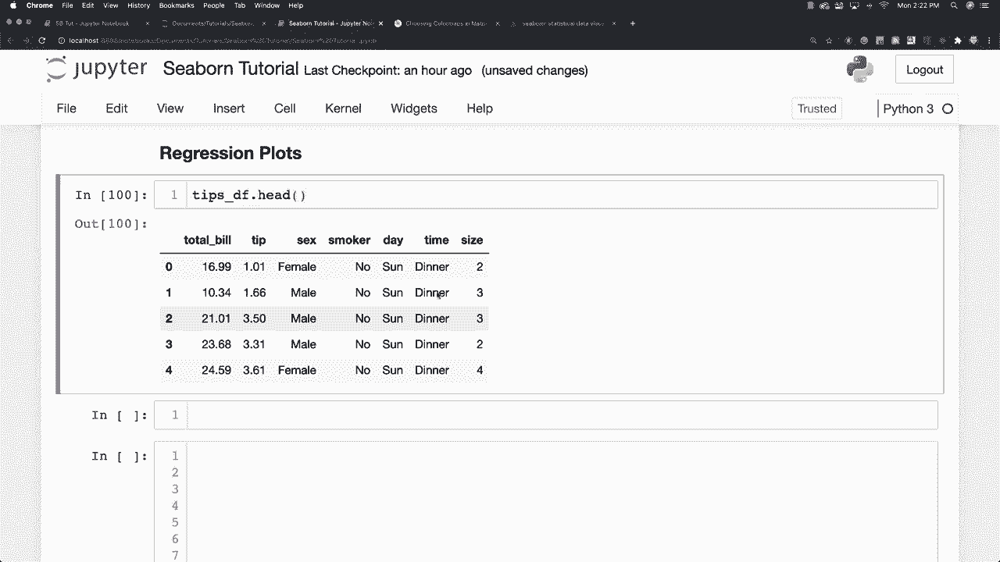

首先，我们需要导入必要的库并加载数据。我们将使用Seaborn内置的“小费”数据集。

```python
import seaborn as sns
import matplotlib.pyplot as plt

# 加载数据集
tips = sns.load_dataset('tips')
# 查看数据前五行
print(tips.head())
```

接下来，设置图形的基本样式和尺寸。我们将图形尺寸设置为8x6，并使用“纸张”上下文，同时将字体缩放比例设为1.4，使图表更美观。

```python
sns.set_context('paper', font_scale=1.4)
plt.figure(figsize=(8, 6))
```

---

## 绘制基础回归图

上一节我们设置了图形环境，本节中我们来看看如何绘制一个基础的回归图。我们将使用`sns.lmplot()`函数，并研究“总账单”金额对“小费”金额的影响。

```python
sns.lmplot(x='total_bill', y='tip', data=tips)
plt.show()
```

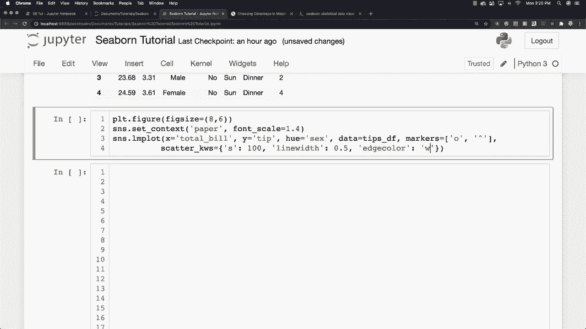

这个简单的命令会生成一个散点图，并自动拟合一条回归线，直观展示两个变量之间的线性关系。

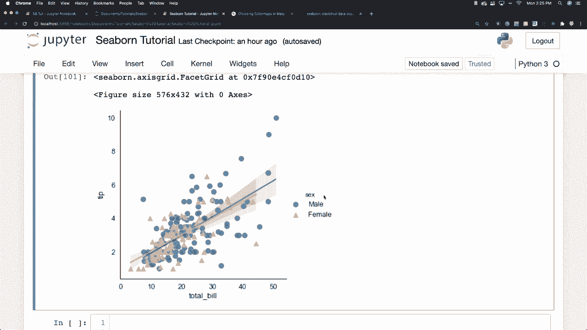

---

## 自定义回归图：分组与样式

基础图表展示了整体趋势，但我们经常需要比较不同组别的数据。例如，我们想区分男性和女性的数据点。

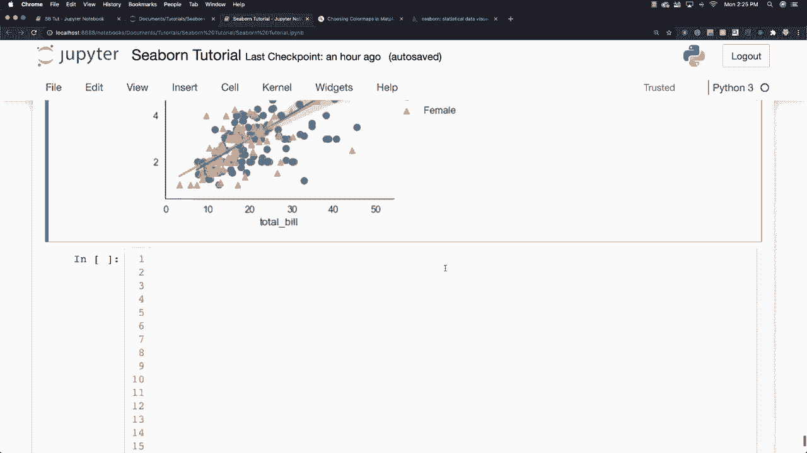

以下是自定义回归图的步骤，包括按性别分组和修改散点样式：

1.  **使用`hue`参数分组**：通过`hue='sex'`，数据点会根据性别用不同颜色区分。
2.  **自定义标记形状**：使用`markers`参数为不同组指定不同的标记。例如，用圆圈`'o'`代表男性，用上三角`'^'`代表女性。
3.  **调整散点样式**：通过`scatter_kws`参数字典，可以调整散点的大小（`s`）、边缘颜色（`edgecolor`）和线宽（`linewidth`）。

```python
sns.lmplot(x='total_bill',
           y='tip',
           hue='sex',
           data=tips,
           markers=['o', '^'],  # 男性用圆圈，女性用三角形
           scatter_kws={'s': 100, 'edgecolor': 'white', 'linewidth': 0.5}
          )
plt.show()
```

运行这段代码，你将得到一个高度定制化的回归图，清晰地展示了不同性别的数据分布和趋势线。

---

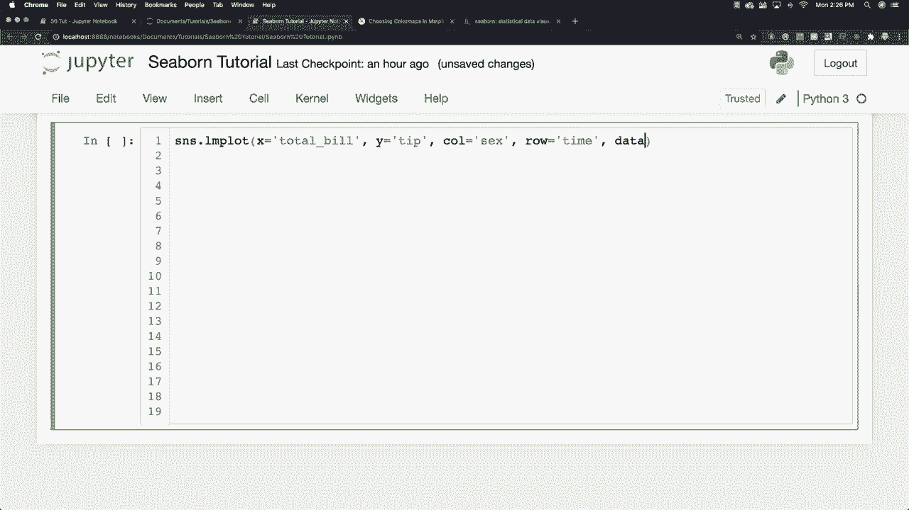

## 高级分面回归图

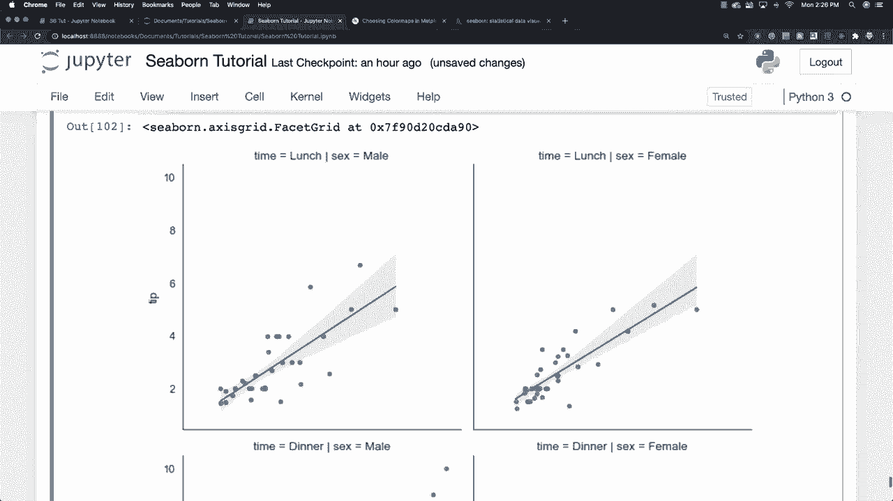

除了按颜色分组，我们还可以将数据拆分到不同的子图中进行分析，这称为“分面”。例如，我们可以按“星期几”和“用餐时间”来分别查看回归关系。

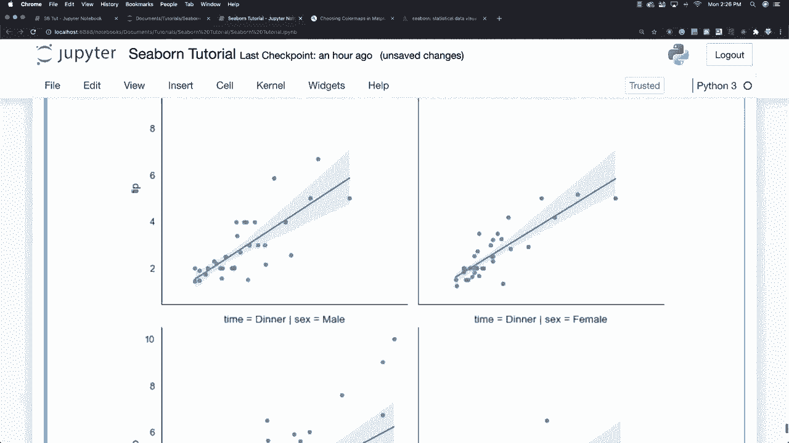

以下是创建分面回归图的方法：

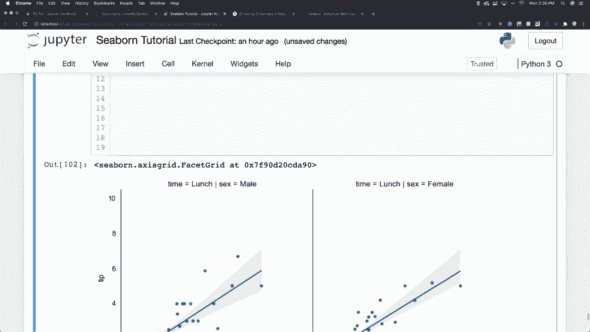

我们将使用`sns.lmplot()`的`col`和`row`参数。`col='day'`会将数据按星期几分到不同的列，`row='time'`则会按午餐/晚餐分到不同的行。

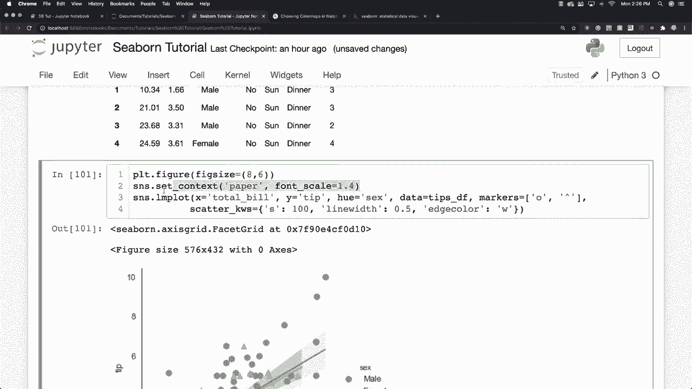

```python
sns.lmplot(x='total_bill',
           y='tip',
           col='day',
           row='time',
           data=tips)
plt.show()
```

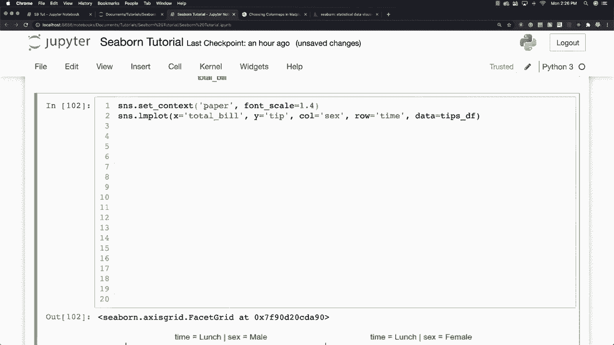

这个图表让我们能够同时观察多个维度（星期几和用餐时间）如何影响总账单与小费之间的关系，为分析提供了更丰富的视角。

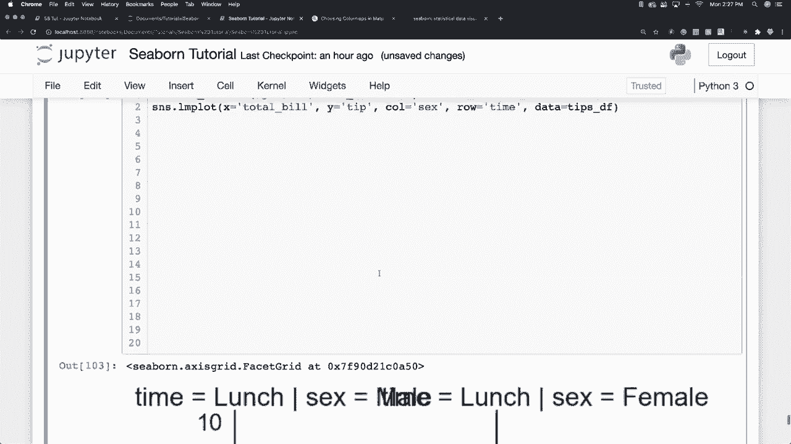

---

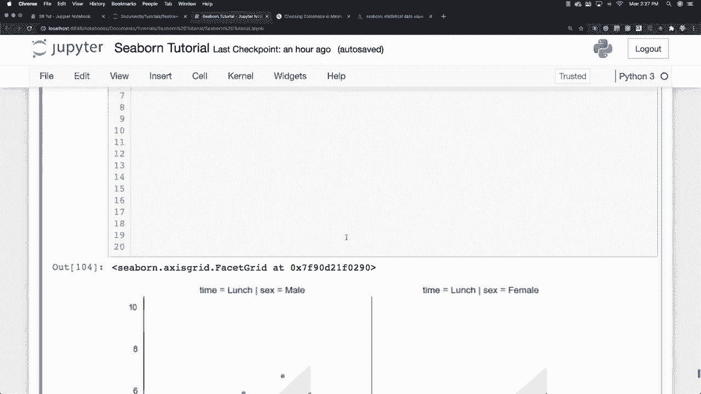

## 调整图形尺寸与比例

有时默认的图形尺寸可能不合适。我们可以调整整个图形的大小或子图的长宽比。

例如，我们可以使用`height`参数设置每个子图的高度，用`aspect`参数设置宽度与高度的比例。

```python
sns.lmplot(x='total_bill',
           y='tip',
           col='day',
           row='time',
           data=tips,
           height=4,      # 每个子图的高度
           aspect=0.8)    # 宽度与高度的比例为0.8
plt.show()
```

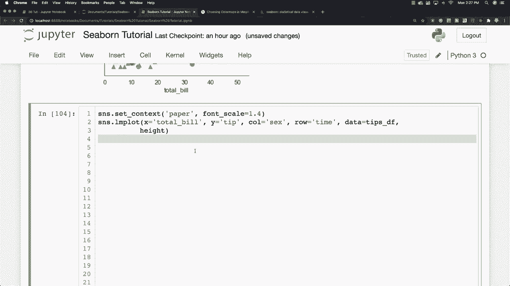

通过调整这些参数，我们可以让图表布局更合理，更便于阅读和展示。

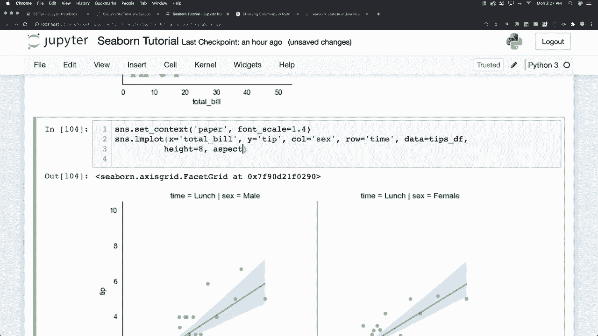

---

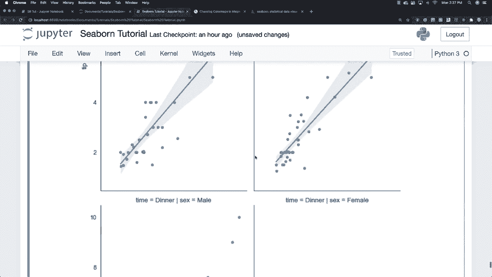

## 总结

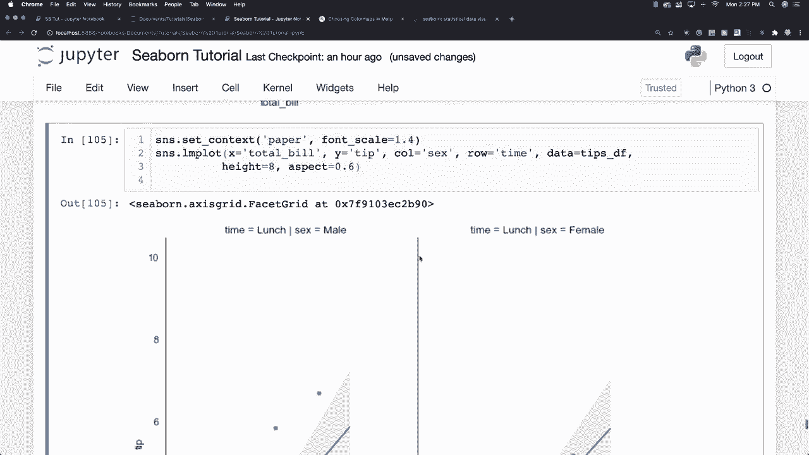

本节课中我们一起学习了如何使用Seaborn绘制回归图。我们从基础的单变量回归开始，逐步深入到如何通过`hue`参数进行分组着色，以及如何使用`col`和`row`参数创建分面网格来同时分析多个分类变量的影响。我们还探讨了如何自定义散点图的标记、大小和边缘样式，以及如何调整整体图形的尺寸和比例。

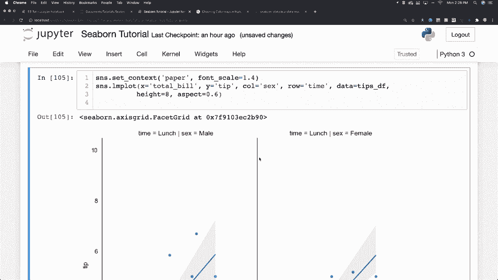

回归图是探索和展示变量间关系的强大工具，结合Seaborn的简洁语法和丰富的定制选项，可以高效地创建出信息丰富且美观的可视化图表。