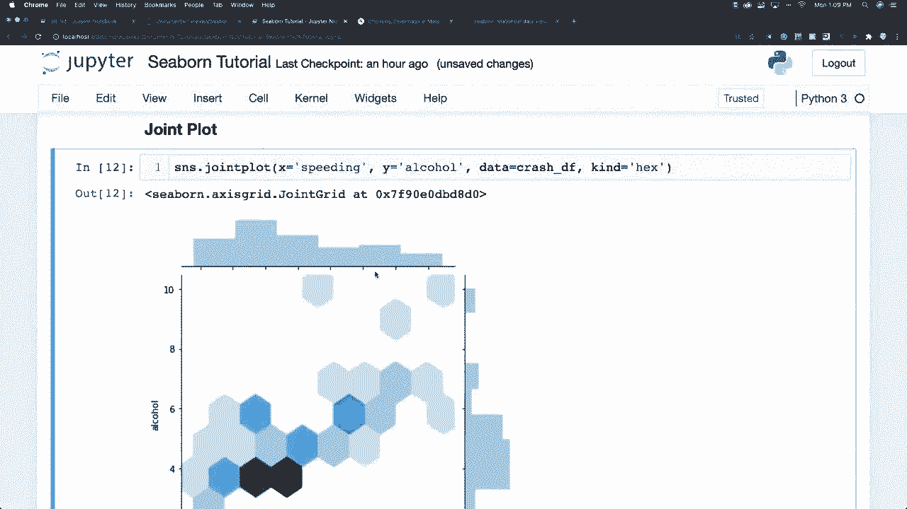
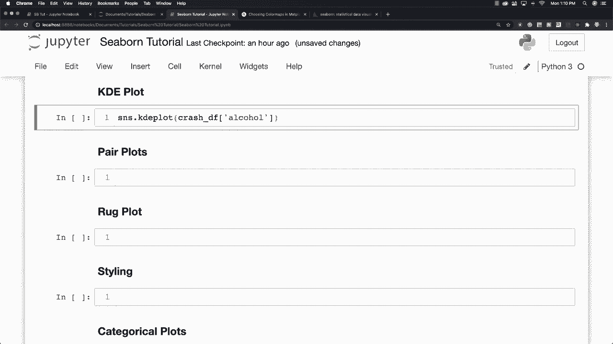
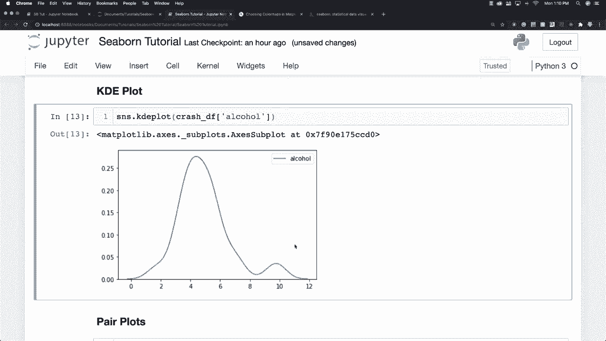

# 更简单的绘图工具包Seaborn，P7：L7-KDE图 📊

在本节课中，我们将要学习Seaborn中的KDE图。KDE图是一种用于可视化数据分布的工具，它通过平滑的曲线来估计数据的概率密度。我们将从基础概念开始，逐步学习如何创建和定制KDE图。



## 概述

上一节我们介绍了联合图，其中提到了KDE图。本节中，我们来看看如何独立地创建和使用KDE图。KDE图能够清晰地展示单个变量的分布情况，是数据分析中常用的可视化方法。

## 创建基础KDE图

要创建一个基础的KDE图，你可以使用Seaborn的`kdeplot`函数。以下是创建一个简单KDE图的步骤。

以下是创建KDE图的基本代码示例：

```python
import seaborn as sns
import matplotlib.pyplot as plt

# 加载示例数据集
tips = sns.load_dataset('tips')

# 创建KDE图
sns.kdeplot(data=tips, x='total_bill')
plt.show()
```

这段代码会生成一个展示`total_bill`列数据分布的KDE图。

## 深入理解KDE图

KDE图的核心是核密度估计，它是一种非参数方法，用于估计随机变量的概率密度函数。公式可以表示为：

\[
\hat{f}_h(x) = \frac{1}{n} \sum_{i=1}^{n} K_h(x - x_i) = \frac{1}{nh} \sum_{i=1}^{n} K\Big(\frac{x-x_i}{h}\Big)
\]

其中，\(K\)是核函数（通常使用高斯核），\(h\)是带宽参数，它控制着平滑程度。

## 定制KDE图

你可以通过调整多个参数来定制KDE图的外观和含义，使其更符合你的分析需求。



以下是常用的定制选项列表：

*   **调整带宽（bandwidth）**：使用`bw_adjust`参数。较小的值使曲线更贴合数据细节，较大的值使曲线更平滑。
    ```python
    sns.kdeplot(data=tips, x='total_bill', bw_adjust=0.5) # 更细节
    sns.kdeplot(data=tips, x='total_bill', bw_adjust=2)   # 更平滑
    ```

*   **填充颜色**：使用`fill`参数。设置为`True`可以为曲线下的区域填充颜色。
    ```python
    sns.kdeplot(data=tips, x='total_bill', fill=True)
    ```

*   **多变量KDE**：通过`hue`参数，可以根据数据中的分类变量绘制多个KDE曲线，便于比较。
    ```python
    sns.kdeplot(data=tips, x='total_bill', hue='time', fill=True)
    ```



*   **累积分布**：使用`cumulative`参数可以绘制累积密度函数图。
    ```python
    sns.kdeplot(data=tips, x='total_bill', cumulative=True)
    ```

## KDE图与其他图表的结合

正如开头提到的，KDE图常常与其他图表结合使用，例如在联合图中作为边际分布图出现。理解独立的KDE图是有效使用这些复合图表的基础。

## 总结

本节课中我们一起学习了Seaborn中的KDE图。我们从如何创建一个基础的KDE图开始，然后深入了解了其背后的核密度估计原理，最后探讨了如何通过调整带宽、填充颜色等参数来定制图表，以及如何利用`hue`参数进行多组数据分布的对比。掌握KDE图将帮助你更好地理解和展示数据的分布特征。