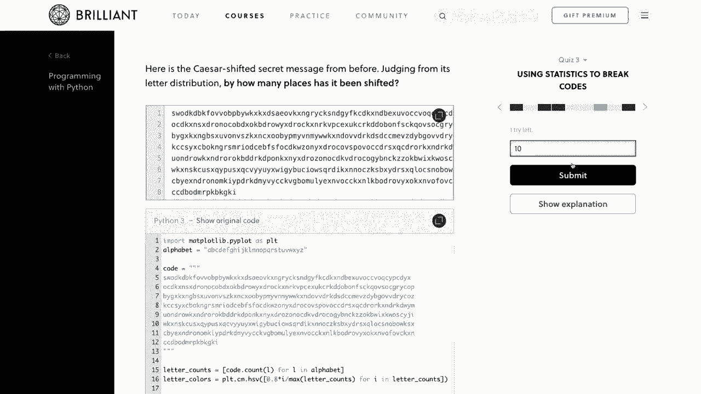
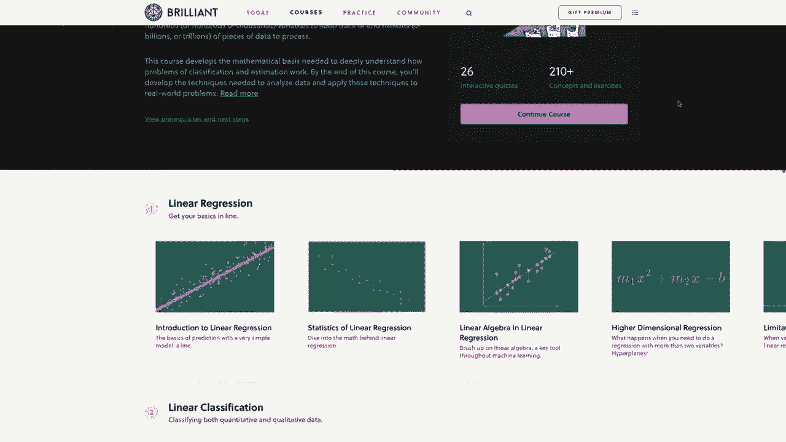
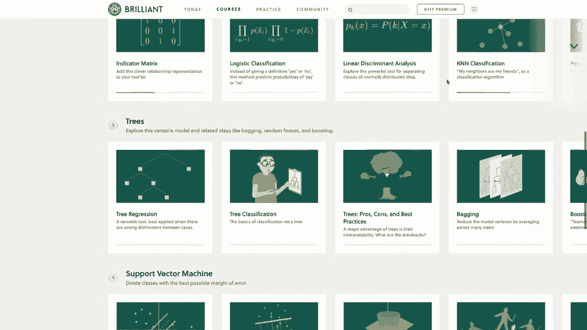
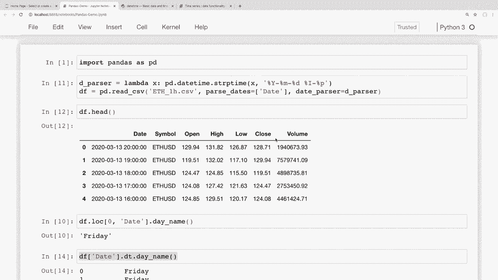

# 课程 P10：用 Pandas 进行数据处理与分析 📅 - 日期和时间序列数据处理

在本节课中，我们将学习如何在 Pandas 中处理日期和时间序列数据。我们将涵盖如何正确读取日期数据、按日期筛选、对时间序列进行重采样以及简单的数据可视化。

## 概述

日期和时间数据是数据分析中常见的数据类型。Pandas 提供了强大的工具来处理这类数据，包括解析、筛选、分组和绘图。本节课将使用一个加密货币的历史小时数据作为示例，演示这些核心操作。

## 读取和转换日期时间数据

首先，我们需要将数据中的日期字符串转换为 Pandas 能够识别的 `datetime` 对象。这是使用日期时间功能的前提。

### 加载数据

我们使用一个包含以太坊（ETH）每小时历史数据的 CSV 文件。数据包含日期、开盘价、收盘价、最高价、最低价和交易量等信息。

```python
import pandas as pd
df = pd.read_csv('ETH_1H.csv')
print(df.head())
print(df.shape)
```

### 将字符串转换为日期时间

数据中的“日期”列最初是字符串格式。我们可以使用 `pd.to_datetime` 函数进行转换。如果 Pandas 无法自动识别格式，我们需要指定 `format` 参数。

以下是日期格式字符串的构成：
*   `%Y`: 四位数的年份
*   `%m`: 两位数的月份
*   `%d`: 两位数的日期
*   `%I`: 12小时制的小时
*   `%p`: AM/PM 标识

```python
# 方法一：加载后转换
df['Date'] = pd.to_datetime(df['Date'], format='%Y-%m-%d %I-%p')
```

我们也可以在读取 CSV 文件时直接指定列进行解析，这通常更高效。

```python
# 方法二：加载时解析
date_parser = lambda x: pd.datetime.strptime(x, '%Y-%m-%d %I-%p')
df = pd.read_csv('ETH_1H.csv', parse_dates=['Date'], date_parser=date_parser)
```

转换后，日期列就变成了 `datetime` 对象，我们可以使用相关方法了。

## 使用日期时间方法

将数据转换为 `datetime` 类型后，我们可以访问丰富的日期时间方法。

### 在序列上应用日期时间方法

类似于字符串的 `.str` 访问器，日期时间序列有 `.dt` 访问器。

```python
# 获取每个日期是星期几
df['DayOfWeek'] = df['Date'].dt.day_name()
print(df[['Date', 'DayOfWeek']].head())
```

### 计算时间范围

我们可以轻松找到数据集的时间跨度。

```python
earliest_date = df['Date'].min()
latest_date = df['Date'].max()
time_span = latest_date - earliest_date
print(f"最早日期: {earliest_date}")
print(f"最新日期: {latest_date}")
print(f"时间跨度: {time_span}")
```

## 按日期时间筛选数据

上一节我们介绍了如何转换和使用日期时间方法，本节中我们来看看如何基于日期时间条件来筛选数据行。

### 使用比较运算符筛选

我们可以使用字符串或 `datetime` 对象与日期列进行比较，创建布尔掩码进行筛选。

```python
# 使用字符串筛选2020年的数据
filter_2020 = df['Date'] >= '2020'
df_2020 = df.loc[filter_2020]
print(df_2020.head())

# 使用datetime对象筛选2019年的数据
start_date = pd.to_datetime('2019-01-01')
end_date = pd.to_datetime('2020-01-01')
filter_2019 = (df['Date'] >= start_date) & (df['Date'] < end_date)
df_2019 = df.loc[filter_2019]
print(df_2019.head())
```

### 将日期设置为索引后进行筛选

如果日期列是唯一的，将其设置为索引可以简化筛选操作，特别是使用切片语法时。

```python
# 将日期列设置为索引
df.set_index('Date', inplace=True)

# 直接获取某年的数据
df_2019 = df['2019']
print(df_2019.head())

# 使用切片获取特定日期范围的数据（例如2020年1月到2月）
df_jan_feb_2020 = df['2020-01':'2020-02']
print(df_jan_feb_2020.head())
```

## 重采样时间序列数据

当我们拥有细粒度的时间序列数据（如每小时）时，重采样（Resampling）是一个强大的功能，可以将其聚合到更粗的时间粒度（如每天、每周）。

### 对单个序列进行重采样

以下是如何将每小时最高价重采样为每日最高价。

```python
# 重采样为每日（'D'）并取最大值
daily_highs = df['High'].resample('D').max()
print(daily_highs.head())

# 验证某一天的值
print(daily_highs['2020-01-01'])
```

### 对整个数据框进行重采样并应用多种聚合函数

我们可以同时对多列进行重采样，并为每列指定不同的聚合方法。

```python
# 按周（'W'）重采样，并对不同列应用不同的聚合函数
weekly_data = df.resample('W').agg({
    'Close': 'mean',      # 周平均收盘价
    'High': 'max',        # 周最高价
    'Low': 'min',         # 周最低价
    'Volume': 'sum'       # 周总交易量
})
print(weekly_data.head())
```

## 时间序列数据可视化

Pandas 集成了 Matplotlib，可以非常方便地对时间序列数据进行绘图。在 Jupyter Notebook 中，我们需要先运行魔法命令 `%matplotlib inline`。

```python
%matplotlib inline
import matplotlib.pyplot as plt

# 绘制每日最高价的折线图
daily_highs.plot(figsize=(12, 6), title='Daily High Price (ETH)')
plt.xlabel('Date')
plt.ylabel('Price')
plt.show()
```

## 总结






本节课中我们一起学习了 Pandas 处理日期和时间序列数据的核心技能。



我们首先学习了如何将字符串格式的日期正确转换为 `datetime` 对象，这是所有后续操作的基础。接着，我们探索了如何使用 `.dt` 访问器调用日期时间方法，以及如何按日期条件筛选数据，特别是将日期设为索引后使用切片的高效方法。

然后，我们深入了解了重采样功能，它能够将数据从一种时间频率转换到另一种，并支持灵活的聚合计算。最后，我们简要介绍了如何使用 Pandas 快速绘制时间序列图表。



掌握这些技能，你就能为时间序列数据分析打下坚实的基础，进行趋势观察、周期分析和数据聚合等任务。在接下来的课程中，我们将学习如何从更多样的数据源（如 Excel、SQL 数据库）读取数据。