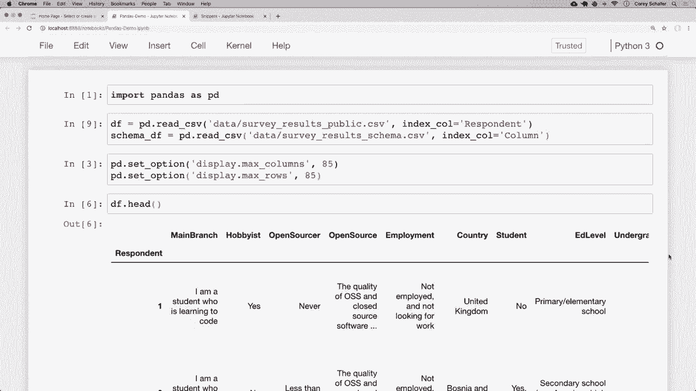
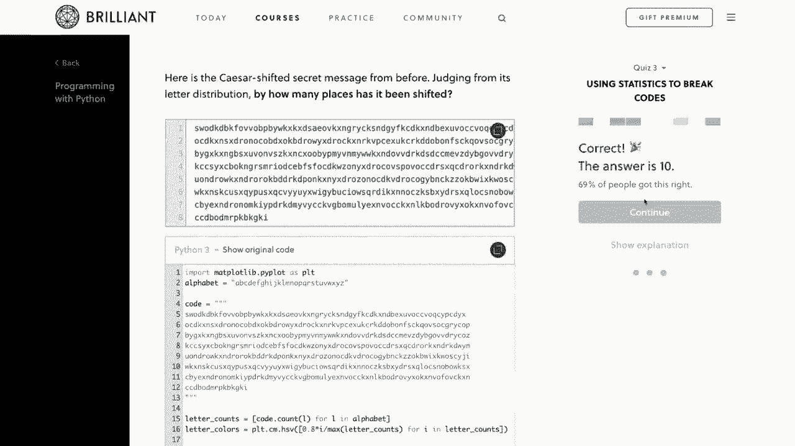
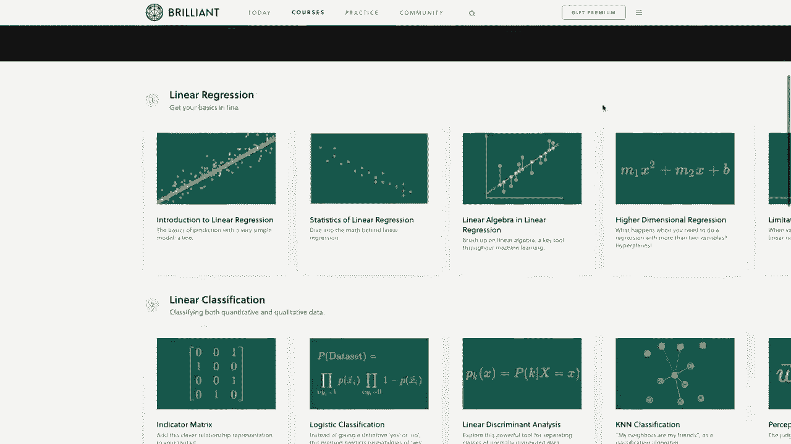
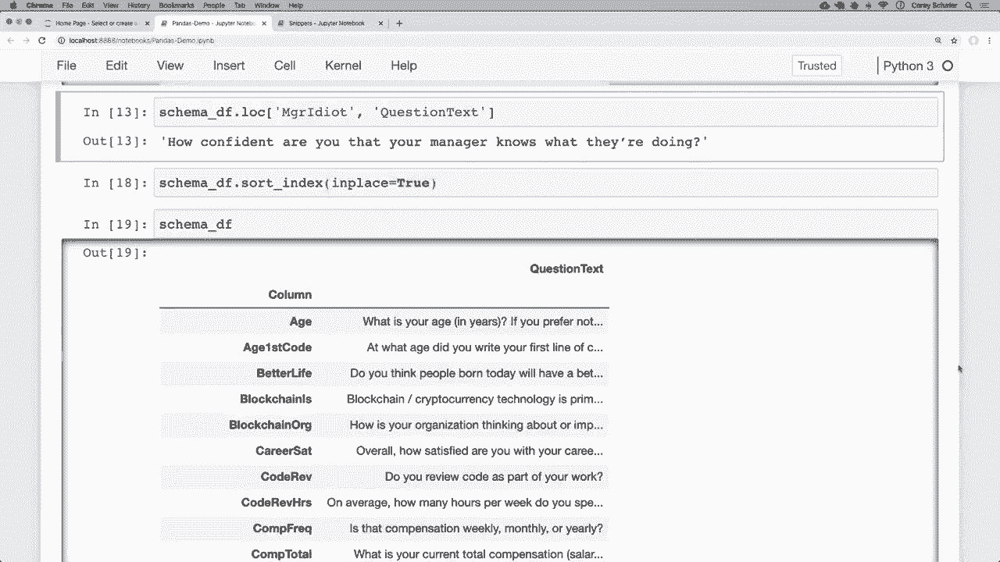

# 用 Pandas 进行数据处理与分析！P3：3）索引 - 如何设置、重置和使用索引 🔍

在本节课中，我们将深入学习 Pandas 中的索引。我们将学习如何设置自定义索引、重置索引以及利用索引高效地访问数据。理解索引是掌握 Pandas 数据操作的关键一步。

## 概述

索引是 Pandas DataFrame 左侧的标签列，用于唯一标识每一行数据。默认情况下，它是一个从0开始的整数序列。然而，根据数据特性，设置一个更有意义的自定义索引（如用户ID、电子邮件等）可以极大地提升数据查询和操作的效率。本节课我们将通过实例，学习如何设置、使用和重置索引。

## 默认索引与自定义索引

在之前的课程中，我们看到的 DataFrame 左侧未命名的数字列就是默认索引。它只是一个简单的整数范围，作为行的标识符。

例如，对于一个包含姓名和邮箱的小型 DataFrame，其默认索引是 `0, 1, 2`。

```python
import pandas as pd

data = {
    ‘first_name‘: [‘Cory‘, ‘Jane‘, ‘John‘],
    ‘last_name‘: [‘Schaefffer‘, ‘Doe‘, ‘Smith‘],
    ‘email‘: [‘CorySchaef@gmail.com‘, ‘JaneDoe@email.com‘, ‘JohnSmith@email.com‘]
}
df = pd.DataFrame(data)
print(df)
```

有时，使用数据中具有唯一性的列（如电子邮件地址）作为索引会更有意义。这为每一行提供了一个清晰、独特的标签。

## 如何设置索引

我们可以使用 `set_index()` 方法将 DataFrame 的某一列设置为新的索引。

以下是设置索引的步骤：

1.  **临时设置索引**：使用 `df.set_index(‘column_name‘)`。这不会改变原始 DataFrame，方便我们进行实验。
2.  **永久设置索引**：使用 `df.set_index(‘column_name‘, inplace=True)`。这会直接修改原始 DataFrame。

让我们将上面示例中的 `email` 列设置为索引：

```python
# 临时设置，查看效果
df_temp = df.set_index(‘email‘)
print(df_temp)

# 永久设置索引
df.set_index(‘email‘, inplace=True)
print(df)
```

设置后，`email` 列会移动到最左侧并变为粗体，成为新的索引。我们可以通过 `df.index` 属性来查看索引的具体内容。

## 使用索引访问数据

设置自定义索引后，我们可以使用 `.loc[]` 索引器通过标签（即索引值）来访问特定的行。

例如，要查找邮箱为 `‘CorySchaef@gmail.com‘` 的行：

```python
# 通过索引标签访问整行
row = df.loc[‘CorySchaef@gmail.com‘]
print(row)

# 通过索引标签访问特定列
last_name = df.loc[‘CorySchaef@gmail.com‘, ‘last_name‘]
print(last_name)
```

请注意，设置自定义索引后，原来的整数位置索引（如 `0`）将不再有效。如果仍需按整数位置访问数据，应使用 `.iloc[]` 索引器。

```python
# 使用 .iloc 按整数位置访问第一行
first_row = df.iloc[0]
print(first_row)
```

## 如何重置索引

如果我们想撤销索引设置，恢复默认的整数索引，可以使用 `reset_index()` 方法。

同样，我们可以选择临时重置或永久重置：

```python
# 永久重置索引，将当前索引恢复为一列
df.reset_index(inplace=True)
print(df)
```

重置后，原来的索引（`email` 列）会变回普通的数据列，DataFrame 左侧会重新出现从0开始的整数索引。

## 在数据加载时设置索引

除了事后设置，我们也可以在从文件（如 CSV）加载数据时直接指定索引列，这更加高效。

假设我们有一个调查数据文件 `survey_results.csv`，其中 `‘respondent_id‘` 列是唯一标识符，适合作为索引。

```python
# 在读取 CSV 文件时直接设置索引
df_survey = pd.read_csv(‘survey_results.csv‘, index_col=‘respondent_id‘)
print(df_survey.head())
```

## 索引的实际应用案例

让我们通过一个更实际的例子来巩固对索引的理解。假设我们有两个 DataFrame：
1.  `df_survey`：包含调查回答数据。
2.  `df_schema`：一个数据字典，解释 `df_survey` 中每一列的含义。

`df_schema` 可能有两列：`‘column‘`（列名）和 `‘question_text‘`（问题文本）。将 `‘column‘` 设置为索引后，我们可以快速查找任何列的含义。

```python
# 设置 schema 的索引
df_schema.set_index(‘column‘, inplace=True)



# 快速查找 ‘hobbyist‘ 列的含义
meaning = df_schema.loc[‘hobbyist‘, ‘question_text‘]
print(meaning)
# 输出可能为：”Do you code as a hobby?”
```

## 索引排序

为了使索引更易于浏览，我们可以对其进行排序。使用 `sort_index()` 方法可以对索引按字母或数字顺序进行排列。

```python
# 按索引升序排序（临时查看）
print(df_schema.sort_index())




# 按索引降序排序（永久修改）
df_schema.sort_index(ascending=False, inplace=True)
print(df_schema)
```




排序索引能让你在使用 `.loc[]` 进行查找或手动浏览数据时更加方便。

## 总结

本节课我们一起学习了 Pandas 索引的核心操作。我们了解了默认索引与自定义索引的区别，学会了如何使用 `set_index()` 设置索引、使用 `.loc[]` 通过标签访问数据、使用 `reset_index()` 重置索引，以及在数据加载时直接指定索引。我们还通过实际案例看到了设置索引如何提升数据查询的效率，并介绍了对索引进行排序的方法。

合理使用索引是组织和平滑化数据工作流的重要技巧。在下一节课中，我们将学习如何根据特定条件过滤 DataFrame 中的数据。



---
*本教程由视频内容翻译整理而成，旨在帮助初学者理解 Pandas 索引的基本概念与操作。*