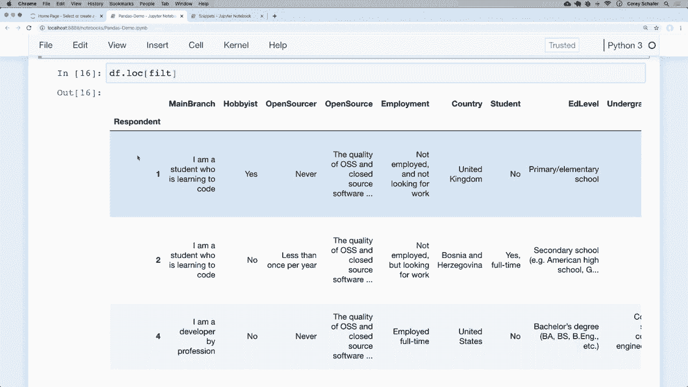
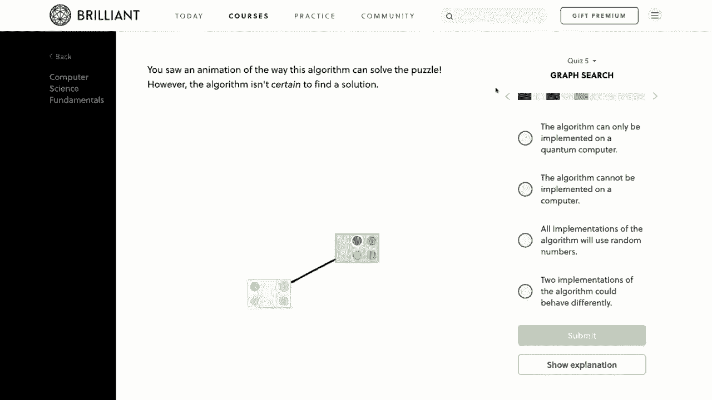
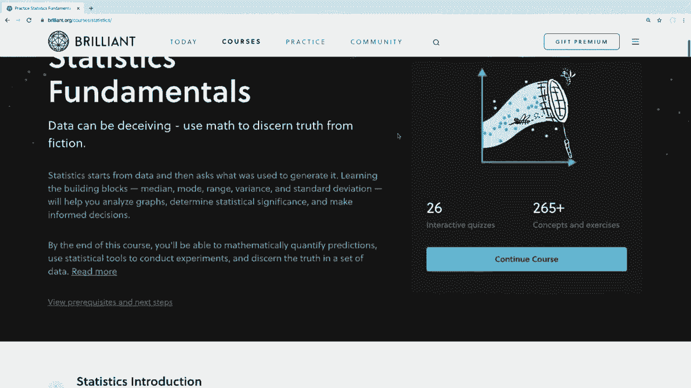
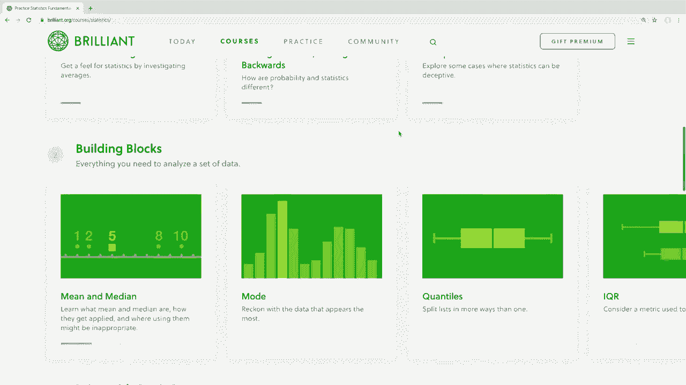
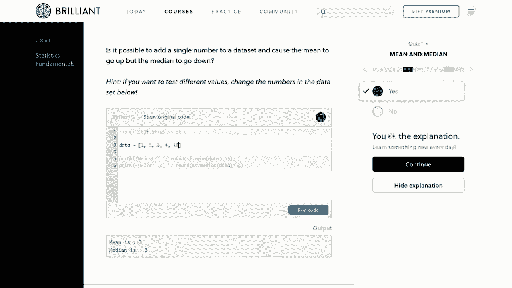
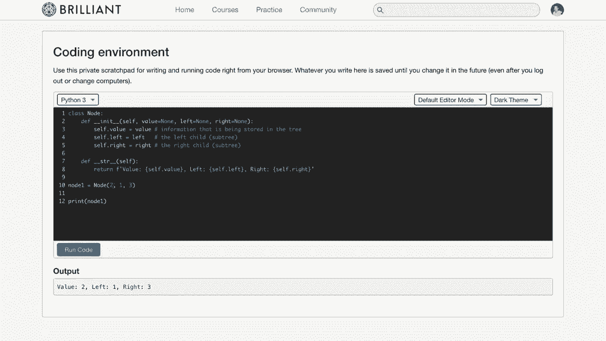
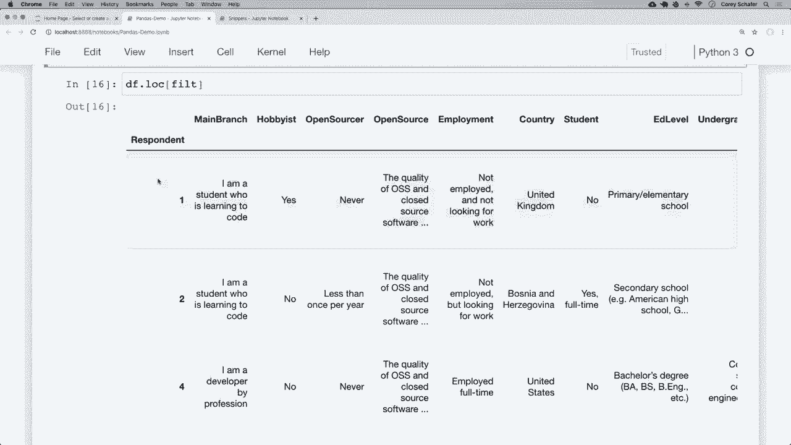

# 用 Pandas 进行数据处理与分析！P4：4）过滤 - 使用条件过滤行和列 🔍

在本节课中，我们将要学习如何从 Pandas 的 `DataFrame` 和 `Series` 对象中过滤数据。这是数据分析中至关重要的一步，它允许我们专注于数据集中满足特定条件的部分，例如筛选出会使用 Python 的受访者，或者来自特定国家的调查结果。

## 概述

过滤是 Pandas 的核心功能之一，它通过应用条件“掩码”来选择数据。我们将从基础比较操作开始，逐步学习如何构建和应用复杂的过滤条件，包括使用逻辑运算符和字符串方法。

---

## 过滤的基础：布尔掩码

上一节我们介绍了课程目标，本节中我们来看看过滤是如何工作的。其核心是创建一个布尔序列（即一系列 `True` 和 `False` 值），然后将其应用于原始数据。

当我们对 `DataFrame` 的某一列进行条件比较时，Pandas 会返回一个 `Series`，其值为布尔值。

```python
# 假设 df 是一个 DataFrame，其中包含 ‘last_name’ 列
mask = df[‘last_name’] == ‘Do’
print(mask)
```

运行上述代码会得到一个布尔序列。`True` 表示该行满足条件（姓氏为 ‘Do’），`False` 则表示不满足。这个布尔序列就是我们的“掩码”。

---

## 应用过滤器

得到布尔掩码后，我们可以将其应用于原始 `DataFrame` 以筛选出符合条件的行。主要有两种应用方式。

以下是应用过滤器的两种常见方法：

1.  **使用方括号 `[]` 直接传入布尔序列**：
    ```python
    filtered_df = df[mask]
    ```

2.  **使用 `.loc` 索引器**（推荐）：
    ```python
    filtered_df = df.loc[mask]
    ```
    使用 `.loc` 的优势在于可以同时筛选行和列。其语法为 `df.loc[行条件, 列名]`。

例如，要筛选出姓氏为 ‘Do’ 的行的 ‘email’ 列：
```python
emails = df.loc[mask, ‘email’]
```

---

## 组合条件：与（&）和或（|）

通常我们需要基于多个条件进行过滤。在 Pandas 中，我们不能使用 Python 关键字 `and` 和 `or`，而必须使用符号 `&`（与）和 `|`（或）。每个条件必须用括号括起来。

以下是组合条件过滤的示例：

*   **与操作（&）**：筛选同时满足多个条件的行。
    ```python
    # 筛选姓氏为 ‘Do’ 且名字为 ‘John’ 的行
    mask = (df[‘last_name’] == ‘Do’) & (df[‘first_name’] == ‘John’)
    result = df.loc[mask]
    ```

*   **或操作（|）**：筛选满足任意一个条件的行。
    ```python
    # 筛选姓氏为 ‘Shaeffer’ 或名字为 ‘John’ 的行
    mask = (df[‘last_name’] == ‘Shaeffer’) | (df[‘first_name’] == ‘John’)
    result = df.loc[mask]
    ```

*   **取反操作（~）**：获取不满足某个条件的行。
    ```python
    # 获取不满足上述 ‘mask’ 条件的行
    opposite_result = df.loc[~mask]
    ```

---

## 实战：在调查数据中应用过滤

现在，让我们将这些技巧应用到一个更真实的场景中，使用一个包含 Stack Overflow 开发者调查数据的 `DataFrame`。

假设我们想分析高收入开发者的情况。

首先，创建一个筛选薪资超过 70,000 的过滤器：
```python
high_salary_mask = df[‘ConvertedSalary’] > 70000
high_salary_df = df.loc[high_salary_mask]
```

为了看得更清楚，我们可以同时筛选特定的列：
```python
result = df.loc[high_salary_mask, [‘Country’, ‘LanguageWorkedWith’, ‘ConvertedSalary’]]
```

---

## 基于列表成员资格进行过滤

如果我们想筛选出来自特定几个国家的数据，手动使用多个 `|` 操作符会很繁琐。

以下是一个更简洁的方法：使用 `.isin()` 方法。

```python
# 定义我们感兴趣的国家列表
countries_of_interest = [‘United States’, ‘India’, ‘United Kingdom’, ‘Germany’, ‘Canada’]
# 创建过滤器
country_mask = df[‘Country’].isin(countries_of_interest)
# 应用过滤器
filtered_by_country = df.loc[country_mask, ‘Country’]
```

---

## 使用字符串方法进行过滤

有时我们需要基于文本内容进行模糊筛选。例如，在“使用的语言”列中查找所有会 Python 的开发者。该列的值可能是用分号分隔的多种语言。

这时，我们可以使用 Pandas 的字符串方法 `.str.contains()`。



以下是使用字符串方法过滤的步骤：

1.  对目标列使用 `.str.contains(‘搜索词’)` 方法。
2.  该方法会返回一个布尔序列，表示每个单元格的字符串是否包含搜索词。
3.  将得到的布尔序列作为掩码应用。

```python
# 筛选会 Python 的开发者
python_mask = df[‘LanguageWorkedWith’].str.contains(‘Python’, na=False)
python_users = df.loc[python_mask, ‘LanguageWorkedWith’]
```
参数 `na=False` 用于处理该列中的缺失值（NaN），确保它们不会干扰过滤逻辑。





---







## 总结

本节课中我们一起学习了在 Pandas 中进行数据过滤的核心技能。我们了解到：

1.  过滤的本质是**创建并应用布尔掩码**。
2.  可以使用 **`.loc[行掩码， 列名]`** 来高效地筛选行和列。
3.  通过 **`&`（与）、`|`（或）、`~`（非）** 运算符可以组合复杂的过滤条件。
4.  **`.isin()`** 方法便于基于列表进行成员资格筛选。
5.  **`.str.contains()`** 等字符串方法支持基于文本内容的灵活过滤。



掌握过滤是操作和分析数据的基石。在下一节课中，我们将学习如何修改 `DataFrame` 中的数据，例如更改特定值或进行批量转换。