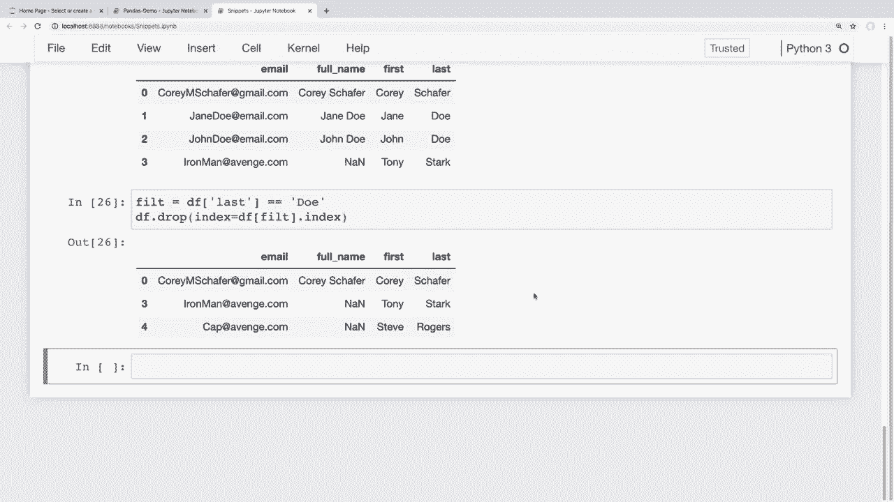
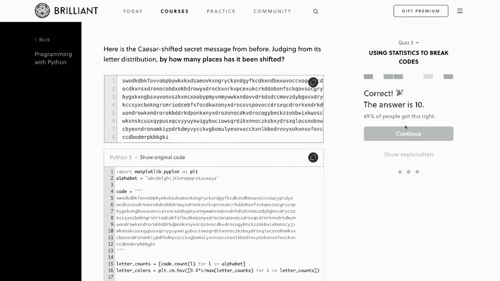
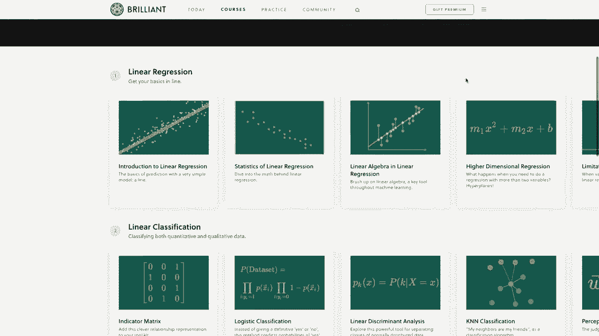
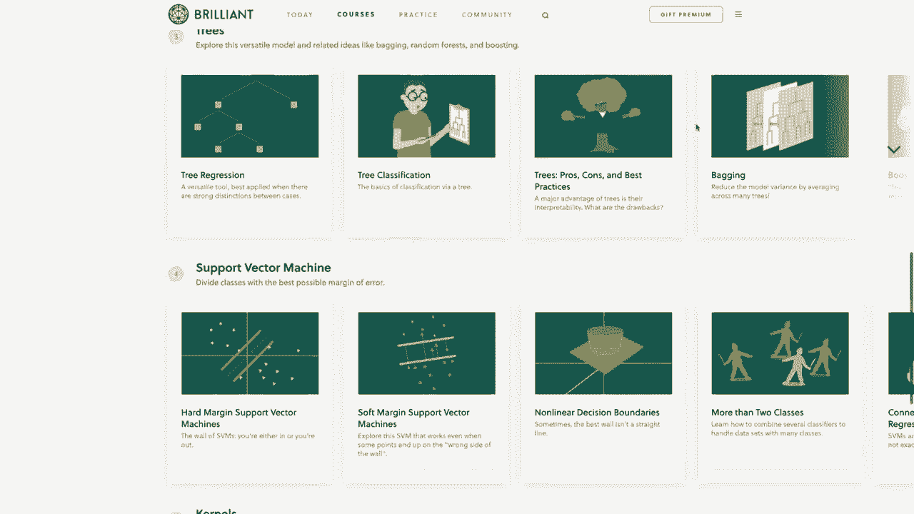
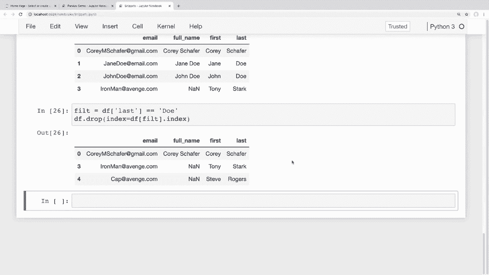

# 用 Pandas 进行数据处理与分析！P6：增删 - 从DataFrame中添加与删除行和列 📝

在本节课中，我们将学习如何向Pandas DataFrame中添加与删除行和列。这是数据清洗和预处理中非常关键的一步，能帮助我们调整数据结构以适应分析需求。

---

## 概述

上一节我们介绍了如何更新DataFrame中已有的行和列。本节中，我们将重点学习如何**添加**新的行和列，以及如何**删除**不需要的行和列。这些操作是构建和整理数据集的基础。

---

## 添加新列

添加新列的操作与我们更新列值非常相似。我们可以通过直接赋值的方式，为DataFrame创建一个新列。

以下是添加新列的具体步骤：

1.  **创建新列并赋值**：通过指定新列名并赋予一个值序列（Series）来完成。
    ```python
    df['新列名'] = 值序列
    ```
2.  **合并现有列**：例如，将“名字”和“姓氏”两列合并为“全名”列。
    ```python
    df['全名'] = df['名字'] + ' ' + df['姓氏']
    ```
3.  **使用`apply`方法**：也可以使用`apply`方法基于现有列进行复杂计算来创建新列。

**注意**：添加列时，必须使用方括号`df[‘列名’]`的语法，而不能使用点符号`df.列名`，因为点符号在Python中用于访问对象属性。

---

## 删除列

当我们不再需要某些列时，可以使用`drop`方法将其删除。

以下是删除列的具体步骤：

1.  **使用`drop`方法**：指定要删除的列名列表。
    ```python
    df.drop(columns=['列名1', '列名2'], inplace=True)
    ```
    *   `inplace=True`参数会使更改直接应用于原DataFrame。
    *   若不设置`inplace=True`，则操作只会返回一个删除列后的新DataFrame视图，而不改变原数据。

---

## 分割列

有时我们需要将一列数据拆分成多列，例如将“全名”拆回“名字”和“姓氏”。

以下是分割列的具体步骤：

1.  使用字符串的`split`方法进行分割。
2.  设置`expand=True`参数，将分割后的列表扩展成多列。
3.  将得到的新列赋值回DataFrame。
    ```python
    # 分割‘全名’列
    分割结果 = df['全名'].str.split(' ', expand=True)
    # 将结果赋值给新列
    df[['名字', '姓氏']] = 分割结果
    ```

---

## 添加新行

向DataFrame中添加新行主要有两种场景：添加单行数据，或合并两个DataFrame。

以下是添加新行的具体方法：

1.  **添加单行数据**：使用`append`方法，传入一个字典或Series。通常需要设置`ignore_index=True`来重新分配索引。
    ```python
    df = df.append({'名字': 'Tony'}, ignore_index=True)
    ```
2.  **合并两个DataFrame**：同样使用`append`方法，将一个DataFrame附加到另一个后面。
    ```python
    df = df.append(df2, ignore_index=True, sort=False)
    ```
    *   为避免列顺序不一致的警告，可以设置`sort=False`。
    *   `append`方法没有`inplace`参数，因此需要将结果赋值回原变量。

---

## 删除行

删除行与删除列类似，使用`drop`方法，但指定的是行的索引。

以下是删除行的具体方法：






1.  **按索引删除**：直接指定要删除行的索引。
    ```python
    df.drop(index=4, inplace=True)
    ```
2.  **按条件删除**：结合条件筛选，删除符合条件的行。为了提高代码可读性，建议将筛选条件单独赋值。
    ```python
    # 定义筛选条件
    filt = df['姓氏'] == 'Do'
    # 删除符合条件行的索引
    df.drop(index=df[filt].index, inplace=True)
    ```



---

## 总结

本节课中我们一起学习了如何对Pandas DataFrame进行“增删”操作：
*   **添加列**：通过直接赋值或`apply`方法实现。
*   **删除列**：使用`drop(columns=…)`方法。
*   **分割列**：利用`str.split(expand=True)`将一列拆分为多列。
*   **添加行**：使用`append`方法添加单行或合并DataFrame。
*   **删除行**：使用`drop(index=…)`方法，可按索引或条件删除。





掌握这些操作能让你更灵活地塑造和清理数据集，为后续的数据分析打下坚实基础。下一节，我们将学习如何对DataFrame中的数据进行排序。