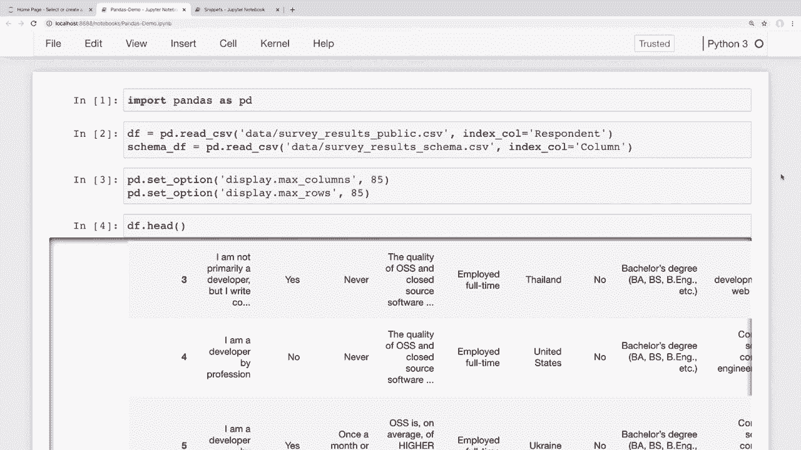
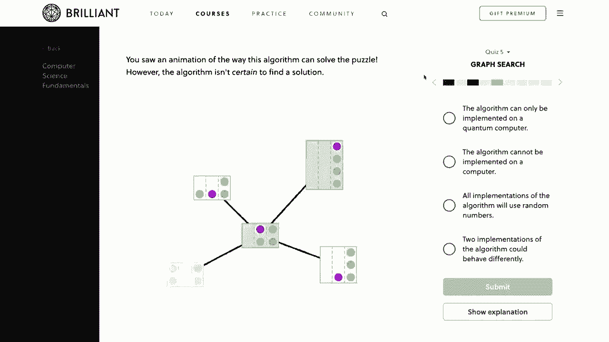
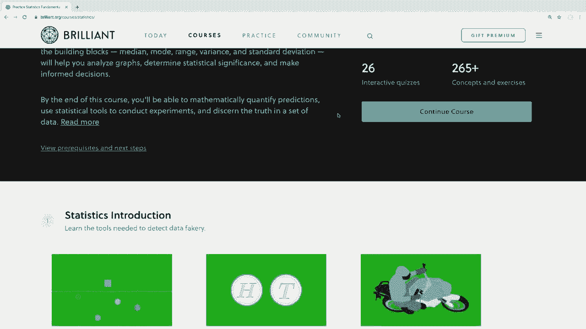
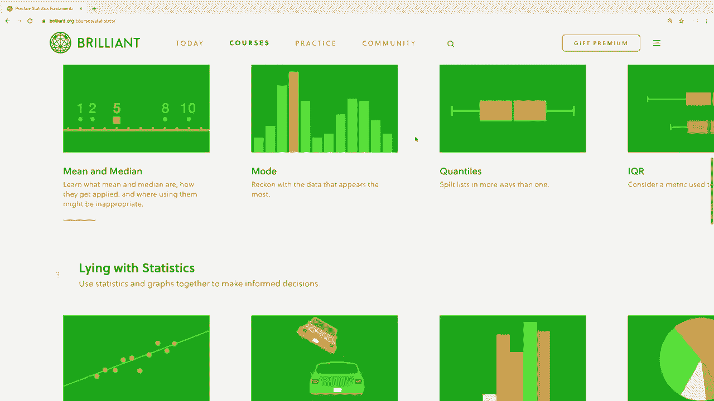
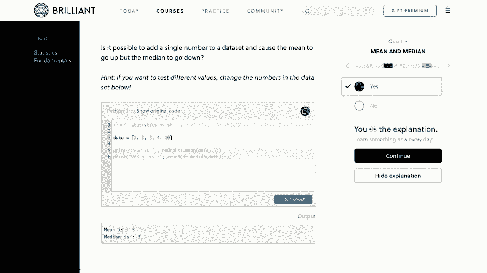
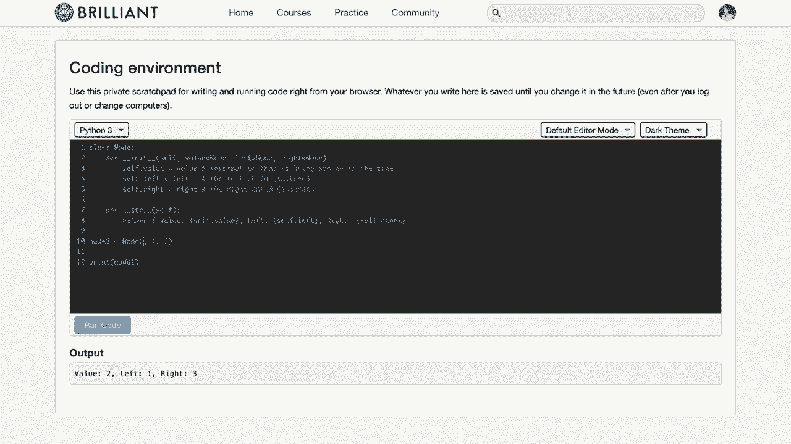
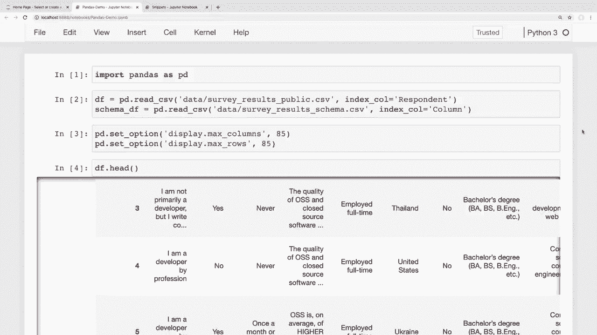

# 课程名称：用 Pandas 进行数据处理与分析！P7：数据排序 📊

在本节课中，我们将学习如何在 Pandas 中对数据进行排序。内容包括对单列或多列进行排序、按升序或降序排列，以及快速提取数据集中的最大值和最小值。掌握排序是数据整理和分析的基础步骤。

---

## 1. 在小数据集上进行排序

上一节我们介绍了课程概述，本节中我们来看看如何对一个简单的数据框进行排序。首先，我们创建一个示例数据框。

```python
import pandas as pd

data = {
    'first': ['John', 'Jane', 'Adam'],
    'last': ['Doe', 'Doe', 'Doe'],
    'email': ['john@email.com', 'jane@email.com', 'adam@do.com']
}
df = pd.DataFrame(data)
print(df)
```

### 1.1 按单列排序

以下是按单列（如“姓氏”）进行排序的方法。使用 `df.sort_values()` 方法，并通过 `by` 参数指定列名。

```python
# 按姓氏升序排序
df_sorted = df.sort_values(by='last')
print(df_sorted)

# 按姓氏降序排序
df_sorted_desc = df.sort_values(by='last', ascending=False)
print(df_sorted_desc)
```

### 1.2 按多列排序

有时需要按多个列排序。当第一列的值相同时，将根据第二列的值进行排序。

以下是按多列排序的方法。向 `by` 参数传入一个列名列表，并可通过 `ascending` 参数为每一列指定排序方向。

```python
# 先按姓氏升序，再按名字降序排序
df_multi_sorted = df.sort_values(by=['last', 'first'], ascending=[True, False])
print(df_multi_sorted)
```

### 1.3 永久修改数据框与排序索引

若希望排序结果永久改变原数据框，可使用 `inplace=True` 参数。

```python
# 原地排序，永久修改df
df.sort_values(by='last', inplace=True)
print(df)

# 将索引恢复为原始顺序（按索引排序）
df.sort_index(inplace=True)
print(df)
```

### 1.4 对单列（Series）排序

如果只想对数据框中的某一列进行排序，可以单独访问该列（一个 Series 对象），然后使用其 `sort_values()` 方法。

```python
# 仅对‘last’列进行排序
sorted_last_names = df['last'].sort_values()
print(sorted_last_names)
```

---

## 2. 在大型数据集上应用排序

上一节我们在小数据集上练习了排序，本节中我们来看看如何将这些技巧应用到更大的真实数据集中，例如 Stack Overflow 开发者调查数据。

### 2.1 按国家排序调查数据

假设我们想按“国家”列对调查数据进行排序，以便更容易地浏览不同国家的信息。

```python
# 假设 df_survey 是包含‘Country’和‘ConvertedComp’列的调查数据框
# 按国家升序排序，并原地修改
df_survey.sort_values(by='Country', inplace=True)

# 查看前50行，包括国家和薪资信息
print(df_survey[['Country', 'ConvertedComp']].head(50))
```

### 2.2 组合排序：国家与薪资

我们可能希望先按国家升序排列，然后在每个国家内按薪资降序排列，以快速查看每个国家的最高薪资。

以下是实现组合排序的方法。

```python
# 按国家升序、薪资降序排序
df_survey.sort_values(by=['Country', 'ConvertedComp'], ascending=[True, False], inplace=True)
print(df_survey[['Country', 'ConvertedComp']].head(50))
```

---

## 3. 快速获取最大值与最小值

有时我们排序只是为了找出数据集中的极值。Pandas 提供了更直接的方法来获取最大或最小的 N 个值。

### 3.1 获取最大的 N 个值

使用 `nlargest()` 方法可以快速获取指定列中最大的 N 个值。

```python
# 获取‘ConvertedComp’列中最大的10个值
top_10_salaries = df_survey['ConvertedComp'].nlargest(10)
print(top_10_salaries)

# 获取薪资最高的10行完整数据
top_10_rows = df_survey.nlargest(10, 'ConvertedComp')
print(top_10_rows)
```



### 3.2 获取最小的 N 个值







相应地，使用 `nsmallest()` 方法可以快速获取最小的 N 个值。





```python
# 获取‘ConvertedComp’列中最小的10个值
bottom_10_salaries = df_survey['ConvertedComp'].nsmallest(10)
print(bottom_10_salaries)
```

---

## 总结

本节课中我们一起学习了 Pandas 中数据排序的核心操作。

我们掌握了如何使用 `sort_values()` 方法对单列或多列进行升序或降序排序，并了解了如何通过 `inplace` 参数永久改变数据框。此外，我们还学习了使用 `nlargest()` 和 `nsmallest()` 方法快速获取数据集中的极值，这对于初步的数据探索非常高效。



排序是数据整理的基础，能帮助我们以更有条理的方式查看和理解数据。在接下来的课程中，我们将学习如何对数据进行聚合与分组，这是进行深入数据分析的关键步骤。