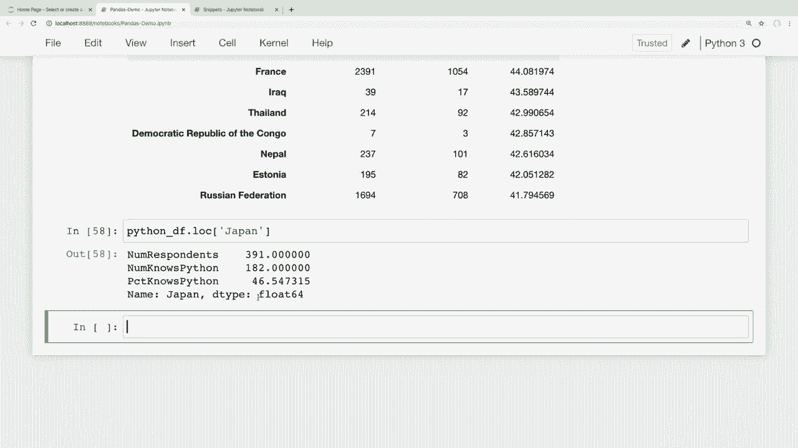
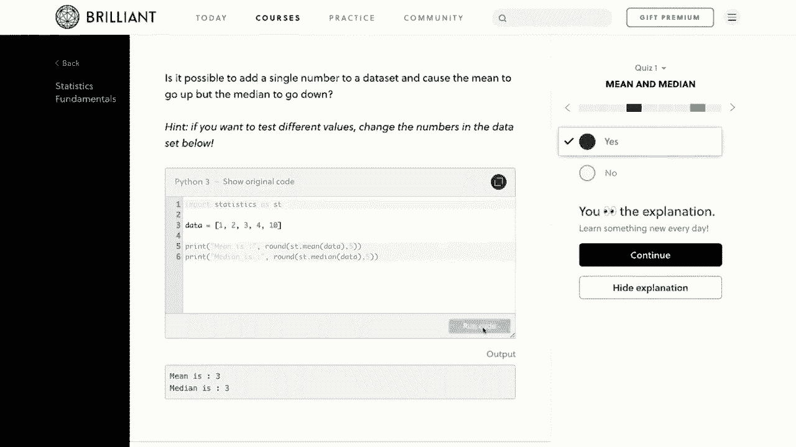
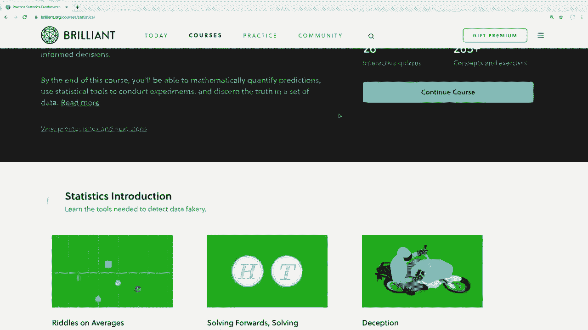
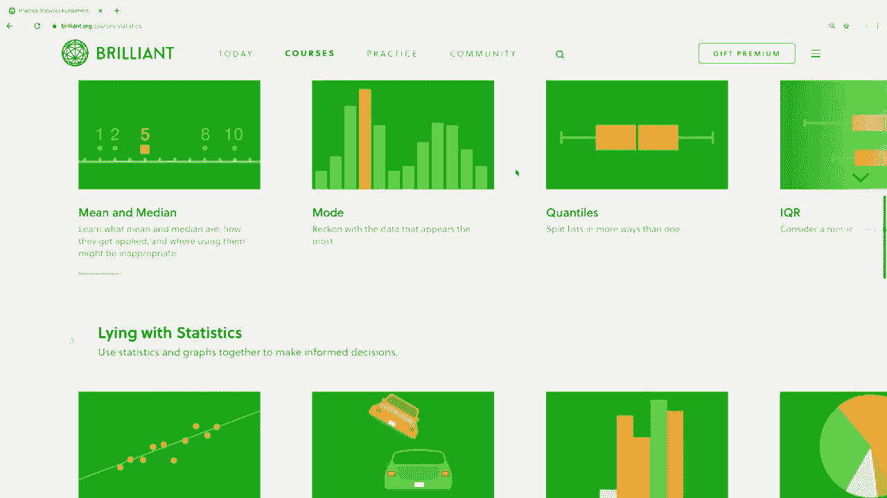

# 用 Pandas 进行数据处理与分析！P8：分组和聚合 - 数据的分析和探索 📊

在本节课中，我们将要学习如何使用 Pandas 对数据进行分组和聚合。这是数据分析的核心技能，能帮助我们回答诸如“开发者的平均薪资是多少？”或“每个国家有多少人会 Python？”这类问题。我们将从基础概念开始，逐步深入到更复杂的应用。

## 概述

数据分析的核心在于从数据中提取有意义的信息。分组和聚合是实现这一目标的关键技术。通过分组，我们可以将数据按照某个标准（如国家）拆分成多个子集；通过聚合，我们可以对每个子集进行计算（如求平均值、计数），从而获得汇总的洞察。

## 基础聚合：理解数据整体情况

在深入分组之前，我们先来看看如何对整个数据集进行简单的汇总分析。聚合函数能将多个数据点合并为一个有意义的统计值。

以下是几个常用的基础聚合函数示例：

```python
# 查看‘转换薪资’列的中位数
median_salary = df['转换薪资'].median()
print(f"调查薪资中位数: {median_salary}")

# 对整个数据框运行中位数函数，它会自动计算所有数值列的中位数
df_median = df.median()
print(df_median)

# 使用describe方法获取数据框的广泛统计概述
df_description = df.describe()
print(df_description)
```

`describe()` 方法会返回计数、均值、标准差、最小值、25%/50%/75%分位数等统计数据。需要注意的是，对于像薪资这样的数据，**中位数**往往比**平均数**更能代表“典型”情况，因为平均数容易受到极高或极低异常值的影响。

## 使用值计数进行类别分析

当我们想了解数据中某个类别字段（如“是/否”问题）的分布时，`value_counts()` 方法非常有用。

以下是使用值计数的示例：

```python
# 查看‘爱好者’列（是否将编码作为爱好）的回答分布
hobby_counts = df['爱好者'].value_counts()
print(hobby_counts)

# 查看‘社交媒体’列，了解开发者最常使用的平台
social_media_counts = df['社交媒体'].value_counts()
print(social_media_counts.head(10))

# 获取百分比形式的分布
social_media_percentages = df['社交媒体'].value_counts(normalize=True)
print(social_media_percentages.head(10))
```

通过这种方式，我们可以快速发现数据中的模式，例如最受欢迎的社交媒体平台是 Reddit。

## 数据分组：按类别深入分析

上一节我们介绍了如何查看数据的整体情况。本节中我们来看看如何按特定条件拆分数据，进行更细致的分析。`groupby()` 函数是完成此操作的核心。

分组操作通常包含三个步骤：**拆分**对象、**应用**函数、**组合**结果。

首先，让我们按国家分组：

```python
# 按‘国家’列对数据框进行分组
country_groups = df.groupby('国家')
```

这个 `country_groups` 是一个 GroupBy 对象，它已经将数据按国家拆分好了。我们可以查看其中一个组：

```python
# 获取‘美国’这个组的所有数据
us_group = country_groups.get_group('美国')
print(us_group.head())
```

## 对分组应用聚合函数

拆分完成后，我们就可以对每个组应用聚合函数，并将结果组合起来。

以下是应用聚合函数的几种方式：

```python
# 计算每个国家薪资的中位数
median_salary_by_country = country_groups['转换薪资'].median()
print(median_salary_by_country.head())

# 对每个组应用多个聚合函数（如中位数和平均数）
salary_stats_by_country = country_groups['转换薪资'].agg(['median', 'mean'])
print(salary_stats_by_country.head())

# 查找每个国家最受欢迎的社交媒体网站
# 这相当于对每个国家的‘社交媒体’列运行 value_counts()
fav_social_by_country = country_groups['社交媒体'].value_counts()
print(fav_social_by_country.head(20))
```

现在，我们可以轻松查询任何国家的信息，例如查询德国或中国的薪资中位数：

```python
germany_median_salary = median_salary_by_country.loc['德国']
china_top_social = fav_social_by_country.loc['中国'].head(1)
```

## 在分组上应用复杂逻辑

有时我们需要的聚合逻辑更复杂，例如计算每个国家会使用 Python 的开发者比例。这需要结合分组、过滤和计算。

以下是一个分步解决方案：

1.  **计算每个国家的总受访人数。**
2.  **计算每个国家会 Python 的受访人数。**
3.  **合并两个结果并计算百分比。**

```python
# 1. 每个国家的总受访人数
respondents_per_country = df['国家'].value_counts()

# 2. 每个国家会 Python 的人数
# 使用 apply 方法在分组上运行自定义函数
python_users_per_country = country_groups['使用的语言'].apply(lambda x: x.str.contains('Python').sum())

# 3. 合并两个 Series 到一个 DataFrame
import pandas as pd
python_df = pd.concat([respondents_per_country, python_users_per_country], axis=1, sort=False)
python_df.columns = ['受访者数量', '会Python人数']

# 4. 计算百分比
python_df['会Python百分比'] = (python_df['会Python人数'] / python_df['受访者数量']) * 100

# 5. 按百分比排序查看
python_df_sorted = python_df.sort_values(by='会Python百分比', ascending=False)
print(python_df_sorted.head(10))

# 查询特定国家，如日本
japan_stats = python_df.loc['日本']
print(japan_stats)
```










## 总结

本节课中我们一起学习了 Pandas 中分组和聚合的强大功能。我们从基础的 `median()`、`describe()` 和 `value_counts()` 开始，理解了如何获取数据的整体摘要。接着，我们深入探讨了 `groupby()` 的核心概念，学会了如何按一个或多个条件拆分数据，并对每个分组应用聚合函数以进行对比分析。最后，我们通过一个综合练习，将分组、过滤、字符串操作和数据处理结合起来，解决了“计算各国 Python 使用者比例”的实际问题。

掌握这些技能后，你就能从数据中提出更深入的问题并找到答案，这是进行有意义的数据探索和分析的关键一步。在接下来的课程中，我们将学习如何处理数据中的缺失值，进一步清洗和整理我们的数据集。